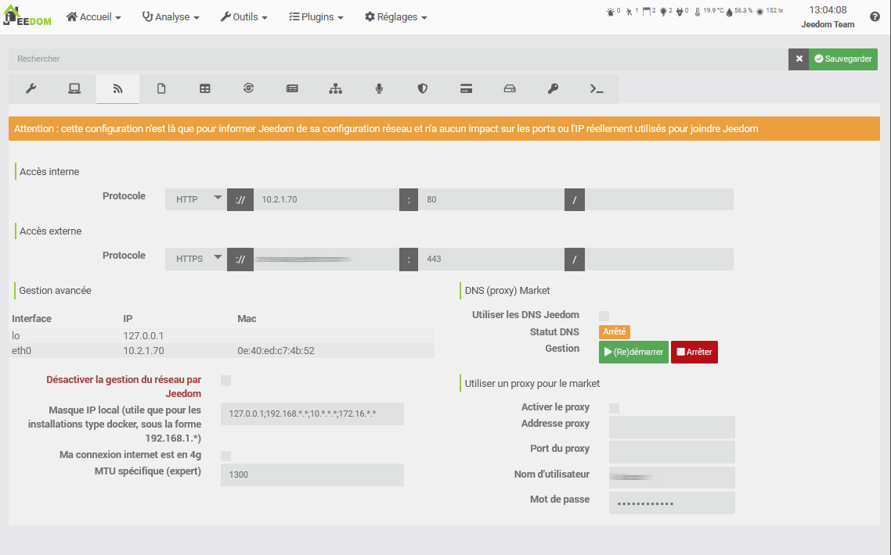

# Premier pas

Bienvenue dans cette documentation de premiers pas, celle-ci va vous aider à mettre en service votre Jeedom.

## Inscription sur le Market

La première chose à faire est de se créer un compte sur le Market pour pouvoir enregistrer votre Jeedom sur celui-ci. Cliquez [ici](https://market.jeedom.com/).

Cliquez sur le bouton "S’enregistrer" en haut à gauche :

Remplissez les différents champs et validez. Vous devriez alors être sur votre compte Market :

## Ajout de votre code Service Pack

Si vous avez acheté une box Jeedom alors vous avez dû recevoir un mail contenant un code pour votre Service Pack.

> **Important**
>
> Il est important de le renseigner car ce code vous donne accès à certains plugins gratuitement, ainsi qu’à des services exclusifs.

> **Important**
>
> Si vous achetez un Service Pack depuis le Market Jeedom vous n’avez rien à faire, celui-ci vous est automatiquement affecté.

Une fois le code recupéré dans le mail, il vous suffit d’aller sur le [Market Jeedom](https://market.jeedom.com/) et de vous identifier.

Puis allez sur votre page de profil :

Puis cliquez sur l’onglet "Mes services" et renseignez votre numéro de Service Pack et validez.

> **Tip**
>
> Si vous avez acheté une box officielle Jeedom, le numéro de Service Pack a dû vous être envoyé par email. Si vous n’avez rien reçu, merci de contacter le magasin où vous avez acheté votre box.

## Trouver votre Jeedom sur le réseau

Une fois Jeedom branché électriquement et connecté à votre réseau local, voici comment se connecter sur celui-ci.

### Trouver Jeedom

#### Par le market

Solution la plus simple (mais ne marche pas dans 100% des cas en fonction de la configuration de votre accès internet), il faut démarrer la box, attendre environ 10 minutes (attention si vous utilisez une image type netinstallation, ça sera plutôt 30 minutes) et aller [ici](https://www.jeedom.com/market/index.php?v=d&p=find)

> **Tip**
>
> Attention, il faut être sur le même réseau que la box Jeedom pour que cette méthode fonctionne.

> **Important**
>
> En fonction de votre box ADSL, cette fonctionalité peut ne pas marcher. Si c’est le cas, rien de grave, il vous suffit de vous connecter à votre box ADSL et de trouver l’IP de Jeedom dans celle-ci. Cette étape ne fait rien d’autre que de vous donner l’IP locale de votre Jeedom. Ce n’est pas à ce moment-là que l’ajout de votre Jeedom à votre compte Market est fait.

#### Par votre box internet

-   Allez sur l’interface d’administration de votre box internet et cherchez Jeedom dans vos périphériques réseaux.
-   Récupérez son IP.
-   Mettez cette IP dans votre navigateur internet. Vous devriez être sur l’interface de Jeedom.

## Première connexion

Quelque soit la méthode utilisée, vous arrivez ensuite sur la page de Login. Par défaut le login et le mot de passe sont "admin".

## Lier mon Jeedom à mon compte Market

Nous allons voir ici comment lier votre Jeedom à votre compte Market.

-   Une fois connecté à votre Jeedom, vous devez aller sur **Réglages → Système → Configuration**.
-   Cliquez sur l’onglet **Mises à jour/Market**.
-   En dessous, cliquez sur l’onglet **Market**.
-   Cochez la case **activer**.
-   Remplissez l’adresse : `https://market.jeedom.com`.
-   Renseignez également les champs **Nom d’utilisateur** et **Mot de passe** en fonction de vos identifants (identifiants du Market et non pas de Jeedom).
-   Vous pouvez tester pour vérifier que la connexion s’effectue correctement.
-   N’oubliez pas de sauvegarder !

Pour plus de détails sur la page de configuration, voir *Manuel de configuration -> Administration*.

## Obtenir mon URL d’accès direct

Si vous avez un Service Pack, Jeedom vous met à disposition une URL d’accès direct à votre Jeedom sans que vous ayez à ouvrir les ports sur votre box ou autre.

Pour la configurer, il vous suffit d’aller dans Réglages → Système → Configuration

Puis d’aller sur la partie "Réseaux"

Une fois ici, il vous suffit d’activer **Utiliser les DNS Jeedom** puis sur la ligne **Gestion** de faire **Rédemarrer** et votre URL apparaitra au niveau de statut HTTP, vous pouvez bien sûr la personnaliser à partir de la page profil du Market.

> **Important**
>
> Si vous venez de lier votre Jeedom à votre compte Market, il faut attendre 24 à 48h avant de pouvoir utiliser le service DNS

## Changer le mot de passe par défaut de Jeedom

Une des étapes importantes est de changer le mot de passe par défaut de votre compte Jeedom, pour cela cliquez sur Réglages → Système → Utilisateurs :

Une fois dessus, vous avez juste à choisir la ligne avec l’utilisateur **admin** et à cliquer sur **Mot de passe** :

Une fenêtre va vous demander le mot de passe. Attention à bien le retenir, ou vous ne pourrez plus accéder à votre Jeedom.

## Créer mon premier objet

Vous allez créer votre premier objet, mais d’abord il faut savoir ce qu’est un objet.

Dans Jeedom, cela peut être tout et n’importe quoi, mais il est recommandé de le faire en fonction de vos pièces.

> **Tip**
>
> Il est possible de définir des relations entre les objets. Exemple : le salon appartient à l’objet rez-de-chaussée qui appartient lui-même à l’objet maison.

Pour créer un objet, rien de plus simple :

-   Allez sur Outils → Objets.
-   Cliquez sur le bouton Ajouter.
-   Jeedom va vous demander le nom de celui-ci. Validez. Voilà votre premier objet créé :

Pour plus d’informations sur cette partie, voir *Manuel d'utilisation -> Objet*.

## Installer mon premier plugin

Un plugin permet d’ajouter des fonctionnalités à Jeedom. Il en existe des centaines. Beaucoup sont gratuits, d’autres peuvent être payants. Pour accéder à la page des plugins, aller sur Plugins → Gestion des plugins.

Il vous suffit ensuite de cliquer sur Market :

Vous allez alors avoir la liste de tous les plugins qu’il est possible d’installer.

> **Important**
>
> Attention, certains sont officiels et d’autres non. En cas de souci avec un plugin non officiel, l’équipe Jeedom ne pourra être tenue pour responsable.

En cliquant sur un plugin, vous obtenez sa fiche :

Vous retrouvez alors :

- Des boutons pour installer le plugin : la version stable est fortement recommandée,
- Un bouton pour supprimer le plugin,
- Une brève description,
- Un lien vers la documentation du plugin,
- Un lien vers le changelog (les dernières modifications apportées),
- La compatibilité avec les différentes plateformes,
- Les avis des utilisateurs,
- La façon d’utiliser le plugin,
- Des informations complémentaires comme l’auteur, le lien vers la discussion du forum concernant ce plugin, la date de dernière mise à jour, etc.

Pour plus d’informations sur les plugins, *Manuel d'utilisation -> Plugin*.

# Support

Jeedom aborde des champs très vastes et évoluant de jour en jour.
Cependant, de nombreux moyens sont mis à votre disposition pour trouver de l’aide et poser vos questions.

## Le forum

Vous le trouverez [ici](https://community.jeedom.com/).

Le forum est très actif et contient énormément d’informations. Si vous avez une question, n’hésitez pas à la poser. Vous aurez une réponse en moins d’une heure (en moyenne). Attention cependant, le forum est maintenu par la communauté Jeedom, composée de bénévoles, et non par la société Jeedom.

## Les demandes de support (ou tickets)

> **Important**
>
> Attention, toute demande de support nécessite obligatoirement d’avoir un compte sur le Market.

Si vous n’avez pas trouvé de solution à votre problème, en dernier recours, vous pouvez faire une demande de support à l’équipe Jeedom. Cette demande passe par un ticket. Il est possible d’en ouvrir un de plusieurs façons :

-   Directement à partir de Jeedom (méthode conseillée) : Menu Réglages → Demande de support.
-   Si pour une raison ou pour une autre vous n’avez pas accès à votre Jeedom, vous pouvez toujours ouvrir un ticket à partir du Market :
    -   soit en cliquant sur votre nom puis sur *Demande de support*,
    -   soit en allant sur votre profil, puis dans la partie **Tickets**, utilisez le bouton "Ouvrir une demande de support".

Toute la suite des échanges se fera par mail.

> **Tip**
>
> Si, lors de l’ouverture d’un ticket, vous obtenez une erreur indiquant que vous avez atteint votre quota, c’est que vous êtes limité à un certain nombre de demandes de support par mois, en fonction de votre Service Pack.

Les différents Services Packs sont :
- Community (gratuit) : 2 tickets/mois (sur plugins payants uniquement)
- Power : 10 tickets/mois
- Pro : 100 tickets/mois

Vous pouvez retrouver le détail des services packs [ici](https://www.jeedom.com/site/fr/soft.html#obtenir).

>**IMPORTANT**
>
>Attention on voit beaucoup d'utilisateurs avec des boites mail "mailinblack", qui lors du 1er échange demande à l'expédideur de valider un lien pour prouver que c'est bien un humain. Ce système n'est pas compatible avec notre systeme de ticketing, donc meme si on vous répond, vous ne receverez jamais la réponse dans votre boite mail car celle-ci nous bloque. Merci donc sur votre page profil du market de mettre une addresse mail n'utilisant pas ce système, sinon vous ne receverez jamais notre réponse.
