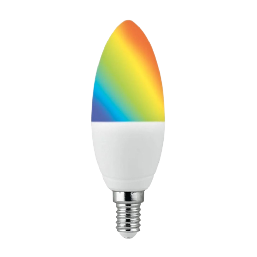
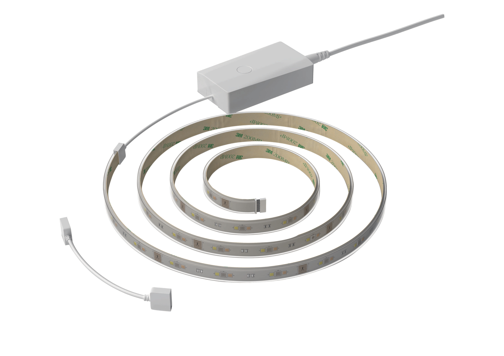
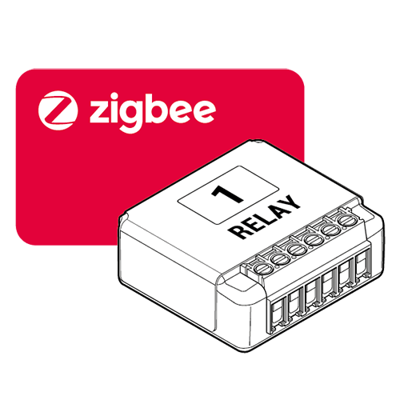

# Compatibilité des modules Zigbee

# Eurotronic

|Image|Marque|Nom|Type|Remarque|Lien|
|---|---|---|---|---|---|
||Eurotronic|Vanne Spirit||Vanne qui a tendance à ne plus accepter d'ordre (changement de consigne) à moins d'enlever les piles et de les remettres. Par contre elle remonte toujours bien les informations de température et changement de consigne manuel||

# Frient

|Image|Marque|Nom|Type|Remarque|Lien|
|---|---|---|---|---|---|
||Frient|Electric meter interface||||
||Develco|Air Quality Sensor||||
||Frient|IO Module||||
||Develco|Keypad||||
||Develco|Panic button||Il semble y avoir un soucis avec le firmware seul la desactivation de l'alerte (appuie 5s sur le bouton après activation du mode panic) est envoyé sur le réseaux zigbee||
||Develco|Siren||||
||Frient|Wallplug||||
||Frient|Water leak detector||||
||Frient|Motion detector||||
||Frient|Smart cable||||
||Frient|Smoke detector||||
||Frient|Wallplug||||

# GR-SMARTHOME

|Image|Marque|Nom|Type|Remarque|Lien|
|---|---|---|---|---|---|
||GR-SMARTHOME|GR-SMARTHOME VANNE 1/4 DE TOUR|||[Acheter](https://www.domadoo.fr/fr/peripheriques/5264-gr-smarthome-motorisation-zigbee-30-pour-vanne-14-de-tour.html)|

# Groupes

|Image|Marque|Nom|Type|Remarque|Lien|
|---|---|---|---|---|---|
||Groupes|Blanc - Luminosité - On - Off||||
||Groupes|Couleur - Blanc - Luminosité - On - Off||||
||Groupes|Luminosité - On - Off||||
||Groupes|On - Off||||

# JunYu

|Image|Marque|Nom|Type|Remarque|Lien|
|---|---|---|---|---|---|
||JunYu|LED RGBW||Attention le retour d'état pour ce model n'est pas en temps réel (soit suite à une commande soit en demandant explicitement une mise à jour de celui-ci)||

# Legrand

|Image|Marque|Nom|Type|Remarque|Lien|
|---|---|---|---|---|---|
||Legrand|||||
||Legrand|Legrand contactor||||
||Legrand|Legrand variateur||||
||Legrand|Legrand interrupteur double||||
||Legrand|Legrand micro module||||
||Legrand|Legrand prise mobile Céliane||||
||Legrand|Legrand volet roulant||||

# Adeo

|Image|Marque|Nom|Type|Remarque|Lien|
|---|---|---|---|---|---|
||Adeo|Adeo LEXK-1||||
||Adeo|Adeo LEXK-2||||
||Adeo|Adeo LEXK-3||||
||Adeo|Adeo LEXK-4||||
||Adeo|Adeo LEXK-5||||
||Adeo|Adeo LEXK-7||||

# Alfawise

|Image|Marque|Nom|Type|Remarque|Lien|
|---|---|---|---|---|---|
||Alfawise|Alfawise Température/humidité||||
||Alfawise|Alfawise porte||||
||Alfawise|Alfawise porte||||

# Awox

|Image|Marque|Nom|Type|Remarque|Lien|
|---|---|---|---|---|---|
||Awox|EGLO Crosslink-Z / Awox TLSR82||||

# Danalock

|Image|Marque|Nom|Type|Remarque|Lien|
|---|---|---|---|---|---|
||Danalock|Danalock V3||Jeedom ne recommande pas ce module qui semble avoir un bug sur le firmware qui oblige a reinclure le module toute les X heures ou jours|[Acheter](https://www.domadoo.fr/fr/controle-acces/4540-danalock-serrure-connectee-bluetooth-et-zigbee-danalock-v3-5712560000493.html)|

# Danfoss

|Image|Marque|Nom|Type|Remarque|Lien|
|---|---|---|---|---|---|
||Danfoss|Danfoss Icon Floor Controller|Contrôleur Plancher Chauffant|||
||Danfoss|Danfoss Ally|Tête thermostatique||[Documentation](https://assets.danfoss.com/documents/DOC353849556547/DOC353849556547.pdf) [Acheter](https://www.domadoo.fr/fr/peripheriques/5156-danfoss-tete-electronique-ally-zigbee-30-5702425245008.html)|

# EWeLink

|Image|Marque|Nom|Type|Remarque|Lien|
|---|---|---|---|---|---|
||EWeLink|OnOff Controller||||

# Ecodim

|Image|Marque|Nom|Type|Remarque|Lien|
|---|---|---|---|---|---|
||Ecodim|Led Smart Dimmer|Variateur|||

# Gledopto

|Image|Marque|Nom|Type|Remarque|Lien|
|---|---|---|---|---|---|
||Gledopto|GL-B-007Z||||
||Gledopto|GL-C-008S||||

# Heiman

|Image|Marque|Nom|Type|Remarque|Lien|
|---|---|---|---|---|---|
||Heiman|CO Sensor||||
||Heiman|Smoke sensor||||
||Heiman|Smoke sensor||||
||Heiman|Smoke sensor||||
||Heiman|Schneider Plug||||

# Icasa

|Image|Marque|Nom|Type|Remarque|Lien|
|---|---|---|---|---|---|
||Icasa|Filamant Bulb||||
||Icasa|AC dimmer||||
||Icasa|AC switch||||
||Icasa|Pulse 4S Wall Controller||||
||Icasa|Rotary Dimmer||||
||Icasa|Sunricher RGB||||

# Ikea

|Image|Marque|Nom|Type|Remarque|Lien|
|---|---|---|---|---|---|
||Ikea|Ikea Fyrtur||||
||Ikea|Ikea Kadrilj||||
||Ikea|Ikea TRADFRI Symfonisk sound controller|Télécommande|||
||Ikea|Driver 10W||||
||Ikea|Driver 30W||||
||Ikea|Ikea TRADFRI SHORTCUT Button|Télécommande|||
||Ikea|Bulb E14 WS 470lm||||
||Ikea|Bulb E14 WS opal 600lm||||
||Ikea|Bulb E14 W opch 400lm||||
||Ikea|Bulb E27 CWS opal 600lm||||
||Ikea|Bulb E27 WS opal 1000lm||||
||Ikea|Bulb E27 WS opal 980lm||Attention le retour d'état pour ce model n'est pas en temps réel (soit suite à une commande soit en demandant explicitement une mise à jour de celui-ci)||
||Ikea|TRADFRI bulb E27 WW 806lm||||
||Ikea|Bulb E27 W opal 1000lm||||
||Ikea|Bulb GU10 WS 400lm||||
||Ikea|Bulb GU10 WW 400lm||||
||Ikea|Ikea TRADFRI prise connectée|||[Documentation](https://www.ikea.com/fr/fr/manuals/tradfri-wireless-control-outlet__AA-2106602-1_pub.pdf) |
||Ikea|Ikea TRADFRI Détecteur de mouvement sans fil blanc|||[Documentation](https://www.ikea.com/fr/fr/manuals/tradfri-wireless-motion-sensor__AA-2145280-2_pub.pdf) |
||Ikea|Ikea TRADFRI télécommande 2 boutons|Télécommande||[Documentation](https://www.ikea.com/fr/fr/assembly_instructions/tradfri-wireless-dimmer-white__AA-2175106-3_pub.pdf) |
||Ikea|Ikea TRADFRI télécommande 5 boutons|Télécommande||[Documentation](https://www.ikea.com/fr/fr/manuals/tradfri-remote-control__AA-2144014-1_pub.pdf) |
||Ikea|Ikea repeateur||||
||Ikea|Ikea télécommande 2 boutons store||||

# Innr

|Image|Marque|Nom|Type|Remarque|Lien|
|---|---|---|---|---|---|
||Innr|INNR E27 Multicolor RGBW + Blanc||||

# Konke

|Image|Marque|Nom|Type|Remarque|Lien|
|---|---|---|---|---|---|
||Konke|Konke Motion sensor||||

# Lellki

|Image|Marque|Nom|Type|Remarque|Lien|
|---|---|---|---|---|---|
||Lellki|Multiprise||||

# Lidl

|Image|Marque|Nom|Type|Remarque|Lien|
|---|---|---|---|---|---|
||Lidl|LIDL E27 LED LIVARNOLUX||||
||Lidl|Lidl E27 RGB||||
||Lidl|LIDL GU10 LED LIVARNOLUX||||
||Lidl|Lidl GU10 RGB Livarnolux||||
||Lidl|LIDL E14 LED LIVARNOLUX||||
||Lidl|Lidl E14 RGB||||
||Lidl|Lidl Ruban LED||||
||Lidl|Prise connectée LIDL Silvercrrest SAPZ 1 A1||||

# Nodon

|Image|Marque|Nom|Type|Remarque|Lien|
|---|---|---|---|---|---|
||Nodon|SIN-4-1-01||||
||Nodon|SIN-4-2-01||||
||Nodon|PTM 216 Z||||

# Orvibo

|Image|Marque|Nom|Type|Remarque|Lien|
|---|---|---|---|---|---|
||Orvibo|Gaz sensor||||
||Orvibo|RGB controller||||
||Orvibo|Multi-functional Relay||Au 15/12/2020, retour d'etat non fonctionnel||
||Orvibo|Sensor connector||||
||Orvibo|Emergency button||||
||Orvibo|Gaz sensor||||
||Orvibo|Température/humidité||||
||Orvibo|Water leak||||
||Orvibo|Smoke detector||||

# Osram

|Image|Marque|Nom|Type|Remarque|Lien|
|---|---|---|---|---|---|
||Osram|OSRAM Smart+ Ampoule LED Connectée - Culot E27||||
||Osram|OSRAM LIGHTIFY Indoor Flex RGBW||Attention le retour d'état pour ce model n'est pas en temps réel (soit suite à une commande soit en demandant explicitement une mise à jour de celui-ci)||
||Osram|Lightify Switch Mini||||
||Osram|OSRAM SMART+ Spot GU5.3 Tunable White||||
||Osram|OSRAM Smart+ Plug||||

# Philips

|Image|Marque|Nom|Type|Remarque|Lien|
|---|---|---|---|---|---|
||Philips|Hue White and Color Ambiance A60 E27||||
||Philips|Hue Lightstrip Plus||||
||Philips|Hue bulb white and color||||
||Philips|Hue White and Color BR30 (1st Gen)||||
||Philips|Hue White and Color Ambiance Spot GU10||Attention le retour d'état pour ce model n'est pas en temps réel (soit suite à une commande soit en demandant explicitement une mise à jour de celui-ci)||
||Philips|Hue White and Color Ambiance A19 E26 (Gen 2)||||
||Philips|Hue White and Color Ambiance A19 E26 (Gen 3)||||
||Philips|Hue White and Color Ambiance BR30 Richer Colors||||
||Philips|Hue White and Color Ambiance Candle E12||||
||Philips|Hue White and Color Ambiance A19 E26||||
||Philips|Hue White and Color Ambiance A19 E26||Attention il n'y a pas de retour d'état pour ce modele, seulement un envoi d'ordre possible||
||Philips|Hue White and Color Ambiance Play Light Bar||||
||Philips|Hue LivingColors||||
||Philips|Hue LivingColors||||
||Philips|Hue LivingColors Iris Table Lamp Gen3||||
||Philips|Hue LivingColors||||
||Philips|Hue Iris Table Lamp||||
||Philips|Hue Bloom Living Colors Starter Pack||Attention le retour d'état pour ce model n'est pas en temps réel (soit suite à une commande soit en demandant explicitement une mise à jour de celui-ci)||
||Philips|Hue Bloom Table Lamp||||
||Philips|Hue LivingColors||||
||Philips|Hue Go Portable Light||||
||Philips|Hue Beyond Suspension Light||||
||Philips|Hue white and color||||
||Philips|Hue white and color||||
||Philips|Hue white and color||||
||Philips|Hue Smart plug||||
||Philips|Hue LightStrip||||
||Philips|Hue LightStrip Plus||||
||Philips|Hue LightStrip Outdoor||||
||Philips|Hue White and Color||Attention il n'y a pas de retour d'état pour ce modele, seulement un envoi d'ordre possible||
||Philips|Hue White Ambiance A19 E26/E27||Attention le retour d'état pour ce model n'est pas en temps réel (soit suite à une commande soit en demandant explicitement une mise à jour de celui-ci)||
||Philips|LTW012||Attention le retour d'état pour ce model n'est pas en temps réel (soit suite à une commande soit en demandant explicitement une mise à jour de celui-ci)||
||Philips|Hue White Ambiance E27||Attention il n'y a pas de retour d'état pour ce modele, seulement un envoi d'ordre possible||
||Philips|Hue White B22||Attention il n'y a pas de retour d'état pour ce modele, seulement un envoi d'ordre possible||
||Philips|Hue White Candle E14||Attention il n'y a pas de retour d'état pour ce modele, seulement un envoi d'ordre possible||
||Philips|Hue White Filament Bulb ST64 E27||||
||Philips|Variateur||||
||Philips|Télécommande 4 boutons||||
||Philips|Hue détecteur de mouvement intérieure|Mouvement,Luminosité,Température|||
||Philips|Hue détecteur de mouvement extérieure|Mouvement,Luminosité,Température|||
||Philips|Hue Go||||

# Profalux

|Image|Marque|Nom|Type|Remarque|Lien|
|---|---|---|---|---|---|
||Profalux|Profalux MOE||||

# Schneider

|Image|Marque|Nom|Type|Remarque|Lien|
|---|---|---|---|---|---|
||Schneider|PlusLink shutter insert|Volets||[Documentation](https://download.schneider-electric.com/files?p_enDocType=System+user+guide&p_File_Name=Merten_PL_Wiser_TIs_DE.pdf&p_Doc_Ref=Merten_PL_Wiser_TIs_DE) |
||Schneider|Interrupteur double||||
||Schneider|Wiser Window/Door Sensor|Ouverture||[Documentation](https://download.schneider-electric.com/files?p_enDocType=User+guide&p_File_Name=MFR1569800.pdf&p_Doc_Ref=MFR1569800) |
||Schneider|Wiser Water Leakage Sensor|Fuite|||
||Schneider|Wiser Exxact dimmer rotary|Variateur|||
||Schneider|Wiser micro module dimmer|Variateur|||
||Schneider|Schneider Electric iTRV|Tête thermostatique|||

# Sonoff

|Image|Marque|Nom|Type|Remarque|Lien|
|---|---|---|---|---|---|
||Sonoff|Sonoff ZBMINI||||
||Sonoff|Sonoff Basic ZBR3|||[Acheter](https://www.domadoo.fr/fr/peripheriques/5258-sonoff-module-commutateur-10a-zigbee-30.html)|
||Sonoff|Sonoff porte||Attention il y a un bug dans le firmware qui le fait remonter comme un module de température et d'humidité il faut donc suite à l'inclusion remettre le bon model et supprimer les commandes de température et d'humidité|[Acheter](https://www.domadoo.fr/fr/peripheriques/5261-sonoff-detecteur-de-mouvement-zigbee-30.htm)|
||Sonoff|Sonoff porte|||[Acheter](https://www.domadoo.fr/fr/peripheriques/5261-sonoff-detecteur-de-mouvement-zigbee-30.htm)|
||Sonoff|Sonoff mouvement|||[Acheter](https://www.domadoo.fr/fr/peripheriques/5261-sonoff-detecteur-de-mouvement-zigbee-30.html)|
||Sonoff|Sonoff Température/humidité|||[Acheter](https://www.domadoo.fr/fr/peripheriques/5260-sonoff-capteur-de-temperature-et-d-humidite-zigbee-30.html)|
||Sonoff|Sonoff bouton|||[Acheter](https://www.domadoo.fr/fr/peripheriques/5259-sonoff-interrupteur-sans-fil-zigbee-30.html)|

# Sunricher

|Image|Marque|Nom|Type|Remarque|Lien|
|---|---|---|---|---|---|
||Sunricher|Sunricher CCT Lighting||||
||Sunricher|Sunricher motor controller||||
||Sunricher|Sunricher RGB||||
||Sunricher|Sunricher remote color||||
||Sunricher|Sunricher remote dimmer switch||||

# Tryo2sys

|Image|Marque|Nom|Type|Remarque|Lien|
|---|---|---|---|---|---|
||Tryo2sys|PTM 215 ZE||||

# Tuya

|Image|Marque|Nom|Type|Remarque|Lien|
|---|---|---|---|---|---|
||Tuya|Tuya prise + 2 USB||||
||Tuya|Température/humidité||||
||Tuya|Capteur ouverture||||
||Tuya|Détecteur de mouvement||||
||Tuya|BlitzWolf BW-SS7 ZigBee3.0 2300W 1 entrée||||
||Tuya|Moes switch lumière||||
||Tuya|Interrupteur simple||||
||Tuya|Interrupteur double||||
||Tuya|Température/humidité||||
||Tuya|ASLED Swing||||
||Tuya|LoraTap télécommande 3 boutons||||
||Tuya|BlitzWolf BW-SHP13 Zigbee 3.0 Prise WIFI intelligente 16A Prise EU||||
||Tuya|Multiprise connectée||||
||Tuya|Module prise de vie connectée Tuya ZigBee 3.0||||
||Tuya|Interrupteur 4 boutons||||
||Tuya|MicroModule lumiere Tuya ZigBee 3.0||||
||Tuya|Interrupteur de scène 3 boutons||||
||Tuya|Tuya TS0042|||[Acheter](l)|
||Moes|Moes Radiator Actuator||||
||Tuya|Sirene||||

# Xiaomi

|Image|Marque|Nom|Type|Remarque|Lien|
|---|---|---|---|---|---|
||Xiaomi|Xioami interrupteur double avec neutre||||
||Xiaomi|Xioami interrupteur double avec neutre||||
||Xiaomi|Xiaomi interrupteur simple sans neutre||||
||Xiaomi|Xioami interrupteur double sans neutre||||
||Xiaomi|Ampoule LED Zigbee Aqara||||
||Xiaomi|Xiaomi serrure connectée||||
||Xiaomi|Xiaomi prise||||
||Xiaomi|Xiaomi prise||||
||Xiaomi|Xiaomi prise||||
||Xiaomi|Xiaomi Aqara LLKZMK11LM Module bidirectionnel Intelligent||||
||Xiaomi|Xioami interrupteur simple|||[Acheter](https://www.domadoo.fr/fr/peripheriques/4516-xiaomi-interrupteur-mural-simple-sans-fil-zigbee-aqara-6970504210)|
||Xiaomi|Xioami interrupteur simple AQ3||||
||Xiaomi|Xioami interrupteur double|||[Acheter](https://www.domadoo.fr/fr/peripheriques/4517-xiaomi-interrupteur-mural-double-sans-fil-zigbee-aqara-6970504210042.html)|
||Xiaomi|Aqara Opple 6 boutons||||
||Xiaomi|Capteur de luminosité||||
||Xiaomi|Capteur de température/humidité||||
||Xiaomi|Xioami interrupteur simple|||[Acheter](https://www.domadoo.fr/fr/peripheriques/4517-xiaomi-interrupteur-mural-double-sans-fil-zigbee-aqara-6970504210042.html)|
||Xiaomi|Xioami interrupteur double|||[Acheter](https://www.domadoo.fr/fr/peripheriques/4517-xiaomi-interrupteur-mural-double-sans-fil-zigbee-aqara-6970504210042.html)|
||Xiaomi|Xiaomi smart cube||||
||Xiaomi|Capteur de température/humidité||||
||Xiaomi|Xiaomi Aquara capteur d'ouverture|||[Acheter](https://www.domadoo.fr/fr/peripheriques/4514-xiaomi-detecteur-d-ouverture-portefenetre-zigbee-aqara.html)|
||Xiaomi|Xiaomi capteur ouverture||||
||Xiaomi|Xiaomi Aquara de mouvement|||[Acheter](https://www.domadoo.fr/fr/peripheriques/4518-xiaomi-detecteur-de-mouvement-zigbee-aqara-192784000090.html)|
||Xiaomi|Xiaomi capteur de mouvement||||
||Xiaomi|Xiaomi Aquara fumée||||
||Xiaomi|Xiaomi Aquara switch Aq2||||
||Xiaomi|Xiaomi Aquara switch||||
||Xiaomi|Xiaomi Aquara inondation|||[Acheter](https://www.domadoo.fr/fr/peripheriques/4519-xiaomi-capteur-d-eau-zigbee-aqara-6970504210257.html)|
||Xiaomi|Micro module on/off avec neutre||||
||Xiaomi|Xioami Aquara Vibration|||[Acheter](https://www.domadoo.fr/fr/peripheriques/4667-xiaomi-capteur-de-vibration-zigbee-aqara-192784000113.html)|
||Xiaomi|Capteur de température/pression/humidité||||
||Xiaomi|Capteur de luminosité||||
||Xiaomi|Xiaomi prise||||
||Xiaomi|Xiaomi Aquara capteur d'ouverture|||[Acheter](https://www.domadoo.fr/fr/peripheriques/4514-xiaomi-detecteur-d-ouverture-portefenetre-zigbee-aqara.html)|
||Xiaomi|Xiaomi Aquara de mouvement|||[Acheter](https://www.domadoo.fr/fr/peripheriques/4518-xiaomi-detecteur-de-mouvement-zigbee-aqara-192784000090.html)|
||Xiaomi|Xiaomi Aquara switch||||
||Xiaomi|Xiaomi Aquara inondation|||[Acheter](https://www.domadoo.fr/fr/peripheriques/4519-xiaomi-capteur-d-eau-zigbee-aqara-6970504210257.html)|
||Xiaomi|Xioami Aquara Vibration|||[Acheter](https://www.domadoo.fr/fr/peripheriques/4667-xiaomi-capteur-de-vibration-zigbee-aqara-192784000113.html)|

Cette liste est basee sur des retours utilisateurs, l\'équipe Jeedom ne peut donc garantir que tous les modules de cette liste sont 100% fonctionnels

2021-02-22 01:32:10
