# Compatibilité des modules Zigbee

# 3A Smart Home DE

|Image|Marque|Nom|Type|Remarque|Lien|
|---|---|---|---|---|---|
||3A Smart Home DE|SFLS-PP lp wireless ballast||||
|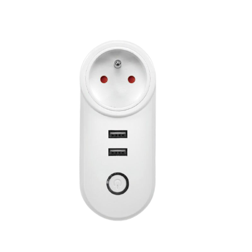|3A Smart Home DE|Prise intelligente + 2 ports USB||||
||3A Smart Home DE|Zigbee 3.0 ZLL RGB lumière||||
||3A Smart Home DE|ZW-EC-01 Store Zemismart||||

# ADUROLIGHT

|Image|Marque|Nom|Type|Remarque|Lien|
|---|---|---|---|---|---|
||ADUROLIGHT|Trust ZPIR-8000||||

# BYLED

|Image|Marque|Nom|Type|Remarque|Lien|
|---|---|---|---|---|---|
||BYLED|BYLED - Récepteur ZigBee pour suspension industrielle||||

# Bitron Video

|Image|Marque|Nom|Type|Remarque|Lien|
|---|---|---|---|---|---|
||Bitron Video|SMABIT - Télécommande 4 boutons|||[Acheter](https://www.domadoo.fr/fr/peripheriques/5551-smabit-telecommande-zigbee-4-boutons-8023874395814.html)|
||Bitron Video|SMABIT - Prise intelligente ON/OFF 16A|||[Acheter](https://www.domadoo.fr/fr/peripheriques/5563-smabit-prise-intelligente-zigbee-onoff-16a-8023874395852.html)|
|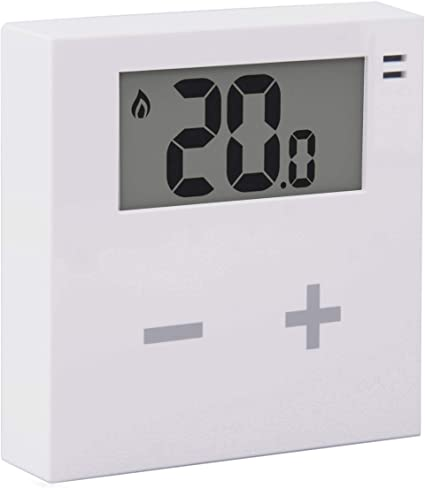|Bitron Video|SMABIT - Thermostat intelligent avec relais intégré|||[Acheter](https://www.domadoo.fr/fr/peripheriques/5565-smabit-thermostat-intelligent-zigbee-avec-relais-8023874395883.html)|
||SMaBiT|SMABIT - Sirène extérieure Zigbee 104 dB|Sirène||[Acheter](https://www.domadoo.fr/fr/peripheriques/5564-smabit-sirene-exterieure-zigbee-104-db-8023874397641.html?domid=4&id_campaign=9)|
|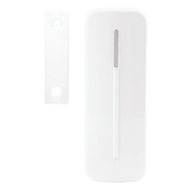|Bitron Video|SMABIT - Détecteur d'ouverture + Entrée capteurs filaires|||[Acheter](https://www.domadoo.fr/fr/peripheriques/5546-smabit-detecteur-d-ouverture-zigbee-entree-capteurs-filaires-8023874396651.html)|
||Bitron Video|SMABIT - Detecteur de mouvement design|||[Acheter](https://www.domadoo.fr/fr/peripheriques/5549-smabit-detecteur-de-mouvement-design-zigbee-8021156061013.html)|
|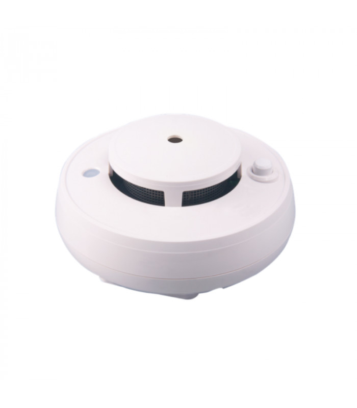|Bitron Video|SMABIT - Détecteur de fumée|||[Acheter](https://www.domadoo.fr/fr/peripheriques/5555-smabit-detecteur-de-fumee-optique-zigbee-avec-fonction-sirene-8023874396644.html)|
|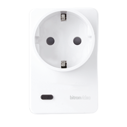|Bitron Video|SMABIT - Prise intelligente ON/OFF 16A||||
|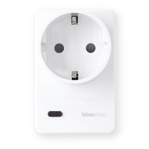|Bitron Video|SMABIT - Prise intelligente variateur 2,5A|||[Acheter](https://www.domadoo.fr/fr/peripheriques/5561-smabit-prise-intelligente-zigbee-variateur-25a-8023874395845.html)|
||Bitron Video|SMABIT - Détecteur de mouvement rideau|||[Acheter](https://www.domadoo.fr/fr/peripheriques/5540-smabit-detecteur-de-mouvement-de-rideau-zigbee-8021156062300.html)|
||Bitron Video|SMABIT - Relais mural variateur 2,5A|||[Acheter](https://www.domadoo.fr/fr/peripheriques/5543-smabit-relais-mural-variateur-25a-zigbee-8023874397122.html)|
||Bitron Video|SMABIT - Relais mural commutateur 10A|||[Acheter](https://www.domadoo.fr/fr/peripheriques/5544-smabit-relais-mural-commutateur-10a-zigbee-8023874397139.html)|
||Bitron Video|SMABIT - Détecteur ouverture extra plat|||[Acheter](https://www.domadoo.fr/fr/peripheriques/5547-smabit-detecteur-d-ouverture-de-porte-ou-fenetre-ultra-plat-zigbee-8023874397658.html)|
||Bitron Video|SMABIT - Interrupteur mural avec piles|||[Acheter](https://www.domadoo.fr/fr/peripheriques/5568-smabit-interrupteur-mural-zigbee-avec-piles-8021156061037.html)|
||Bitron Video|SMABIT - Detecteur inondation + sirene|||[Acheter](https://www.domadoo.fr/fr/peripheriques/5569-smabit-detecteur-de-fuite-d-eau-avec-sirene-zigbee-8021156063291.html)|
||Bitron Video|SMABIT - Détecteur de mouvement extérieur|||[Acheter](https://www.domadoo.fr/fr/peripheriques/5550-smabit-detecteur-de-mouvement-exterieur-zigbee-8023874397665.html)|

# Eurotronic

|Image|Marque|Nom|Type|Remarque|Lien|
|---|---|---|---|---|---|
|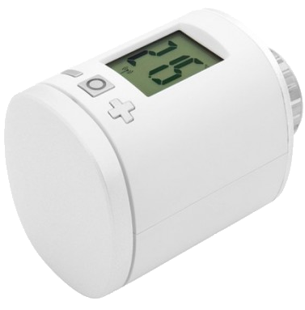|Eurotronic|Tête thermosatique||Vanne qui a tendance à ne plus accepter d'ordre (changement de consigne) à moins d'enlever les piles et de les remettre. Par contre celle-ci remonte toujours bien les informations de température et changement de consigne manuel|[Acheter](https://www.domadoo.fr/fr/peripheriques/5188-eurotronic-tete-thermostatique-zigbee-4260012711233.html)|

# Frient

|Image|Marque|Nom|Type|Remarque|Lien|
|---|---|---|---|---|---|
|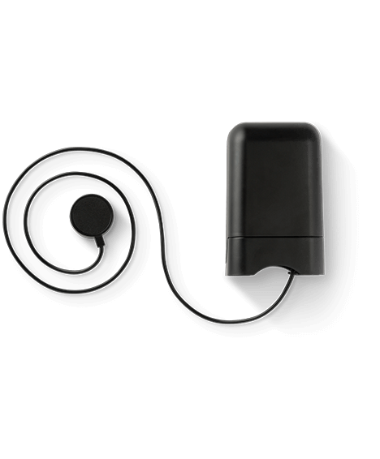|Frient|Compteur optique de consommation d'électricité|||[Acheter](https://www.domadoo.fr/fr/peripheriques/5424-frient-compteur-optique-de-consommation-d-electricite-zigbee-ha-5713594002583.html)|
||Frient|Capteur de qualité d'air|||[Acheter](https://www.domadoo.fr/fr/peripheriques/5408-frient-capteur-de-qualite-d-air-zigbee-ha-5713594002392.html)|
||Frient|IO Module||||
||Frient|Module IO Zigbee 3.0 - 4 entrées contact sec + 2 sorties contact sec NO/NC (ON/OFF ou impulsion)|||[Acheter](https://www.domadoo.fr/fr/peripheriques/6148-domadoo-module-io-zigbee-30-4-entrees-contact-sec-2-sorties-nonc-onoff-ou-impulsion.html?domid=4&id_campaign=9)|
||Develco|Clavier intelligent||Pour la commande Info SOS la signification est : 2 SOS (appui long sur le bouton), 7 quelqu'un a passé la devant le clavier|[Acheter](https://www.domadoo.fr/fr/peripheriques/5537-frient-clavier-a-codes-intelligent-zigbee-30-lecteur-rfid-5713594002415.html?domid=4&id_campaign=9)|
|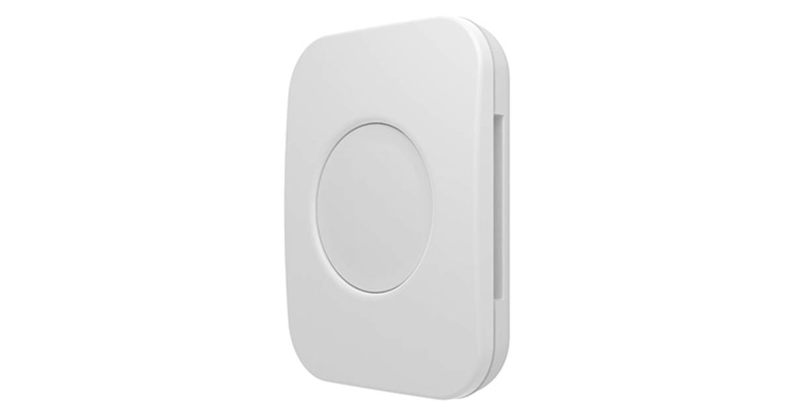|Develco|Panic button||Il semble y avoir un soucis avec le firmware seul la desactivation de l'alerte (appuie 5s sur le bouton après activation du mode panic) est envoyé sur le réseaux zigbee|[Acheter](https://www.domadoo.fr/fr/peripheriques/5808-frient-bouton-intelligent-zigbee-30.html?domid=4&id_campaign=9)|
||Frient|Sirène intelligente|||[Acheter](https://www.domadoo.fr/fr/peripheriques/5538-frient-sirene-intelligente-zigbee-30-5713594002422.html?domid=4&id_campaign=9)|
||Frient|Prise intelligente|||[Acheter](https://www.domadoo.fr/fr/peripheriques/5412-frient-prise-intelligente-mini-avec-mesure-de-consommation-zigbee-ha-version-fr-5713594002514.html)|
|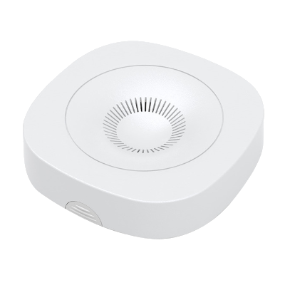|Frient|Capteur de qualité d'air|||[Acheter](https://www.domadoo.fr/fr/peripheriques/5408-frient-capteur-de-qualite-d-air-zigbee-ha-5713594002392.html)|
||Frient|Détecteur d'inondation intelligent|||[Acheter](https://www.domadoo.fr/fr/peripheriques/5427-frient-detecteur-d-inondation-zigbee-30-5713594002453.html)|
||Frient|Détecteur de chaleur|||[Acheter](https://www.domadoo.fr/fr/peripheriques/5411-frient-detecteur-de-chaleur-intelligent-zigbee-30-din-en-14604-et-din-14676-5713594002446.html)|
|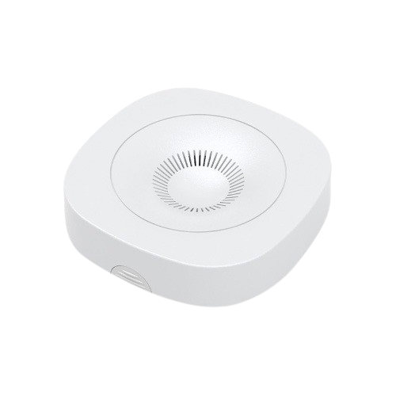|Frient|Capteur de temptérature et humidité|||[Acheter](https://www.domadoo.fr/fr/peripheriques/5407-frient-capteur-de-temperature-et-humidite-intelligent-zigbee-30-5713594002385.html)|
||Frient|Clavier intelligent||Pour la commande Info SOS la signification est : 2 SOS (appui long sur le bouton), 7 quelqu'un a passé la devant le clavier|[Acheter](https://www.domadoo.fr/fr/peripheriques/5537-frient-clavier-a-codes-intelligent-zigbee-30-lecteur-rfid-5713594002415.html?domid=4&id_campaign=9)|
|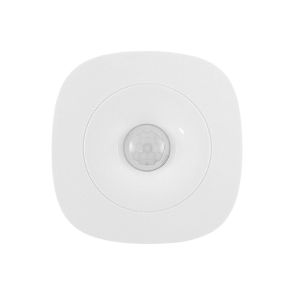|Frient|Détecteur de mouvement et capteur de température et luminosité|||[Acheter](https://www.domadoo.fr/fr/peripheriques/5404-frient-detecteur-de-mouvement-zigbee-30-capteur-de-temperature-et-luminosite-5713594002361.html)|
||Frient|Détecteur de mouvement|||[Acheter](https://www.domadoo.fr/fr/peripheriques/5403-frient-detecteur-de-mouvement-zigbee-30-5713594002835.html)|
||Frient|FRIENT - SIRÈNE INTELLIGENTE ZIGBEE 3.0|||[Documentation](https://www.domadoo.fr/fr/index.php?controller=attachment&id_attachment=2700) [Acheter](https://www.domadoo.fr/fr/peripheriques/5538-frient-sirene-intelligente-zigbee-30-5713594002422.html?domid=4&id_campaign=9)|
|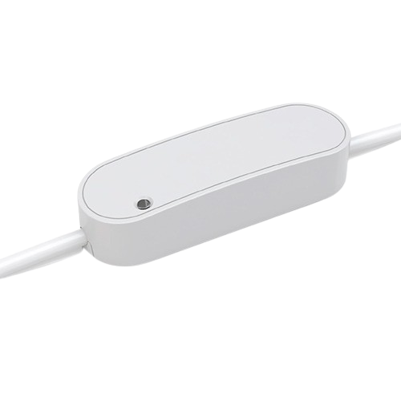|Frient|Interrupteur sur cordon intelligent|||[Acheter](https://www.domadoo.fr/fr/peripheriques/5421-frient-interrupteur-sur-cordon-zigbee-30-5713594002408.html)|
||Frient|Détecteur de fumée intelligent DIN EN 14604 ET DIN 14676|||[Acheter](https://www.domadoo.fr/fr/peripheriques/5409-frient-detecteur-de-fumee-intelligent-zigbee-30-5713594002330.html)|
|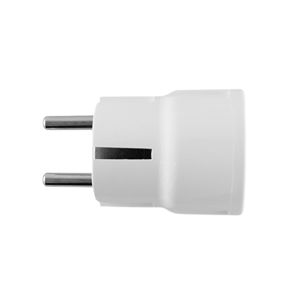|Frient|Prise intelligente format Schuko|||[Acheter](https://www.domadoo.fr/fr/peripheriques/5420-frient-prise-intelligente-mini-avec-mesure-de-consommation-zigbee-ha-version-schuko-5713594002347.html)|
||Frient|Prise intelligente format FR|||[Acheter](https://www.domadoo.fr/fr/peripheriques/5412-frient-prise-intelligente-mini-avec-mesure-de-consommation-zigbee-ha-version-fr-5713594002514.html)|
||Frient|Sirène intelligente|||[Acheter](https://www.domadoo.fr/fr/peripheriques/5538-frient-sirene-intelligente-zigbee-30-5713594002422.html?domid=4&id_campaign=9)|
|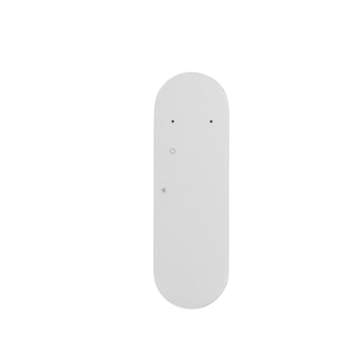|Frient|Détecteur d'ouverture de porte ou fenêtre et capteur de température|||[Acheter](https://www.domadoo.fr/fr/peripheriques/5402-frient-detecteur-d-ouverture-de-porte-ou-fenetre-zigbee-30-capteur-de-temperature-5713594002354.html)|
||Frient|Détecteur de mouvement intelligent|||[Acheter](https://www.domadoo.fr/fr/peripheriques/5401-frient-detecteur-d-ouverture-de-porte-ou-fenetre-zigbee-30-5713594002545.html)|
||Frient|Smart button|Télécommande,Bouton||[Acheter](https://www.domadoo.fr/fr/peripheriques/5808-frient-bouton-intelligent-zigbee-30.html?domid=4&id_campaign=9)|

# GR-SMARTHOME

|Image|Marque|Nom|Type|Remarque|Lien|
|---|---|---|---|---|---|
||GR-SMARTHOME|Motorisation pour vanne 1/4 de tour|Vanne||[Acheter](https://www.domadoo.fr/fr/peripheriques/5264-gr-smarthome-motorisation-zigbee-30-pour-vanne-14-de-tour.html)|
||GR-SMARTHOME|GR-SMARTHOME - MOTORISATION ZIGBEE 3.0 POUR VANNE 1/4 DE TOUR|||[Documentation](https://www.domadoo.fr/fr/index.php?controller=attachment&id_attachment=2823) [Acheter](https://www.domadoo.fr/fr/peripheriques/5264-gr-smarthome-motorisation-zigbee-30-pour-vanne-14-de-tour.html?domid=4&id_campaign=9)|
|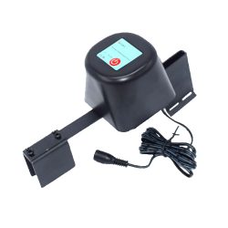|GR-SMARTHOME|Motorisation pour vanne 1/4 de tour|Vanne||[Acheter](https://www.domadoo.fr/fr/peripheriques/5264-gr-smarthome-motorisation-zigbee-30-pour-vanne-14-de-tour.html)|
||GR-SMARTHOME|GR-SMARTHOME - MOTORISATION ZIGBEE 3.0 POUR VANNE 1/4 DE TOUR|||[Documentation](https://www.domadoo.fr/fr/index.php?controller=attachment&id_attachment=2823) [Acheter](https://www.domadoo.fr/fr/peripheriques/5264-gr-smarthome-motorisation-zigbee-30-pour-vanne-14-de-tour.html?domid=4&id_campaign=9)|

# Gewiss

|Image|Marque|Nom|Type|Remarque|Lien|
|---|---|---|---|---|---|
|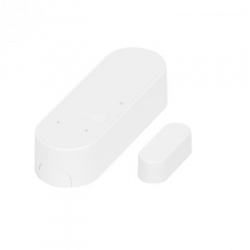|Gewiss|Détecteur de d'ouverture et capteur de température||||
||Gewiss|Actionneur 2 cannaux||||
|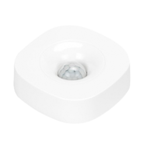|Gewiss|Détecteur de mouvement et capteur de température et luminosité||||
||Gewiss|Détecteur de fumée||||

# GreenPower

|Image|Marque|Nom|Type|Remarque|Lien|
|---|---|---|---|---|---|
||GreenPower|Equipement générique GreenPower||||
||GreenPower|Equipement GreenPower On/Off||||
||GreenPower|Equipement GreenPower poignée de fenetre||||

# Groupes

|Image|Marque|Nom|Type|Remarque|Lien|
|---|---|---|---|---|---|
|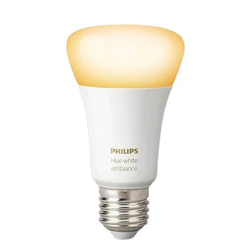|Groupes|Blanc - Luminosité - On - Off||||
|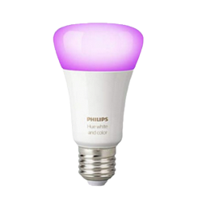|Groupes|Couleur - Blanc - Luminosité - On - Off||||
||Groupes|Luminosité - On - Off||||
|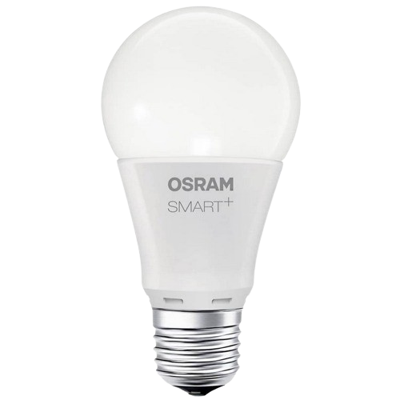|Groupes|On - Off||||
||Groupes|Volet||||

# Halemeier

|Image|Marque|Nom|Type|Remarque|Lien|
|---|---|---|---|---|---|
|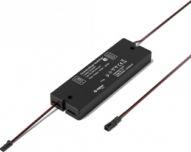|Halemeier|HA-ZGMW2-E||||
||Halemeier|HA-ZGMW2-E||||

# Insta

|Image|Marque|Nom|Type|Remarque|Lien|
|---|---|---|---|---|---|
||Insta|Télécommande||||

# JunYu

|Image|Marque|Nom|Type|Remarque|Lien|
|---|---|---|---|---|---|
|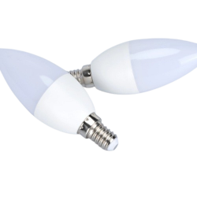|JunYu|LED RGBW||Attention le retour d'état pour ce model n'est pas en temps réel (soit suite à une commande soit en demandant explicitement une mise à jour de celui-ci)||

# LIVOLO

|Image|Marque|Nom|Type|Remarque|Lien|
|---|---|---|---|---|---|
||LIVOLO|Interrupteur||||

# LS Deutschland GmbH

|Image|Marque|Nom|Type|Remarque|Lien|
|---|---|---|---|---|---|
|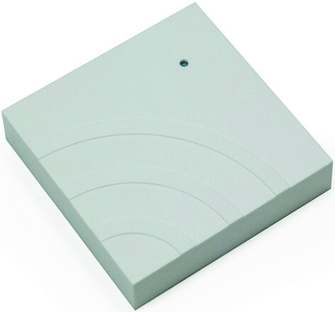|LS Deutschland GmbH|||||

# Legrand

|Image|Marque|Nom|Type|Remarque|Lien|
|---|---|---|---|---|---|
|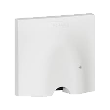|Legrand|Sortie de câble connectée||Ne peut etre appairé que sur le canal 11||
||Legrand|Micro module VMC||Ne peut etre appairé que sur le canal 11||
||Legrand|Prise connectée||Ne peut etre appairé que sur le canal 11||
||Legrand|Contacteur connecté DRIVIA||Ne peut etre appairé que sur le canal 11||
||Legrand|DIN power consumption module||Ne peut etre appairé que sur le canal 11||
||Legrand|Interrupteur filaire connecté avec option variateur sans neutre||Ne peut etre appairé que sur le canal 11, 13 ou 15||
||Legrand|Interrupteur connecté avec neutre avec option variateur||Ne peut etre appairé que sur le canal 11, 13 ou 15||
|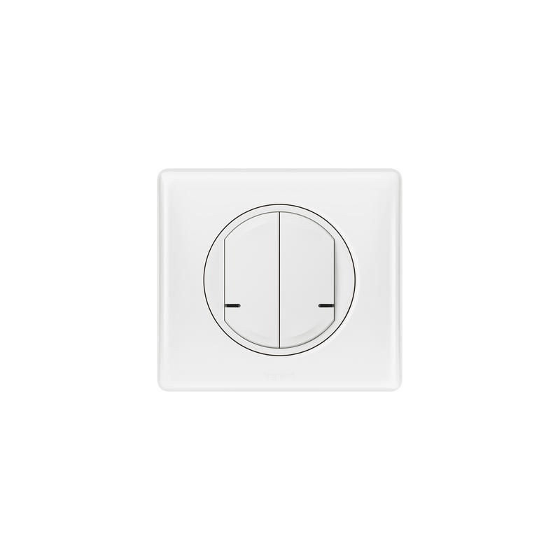|Legrand|Commande double sans fil||Ne peut etre appairé que sur le canal 11||
||Legrand|GreenPower Home/Away||||
||Legrand|GreenPower Day/Night||||
||Legrand|GreenPower On/Off||||
||Legrand|GreenPower volet||||
||Legrand|Module pour éclairage connecté||Ne peut etre appairé que sur le canal 11 ou 15||
|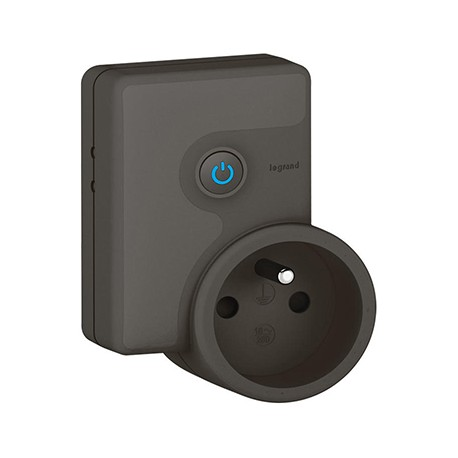|Legrand|Prise mobile Céliane||Ne peut etre appairé que sur le canal 11||
||Legrand|Double interrupteur connecté avec neutre||Ne peut etre appairé que sur le canal 11 ou 15||
|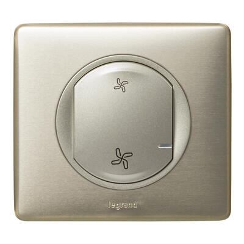|Legrand|Interrupteur pour ventilateur||Ne peut etre appairé que sur le canal 11||
|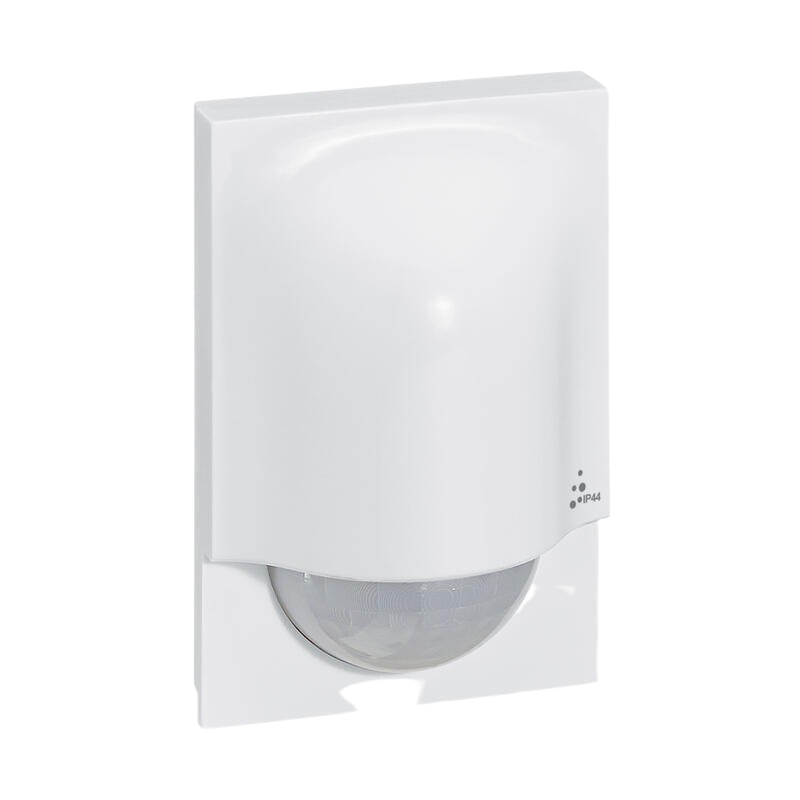|Legrand|Detecteur de mouvement||Ne peut etre appairé que sur le canal 11||
||Legrand|Commande simple sans fil||Ne peut etre appairé que sur le canal 11||
|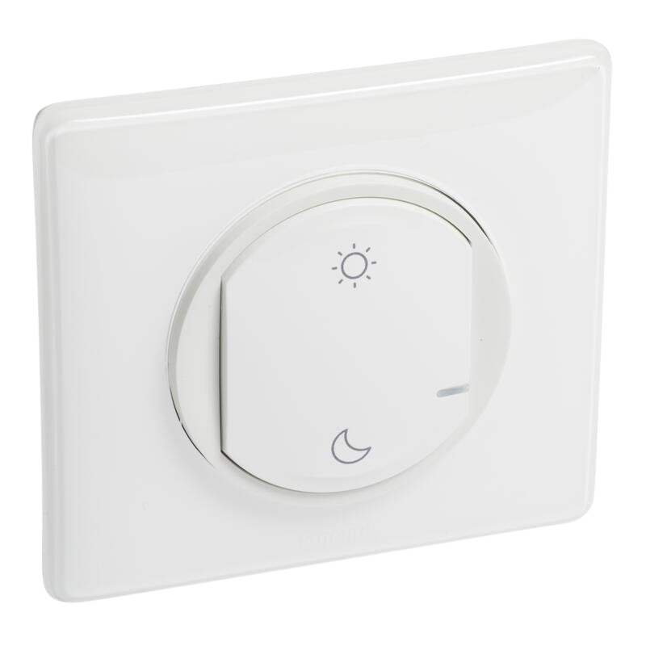|Legrand|Commande sans fil Lever Coucher||Ne peut etre appairé que sur le canal 11||
|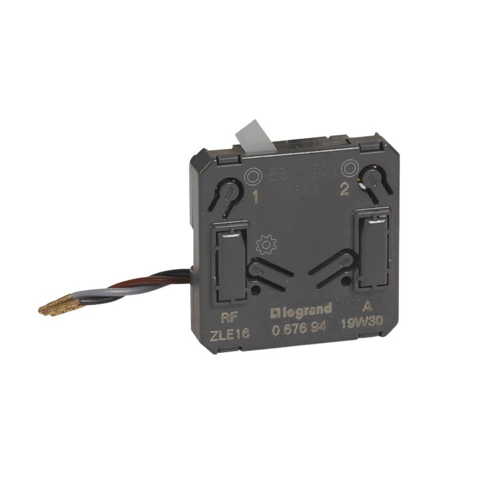|Legrand|Commande bascule||Ne peut etre appairé que sur le canal 11||
||Legrand|BTICINO - Interrupteur filaire pour volet roulant avec positionnement||Ne peut etre appairé que sur le canal 11||
|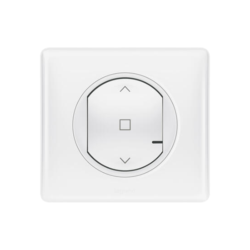|Legrand|Interrupteur filaire connecté pour volet roulant||Ne peut etre appairé que sur le canal 11||
|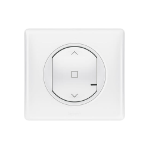|Legrand|Commande sans fil pour volet roulant||Ne peut etre appairé que sur le canal 11||
||Legrand|Télérupteur||Ne peut etre appairé que sur le canal 11||
||Legrand|Commande scène||Ne peut etre appairé que sur le canal 11||

# LiXee

|Image|Marque|Nom|Type|Remarque|Lien|
|---|---|---|---|---|---|
||Lixee|Lixe ZiPulse - Compteur d'impulsions communiquant en ZigBee 3.0.|Compteur|||
||Lixee|Module TIC pour compteur Linky|Compteur||[Acheter](https://www.domadoo.fr/fr/box-domotique/5914-lixee-module-tic-vers-zigbee-30-pour-compteur-linky-3770014375148.html?domid=4&id_campaign=9)|

# MLI

|Image|Marque|Nom|Type|Remarque|Lien|
|---|---|---|---|---|---|
||MLI|MLI - ZBT remote all RGBW||||

# NIKO NV

|Image|Marque|Nom|Type|Remarque|Lien|
|---|---|---|---|---|---|
||NIKO NV|Prise intelligente||||

# Oeeone

|Image|Marque|Nom|Type|Remarque|Lien|
|---|---|---|---|---|---|
||Oeeone|Oeeone Ampoule à Filament LED Intelligente E27||||

# Paul Neuhaus

|Image|Marque|Nom|Type|Remarque|Lien|
|---|---|---|---|---|---|
||Paul Neuhaus|Q-Orbit||||
||Paul Neuhaus|Q-SKYLINE||||
||Paul Neuhaus|Q-Miran||||
|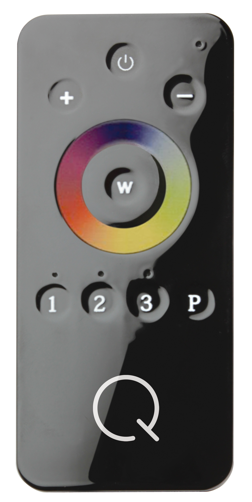|Paul Neuhaus|NLG-remote||||
||Paul Neuhaus|Neuhaus remote||||

# Philio

|Image|Marque|Nom|Type|Remarque|Lien|
|---|---|---|---|---|---|
|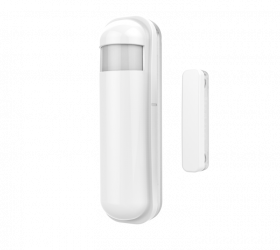|Philio|4 in 1 Multi sensor||||

# SZ

|Image|Marque|Nom|Type|Remarque|Lien|
|---|---|---|---|---|---|
||SZ|Zigbee On/Off contrôleur||||

# Samjin

|Image|Marque|Nom|Type|Remarque|Lien|
|---|---|---|---|---|---|
|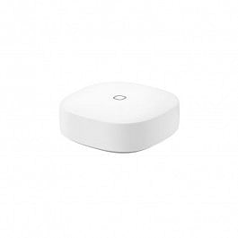|Samjin|Bouton||||
||Samjin|Motion||||

# Samotech

|Image|Marque|Nom|Type|Remarque|Lien|
|---|---|---|---|---|---|
|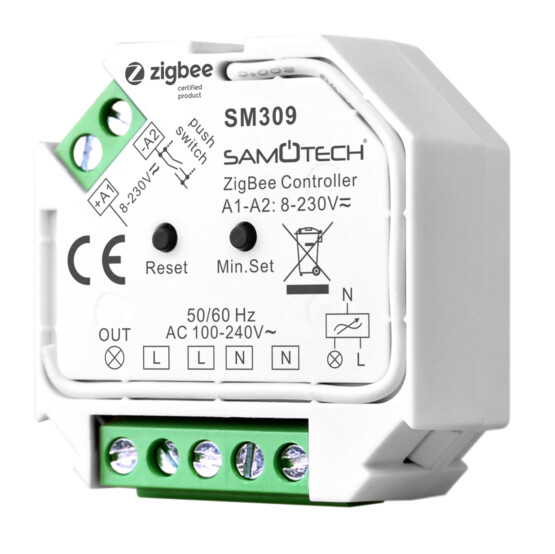|Samotech|SAMOTEK SM309||||

# Sinope Technologies

|Image|Marque|Nom|Type|Remarque|Lien|
|---|---|---|---|---|---|
|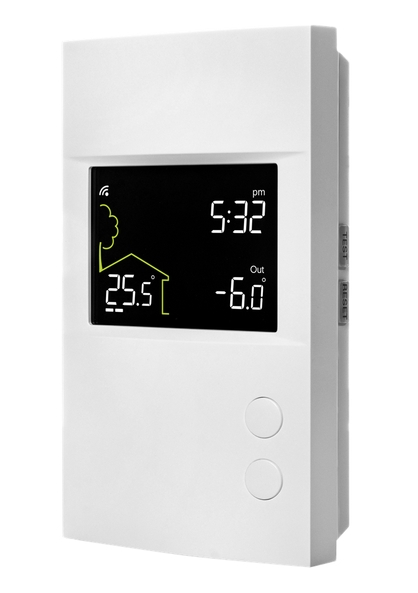|Ouellet|Ouellet OTH3600-GA-ZB|Tête thermostatique|||

# Terncy

|Image|Marque|Nom|Type|Remarque|Lien|
|---|---|---|---|---|---|
||Terncy|SFLS-PP lp wireless ballast||||

# Titan Products Ltd

|Image|Marque|Nom|Type|Remarque|Lien|
|---|---|---|---|---|---|
|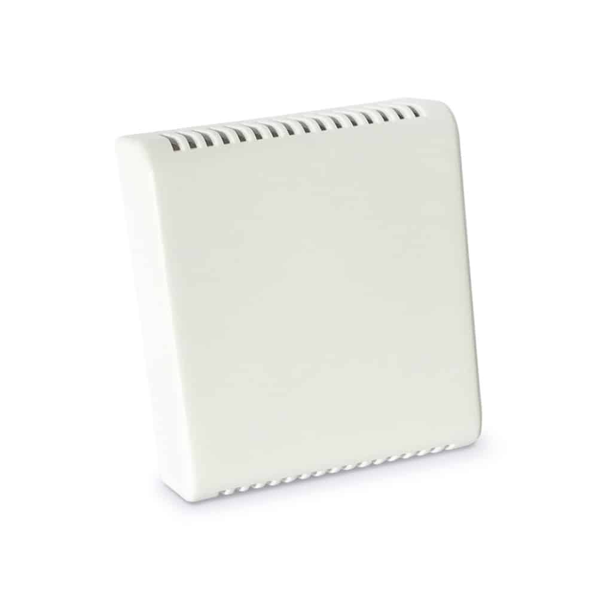|Titan Products Ltd|TPZ-Net Wireless CO2, Temperature & Humidity Sensors|Température,Humidité,Qualité d'air,CO2|||

# Trust International

|Image|Marque|Nom|Type|Remarque|Lien|
|---|---|---|---|---|---|
||Trust International|Trust International ZLL-DimmableLigh||||

# Ysrai

|Image|Marque|Nom|Type|Remarque|Lien|
|---|---|---|---|---|---|
||Ysrai|YSRSAI - ZB-CL01||||

# ZB Ajax Online

|Image|Marque|Nom|Type|Remarque|Lien|
|---|---|---|---|---|---|
||ZB Ajax Online|CCT Light||||

# Zemismart

|Image|Marque|Nom|Type|Remarque|Lien|
|---|---|---|---|---|---|
||Zemismart|Zigbee 3.0 RGB Remote Controller||||
|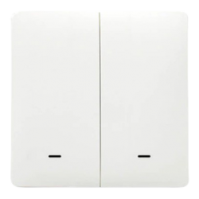|Zemismart|Interrupteur intelligent simple charge sans neutre||||
|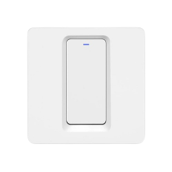|Zemismart|Interrupteur intelligent simple charge sans neutre||||
||Zemismart|Zemismart Zigbee/RF||||
||Zemismart|Store|Volets|||

# Acova

|Image|Marque|Nom|Type|Remarque|Lien|
|---|---|---|---|---|---|
||Acova|ACOVA Alcantara2|Chauffage||[Documentation](https://acova.fr/sites/default/files/PIM/documents/Notice_utilisation_Alcantara_2.pdf) [Acheter](https://www.leroymerlin.fr/produits/chauffage-plomberie/chauffage-electrique/radiateur-electrique/radiateur-a-inertie/radiateur-electrique-connecte-a-inertie-fluide-1000w-acova-alcantara2-horizontal-82646764.html)|
||Acova|ACOVA Percale2|Chauffage||[Documentation](https://acova.fr/radiateur-electrique/percale-2-connecte-156865) [Acheter](https://www.leroymerlin.fr/produits/chauffage-plomberie/chauffage-electrique/radiateur-electrique/radiateur-a-inertie/radiateur-electrique-connecte-a-inertie-fluide-1000w-acova-percale2-horizontal-82646753.html)|

# Adeo

|Image|Marque|Nom|Type|Remarque|Lien|
|---|---|---|---|---|---|
||Adeo|LEXMAN ENKI - Prise connectée 16A Dimmer||||
||Adeo|LEXMAN ENKI - Prise connectée 16A|||[Acheter](https://www.leroymerlin.fr/produits/electricite-domotique/domotique-et-objets-connectes/domotique/solutions-de-commande/prise-connectee-16a-3680w-repeteur-lexman-82428895.html)|
||Adeo|Detecteur de mouvement|Mouvement|||
|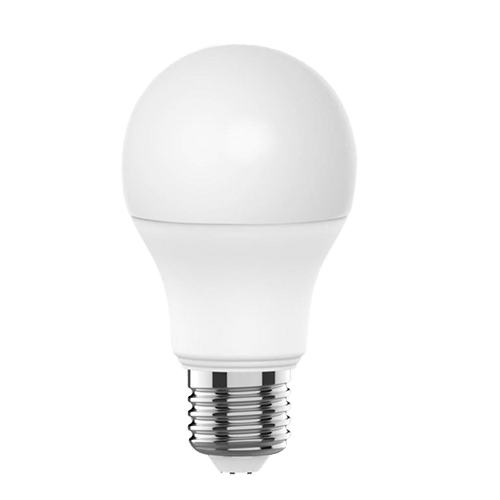|Adeo|LEXMAN ENKI - Ampoule intelligente||||
|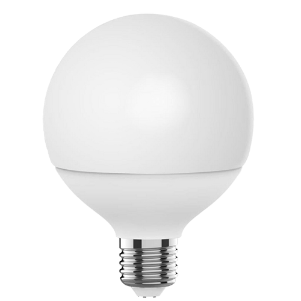|Adeo|LEXMAN ENKI - Ampoule intelligente||||
||Adeo|LEXMAN ENKI - Ampoule intelligente||||
||Adeo|LEXMAN ENKI - Ampoule intelligente||||
|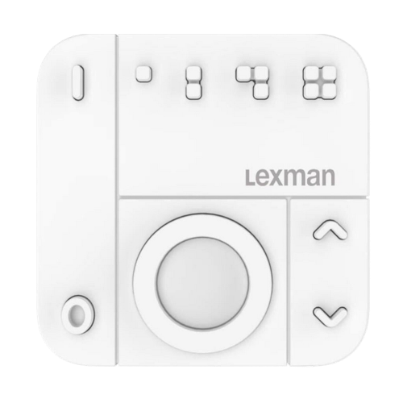|Adeo|LEXMAN ENKI - Télécommande pour ampoules connectées RGB||||
|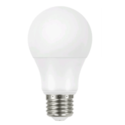|Adeo|LEXMAN ENKI - Ampoule intelligente||||
|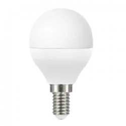|Adeo|LEXMAN ENKI E14 40W - Ampoule intelligente||||
||Adeo|LEXMAN ENKI E27 75W - Ampoule intelligente||||

# Alfawise

|Image|Marque|Nom|Type|Remarque|Lien|
|---|---|---|---|---|---|
|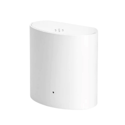|Alfawise|Alfawise Température/humidité||||
||Alfawise|Alfawise porte||||
|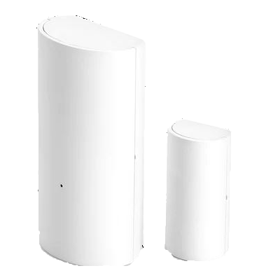|Alfawise|Alfawise porte||||

# Awox

|Image|Marque|Nom|Type|Remarque|Lien|
|---|---|---|---|---|---|
||Awox|EGLO Crosslink-Z / Awox TLSR82||||

# Casaia

|Image|Marque|Nom|Type|Remarque|Lien|
|---|---|---|---|---|---|
||Casaia|Relais Rail-Din 32A et compteur d'énergie Zigbee|Contacteur,Compteur||[Documentation](https://casaia.fr/product/relais-rail-din-et-compteur-denergie-zigbee/?attachment_id=2554&download_file=pciir2fcqcjiz) [Acheter](https://www.domadoo.fr/fr/peripheriques/5578-casaia-relais-rail-din-32a-et-compteur-d-energie-zigbee-3770021021175.html)|
||Casaia|Detecteur de porte intelligent|Ouverture|IMPORTANT : s'inclu mais ne remonte aucunes informations||
|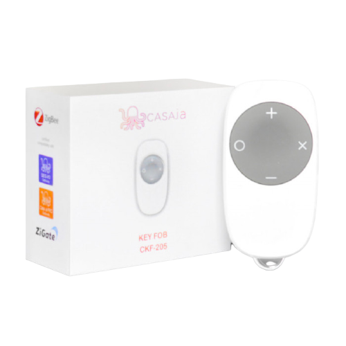|Casaia|Telecommande 4 boutons||Seule les boutons + et moins - marchent|[Acheter](https://www.domadoo.fr/fr/peripheriques/5580-casaia-telecommande-keyfob-4-boutons-zigbee-3770021021205.html)|
|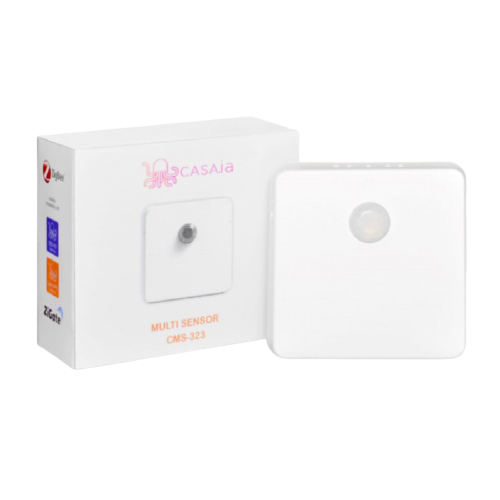|Casaia|Multi-sensor mouvements/vibrations/température/humidité|||[Acheter](https://www.domadoo.fr/fr/peripheriques/5571-casaia-multi-sensor-zigbee-mouvements-vibrations-temperature-humidite-3770021021045.html)|
|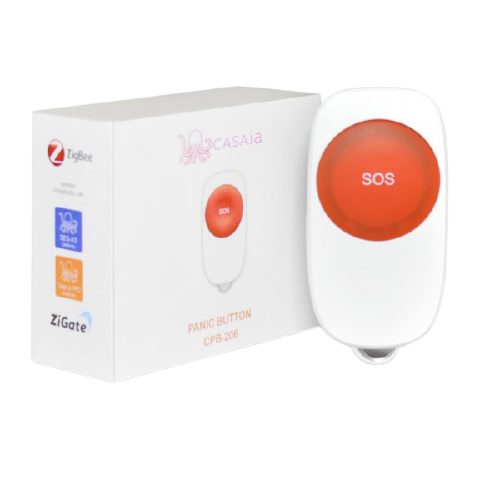|Casaia|Bouton SOS||||
||Casaia|Module de contrôle d'accès Zigbee (6-24V DC) - Contact sec et temporisé à 2 secondes|Contacteur||[Documentation](https://casaia.fr/product/module-de-controle-dacces-zigbee/?attachment_id=2539&download_file=nalg5m9bkxv0a) [Acheter](https://www.domadoo.fr/fr/peripheriques/5574-casaia-module-de-controle-d-acces-zigbee-6-24v-dc-contact-sec-et-temporise-a-2-secondes-3770021021120.html)|
|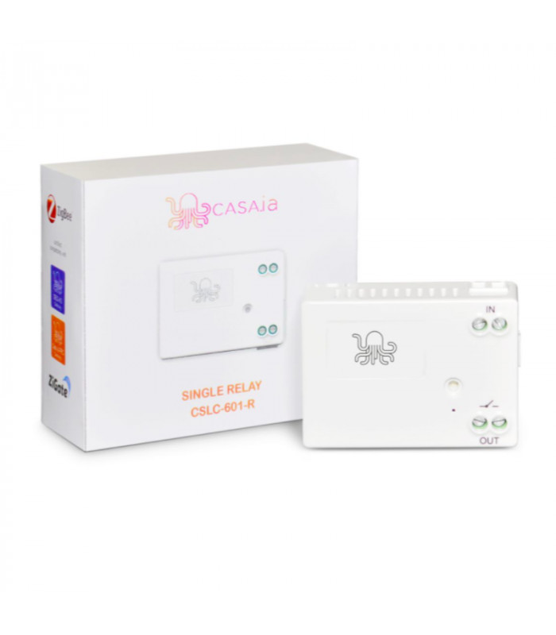|Casaia|MODULE RELAIS CONTACT SEC ZIGBEE (230V - 10A)|Contacteur||[Documentation](https://casaia.fr/product/module-relais-contact-sec-zigbee-2/?attachment_id=2531&download_file=sot05ddz1k2wn) [Acheter](https://www.domadoo.fr/fr/peripheriques/5573-casaia-module-relais-contact-sec-zigbee-230v-10a-3770021021113.html)|
|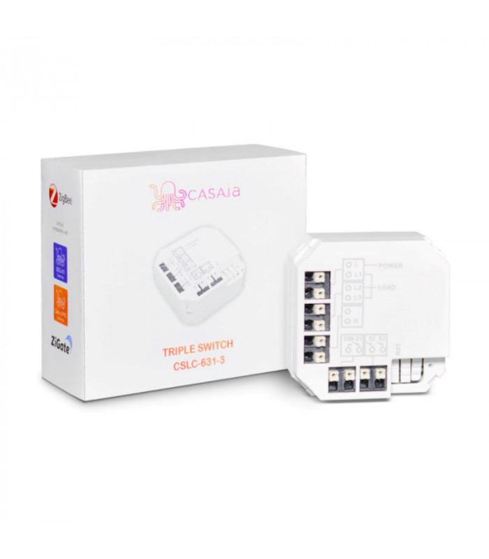|Casaia|Module triple relais Zigbee|Contacteur||[Documentation](https://casaia.fr/product/module-triple-relais-zigbee/?attachment_id=2518&download_file=c2digfwrhtylk) [Acheter](https://www.domadoo.fr/fr/peripheriques/5577-casaia-module-triple-relais-zigbee-3770021021151.html)|
||Casaia|Sonde de température déportée sur câble|||[Acheter](https://www.domadoo.fr/fr/peripheriques/5572-casaia-sonde-de-temperature-deportee-sur-cable-zigbee-3770021021052.html)|

# ClimaxTechnology

|Image|Marque|Nom|Type|Remarque|Lien|
|---|---|---|---|---|---|
||ClimaxTechnology|Detecteur Bris de Verre|Capteur||[Documentation](https://www.climax.com.tw/new/downloads/ACGS-23ZBS_Product_News_20210701.pdf) |
||ClimaxTechnology|Capteur de température, humidité, luminosité|Capteur,Humidité,Température, Luminosité||[Documentation](https://www.climax.com.tw/new/downloads/LMHT-1ZBS_Product_News_20121-0512.pdf) |
||ClimaxTechnology|Panic button|||[Documentation](https://www.climax.com.tw/new/downloads/PB-23ZBS_Product%20News%2020190702.pdf) |
|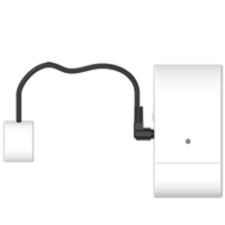|ClimaxTechnology|Energy Meter|Capteur,Consommation||[Documentation](https://www.climax.com.tw/new/downloads/EMD-1ZBS_Product_News_2021_0423.pdf) |
|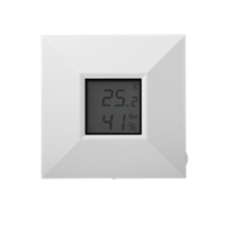|ClimaxTechnology|Capteur de température et humidité|Capteur,Humidité,Température||[Documentation](https://www.climax.com.tw/new/downloads/RS-23R2-ZBS_Product%20News_20200603.pdf) |
||ClimaxTechnology|Capteur de température|Capteur,Humidité,Température||[Documentation](https://www.climax.com.tw/new/downloads/TSO-9-EL-ZBS_Product%20News_20201111.pdf) |
|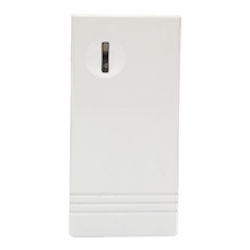|ClimaxTechnology|Input / Output Switch|Capteur,Humidité,Température||[Documentation](https://www.climax.com.tw/new/downloads/XE-11_Product%20News_20210503.pdf) |

# Danalock

|Image|Marque|Nom|Type|Remarque|Lien|
|---|---|---|---|---|---|
||Danalock|Serrure intelligente V3|||[Acheter](https://www.domadoo.fr/fr/controle-acces/4540-danalock-serrure-connectee-bluetooth-et-zigbee-danalock-v3-5712560000493.html)|

# Danfoss

|Image|Marque|Nom|Type|Remarque|Lien|
|---|---|---|---|---|---|
||Danfoss|Danfoss Ally (2)|Tête thermostatique||[Documentation](https://assets.danfoss.com/documents/DOC353849556547/DOC353849556547.pdf) [Acheter](https://www.domadoo.fr/fr/peripheriques/5156-danfoss-tete-electronique-ally-zigbee-30-5702425245008.html)|
|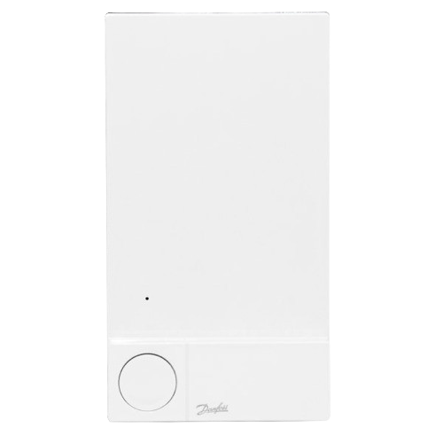|Danfoss|Danfoss Icon Floor Controller|Contrôleur Plancher Chauffant|||
||Danfoss|Danfoss Ally|Tête thermostatique||[Documentation](https://assets.danfoss.com/documents/DOC353849556547/DOC353849556547.pdf) [Acheter](https://www.domadoo.fr/fr/peripheriques/5156-danfoss-tete-electronique-ally-zigbee-30-5702425245008.html)|
||Danfoss|Sonde de température et d'humidité|||[Acheter](https://www.domadoo.fr/fr/peripheriques/5930-danfoss-sonde-de-temperature-et-d-humidite-zigbee-30-5715162289013.html)|

# Dresden elektronik

|Image|Marque|Nom|Type|Remarque|Lien|
|---|---|---|---|---|---|
||Dresden elektronik|FLS-PP lp wireless ballast||||

# EWeLink

|Image|Marque|Nom|Type|Remarque|Lien|
|---|---|---|---|---|---|
||eWeLight|Controleur LED intelligente RGBCW MR16||||
|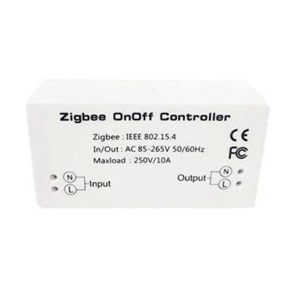|EWeLink|OnOff Controller||||
||EWeLink|Ampoule LED intelligente RGBCW MR16||||
||EWeLink|Commutateur de Relais Intelligent ZigBee à 1 Canal||||
|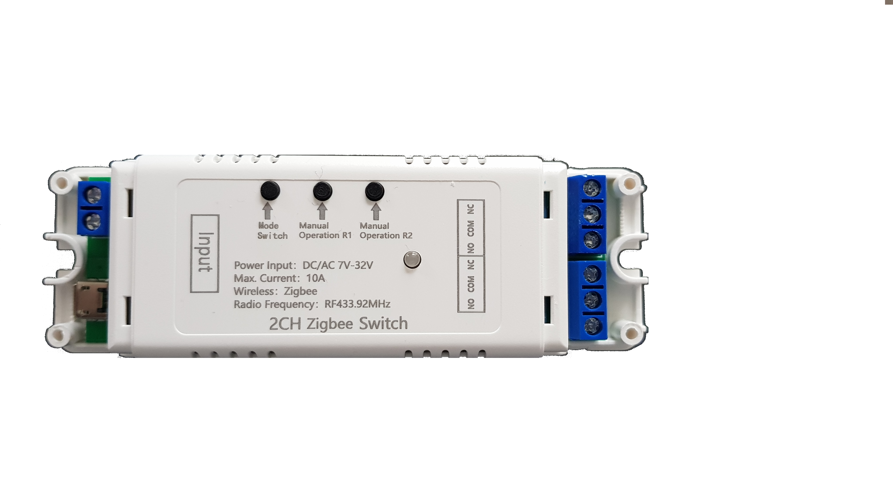|EWeLink|OnOff Controller||||

# Ecodim

|Image|Marque|Nom|Type|Remarque|Lien|
|---|---|---|---|---|---|
|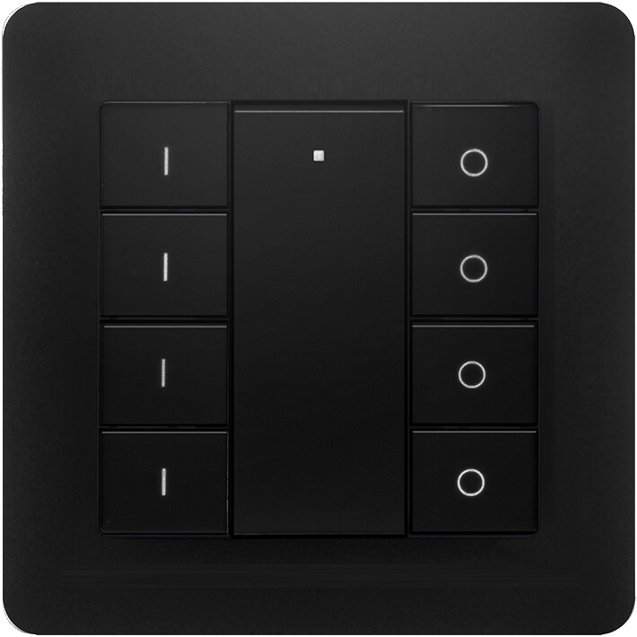|Ecodim|CONTRÔLEUR MURAL SANS FIL 8 BOUTONS||||
||Ecodim|Interrupteur variateur rotatif|Interrupteur,Variateur||[Acheter](https://www.domadoo.fr/fr/eclairage/5369-ecodim-interrupteur-variateur-rotatif-zigbee-30-200w-8719322371263.html)|
|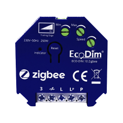|Ecodim|ECODIM - MODULE VARIATEUR INTELLIGENT ZIGBEE 3.0 250W ECO-DIM.10|Interrupteur,Variateur||[Acheter](https://www.domadoo.fr/fr/eclairage/5372-ecodim-module-variateur-intelligent-zigbee-30-250w-eco-dim10-8719322371775.html?domid=4&id_campaign=9)|

# Evology

|Image|Marque|Nom|Type|Remarque|Lien|
|---|---|---|---|---|---|
|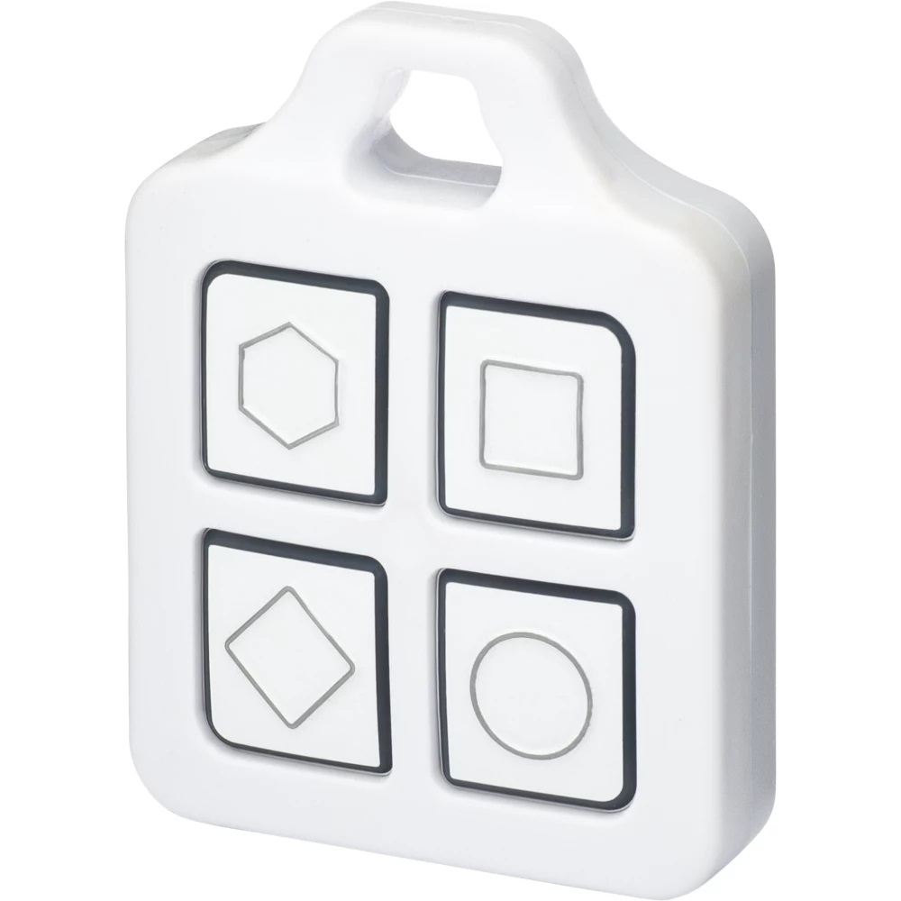|EVOLOGY|3450-Geu|Télécommande|||
||Evology|Sirène intelligente||||

# Feller

|Image|Marque|Nom|Type|Remarque|Lien|
|---|---|---|---|---|---|
|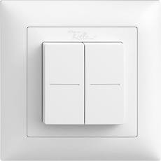|Feller|Friends of huer 4 boutons||||

# Gledopto

|Image|Marque|Nom|Type|Remarque|Lien|
|---|---|---|---|---|---|
|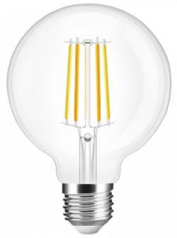|Gledopto|GL-B-004P||||
|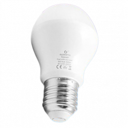|Gledopto|GL-B-007Z||||
|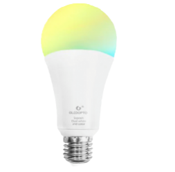|Gledopto|GL-B-008Z||||
||Gledopto|Contrôleur intelligent ruban de LED blanc chaud et froid||||
|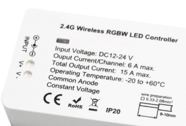|Gledopto|GL-C-007||||
||Gledopto|GL-C-008P||||
|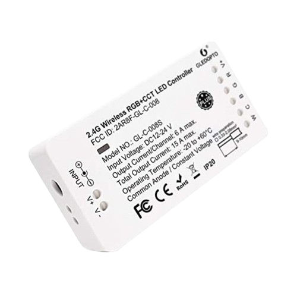|Gledopto|GL-C-008S||||
|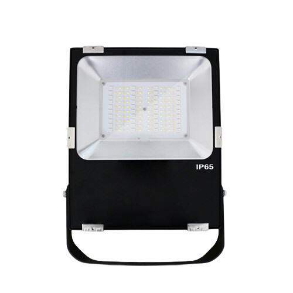|Gledopto|GL-FL-006P||||
||Gledopto|GL-G-001P||||
|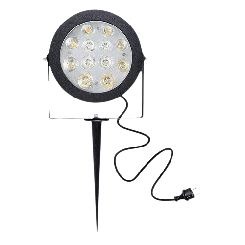|Gledopto|GL-G-001ZS||||
||Gledopto|GL-H-001||||
||Gledopto|Ruban Gledopto RGBCCT||||
||Gledopto|Ruban Gledopto RGBCCT||||
||Gledopto|GL-S-004Z||||
||Gledopto|GL-S-007Z||||

# Heiman

|Image|Marque|Nom|Type|Remarque|Lien|
|---|---|---|---|---|---|
|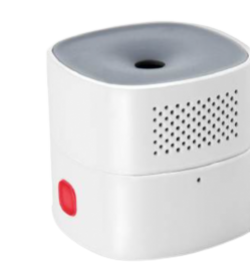|Heiman|Smart Carbon Monoxide Sensor|||[Acheter](https://www.domadoo.fr/fr/peripheriques/5884-heiman-capteur-co-monoxyde-de-carbone-zigbee-30.html?domid=4&id_campaign=9)|
|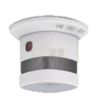|Heiman|Détecteur de monoxyde de carbone||||
|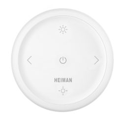|Heiman|Telecommande 5 boutons couleur||||
||Heiman|ColorLight E27||||
|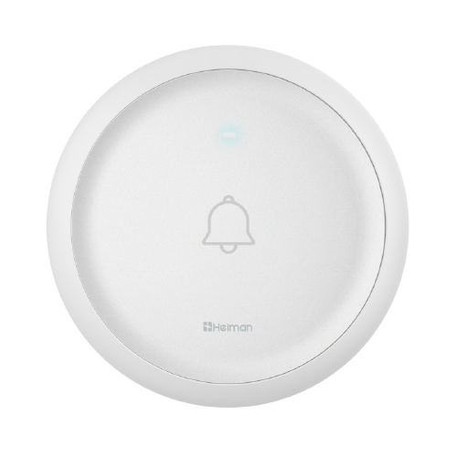|Heiman|Sonnette connectée||||
|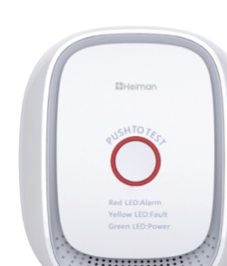|Heiman|Smart Combustible Gas Sensor|||[Acheter](https://www.domadoo.fr/fr/peripheriques/5883-heiman-capteur-de-gaz-combustible-intelligent-zigbee-30.html?domid=4&id_campaign=9)|
||Heiman|Détecteur de gaz|||[Acheter](https://www.domadoo.fr/fr/peripheriques/5883-heiman-capteur-de-gaz-combustible-intelligent-zigbee-30.html?domid=4&id_campaign=9)|
||Heiman|Capteur de qualité d'air Zigbee 3.0|||[Acheter](https://www.domadoo.fr/fr/peripheriques/5882-heiman-capteur-de-qualite-d-air-co2-temperature-humidite-zigbee-30-alarme-visuelle-et-sonore.html?domid=4&id_campaign=9)|
||Heiman|HEIMAN - CAPTEUR DE TEMPERATURE ET HUMIDITÉ ZIGBEE 3.0 AVEC ÉCRAN|||[Acheter](https://www.domadoo.fr/fr/peripheriques/6293-heiman-capteur-de-temperature-et-humidite-zigbee-30-avec-ecran.html?domid=4&id_campaign=9)|
|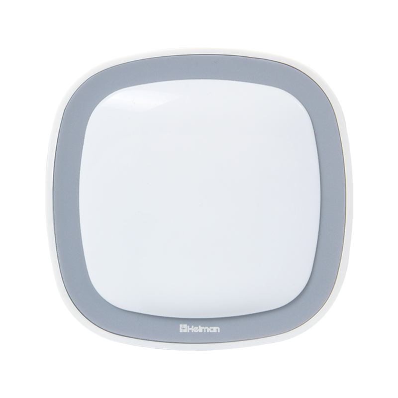|Heiman|||||
||Heiman|Telecommande 4 boutons|||[Acheter](https://www.domadoo.fr/fr/peripheriques/5721-heiman-telecommande-porte-cles-de-scenes-zigbee.html?domid=4&id_campaign=9)|
||Heiman|Bouton SOS||||
|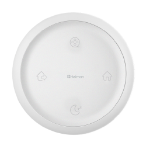|Heiman|Telecommande 4 boutons|||[Acheter](https://www.domadoo.fr/fr/peripheriques/5715-heiman-telecommande-de-scenes-zigbee.html?domid=4&id_campaign=9)|
||Heiman|Détecteur de fumée||||
||Heiman|Détecteur de fumée||||
|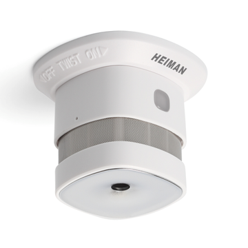|Heiman|Détecteur de fumée||||
||Heiman|Telecommande 5 boutons||||
||Heiman|||||
||Heiman|Sirène intelligente|||[Acheter](https://www.domadoo.fr/fr/peripheriques/5714-heiman-sirene-interieure-intelligente-zigbee-30.html?domid=4&id_campaign=9)|
||Schneider|Prise connectée et répéteur Wiser|Prise,Compteur,Puissance,Répéteur||[Acheter](https://www.domadoo.fr/fr/eclairage/5499-schneider-electric-prise-connectee-et-repeteur-zigbee-30-wiser-3606489917883.html)|
|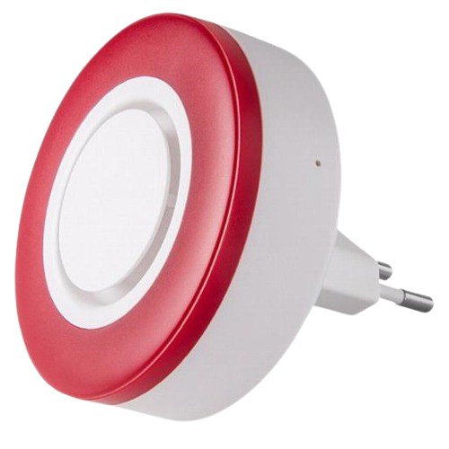|Heiman|Sirène intérieure Zigbee 3.0|Sirène||[Acheter](https://www.domadoo.fr/fr/peripheriques/5714-heiman-sirene-interieure-intelligente-zigbee-30.html?domid=4&id_campaign=9)|

# Icasa

|Image|Marque|Nom|Type|Remarque|Lien|
|---|---|---|---|---|---|
||Icasa|Filamant Bulb||||
|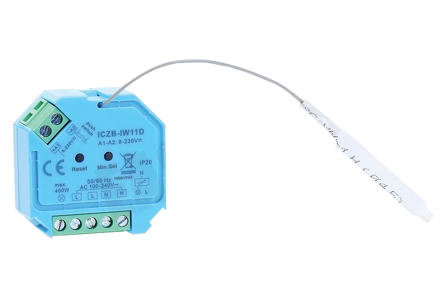|Icasa|AC dimmer||||
|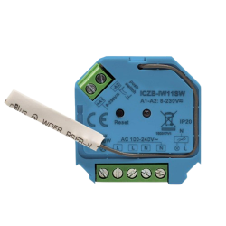|Icasa|AC switch||||
||Icasa|Pulse 4S Wall Controller||||
||Icasa|Rotary Dimmer||||
|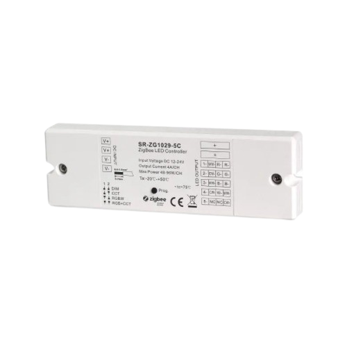|Icasa|Icasa RGB||||

# Idinio

|Image|Marque|Nom|Type|Remarque|Lien|
|---|---|---|---|---|---|
||Idinio|IDINIO - INTERRUPTEUR LED SUR CORDON ZIGBEE 3.0 NOIR + BLANC (COMPATIBLE PHILIPS HUE)|||[Acheter](https://www.domadoo.fr/fr/peripheriques/5744-idinio-interrupteur-led-sur-cordon-zigbee-30-noir-blanc-compatible-philips-hue-8720246200201.html?domid=4&id_campaign=9)|
||Idinio|Interrupteur variateur sur pied|Interrupteur,Variateur||[Acheter](https://www.domadoo.fr/fr/peripheriques/5743-idinio-variateur-sur-pied-zigbee-30-pour-led-noirblanc-compatible-philips-hue-8720246201291.html?domid=4&id_campaign=9)|

# Ikea

|Image|Marque|Nom|Type|Remarque|Lien|
|---|---|---|---|---|---|
||Ikea|FLOALT panel WS 30x30||||
||Ikea|FLOALT panel WS 30x90||||
|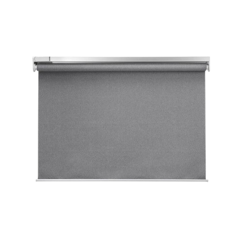|Ikea|Fyrtur - store à enrouleur||||
||Ikea|GUNNARP panel round||||
|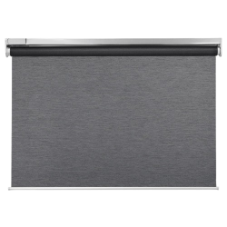|Ikea|Kadrilj - store à enrouleur||||
||Ikea|Télécommande STYRBAR|Télécommande|||
||Ikea|Purificateur d’air IKEA Starkvind||||
||Ikea|Purificateur d’air IKEA Starkvind table||||
|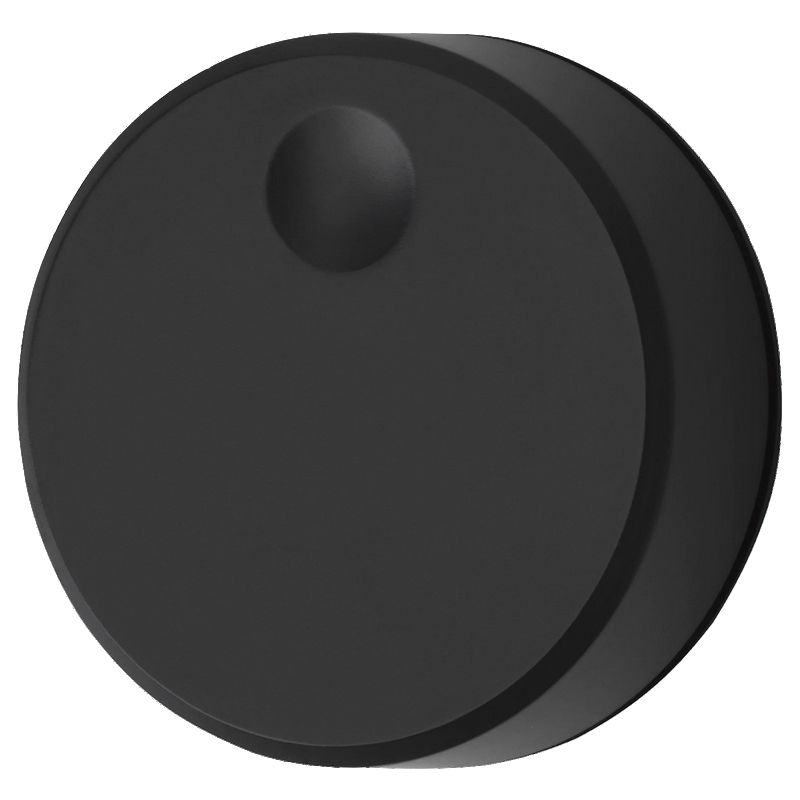|Ikea|Symfonisk sound controller|Télécommande|||
|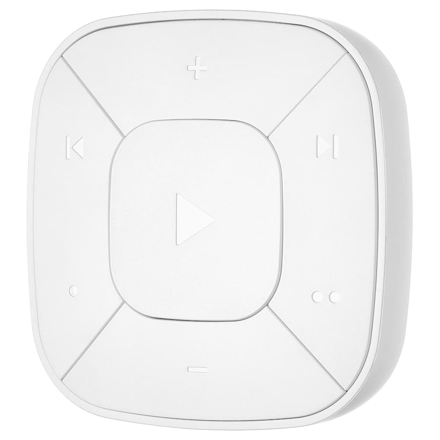|Ikea|Symfonisk sound controller gen2|Télécommande|||
||Ikea|Driver 10W||||
|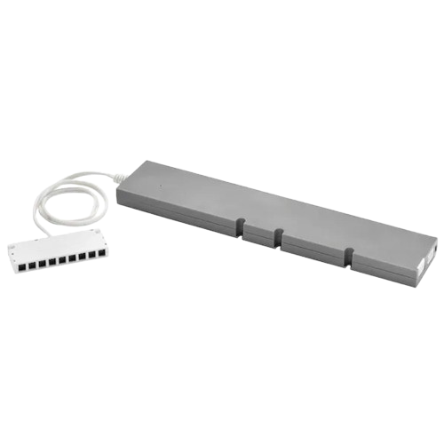|Ikea|Driver 30W||||
|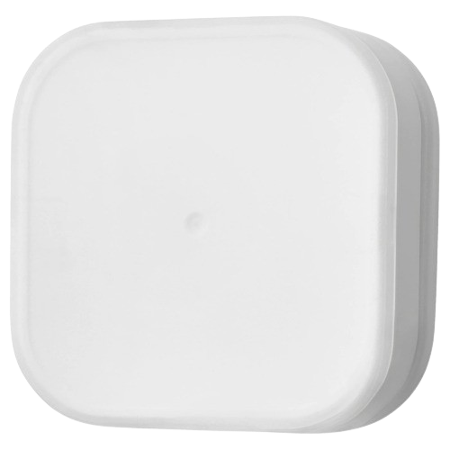|Ikea|SHORTCUT Button|Télécommande|||
||Ikea|Bulb E14 CWS 470lm||||
||Ikea|Bulb E14 CWS opal 600lm||||
||Ikea|Bulb E14 WS 470lm||||
|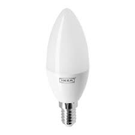|Ikea|Bulb E14 WS opal 600lm||||
||Ikea|Bulb E14 W opch 400lm||||
||Ikea|Bulb E27 CWS 806lm||||
|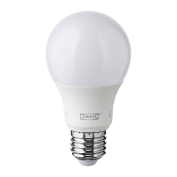|Ikea|Bulb E27 CWS opal 600lm||||
||Ikea|Bulb E27 WS opal 1000lm||||
||Ikea|Bulb E27 WS opal 980lm||Attention le retour d'état pour ce model n'est pas en temps réel (soit suite à une commande soit en demandant explicitement une mise à jour de celui-ci)||
||Ikea|Bulb E27 WW 806lm||||
||Ikea|TRADFRI bulb E27 WW clear 250lm||||
||Ikea|Bulb E27 W opal 1000lm||||
||Ikea|Bulb GU10 WS 400lm||||
|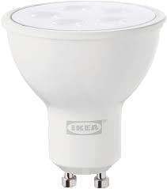|Ikea|Bulb GU10 WW 400lm||||
|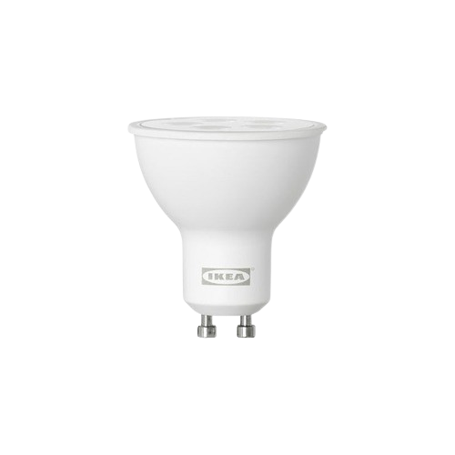|Ikea|Bulb GU10 W 400lm||||
||Ikea|Prise connectée|||[Documentation](https://www.ikea.com/fr/fr/manuals/tradfri-wireless-control-outlet__AA-2106602-1_pub.pdf) |
||Ikea|Détecteur de mouvement|||[Documentation](https://www.ikea.com/fr/fr/manuals/tradfri-wireless-motion-sensor__AA-2145280-2_pub.pdf) |
||Ikea|Télécommande 2 boutons|Télécommande||[Documentation](https://www.ikea.com/fr/fr/assembly_instructions/tradfri-wireless-dimmer-white__AA-2175106-3_pub.pdf) |
|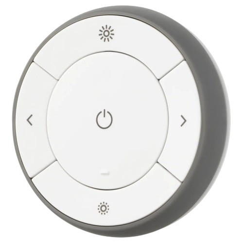|Ikea|Télécommande 5 boutons|Télécommande||[Documentation](https://www.ikea.com/fr/fr/manuals/tradfri-remote-control__AA-2144014-1_pub.pdf) |
|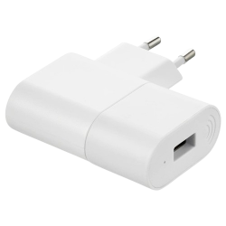|Ikea|Ikea repeateur||||
|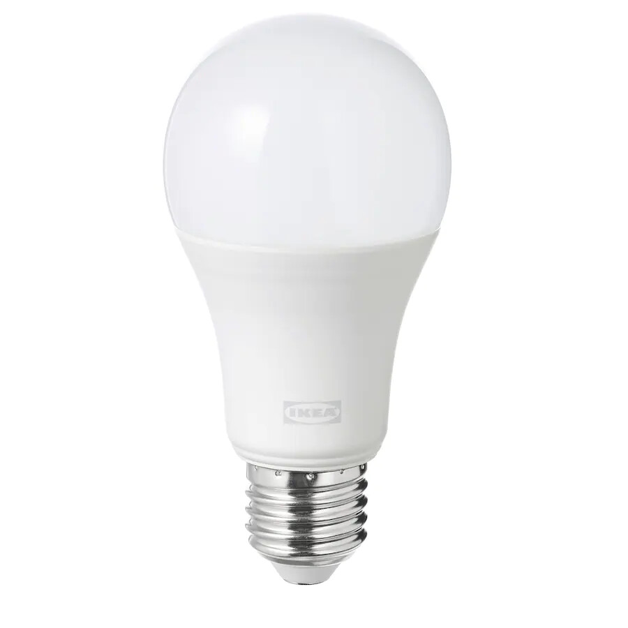|Ikea|Bulb E27 1055lm||||
||Ikea|TRADFRI bulb E27 WW clear 250lm||||
||Ikea|Bulb GU10 WS 350lm||||
||Ikea|Tredansen||||
||Ikea|Télécommande 2 boutons store||||

# Iluminize

|Image|Marque|Nom|Type|Remarque|Lien|
|---|---|---|---|---|---|
||Iluminize|Zigbee 3.0 haute tension, Actionneur de variateur||||

# Imaax

|Image|Marque|Nom|Type|Remarque|Lien|
|---|---|---|---|---|---|
||Imaax|IMMAX - Sirene Intelligente Exterieure|||[Acheter](https://www.domadoo.fr/fr/peripheriques/6352-immax-sirene-intelligente-exterieure-zigbee-30-tuya-ip65.html?domid=4&id_campaign=9)|
|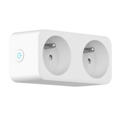|Imaax|IMMAX - Prise Double||||
||Imaax|IMMAX - Multi Sensors (PIR, Temperature, Humidite, Luminosite|||[Acheter](https://www.domadoo.fr/fr/peripheriques/6355-immax-detecteur-de-mouvement-pir-temperature-humidite-et-luminosite-zigbee-30-tuya.html?domid=4&id_campaign=9)|

# Innr

|Image|Marque|Nom|Type|Remarque|Lien|
|---|---|---|---|---|---|
||Innr|INNR AE 260||||
||Innr|INNR RUBAN FLEXIBLE INDOOR RGBW|||[Acheter](https://www.domadoo.fr/fr/peripheriques/5455-innr-ruban-flexible-indoor-couleur-4m-couleur-et-blanc-variable-2000k-a-6500k-8718781552725.html?domid=4&id_campaign=9)|
||Innr|INNR Outdoor Flex Light Colour|||[Acheter](https://www.domadoo.fr/fr/eclairage/5482-innr-ruban-flexible-outdoor-couleur-4m-zigbee-lightlink-8718781552527.html?domid=4&id_campaign=9)|
||Innr|INNR - GLOBE LED CONNECTE 19 CM POUR JARDIN - PACK DE 3|||[Acheter](https://www.domadoo.fr/fr/eclairage/6240-innr-globe-led-connecte-19-cm-pour-jardin-avec-alim-couleur-et-blanc-pack-de-3-8718781553647.html?domid=4&id_campaign=9)|
||Innr|INNR - SPOT CYLINDRE LED CONNECTÉ ZIGBEE POUR JARDIN - PACK DE 3|||[Acheter](https://www.domadoo.fr/fr/peripheriques/5795-innr-spot-cylindre-led-connecte-zigbee-pour-jardin-pack-de-3-8718781552770.html?domid=4&id_campaign=9)|
||Innr|OSL 130 C|||[Acheter](https://www.domadoo.fr/fr/peripheriques/5793-innr-spot-led-connecte-pour-jardin-couleur-et-blanc-zigbee-8718781552541.html?domid=4&id_campaign=9)|
||Innr|INNR RB 165||||
||Innr|INNR E14 RGBW|||[Acheter](https://www.domadoo.fr/fr/peripheriques/5349-innr-ampoule-connectee-type-e14-zigbee-30-multicolor-rgbw-blanc-reglable-2200k-a-6500k-8718781552060.html)|
||Innr|Innr RB 265||||
||Innr|RB278T|||[Acheter](https://www.domadoo.fr/fr/peripheriques/5353-innr-ampoule-connectee-type-e27-zigbee-30-pack-de-2-ampoules-blanc-reglable-2200k-a-5000k-8718781552312.html?domid=4&id_campaign=9)|
||Innr|INNR E27 Multicolor RGBW + Blanc|||[Acheter](https://www.domadoo.fr/fr/peripheriques/5355-innr-ampoule-connectee-type-e27-zigbee-30-multicolor-rgbw-blanc-reglable-2200k-a-6500k-8718781552206.html?domid=4&id_campaign=9)|
|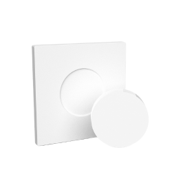|Innr|INNR smart button|||[Acheter](https://www.domadoo.fr/fr/peripheriques/6055-innr-bouton-intelligent-sans-fil-zigbee-1-touche-smart-button-8718781553364.html?domid=4&id_campaign=9)|
|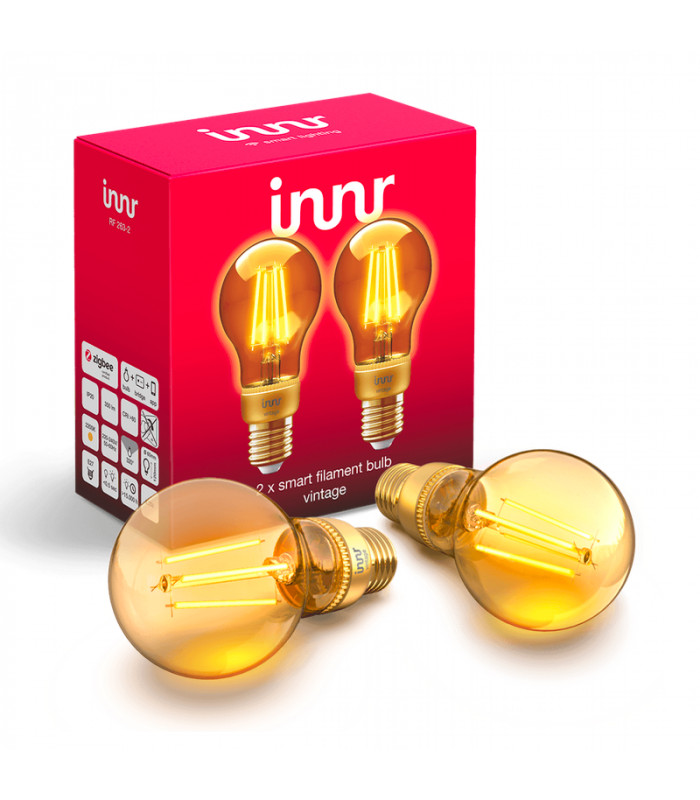|Innr|INNR RF 263|||[Acheter](https://www.domadoo.fr/fr/peripheriques/5361-innr-ampoule-connectee-type-e27-zigbee-30-pack-de-2-ampoules-vintage-filament-2200-k-8718781552022.html?domid=4&id_campaign=9)|
|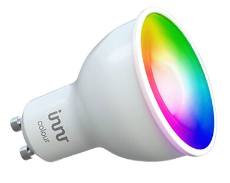|Innr|INNR GU10 RGBW|||[Acheter](https://www.domadoo.fr/fr/peripheriques/5451-innr-ampoule-connectee-type-gu10-zigbee-30-multicolor-rgbw-blanc-reglable-1800-a-6500k-8718781552039.html?domid=4&id_campaign=9)|
||Innr|INNR PRISE||||
|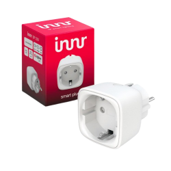|Innr|Prise|||[Acheter](https://www.domadoo.fr/fr/peripheriques/5362-innr-prise-connectee-super-slim-zigbee-30-8718781552657.html)|

# Konke

|Image|Marque|Nom|Type|Remarque|Lien|
|---|---|---|---|---|---|
|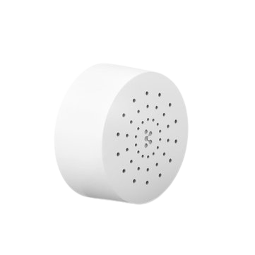|Konke|Sonde de température et d'humidité||||
|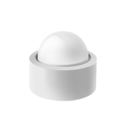|Konke|Konke Motion sensor||||

# Ledvance

|Image|Marque|Nom|Type|Remarque|Lien|
|---|---|---|---|---|---|
||Ledvance|Classic E27 Multicolor||||
|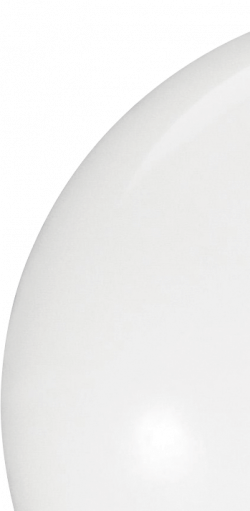|Ledvance|Classic E27 Tunable white||||
||Ledvance|FLEX RGBW Z3||||
|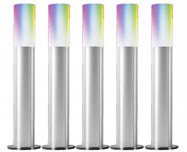|Ledvance|Gardenpole RGBW Z3||||
||Ledvance|Outdoor FLEX RGBW Z3||||
||Ledvance|LEDVANCE SMART+ BT OUTDOOR PLUG EU||||
||Ledvance|Prise Smart+ Plug Z3||||

# Lellki

|Image|Marque|Nom|Type|Remarque|Lien|
|---|---|---|---|---|---|
||Lellki|Multiprise intelligente||||

# Lexman

|Image|Marque|Nom|Type|Remarque|Lien|
|---|---|---|---|---|---|
||Lexman|LEXMAN ENKI - Prise connectée 10A||||
|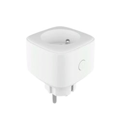|Lexman|LEXMAN ENKI - Prise connectée 16A|||[Acheter](https://www.leroymerlin.fr/produits/electricite-domotique/domotique-et-objets-connectes/domotique/solutions-de-commande/prise-connectee-16a-3680w-repeteur-lexman-82428895.html)|

# Lidl

|Image|Marque|Nom|Type|Remarque|Lien|
|---|---|---|---|---|---|
|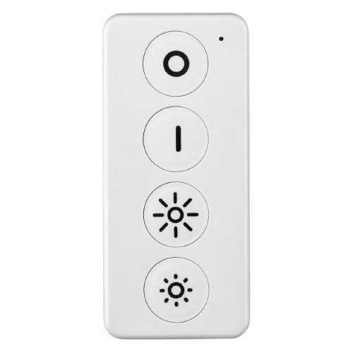|Lidl|Télécommande intelligente variateur||||
||Lidl|Détecteur de mouvement intelligent||||
||Lidl|Ampoule connectée E27||||
||Lidl|Applique murale LED d'exterieur connectée||||
||Lidl|Ampoule connectée E27 RGB||||
||Lidl|Ampoule LED connectée GU10||||
|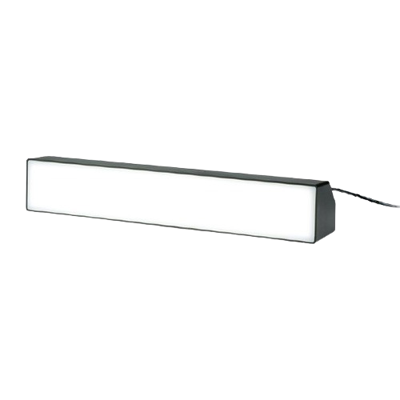|Lidl|Reglette à LED connectée||||
||Lidl|Ampoule connectée GU10 RGB||||
|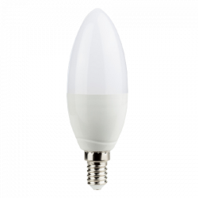|Lidl|Ampoule LED connectée E14||||
|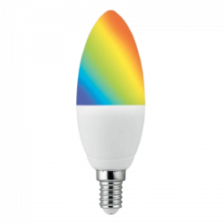|Lidl|Ampoule connectée E14 RGB||||
||Lidl|Ruban de LED intelligent||||
||Lidl|Multiprise connectée 4 prises et 2 ports USB||||
|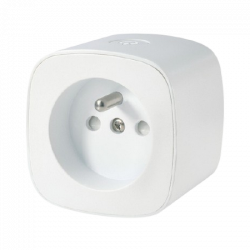|Lidl|Prise connectée ON/OFF||||
|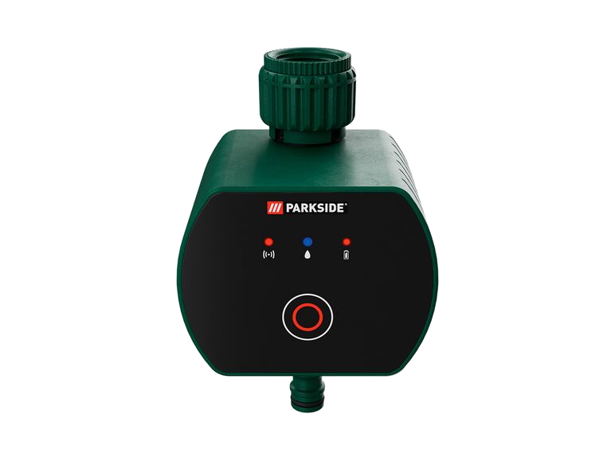|Lidl|Controleur d'irrigation||||

# Loratap

|Image|Marque|Nom|Type|Remarque|Lien|
|---|---|---|---|---|---|
||Loratap|Module volet roulant||||
||Loratap|LORATAP - Repeteur de signal Zigbee 3.0|||[Acheter](https://www.domadoo.fr/fr/peripheriques/5984-loratap-repeteur-de-signal-zigbee-30.html?domid=4&id_campaign=9)|

# Miboxer

|Image|Marque|Nom|Type|Remarque|Lien|
|---|---|---|---|---|---|
||Miboxer|MIBOXER - LED Controller||||

# Moes

|Image|Marque|Nom|Type|Remarque|Lien|
|---|---|---|---|---|---|
||Moes|MOES - TÊTE THERMOSTATIQUE INTELLIGENTE ZIGBEE 3.0 TUYA|||[Acheter](https://www.domadoo.fr/fr/peripheriques/6390-moes-tete-thermostatique-intelligente-zigbee-30-tuya.html?domid=4&id_campaign=9)|
|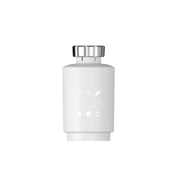|Moes|MOES - TÊTE THERMOSTATIQUE INTELLIGENTE ZIGBEE TUYA|||[Acheter](https://www.domadoo.fr/fr/peripheriques/6389-moes-tete-thermostatique-intelligente-zigbee-tuya.html?domid=4&id_campaign=9)|
||Moes|MOES - Détecteur de présence Zigbee Tuya (technologie radar)|||[Acheter](https://www.domadoo.fr/fr/domotique/6328-moes-detecteur-de-presence-zigbee-tuya-technologie-radar.html?domid=4&id_campaign=9)|

# Neo

|Image|Marque|Nom|Type|Remarque|Lien|
|---|---|---|---|---|---|
||Neo|NEO CoolCam NAS-WS02||||
||Neo|NEO - Prise intelligente Zigbee Tuya 16A + mesure de consommation|||[Acheter](https://www.domadoo.fr/fr/peripheriques/6473-neo-prise-intelligente-zigbee-tuya-16a-mesure-de-consommation.html?domid=4&id_campaign=9 )|

# Nodon

|Image|Marque|Nom|Type|Remarque|Lien|
|---|---|---|---|---|---|
||NodOn|Commutateur ON/OFF simple charge 16A|Contacteur||[Acheter](https://www.domadoo.fr/fr/peripheriques/5688-nodon-module-multifonction-zigbee-3700313925188.html?domid=4&id_campaign=9)|
|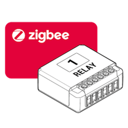|NodOn|Commutateur ON/OFF simple charge 16A PRO|Contacteur||[Acheter](https://www.domadoo.fr/fr/peripheriques/5585-nodon-pro-module-multifonction-zigbee-3700313925256.html?domid=4&id_campaign=9)|
||NodOn|Module commutateur double charge ON/OFF 2x3A|Contacteur||[Acheter](https://www.domadoo.fr/fr/peripheriques/5689-nodon-module-eclairage-onoff-zigbee-3700313925225.html?domid=4&id_campaign=9)|
||NodOn|Module commutateur double charge ON/OFF 2x3A PRO|Contacteur||[Acheter](https://www.domadoo.fr/fr/peripheriques/5586-nodon-pro-module-eclairage-onoff-zigbee-3700313925317.html?domid=4&id_campaign=9)|
||Nodon|Module volet roulant|||[Acheter](https://www.domadoo.fr/fr/peripheriques/5690-nodon-module-volet-roulant-zigbee-3700313925201.html?domid=4&id_campaign=9)|
||Nodon|Module volet roulant PRO|||[Acheter](https://www.domadoo.fr/fr/peripheriques/5587-nodon-pro-module-volet-roulant-zigbee-3700313925287.html?domid=4&id_campaign=9)|
|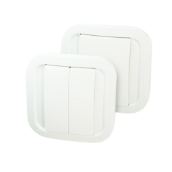|NodOn|Interrupteur mural Zigbee compatible Philips Hue|Interrupteur||[Acheter](https://www.domadoo.fr/fr/peripheriques/5922-nodon-interrupteur-mural-zigbee-compatible-philips-hue-3700313924723.html?domid=4&id_campaign=9)|

# Nous

|Image|Marque|Nom|Type|Remarque|Lien|
|---|---|---|---|---|---|
||Nous|NOUS - DÉTECTEUR D'INONDATION ZIGBEE 3.0 TUYA|Capteur,Fuite,Inondation||[Acheter](https://www.domadoo.fr/fr/peripheriques/6201-nous-detecteur-d-inondation-zigbee-30-tuya-5907772033883.html?domid=4&id_campaign=9)|
||Nous|NOUS - VANNE INTELLIGENTE ZIGBEE 3.0 TUYA|||[Acheter](https://www.domadoo.fr/fr/peripheriques/6214-nous-vanne-intelligente-zigbee-30-tuya-5907772033968.html?domid=4&id_campaign=9)|
||Nous|NOUS - PRISE INTELLIGENTE ZIGBEE 3.0 + MESURE DE CONSOMMATION|||[Documentation](https://nous.technology/product/a1z-1/fr.html) [Acheter](https://www.domadoo.fr/fr/peripheriques/6165-nous-prise-intelligente-zigbee-30-mesure-de-consommation-5907772033517.html?domid=4&id_campaign=9)|
||Nous|NOUS - Capteur de température et d'humidité intelligent Zigbee 3.0 TUYA|||[Acheter](https://www.domadoo.fr/fr/peripheriques/6197-nous-capteur-de-temperature-et-humidite-zigbee-30-tuya-5907772033890.html?domid=4&id_campaign=9)|
||Nous|NOUS - Détecteur d'ouverture de porte ou fenêtre Zigbee 3.0 TUYA|Ouverture||[Acheter](https://www.domadoo.fr/fr/peripheriques/6193-nous-detecteur-d-ouverture-de-porte-ou-fenetre-zigbee-30-tuya-5907772033876.html?domid=4&id_campaign=9)|

# Orvibo

|Image|Marque|Nom|Type|Remarque|Lien|
|---|---|---|---|---|---|
||Orvibo|Gaz sensor|Capteur,Gaz||[Documentation](https://www.domadoo.fr/fr/index.php?controller=attachment&id_attachment=2475) [Acheter](https://www.domadoo.fr/fr/peripheriques/5337-orvibo-detecteur-de-gaz-zigbee.html)|
|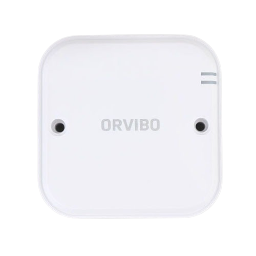|Orvibo|RGB controller||||
|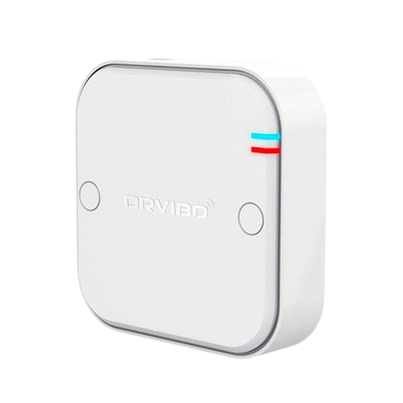|Orvibo|Multi-functional Relay|Contacteur|Au 15/12/2020, retour d'etat non fonctionnel|[Documentation](https://www.domadoo.fr/fr/index.php?controller=attachment&id_attachment=2461) [Acheter](https://www.domadoo.fr/fr/peripheriques/5340-orvibo-module-commutateur-contact-sec-zigbee.html)|
|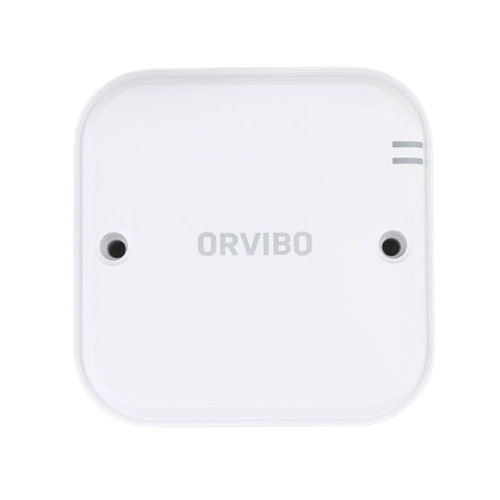|Orvibo|Sensor connector|Capteur|||
|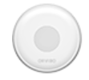|Orvibo|Emergency button|Bouton,Télécommande||[Acheter](https://www.domadoo.fr/fr/peripheriques/5335-orvibo-bouton-d-urgence-sos-zigbee.html)|
||Orvibo|Gaz sensor|Capteur,Gaz|||
||Orvibo|Temperature/humidity sensor|Capteur,Température,Humidité||[Documentation](https://www.domadoo.fr/fr/index.php?controller=attachment&id_attachment=2455) [Acheter](https://www.domadoo.fr/fr/peripheriques/5334-orvibo-capteur-de-temperature-et-humidite-zigbee.html)|
||Orvibo|Water leak|Capteur,Fuite,Inondation||[Documentation](https://www.domadoo.fr/fr/index.php?controller=attachment&id_attachment=2458) [Acheter](https://www.domadoo.fr/fr/peripheriques/5338-orvibo-detecteur-d-inondation-zigbee.html)|
|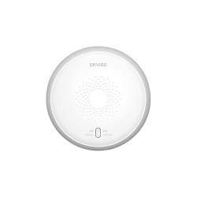|Orvibo|Smoke detector||||

# Osram

|Image|Marque|Nom|Type|Remarque|Lien|
|---|---|---|---|---|---|
|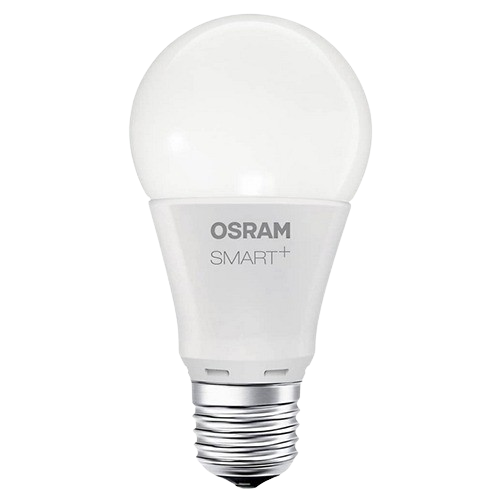|Osram|OSRAM Smart+ Ampoule LED Connectée - Culot E27||||
||Osram|Osram Smart+ Tunable white culot E27||Attention le retour d'état pour ce model n'est pas en temps réel (soit suite à une commande soit en demandant explicitement une mise à jour de celui-ci)||
|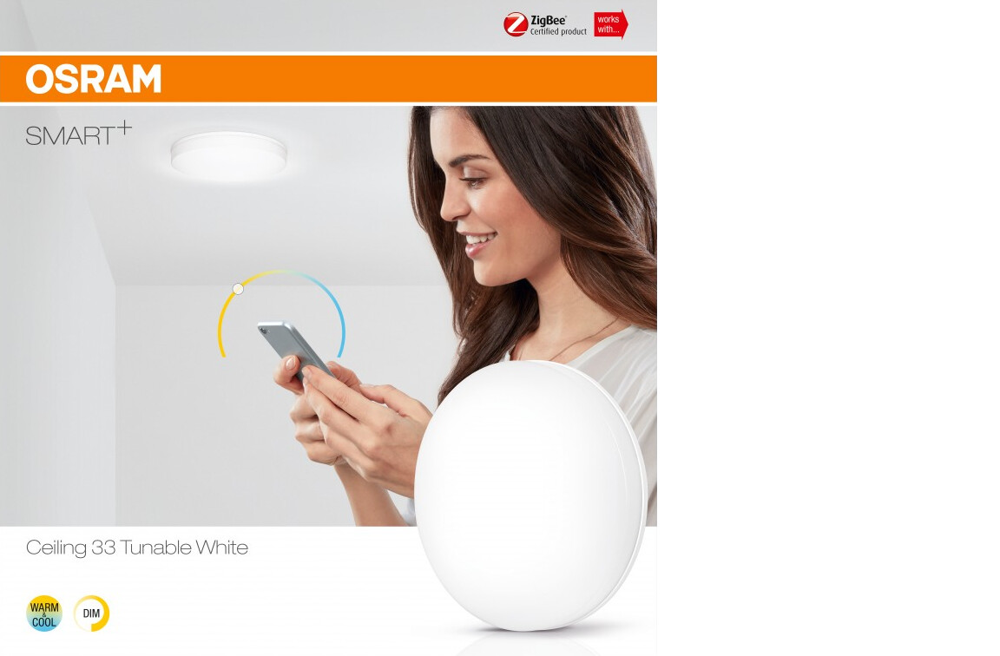|Osram|OSRAM Ceiling TW OSRAM||Attention le retour d'état pour ce model n'est pas en temps réel (soit suite à une commande soit en demandant explicitement une mise à jour de celui-ci)||
||Osram|OSRAM Smart+ Ampoule LED E14||Attention le retour d'état pour ce model n'est pas en temps réel (soit suite à une commande soit en demandant explicitement une mise à jour de celui-ci)||
||Osram|LEDVANCE SMART+ JARDIN POLE||Attention le retour d'état pour ce model n'est pas en temps réel (soit suite à une commande soit en demandant explicitement une mise à jour de celui-ci)||
|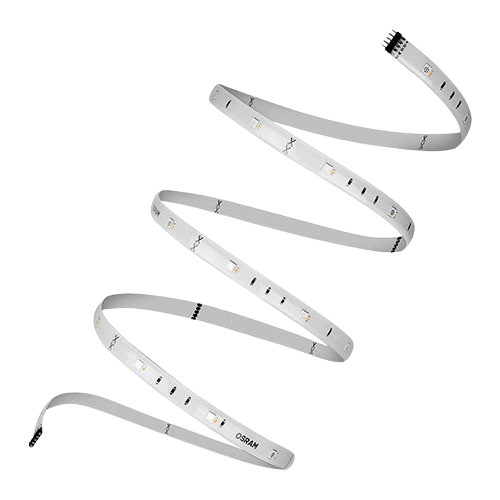|Osram|OSRAM LIGHTIFY Indoor Flex RGBW||Attention le retour d'état pour ce model n'est pas en temps réel (soit suite à une commande soit en demandant explicitement une mise à jour de celui-ci)||
|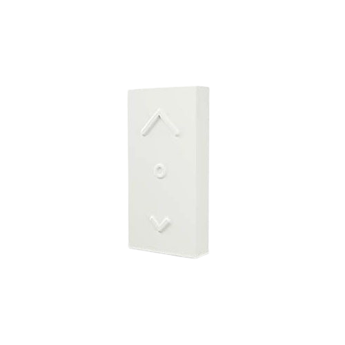|Osram|Lightify Switch Mini||||
|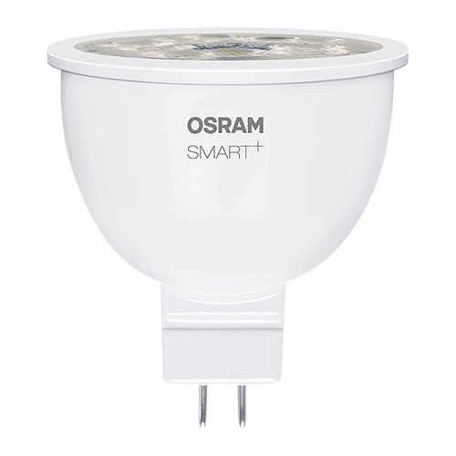|Osram|OSRAM SMART+ Spot GU5.3 Tunable White||||
|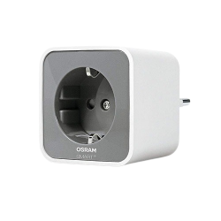|Osram|OSRAM Smart+ Plug||||

# Owon

|Image|Marque|Nom|Type|Remarque|Lien|
|---|---|---|---|---|---|
||Owon|Relais Rail-Din 32A et compteur d'énergie Zigbee|Contacteur,Compteur||[Documentation](https://www.owon-smart.com/uploads/Quick-Start-Guide-CB432-Din-Rail-Relay1.pdf) |
||Owon|OWON - COMPTEUR DE CONSOMMATION ÉLECTRIQUE ZIGBEE MONOPHASÉ/TRIPHASÉ (80 À 300A) - COMPATIBLE JEEDOM/HOME ASSISTANT|||[Documentation](https://www.owon-smart.com/uploads/Quick-Start-Guide-PC321-Power-Clamp.pdf) [Acheter](https://www.domadoo.fr/fr/peripheriques/6372-owon-compteur-de-consommation-electrique-zigbee-monophasetriphase-80-a-300a.html?domid=4&id_campaign=9)|
|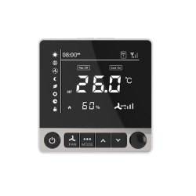|Owon|THERMOSTAT POUR VENTILO-CONVECTEUR ZIGBEE (100V-240V)|Thermostat||[Documentation](https://www.owon-smart.com/uploads/Quick-Start-Guide-%E2%80%93-PCT504-ZigBee-Fan-coil-Thermostat.pdf) [Acheter](https://www.domadoo.fr/fr/peripheriques/6056-owon-thermostat-de-ventilo-convecteur-zigbee-100v-240v.html)|
||Owon|Multi-Sensor (Mouvement/Temperature/Humidite/Luminosite)|||[Documentation](https://www.owon-smart.com/uploads/Quick-Start-Guide-PIR313-Multisensor-V0.4.pdf) [Acheter](https://www.domadoo.fr/fr/peripheriques/6010-owon-capteur-de-mouvement-temperature-et-humidite-zigbee.html?domid=4&id_campaign=9)|
||Owon|Multi-Sensor (Mouvement/Temperature/Humidite)|||[Documentation](https://www.owon-smart.com/uploads/Quick-Start-Guide-PIR323-ZigBee-Multi-Sensor.pdf) [Acheter](https://www.domadoo.fr/fr/peripheriques/6009-owon-capteur-de-mouvement-temperature-et-humidite-zigbee.html?domid=4&id_campaign=9)|
||Owon|OWON - INTERRUPTEUR MURAL ZIGBEE HA ON/OFF + FONCTION BINDING|||[Acheter](https://www.domadoo.fr/fr/peripheriques/6318-owon-interrupteur-zigbee-ha-onoff-fonction-binding-2-piles-aaa.html?domid=4&id_campaign=9)|
||Owon|Sonde de température déportée sur câble|||[Acheter](https://www.domadoo.fr/fr/peripheriques/5998-owon-sonde-de-temperature-deportee-sur-cable-zigbee.html)|
|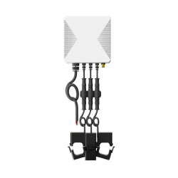|Owon|OWON - COMPTEUR DE CONSOMMATION ÉLECTRIQUE ZIGBEE MONOPHASÉ/TRIPHASÉ (80 À 300A) - COMPATIBLE JEEDOM/HOME ASSISTANT|||[Documentation](https://www.owon-smart.com/uploads/Quick-Start-Guide-PC321-Power-Clamp.pdf) [Acheter](https://www.domadoo.fr/fr/peripheriques/6372-owon-compteur-de-consommation-electrique-zigbee-monophasetriphase-80-a-300a.html?domid=4&id_campaign=9)|

# Philips

|Image|Marque|Nom|Type|Remarque|Lien|
|---|---|---|---|---|---|
||Philips|Projecteur extérieur Philips||||
||Philips|Philips Hue White and Color ambiance APPEAR||||
|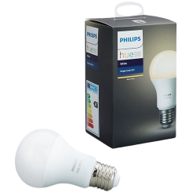|Philips|Hue White A60 E27||||
|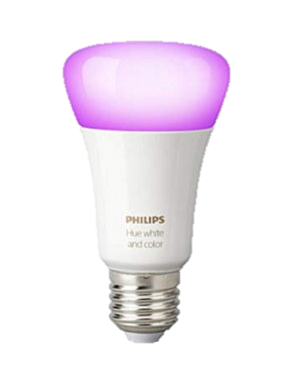|Philips|Hue White and Color Ambiance A60 E27||||
||Philips|Hue Lightstrip Plus||||
||Philips|Hue Outdoor Lily XL||||
||Philips|Hue bulb white and color||||
|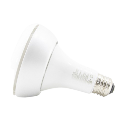|Philips|Hue White and Color BR30 (1st Gen)||||
||Philips|Hue White and Color Ambiance Spot GU10||Attention le retour d'état pour ce model n'est pas en temps réel (soit suite à une commande soit en demandant explicitement une mise à jour de celui-ci)||
||Philips|Hue White and Color Ambiance A19 E26 (Gen 2)||||
||Philips|Hue White and Color Ambiance A19 E26 (Gen 3)||||
||Philips|Hue White and Color Ambiance BR30 Richer Colors||||
|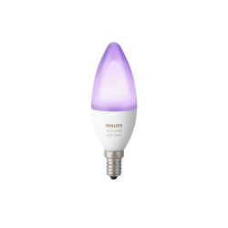|Philips|Hue White and Color Ambiance Candle E12||||
||Philips|Hue White and Color Ambiance A19 E26||||
||Philips|Hue White and Color Ambiance A19 E26||Attention il n'y a pas de retour d'état pour ce modele, seulement un envoi d'ordre possible||
||Philips|Hue White and Color Ambiance Play Light Bar||||
||Philips|Hue LivingColors||||
||Philips|Hue LivingColors||||
||Philips|Hue LivingColors Iris Table Lamp Gen3||||
||Philips|Hue LivingColors||||
|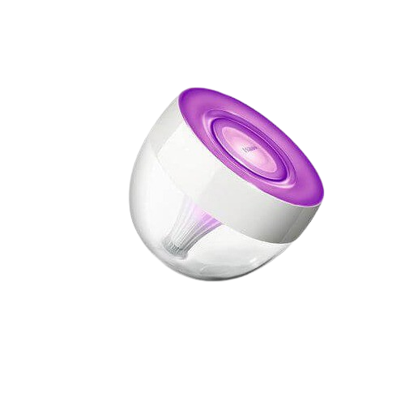|Philips|Hue Iris Table Lamp||||
||Philips|Hue Bloom Living Colors Starter Pack||Attention le retour d'état pour ce model n'est pas en temps réel (soit suite à une commande soit en demandant explicitement une mise à jour de celui-ci)||
||Philips|Hue Bloom Table Lamp||||
||Philips|Hue LivingColors||||
|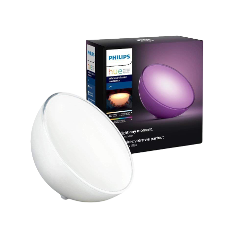|Philips|Hue Go Portable Light||||
||Philips|Hue Beyond Suspension Light||||
||Philips|Hue white and color||||
||Philips|Hue white and color||||
||Philips|Hue white and color||||
|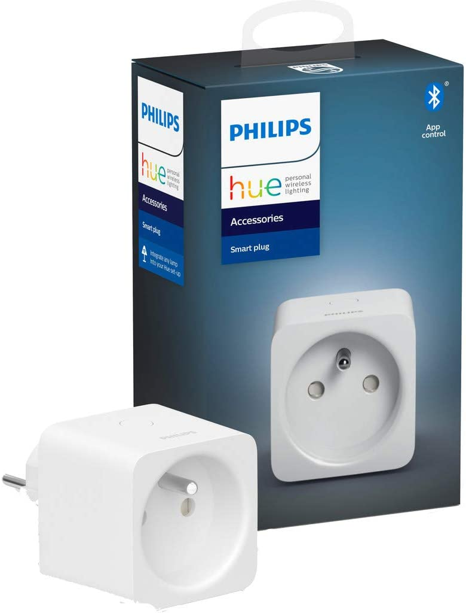|Philips|Hue Smart plug||||
|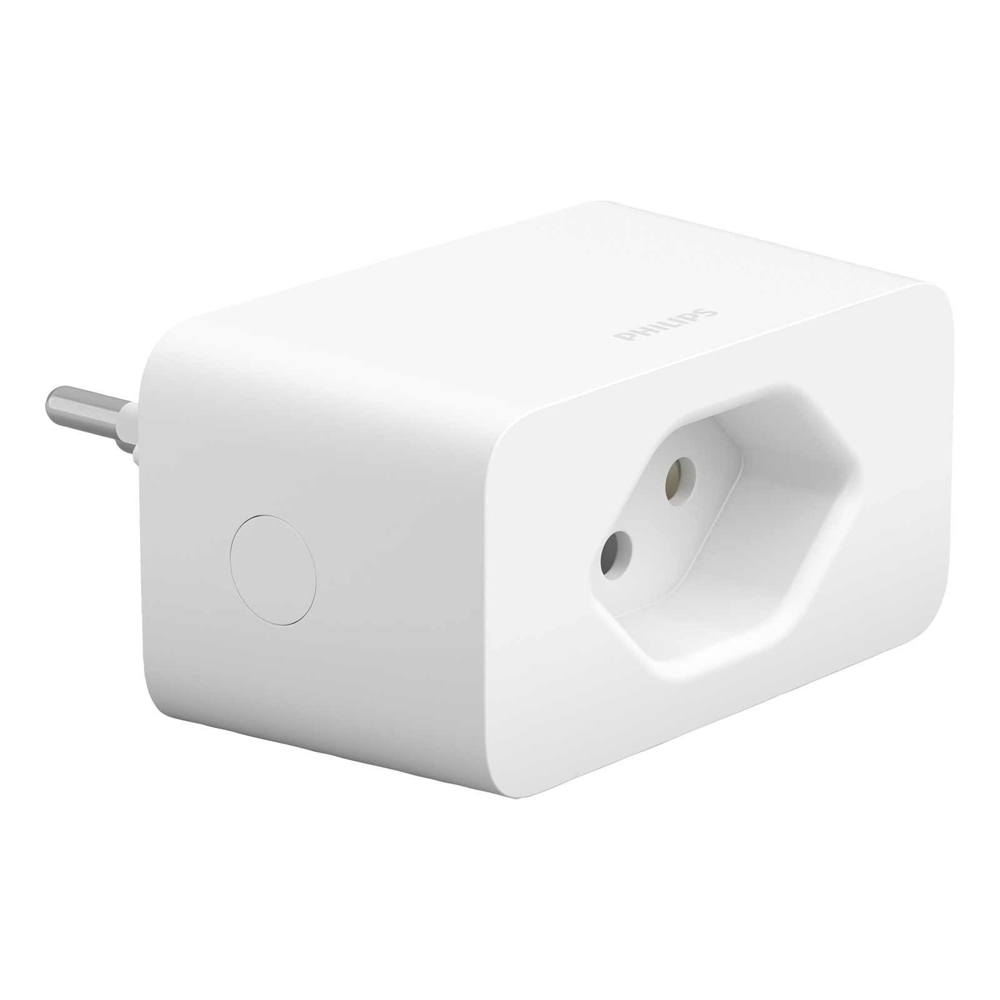|Philips|Hue Smart plug||||
||Philips|Hue LightStrip||||
||Philips|Hue LightStrip Plus||||
|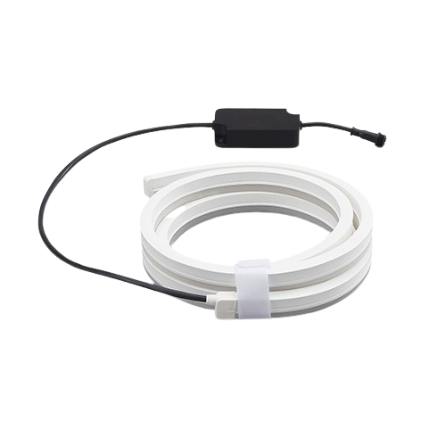|Philips|Hue LightStrip Outdoor||||
||Philips|Hue White E27 with Bluetooth||||
||Philips|Hue White Ambiance E14 w/ BT||||
||Philips|Hue White and Color||Attention il n'y a pas de retour d'état pour ce modele, seulement un envoi d'ordre possible||
||Philips|Hue White Ambiance A19 E26/E27||Attention le retour d'état pour ce model n'est pas en temps réel (soit suite à une commande soit en demandant explicitement une mise à jour de celui-ci)||
|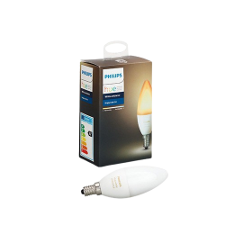|Philips|LTW012||Attention le retour d'état pour ce model n'est pas en temps réel (soit suite à une commande soit en demandant explicitement une mise à jour de celui-ci)||
|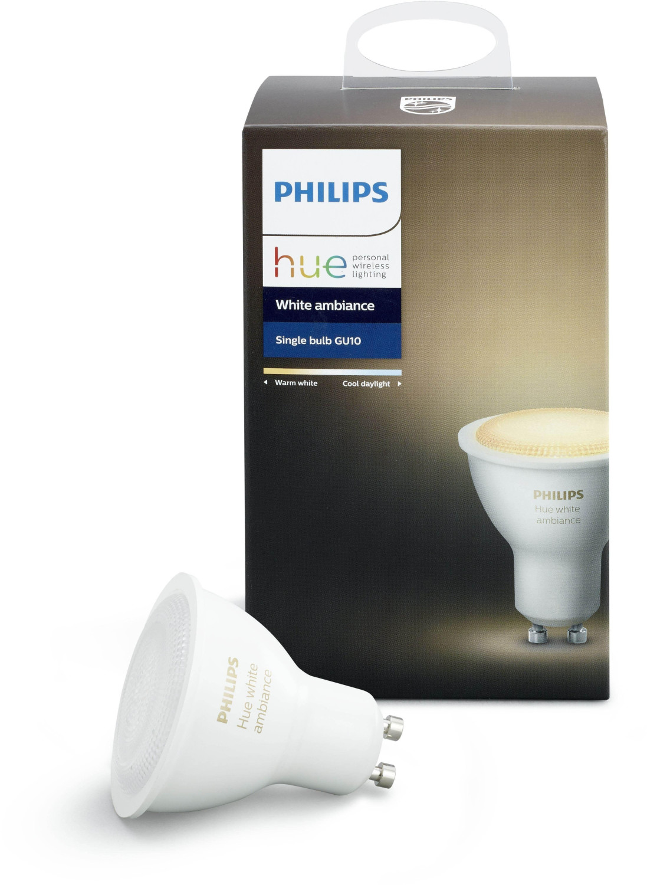|Philips|Ampoule connectée GU10 blanc||Attention le retour d'état pour ce model n'est pas en temps réel (soit suite à une commande soit en demandant explicitement une mise à jour de celui-ci)||
||Philips|Hue White Ambiance E27||Attention il n'y a pas de retour d'état pour ce modele, seulement un envoi d'ordre possible||
||Philips|Hue White A67 E27 1600 LM||Attention il n'y a pas de retour d'état pour ce modele, seulement un envoi d'ordre possible||
||Philips|Hue White E27||Attention il n'y a pas de retour d'état pour ce modele, seulement un envoi d'ordre possible||
|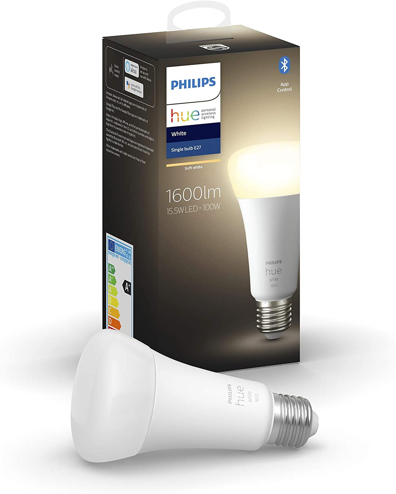|Philips|E27 Philps Hue 9W 806 lm Dimmable White Bulb||||
||Philips|E27 Philps Hue 9W||||
||Philips|Hue White B22||Attention il n'y a pas de retour d'état pour ce modele, seulement un envoi d'ordre possible||
||Philips|Hue White Candle E14||Attention il n'y a pas de retour d'état pour ce modele, seulement un envoi d'ordre possible||
|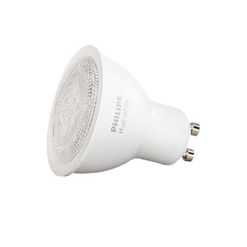|Philips|Hue White GU10||||
||Philips|GU10 Philips HUE||||
|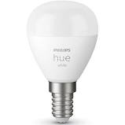|Philips|Hue E14 P45||||
|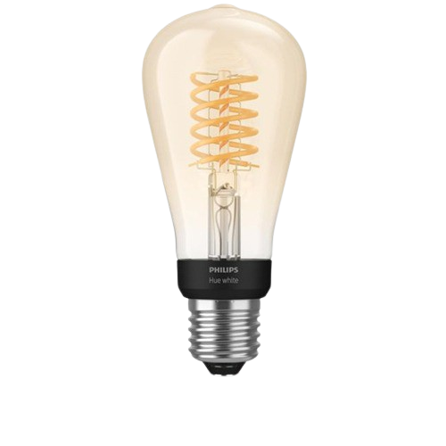|Philips|Hue White Filament Bulb ST64 E27||||
||Philips|Variateur||||
|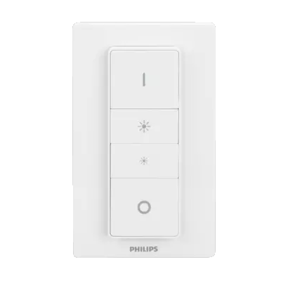|Philips|Télécommande 4 boutons||||
|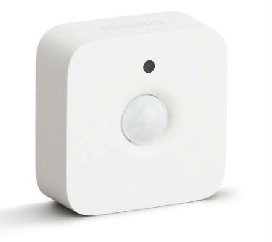|Philips|Hue détecteur de mouvement intérieure|Mouvement,Luminosité,Température|||
|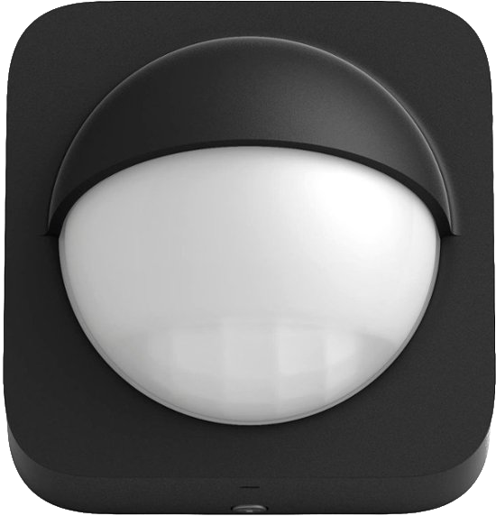|Philips|Hue détecteur de mouvement extérieure|Mouvement,Luminosité,Température|||
||Philips|Hue détecteur de mouvement intérieure|Mouvement,Luminosité,Température|||
||Philips|Hue détecteur de mouvement extérieure|Mouvement,Luminosité,Température|||
||Philips|Hue Go||||
||Philips|Hue Module interrupteur Mural||||
||Philips|Télécommande 4 boutons||||

# Popp

|Image|Marque|Nom|Type|Remarque|Lien|
|---|---|---|---|---|---|
||Popp|Popp Valve|Tête thermostatique|||

# Profalux

|Image|Marque|Nom|Type|Remarque|Lien|
|---|---|---|---|---|---|
|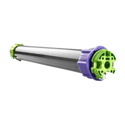|Profalux|Profalux MOT-C1Z06C||||
||Profalux|Profalux MOE||||

# Salus

|Image|Marque|Nom|Type|Remarque|Lien|
|---|---|---|---|---|---|
|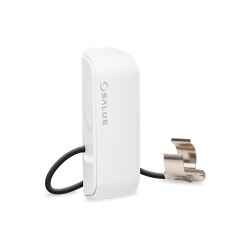|Salus|Salus PS600 - Sonde appliquée connectée|||[Documentation](https://salus-controls.com/fr/files/PS600-WE-QG-V003.pdf) |

# Schneider

|Image|Marque|Nom|Type|Remarque|Lien|
|---|---|---|---|---|---|
||Schneider|PlusLink shutter insert|Volets||[Documentation](https://download.schneider-electric.com/files?p_enDocType=System+user+guide&p_File_Name=Merten_PL_Wiser_TIs_DE.pdf&p_Doc_Ref=Merten_PL_Wiser_TIs_DE) |
||Schneider|Interrupteur double||||
||Schneider|Wiser Window/Door Sensor|Ouverture||[Documentation](https://download.schneider-electric.com/files?p_enDocType=User+guide&p_File_Name=MFR1569800.pdf&p_Doc_Ref=MFR1569800) |
||Schneider|Wiser Water Leakage Sensor|Fuite|||
|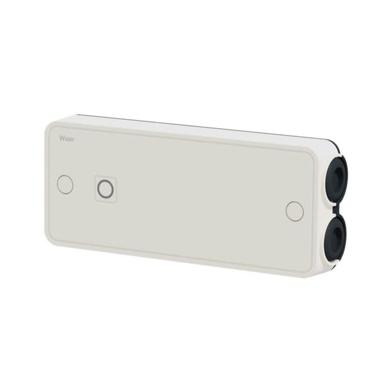|Schneider|Actionneur pour radiateur électrique Wiser|||[Acheter](https://www.domadoo.fr/fr/chauffage-clim/5498-schneider-electric-actionneur-pour-radiateur-electrique-fil-pilote-zigbee-30-wiser-3606481914705.html)|
||Schneider|Variateur poussoir connecté Zigbee 3.0 Wiser Odace|Interrupteur,Variateur||[Documentation](https://download.schneider-electric.com/files?p_enDocType=Instruction+sheet&p_File_Name=S5x0522W_HW.pdf&p_Doc_Ref=S5x0522W_HW) [Acheter](https://www.domadoo.fr/fr/peripheriques/5716-schneider-electric-interrupteur-sans-fil-sans-pile-pour-eclairage-odace-sfsp-3606481019561.html)|
||Schneider|Interrupteur volet roulant connecté Zigbee 3.0 Wiser Odace|Interrupteur,Volets||[Documentation](https://download.schneider-electric.com/files?p_enDocType=Instruction+sheet&p_File_Name=S5x0567W_HW.pdf&p_Doc_Ref=S5x0567W_HW) [Acheter](https://www.domadoo.fr/fr/peripheriques/5723-schneider-electric-interrupteur-volet-roulant-connecte-zigbee-30-wiser-odace-blanc-3606481019585.html)|
||Schneider|Interrupteur connecté Zigbee 3.0 Wiser Odace|||[Documentation](https://download.schneider-electric.com/files?p_enDocType=Instruction+sheet&p_File_Name=S5x0530W_HW.pdf&p_Doc_Ref=S5x0530W_HW) [Acheter](https://www.domadoo.fr/fr/peripheriques/5719-schneider-electric-interrupteur-connecte-zigbee-30-wiser-odace-blanc-3606481019578.html)|
|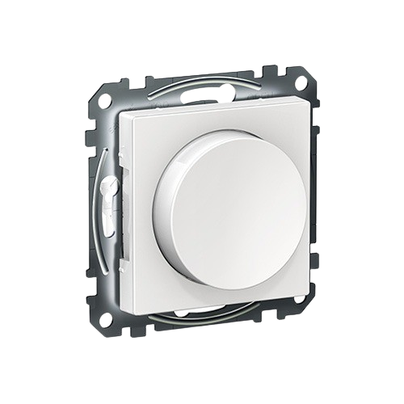|Schneider|Wiser Exxact dimmer rotary|Variateur|||
|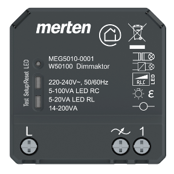|Schneider|Wiser micro module dimmer|Variateur|||
|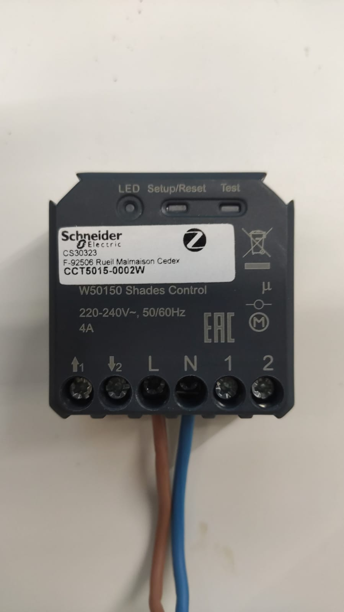|Schneider|Module connecté pour volets roulants|Volets||[Documentation](https://download.schneider-electric.com/files?p_enDocType=Instruction+sheet&p_File_Name=CCT5xx5-xxx2_2W_HW.pdf&p_Doc_Ref=CCT5xx5-xxx2_2W_HW) [Acheter](https://www.domadoo.fr/fr/peripheriques/5724-schneider-electric-micromodule-volet-roulant-connecte-zigbee-30-wiser-3606481048189.html)|
||Schneider|Module commutateur ON/OFF Wiser|Interrupteur|||
||Schneider|Module commutateur ON/OFF Wiser 2nd edition|Contacteur||[Acheter](https://www.domadoo.fr/fr/peripheriques/5722-schneider-electric-micromodule-interrupteur-eclairage-connecte-zigbee-30-wiser-3606481048172.html?domid=4&id_campaign=9)|
|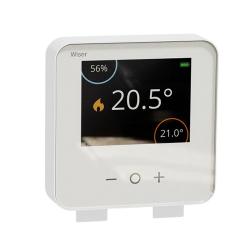|Schneider|Thermostat d'ambiance connecté Wiser|Thermostat,Chauffage|Module déconseillé, il semble etre trés compliqué à faire marcher et necessite tout l'éco-systeme Schneider|[Acheter](https://www.domadoo.fr/fr/thermostats/5496-schneider-electric-thermostat-d-ambiance-connecte-zigbee-30-wiser-3606489710194.html)|
||Schneider|Tête de vanne thermostatique connectée Wiser|Tête thermostatique,Chauffage||[Acheter](https://www.domadoo.fr/fr/tetes-thermostatiques/5497-schneider-electric-tete-de-vanne-thermostatique-connectee-zigbee-30-wiser-3606489582821.html)|

# Smabit

|Image|Marque|Nom|Type|Remarque|Lien|
|---|---|---|---|---|---|
||Smabit|SMABIT - Détecteur de mouvement extérieur|||[Acheter](https://www.domadoo.fr/fr/peripheriques/5550-smabit-detecteur-de-mouvement-exterieur-zigbee-8023874397665.html)|

# Sonoff

|Image|Marque|Nom|Type|Remarque|Lien|
|---|---|---|---|---|---|
||Sonoff|PRISE INTELLIGENTE 16A US|Prise|||
|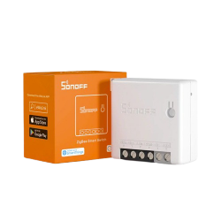|Sonoff|Micromodule commutateur connecté|Contacteur,Lumière||[Acheter](https://www.domadoo.fr/fr/peripheriques/5375-sonoff-micromodule-commutateur-connecte-zigbee.html)|
||Sonoff|Micromodule commutateur 10A|Contacteur||[Documentation](http://dl.itead.cc/basiczbr3/BASICZBR3-user-manual-V-1-1.pdf) [Acheter](https://www.domadoo.fr/fr/peripheriques/5258-sonoff-module-commutateur-10a-zigbee-30.html)|
||Sonoff|PRISE INTELLIGENTE 16A|Prise||[Acheter](https://www.domadoo.fr/fr/peripheriques/5880-sonoff-prise-intelligente-16a-zigbee-30-version-fr.html)|
||Sonoff|SONOFF - Capteur de température et d'humidité Zigbee 3.0 avec écran|||[Acheter](https://www.domadoo.fr/fr/peripheriques/6614-sonoff-capteur-de-temperature-et-d-humidite-zigbee-30-avec-ecran.html?domid=4&id_campaign=9)|
||Sonoff|ZigBee Interrupteur Sans Fil Aucun Fil Neutre||||
||Sonoff|SONOFF - Commutateur intelligent sans neutre Zigbee 3.0 ZBMINIL2|||[Acheter](https://www.domadoo.fr/fr/peripheriques/6619-sonoff-commutateur-intelligent-sans-neutre-zigbee-30-zbminil2.html?domid=4&id_campaign=9)|
|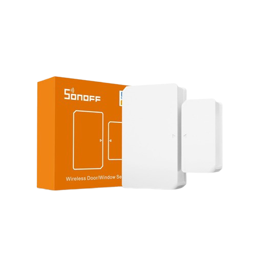|Sonoff|Capteur d'ouverture porte/fenêtre|Capteur,Ouverture|Attention il y a un bug dans le firmware qui le fait remonter comme un module de température et d'humidité il faut donc suite à l'inclusion remettre le bon model et supprimer les commandes de température et d'humidité|[Documentation](http://dl.itead.cc/SNZB-04/Instructions/SNZB-04_V1.0_User_manual_20201116.pdf) [Acheter](https://www.domadoo.fr/fr/peripheriques/5320-sonoff-capteur-d-ouverture-de-portefenetre-zigbee.html)|
|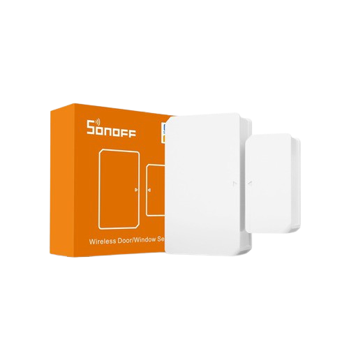|Sonoff|Capteur d'ouverture porte/fenêtre|Capteur,Ouverture||[Documentation](http://dl.itead.cc/SNZB-04/Instructions/SNZB-04_V1.0_User_manual_20201116.pdf) [Acheter](https://www.domadoo.fr/fr/peripheriques/5320-sonoff-capteur-d-ouverture-de-portefenetre-zigbee.html)|
||Sonoff|Détecteur de mouvement intelligent|Capteur,Mouvement||[Documentation](http://dl.itead.cc/SNZB-03/Instructions/SNZB-03_V1.0_User_manual_20201116.pdf) [Acheter](https://www.domadoo.fr/fr/peripheriques/5261-sonoff-detecteur-de-mouvement-zigbee-30.html)|
||Sonoff|Capteur de température et humidité|Capteur,Humidité,Température||[Documentation](http://dl.itead.cc/SNZB-02/Instructions/SNZB-02_V1.0_User_manual_20201116.pdf) [Acheter](https://www.domadoo.fr/fr/peripheriques/5260-sonoff-capteur-de-temperature-et-d-humidite-zigbee-30.html)|
||Sonoff|Interrupteur connecté sans fil|Interrupteur,Télécommande||[Documentation](http://dl.itead.cc/SNZB-01/Instructions/SNZB-01_V1.0_User_manual_20201116.pdf) [Acheter](https://www.domadoo.fr/fr/peripheriques/5259-sonoff-interrupteur-sans-fil-zigbee-30.html)|

# Sunricher

|Image|Marque|Nom|Type|Remarque|Lien|
|---|---|---|---|---|---|
||Sunricher|Sunricher CCT Lighting||||
||Sunricher|Module variateur 2-fils|Variateur,Lumière,Puissance,Comptage||[Acheter](https://www.domadoo.fr/fr/peripheriques/5244-sunricher-module-variateur-2-fils-zigbee-30.html)|
|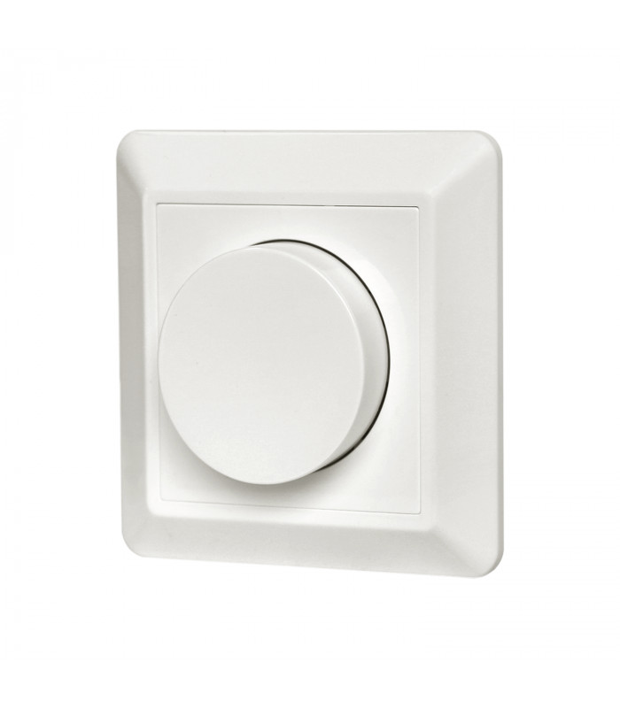|Sunricher|Interrupteur variateur rotatif|Variateur,Lumière,Puissance,Comptage||[Acheter](https://www.domadoo.fr/fr/peripheriques/5736-sunricher-interrupteur-variateur-rotatif-500w-zigbee-dimmer.html)|
|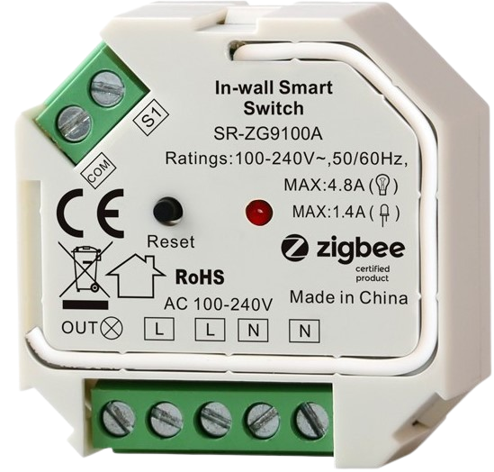|Sunricher|Module ON/OFF|Contacteur,Lumière||[Acheter](https://www.domadoo.fr/fr/peripheriques/5242-sunricher-module-onoff-zigbee-30.html)|
|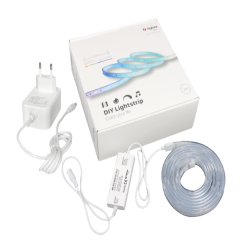|Sunricher|Sunricher - SR-DIY-ZG9101-CCT|||[Acheter](https://www.domadoo.fr/fr/eclairage/6336-sunricher-kit-ruban-de-led-cct-zigbee-30-2-metres.html?domid=4&id_campaign=9)|
||Sunricher|Sunricher Dali||||
||Sunricher|Sunricher - SR-DIY-ZG9101-RGBW|||[Acheter](https://www.domadoo.fr/fr/eclairage/6337-sunricher-kit-ruban-de-led-rgbw-zigbee-30-2-metres.html)|
|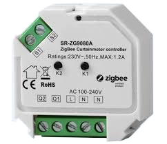|Sunricher|Module volet roulant|Volet,Store||[Acheter](https://www.domadoo.fr/fr/peripheriques/5245-sunricher-module-volet-roulant-zigbee-30.html)|
||Sunricher|SUNRICHER - MODULE ON/OFF 2 SORTIES AVEC MESURE DE CONSOMMATION ZIGBEE 3.0|||[Documentation](https://www.domadoo.fr/fr/index.php?controller=attachment&id_attachment=2820) [Acheter](https://www.domadoo.fr/fr/peripheriques/6163-sunricher-module-onoff-2-sorties-avec-mesure-de-consommation-zigbee-30.html?domid=4&id_campaign=9)|
|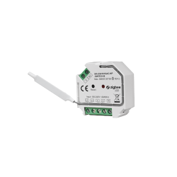|Sunricher|SUNRICHER - MODULE ON/OFF 16A AVEC MESURE DE CONSOMMATION ZIGBEE 3.0|||[Acheter](https://www.domadoo.fr/fr/peripheriques/6162-sunricher-module-onoff-16a-avec-mesure-de-consommation-zigbee-30.html?domid=4&id_campaign=9)|
|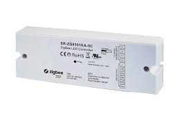|Sunricher|Contrôleur LED RGBW 4 en 1|Lumière,RGBW,Variateur||[Acheter](https://www.domadoo.fr/fr/peripheriques/5248-sunricher-controleur-led-rgbw-4-en-1-zigbee-30.html)|
||Sunricher|CONTRÔLEUR MURAL SANS FIL 4 BOUTONS|||[Acheter](https://www.domadoo.fr/fr/peripheriques/5738-sunricher-controleur-mural-sans-fil-4-boutons-2-zones-zigbee.html)|
||Sunricher|CONTRÔLEUR MURAL SANS FIL 8 BOUTONS|||[Acheter](https://www.domadoo.fr/fr/peripheriques/5739-sunricher-controleur-mural-sans-fil-8-boutons-4-zones-zigbee.html)|
||Sunricher|Sunricher RGB CCT Sun 3 in 1|||[Acheter](https://www.domadoo.fr/fr/peripheriques/5710-sunricher-telecommande-3-en-1-zigbee-30.html?domid=4&id_campaign=9)|
||Sunricher|Télécommande 3 en 1|Télécommande||[Acheter](https://www.domadoo.fr/fr/peripheriques/5247-sunricher-telecommande-3-en-1-zigbee-30.html)|
||Sunricher|Sunricher thermostat||||
||Sunricher|CONTRÔLEUR MURAL SANS FIL 2 BOUTONS|||[Acheter](https://www.domadoo.fr/fr/peripheriques/5737-sunricher-controleur-mural-sans-fil-2-boutons-1-zone-zigbee.html)|
|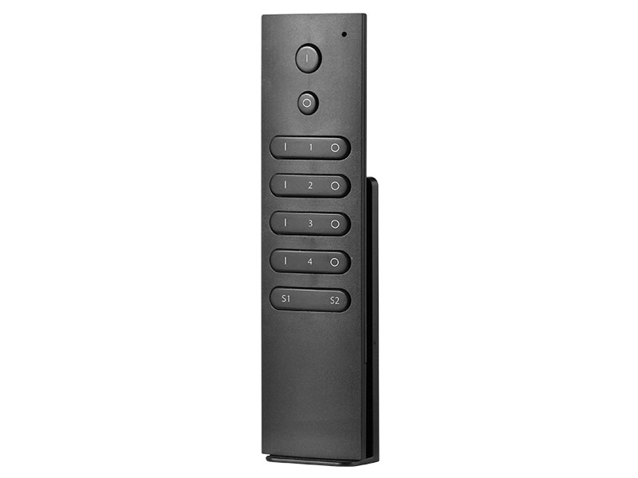|Sunricher|Télécommande 4 zones|Télécommande||[Acheter](https://www.domadoo.fr/fr/peripheriques/5246-sunricher-telecommande-4-zones-zigbee-30.html)|

# Tryo2sys

|Image|Marque|Nom|Type|Remarque|Lien|
|---|---|---|---|---|---|
||Tryo2sys|PTM 215 ZE||||

# Tuya

|Image|Marque|Nom|Type|Remarque|Lien|
|---|---|---|---|---|---|
|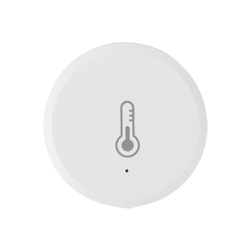|Tuya|Capteur de température et humidité||||
||Tuya|Capteur d'ouverture de porte ou fenêtre intelligent||||
||Tuya|Détecteur de mouvement intelligent||||
||Tuya|Capteur de vibration||||
|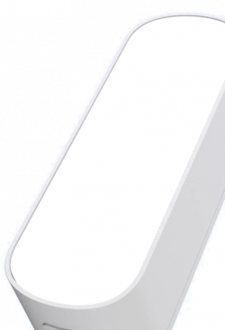|Tuya|TUYA - Capteur de luminosité|||[Acheter](https://fr.aliexpress.com/item/1005002117427752.html?spm=a2g0s.9042311.0.0.22206c37vgJYy8)|
|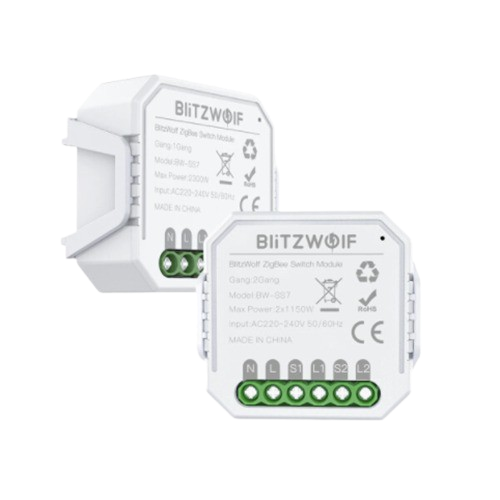|Tuya|Commutateur ON/OFF 2300W 1 canal||||
||Tuya|Prise intelligente ON/OFF et 2 ports USB||||
|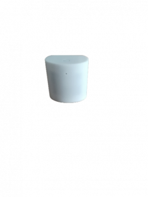|Tuya|TUYA - Capteur de luminosité (2)|||[Acheter](https://doowifi.fr/fr/capteur-wifi/180-capteur-luminosite-zigbee-DWF-0616ZB.html)|
|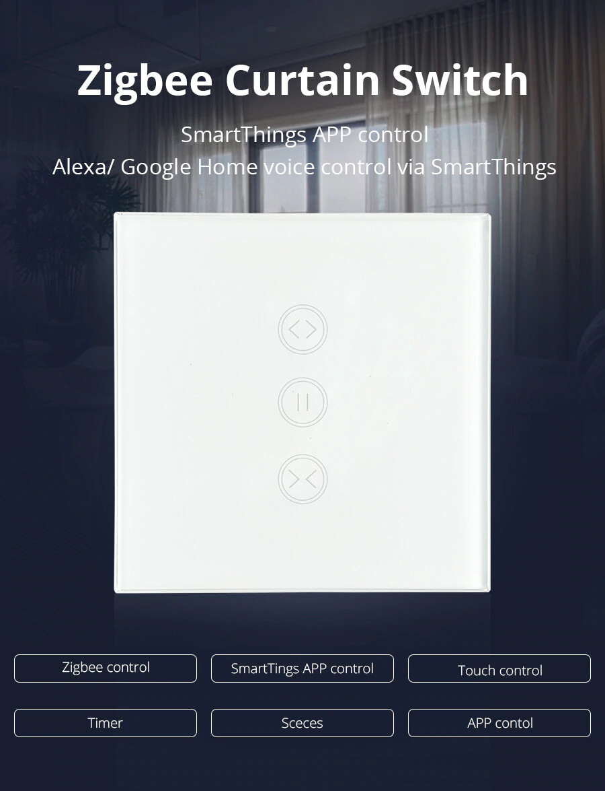|Tuya|Interrupteur connecté pour volet roulant||||
||Tuya|Mini capteur de mouvement||||
|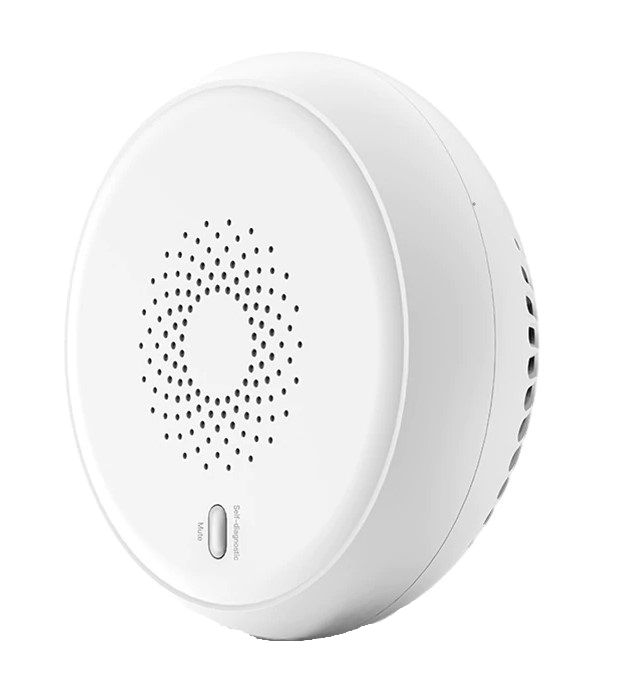|Tuya|Detecteur de fumée||||
||Tuya|Commutateur intelligent ON/OFF||||
|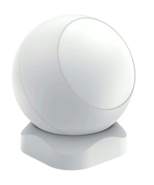|Tuya|Detecteur de mouvement||||
|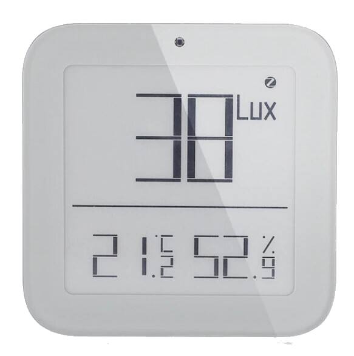|Tuya|Température, luminosité, humidité avec écran||||
||Tuya|Interrupteur triple||||
||Tuya|Contacteur de porte|Ouverture|||
||Tuya|Tuya Zigbee - Interrupteur 16A||||
||Tuya|Interrupteur intelligent simple charge||||
||Tuya|Sirène intelligente avec LED|Sirène|||
|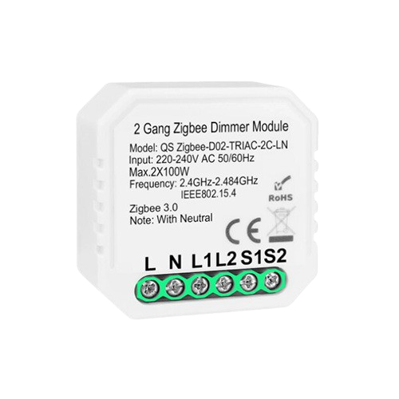|Tuya|MicroModule lumiere Tuya ZigBee 3.0 double dimmer||||
|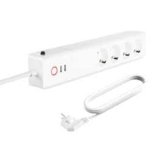|Tuya|USEELINK - Multiprise connectée 4 prises et 2 ports USB|||[Acheter](https://www.domadoo.fr/fr/peripheriques/5489-useelink-multiprise-connectee-16a-zigbee-ha-4-prises-2-ports-usb.html)|
||Tuya|Interrupteur double||||
||Tuya|Interrupteur intelligent simple charge||||
|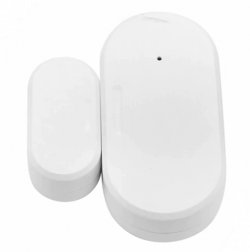|Tuya|Capteur d'ouverture de porte ou fenêtre intelligent||||
||Tuya|Vanne eau/gaz||||
|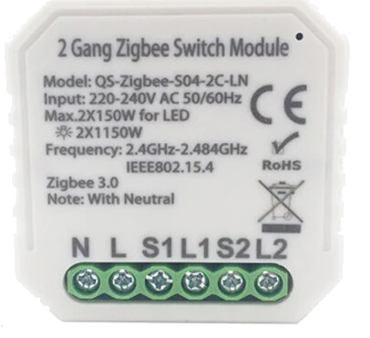|Tuya|Commutateur ON/OFF 2300W 2 canal||||
||Tuya|Capteur de température et humidité avec écran||||
|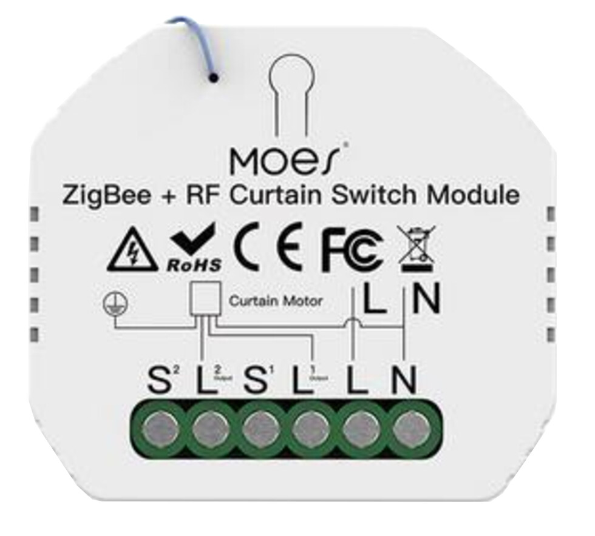|Tuya|MOES - Module zigbee+RF Volet Roulant|Volets|||
|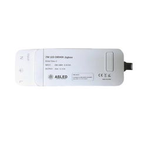|Tuya|Contrôleur de LED||||
||Tuya|Télécommande SOS||||
||Tuya|Micromodule double sans neutre||||
|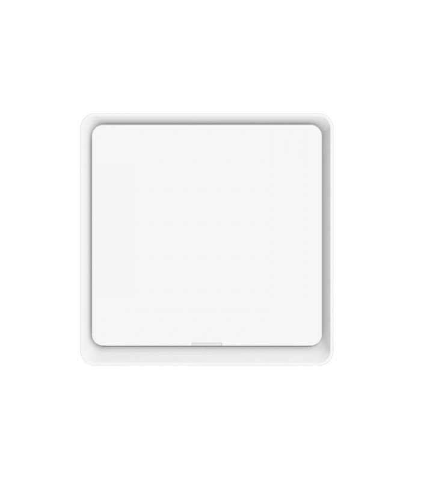|Tuya|Interrupteur connecté 1 boutons|||[Acheter](https://www.domadoo.fr/fr/domotique/5785-moes-interrupteur-intelligent-sans-fil-zigbee-1-bouton.html)|
||Tuya|Module intelligent pour volet roulant (3)||||
||Tuya|Contrôleur strip LED||||
|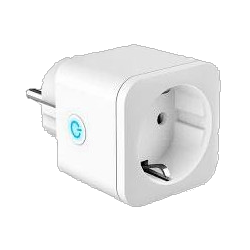|Tuya|QONTROLS Prise 16A avec mesure de consommation||||
||Tuya|Contrôleur de LED||||
||Tuya|Répeteur|||[Acheter](https://www.domadoo.fr/fr/peripheriques/5984-loratap-repeteur-de-signal-zigbee-30.html?domid=4&id_campaign=9)|
||Tuya|Interrupteur connecté pour rideau connecté||||
||Tuya|Prise connectée|Prise,Compteur,Puissance,Répéteur|||
||Tuya|Dimmer 2 voix||||
|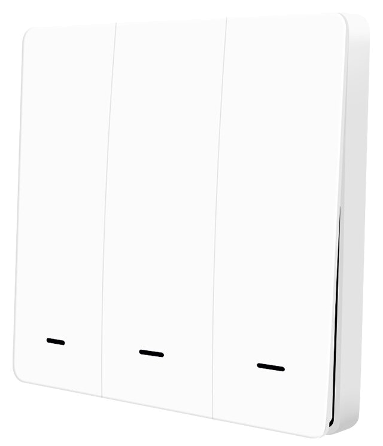|Tuya|Interrupteur connecté 3 boutons||||
||Tuya|Scene remote 4 boutons||||
||Tuya|Interrupteur double intelligent||||
||Tuya|Power Strip 16A 4000W 4AC + 2USB|Prise,Consommation,Puissance,Répéteur||[Acheter](https://fr.aliexpress.com/item/1005001408157771.html)|
||Tuya|Capteur de température et humidité||||
||Tuya|Tuya Zigbee - Switch 2 voies||||
||Tuya|Multiprise connectée 4 prises et 2 ports USB (2)|||[Acheter](https://www.domadoo.fr/fr/peripheriques/5489-useelink-multiprise-connectee-16a-zigbee-ha-4-prises-2-ports-usb.html?domid=4&id_campaign=9)|
|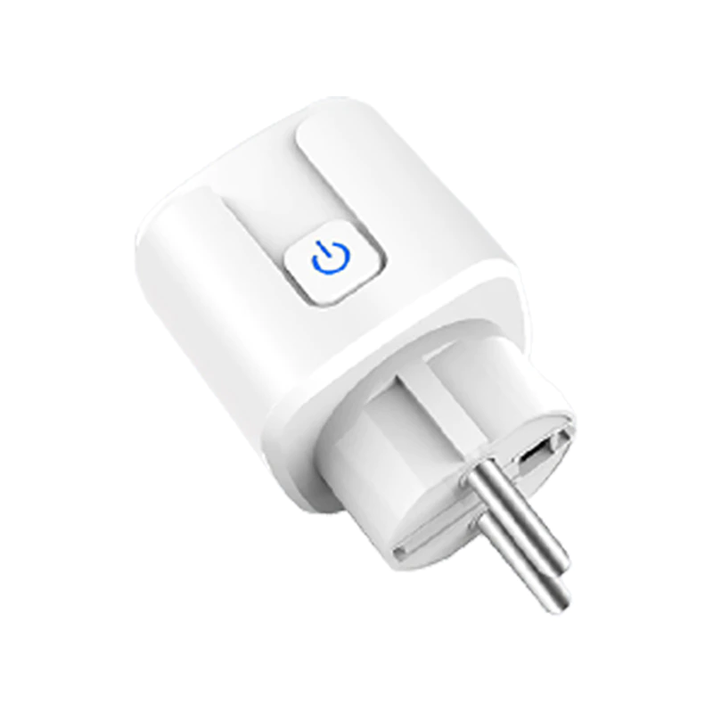|Tuya|Prise connectée|Prise,Compteur,Puissance,Répéteur|||
||Tuya|Prise connectée + USB|Prise||[Acheter](https://www.domadoo.fr/fr/prises-connectees/5840-moes-prise-connectee-zigbee-30-2-ports-usb-pilotables-version-schuko.html)|
||Tuya|Interrupteur connecté pour rideau connecté||||
||Tuya|Interrupteur connecté 2 boutons|||[Acheter](https://www.domadoo.fr/fr/domotique/5786-moes-interrupteur-intelligent-sans-fil-zigbee-2-boutons.html)|
||Tuya|Température, humidité||||
||Tuya|Capteur d'ouverture|Ouverture|||
||Tuya|Commutateur ON/OFF 2300W 1 canal||||
||Tuya|Module intelligent pour volet roulant (2)||||
||Tuya|Interrupteur double||||
||Tuya|BLITZWOLF - Prise intelligente EU 16A||||
||Tuya|Interrupteur triple||||
|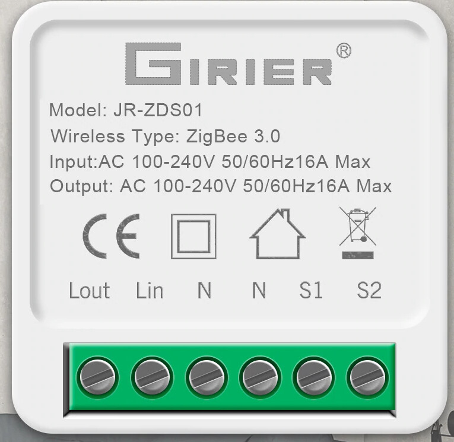|Tuya|Gigier JR-ZDS01||||
|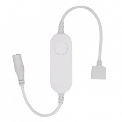|Tuya|Mini contrôleur de ruban Led RGB||||
||Tuya| Interrupteur À Clé Intelligent||||
||Tuya|Module de commutation ON/OFF 10A|Prise,Consommation,Puissance,Répéteur||[Acheter](https://fr.aliexpress.com/item/1005003438720832.html)|
||Tuya|Interrupteur pour volet roulant||||
||Tuya|Tuya Zigbee - Switch 4 voies||||
||Tuya|Range extender||||
|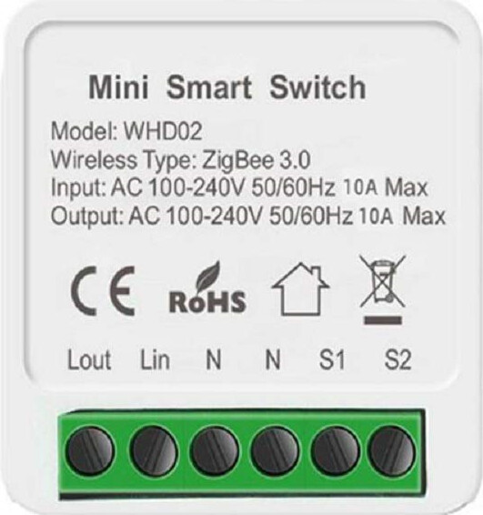|Tuya|Micromodule Zigbee 3.0 SKTE||||
|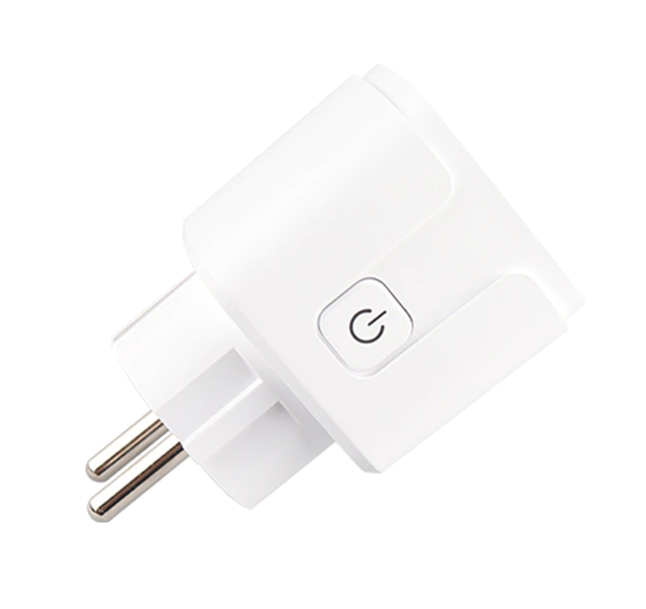|Tuya|Plug connectée simple ON/OFF|Prise,Répéteur||[Acheter](https://fr.aliexpress.com/item/1005002761118194.html)|
|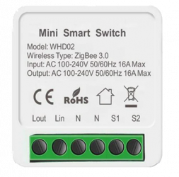|Tuya|Mini SMART - Module connecté simple ON/OFF 16A|||[Acheter](https://fr.aliexpress.com/item/1005003167278697.html)|
||Tuya|Multiprise connectée 4 prises et 2 ports USB||||
||Tuya|Tuya Zigbee - Controleur de vanne||||
||Tuya|Tuya Zigbee - Switch 3 voies||||
||Tuya|Module connectée double ON/OFF||||
||Tuya|Module connecté simple ON/OFF sans neutre||||
|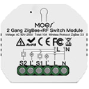|Tuya|MOES - Module connecté double ON/OFF||||
||Tuya|Capteur de température, humidité et luminosité avec écran||||
||Tuya|Livarno Lux E27||||
||Tuya|Detecteur d'inondation|Fuite|||
||Tuya|Contrôleur ruban de LED RGBCCT||||
|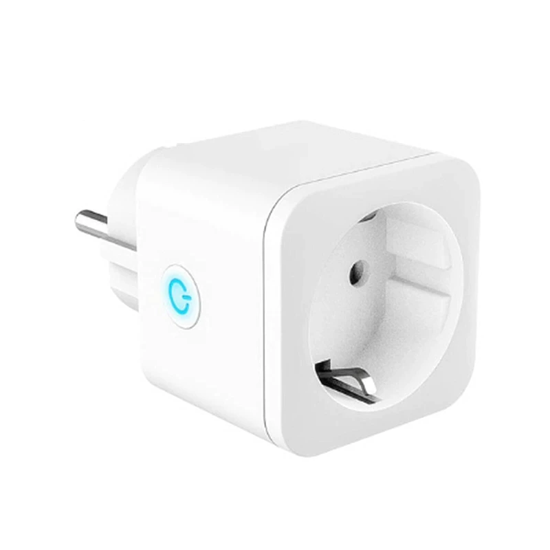|Tuya|Interrupteur intelligent simple charge||||
||Tuya|Interrupteur triple intelligent||||
|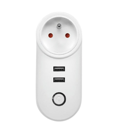|Tuya|Prise avec 2 ports usb||||
||Tuya|Interrupteur simple intelligent||||
||Tuya|Tuya Zigbee - Switch 1 voie||||
|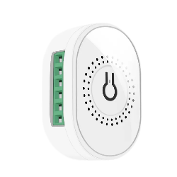|Tuya|SMART - Module connecté simple ON/OFF||||
||Tuya|Prise intelligente avec mesure de puissance|Prise,Répéteur|||
||Tuya|Module 4CH||||
||Tuya|Contrôleur ruban de LED RGBW||||
||Tuya|Detecteur d'inondation (3)|Fuite|||
||Tuya|Module intelligent pour volet roulant||||
||Tuya|Interrupteur intelligent 4 boutons avec piles||||
|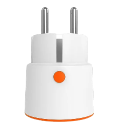|Tuya|Plug connectée simple ON/OFF 16A|Prise,Consommation,Puissance,Répéteur||[Acheter](https://fr.aliexpress.com/item/1005003444957152.html)|
||Tuya|Interrupteur connecté 3 boutons|||[Acheter](https://www.domadoo.fr/fr/domotique/5787-moes-interrupteur-intelligent-sans-fil-zigbee-3-boutons.html)|
||Tuya|Interrupteur triple||||
||Tuya|Detecteur d'inondation (2)|Fuite|||
||Tuya|Interrupteur intelligent 4 boutons avec piles||||
||Doowifi|COMMANDE VOLET ZIGBEE DWF-0205ZB-PN-2|Volets|||
||Tuya|Prise connectée|Prise,Compteur,Puissance,Répéteur|||
||Tuya|MOES - Module connecté simple ON/OFF||||
||Tuya|ZigBee GU10 Smart LED Dimmable Ampoules RGBCCT 2200-6500K C+W 5W||||
||Tuya|Ampoule Led 3.0, rvb + WW + CW E27||||
|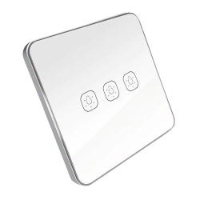|Tuya|Interrupteur connecté 3 boutons||||
|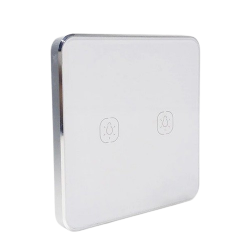|Tuya|Interrupteur connecté 2 boutons||||
||Tuya|Vanne arrosage||Il est pour le moment impossible de controller le timer correctement, lors d'une mise à On la vanne reste ouverte 10min puis se coupe|[Acheter](https://www.domadoo.fr/fr/peripheriques/5886-saswell-electrovanne-et-programmateur-d-arrosage-connecte-zigbee-mesure-de-consommation.html?domid=4&id_campaign=9)|
||Tuya|Zigbee Motion Sensor||||
|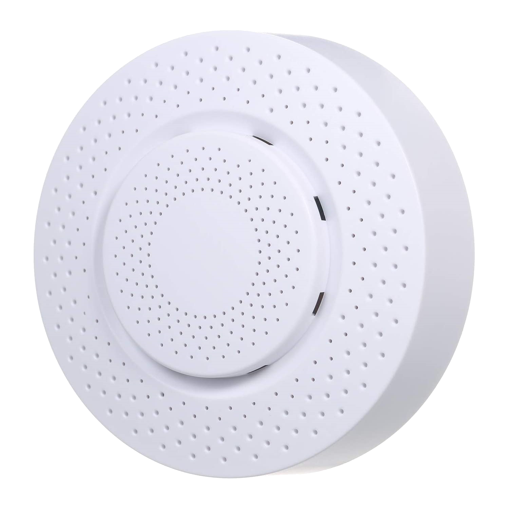|Tuya|Tuya air quality CO||||
||Tuya|Vanne arrosage||Il est pour le moment impossible de controller le timer correctement, lors d'une mise à On la vanne reste ouverte 10min puis se coupe|[Acheter](https://www.domadoo.fr/fr/peripheriques/5886-saswell-electrovanne-et-programmateur-d-arrosage-connecte-zigbee-mesure-de-consommation.html?domid=4&id_campaign=9)|
||Tuya|Vanne arrosage||Il est pour le moment impossible de controller le timer correctement, lors d'une mise à On la vanne reste ouverte 10min puis se coupe|[Acheter](https://www.domadoo.fr/fr/peripheriques/5886-saswell-electrovanne-et-programmateur-d-arrosage-connecte-zigbee-mesure-de-consommation.html?domid=4&id_campaign=9)|
||Tuya|Thermostat intelligent||||
||Moes|MOES - Tête thermostatique intelligente (3)|||[Acheter](https://www.domadoo.fr/fr/tetes-thermostatiques/5783-moes-tete-thermostatique-intelligente-zigbee-30-blanc.html)|
||Tuya|Thermostat intelligent||||
|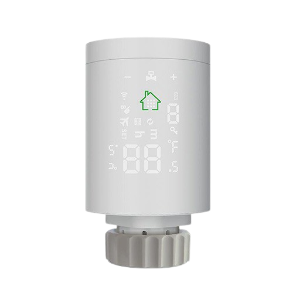|Moes|MOES - Tête thermostatique intelligente||||
||Tuya|Sirène intelligente avec capteur de température et humidité||||
|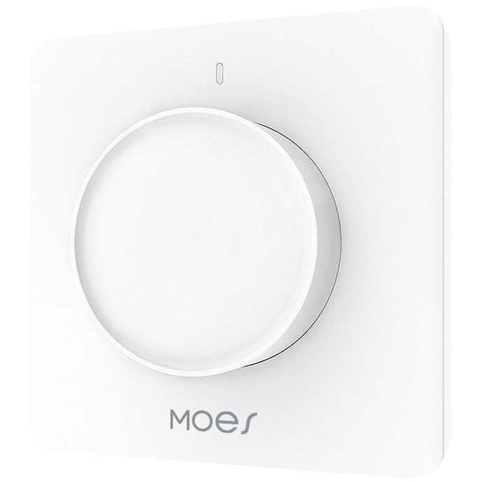|Tuya|MOES - Thermostat intelligent||||
||Tuya|MOES - Thermostat intelligent||||
|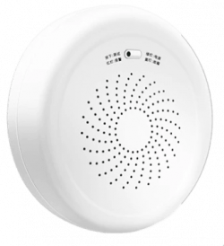|Tuya|Capteur gaz||||
|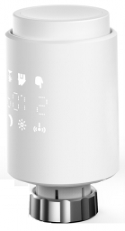|Tuya|Tête thermostatique intelligente||||
|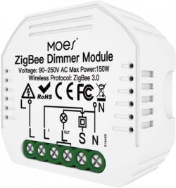|Tuya|MOES - Module dimmer simple||||
||Tuya|Rouleau de chaîne motorisé intelligent|Volets|||
||Tuya|MOES - Détecteur de présence Zigbee Tuya (technologie radar)|||[Acheter](https://www.domadoo.fr/fr/domotique/6328-moes-detecteur-de-presence-zigbee-tuya-technologie-radar.html?domid=4&id_campaign=9)|
|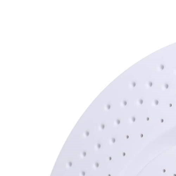|Tuya|Tuya air quality||||
||Moes|MOES - Tête thermostatique intelligente (2)||||
||Tuya|Zigbee Motion Sensor||||

# Woox

|Image|Marque|Nom|Type|Remarque|Lien|
|---|---|---|---|---|---|
||Woox|Détecteur de mouvement intelligent||||
|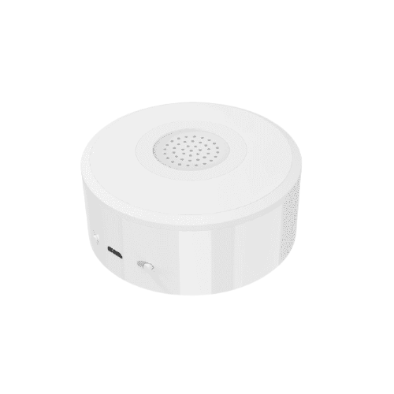|Woox|Sirène intelligente avec LED|Sirène||[Acheter](https://www.domadoo.fr/fr/peripheriques/5682-woox-sirene-interieure-intelligente-zigbee-30-8435606701105.html)|
||Woox|Détecteur d'ouverture de porte ou fenêtre intelligent||||
||Woox|Ampoule LED E27 connectée - RGB + CCT|||[Acheter](https://www.domadoo.fr/fr/peripheriques/5680-woox-ampoule-connectee-zigbee-e27-rgb-cct-compatible-amazon-alexa-et-google-assistant-8435606703581.html)|
|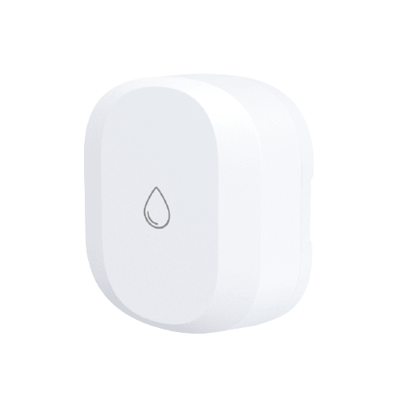|Woox|Détecteur d'inondation intelligent||||
||Woox|Télécommande 4 boutons SOS/Armer/Désarmer/Maison|Télécommande||[Acheter](https://www.domadoo.fr/fr/peripheriques/5684-woox-telecommande-intelligente-4-boutons-zigbee-30-8435606701136.html)|
|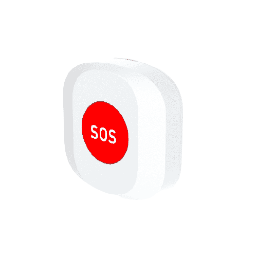|Woox|Bouton SOS|Bouton,Télécommande||[Acheter](https://www.domadoo.fr/fr/peripheriques/5683-woox-bouton-d-urgence-sos-zigbee-30-8435606701112.html)|
|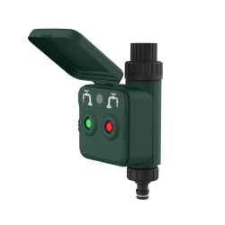|Woox|Contrôleur d'arrosage extérieur intelligent ON/OFF |Arrosage,Vanne||[Acheter](https://www.domadoo.fr/fr/peripheriques/5685-woox-controleur-d-arrosage-intelligent-onoff-zigbee-30-8435606701198.html)|
|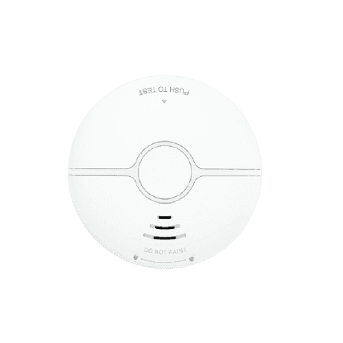|Woox|Détecteur de fumée intelligent||||
|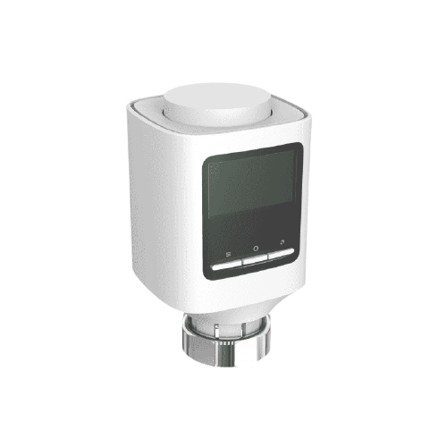|Woox|Tete thermostatique intelligente avec écran|Tête thermostatique||[Acheter](https://www.domadoo.fr/fr/tetes-thermostatiques/5902-woox-tete-thermostatique-connectee-zigbee-30-8435606701761.html?domid=4&id_campaign=9)|

# Xiaomi

|Image|Marque|Nom|Type|Remarque|Lien|
|---|---|---|---|---|---|
||Xiaomi|Xiaomi Mijia RTCGQ01LM|||[Acheter](https://www.domadoo.fr/fr/peripheriques/4518-xiaomi-aqara-detecteur-de-mouvement-zigbee-rtcgq11lm-192784000090.html?domid=4&id_campaign=9)|
|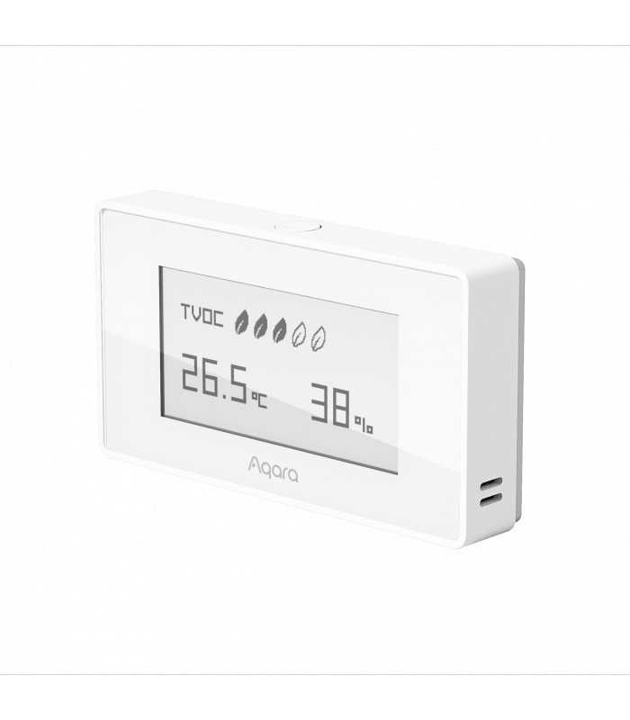|Xiaomi|XIAOMI AQARA - Moniteur de qualité d'air Zigbee 3.0 (température, humidité, COVT)|Température,Humidité,Qualité d'air||[Documentation](https://cdn.aqara.com/cdn/website/mainland/static/docs/TVOC-Air-Quality-Monitor_Manual_EN.pdf) [Acheter](https://www.domadoo.fr/fr/peripheriques/5751-xiaomi-aqara-moniteur-de-qualite-d-air-zigbee-30-temp-hum-covt-6970504214644.html)|
||Xiaomi|AQARA - SMART RADIATOR THERMOSTAT E1|||[Acheter](https://www.domadoo.fr/fr/peripheriques/6286-aqara-tete-thermostatique-zigbee-30-aqara-radiator-thermostat-e1-6970504217058.html?domid=4&id_campaign=9)|
|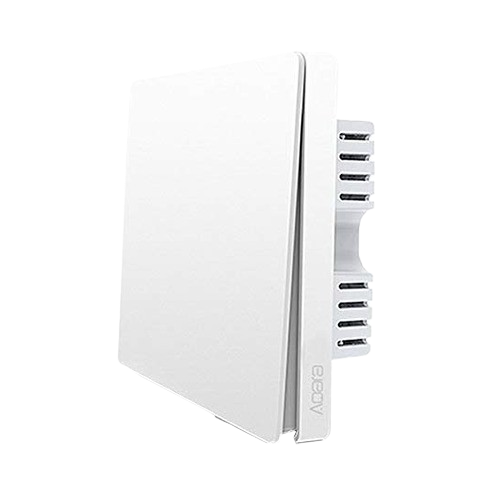|Xiaomi|AQARA - Interrupteur simple avec neutre||||
||Xiaomi|AQARA - Interrupteur double avec neutre||||
||Xiaomi|AQARA - Interrupteur simple sans neutre||||
||Xiaomi|AQARA - Interrupteur double sans neutre||||
|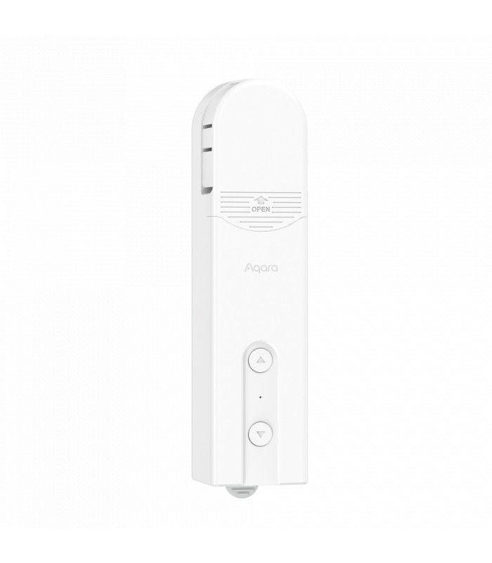|Xiaomi|AQARA - Motorisation intelligente pour store enrouleur a chaînette|||[Acheter](https://www.domadoo.fr/fr/peripheriques/5892-xiaomi-aqara-motorisation-intelligente-pour-store-enrouleur-a-chainette-zigbee-30-rsd-m01-6970504215085.html)|
||Xiaomi|AQARA - MOTORISATION POUR RIDEAU ZIGBEE 3.0 AQARA CURTAIN DRIVER E1 (VERSION TRINGLE)|||[Acheter](https://www.domadoo.fr/fr/peripheriques/6250-aqara-motorisation-pour-rideau-zigbee-30-aqara-curtain-driver-e1-version-tringle-6970504216860.html?domid=4&id_campaign=9)|
||Xiaomi|Moteur rideau||||
|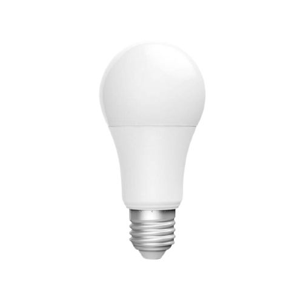|Xiaomi|AQARA - Ampoule LED connectée|||[Acheter](https://www.domadoo.fr/fr/peripheriques/5257-aqara-ampoule-led-zigbee-aqara-blanc-variable-0192784000144.html)|
|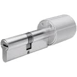|Xiaomi|MIJIA - Serrure connectée|Serrure|||
||Xiaomi|AQARA - Détecteur d'ouverture intelligent (3)|||[Acheter](https://www.domadoo.fr/fr/peripheriques/4514-xiaomi-detecteur-d-ouverture-portefenetre-zigbee-aqara.html)|
|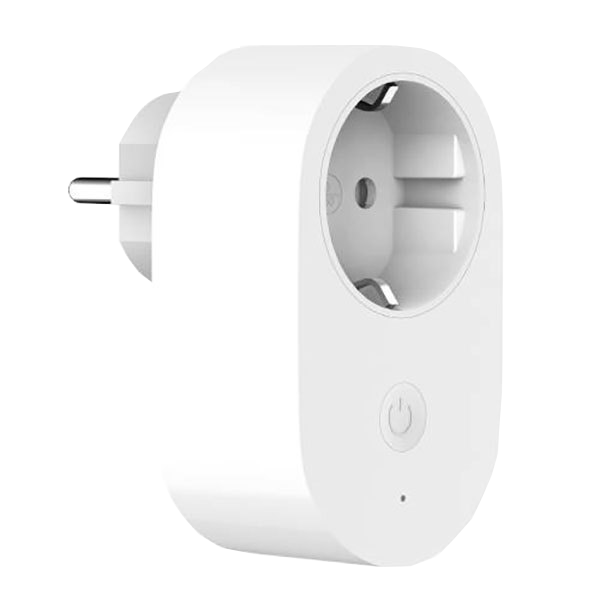|Xiaomi|MI - Prise intelligente ON/OFF||||
||Xiaomi|AQARA - Prise connectée|||[Acheter](https://www.domadoo.fr/fr/peripheriques/5385-aqara-prise-connectee-zigbee-30-smart-plug-6970504210646.html)|
|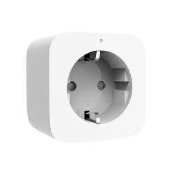|Xiaomi|MI - Prise connectée ON/OFF + Mesure de consommation|||[Acheter](https://www.domadoo.fr/fr/peripheriques/5305-xiaomi-prise-connectee-zigbee-mi-smart-plug-6934177706493.html)|
|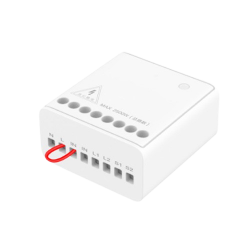|Xiaomi|AQARA - Module bidirectionnel intelligent||||
||Xiaomi|AQARA - Interrupteur simple sans fil intelligent|||[Acheter](https://www.domadoo.fr/fr/peripheriques/4516-xiaomi-interrupteur-mural-simple-sans-fil-zigbee-aqara-6970504210)|
||Xiaomi|AQARA - Interrupteur simple sans fil intelligent|||[Acheter](https://www.domadoo.fr/fr/peripheriques/4516-xiaomi-interrupteur-mural-simple-sans-fil-zigbee-aqara-6970504210)|
||Xiaomi|AQARA - Interrupteur sans fil intelligent (REV1)|Télécommande,Interrupteur||[Acheter](https://www.domadoo.fr/fr/peripheriques/4669-aqara-interrupteur-sans-fil-intelligent-zigbee-192784000052.html)|
|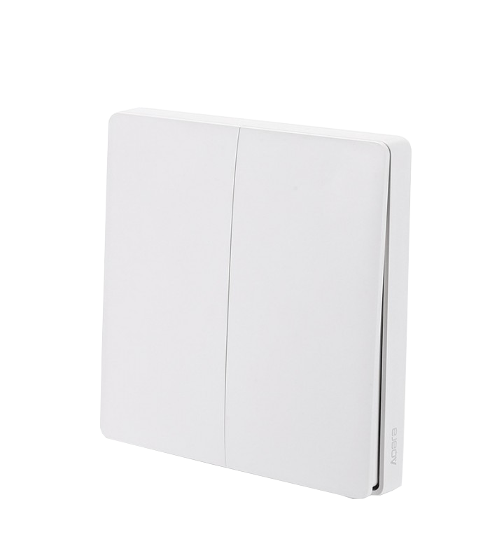|Xiaomi|AQARA - Interrupteur double sans fil||Le module est un peu capricieux il faut etre trés près de la clef|[Acheter](https://www.domadoo.fr/fr/peripheriques/4517-xiaomi-interrupteur-mural-double-sans-fil-zigbee-aqara-6970504210042.html)|
|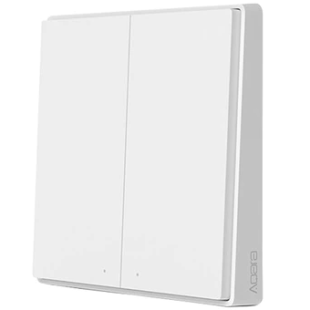|Xiaomi|AQARA - Interrupteur double sans fil|||[Acheter](https://www.domadoo.fr/fr/peripheriques/4517-xiaomi-interrupteur-mural-double-sans-fil-zigbee-aqara-6970504210042.html)|
|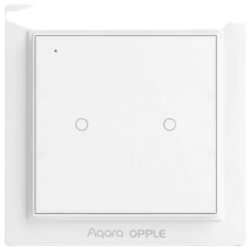|Xiaomi|AQARA - Interrupteur 2 sans fil||||
||Xiaomi|XIAOMI AQARA - Interrupteur mural double sans fil H1 ZigBee 3.0|Interrupteur,Télécommande|Le module ne permet de distinguer les clics droit et gauche, le 2eme bouton n'est donc pas exploitable|[Documentation](https://cdn.aqara.com/cdn/website/mainland/static/docs/Wireless-Remote-Switch-H1_Manual_EN.pdf) [Acheter](https://www.domadoo.fr/fr/peripheriques/5725-xiaomi-aqara-interrupteur-mural-double-sans-fil-h1-zigbee-30-6970504215023.html)|
||Xiaomi|AQARA - Interrupteur 4 sans fil||||
|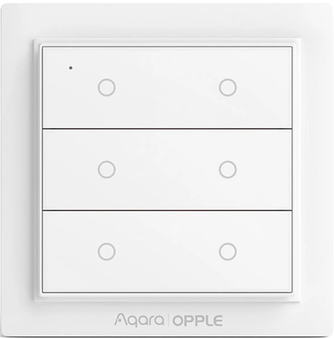|Xiaomi|AQARA - Interrupteur sans fil intelligent 6 boutons OPPLE||||
||Xiaomi|MI - Capteur de luminosité|||[Acheter](https://www.domadoo.fr/fr/peripheriques/5486-xiaomi-mi-capteur-de-luminosite-zigbee-30-6934177710865.html?domid=4&id_campaign=9)|
|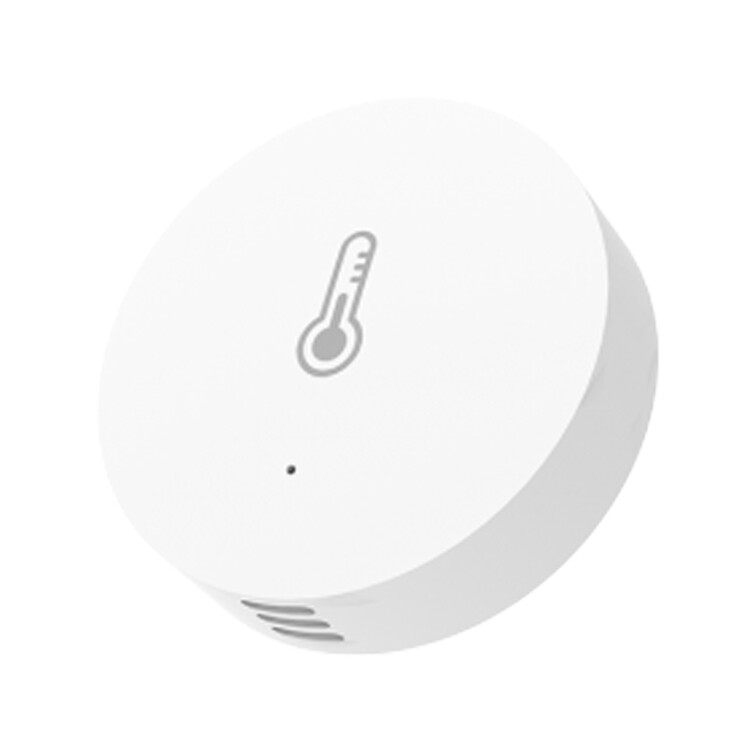|Xiaomi|MIJIA - Capteur de température/humidité||||
||Xiaomi|AQARA - Interrupteur simple sans fil intelligent|||[Acheter](https://www.domadoo.fr/fr/peripheriques/4516-aqara-interrupteur-mural-simple-sans-fil-zigbee-6970504210035.html)|
||Xiaomi|AQARA - Interrupteur double sans fil intelligent|||[Acheter](https://www.domadoo.fr/fr/peripheriques/4517-xiaomi-interrupteur-mural-double-sans-fil-zigbee-aqara-6970504210042.html)|
||Xiaomi|AQARA - Contrôleur intelligent Magic Cube|Télécommande,Contrôleur||[Acheter](https://www.domadoo.fr/fr/peripheriques/4668-aqara-controleur-intelligent-magic-cube-zigbee-0192784000045.html)|
|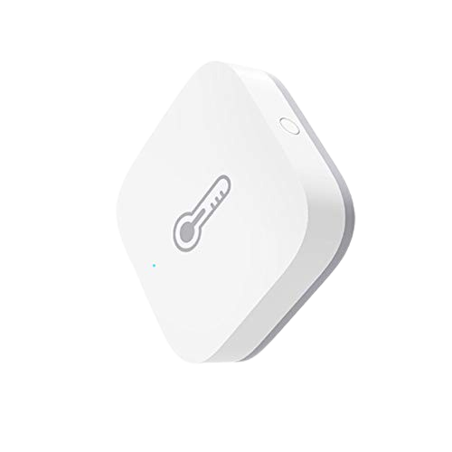|Xiaomi|AQARA - Capteur de température et humidité intelligent|||[Acheter](https://www.domadoo.fr/fr/peripheriques/4515-aqara-capteur-de-temperature-et-d-humidite-zigbee-6970504212510.html)|
||Xiaomi|AQARA - Capteur d'ouverture intelligent|||[Acheter](https://www.domadoo.fr/fr/peripheriques/4514-xiaomi-detecteur-d-ouverture-portefenetre-zigbee-aqara.html)|
|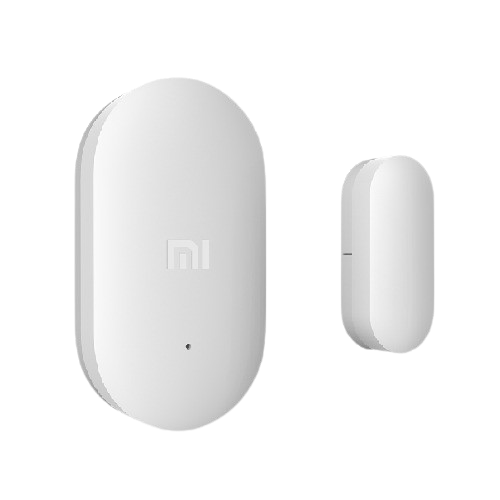|Xiaomi|MI - Capteur d'ouverture intelligent||||
|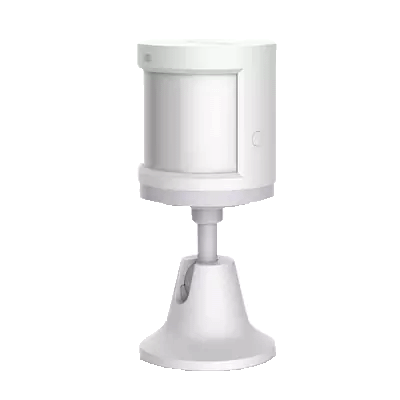|Xiaomi|AQARA - Capteur de mouvement intelligent|||[Acheter](https://www.domadoo.fr/fr/peripheriques/4518-xiaomi-detecteur-de-mouvement-zigbee-aqara-192784000090.html)|
||Xiaomi|AQARA - Capteur de mouvement intelligent|||[Acheter](https://www.domadoo.fr/fr/peripheriques/4518-aqara-detecteur-de-mouvement-zigbee-192784000090.html)|
||Xiaomi|Honeywell Gas Alarm||||
|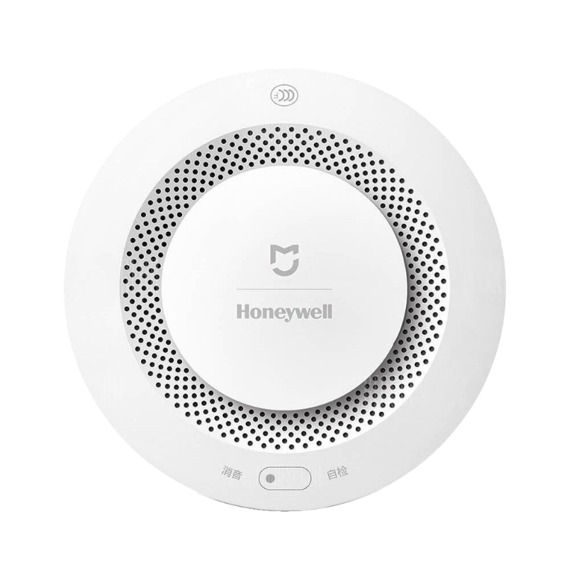|Xiaomi|MIJIA - Détecteur de fumée intelligent||||
||Xiaomi|AQARA - Interrupteur sans fil intelligent|Télécommande,Interrupteur|||
|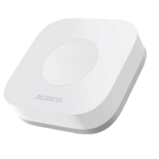|Xiaomi|AQARA - Interrupteur sans fil intelligent (REV2)|Télécommande,Interrupteur||[Acheter](https://www.domadoo.fr/fr/peripheriques/4669-aqara-interrupteur-sans-fil-intelligent-zigbee-192784000052.html)|
||Xiaomi|AQARA - Interrupteur sans fil intelligent (REV3)|Télécommande,Interrupteur|||
|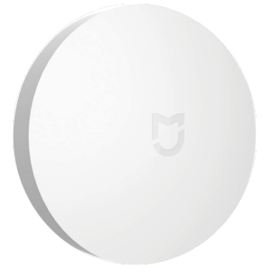|Xiaomi|MIJIA - Commutateur sans fil intelligent||||
|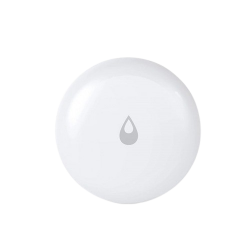|Xiaomi|AQARA - Détecteur d'inondation intelligent|||[Acheter](https://www.domadoo.fr/fr/peripheriques/4519-xiaomi-capteur-d-eau-zigbee-aqara-6970504210257.html)|
||Xiaomi|AQARA - interrupteur Simple sans neutre|Contacteur|||
|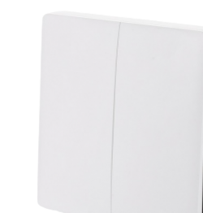|Xiaomi|AQARA - Interrupteur double sans neutre|||[Acheter](https://www.domadoo.fr/fr/peripheriques/5727-xiaomi-aqara-interrupteur-mural-double-intelligent-h1-zigbee-30-sans-neutre-ws-euk02-6970504214781.html?domid=4&id_campaign=9)|
||Xiaomi|AQARA - Interrupteur mural intelligent D1||||
|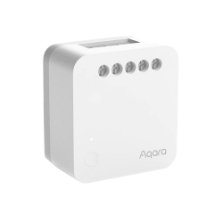|Xiaomi|AQARA - Micromodule on/off sans neutre|Contacteur,Compteur,Puissance||[Acheter](https://www.domadoo.fr/fr/peripheriques/5387-aqara-micromodule-onoff-zigbee-30-1250w-sans-neutre-6970504213302.html)|
||Xiaomi|XIAOMI AQARA - Interrupteur mural intelligent H1 ZigBee 3.0 (sans neutre)|Interrupteur,Lumière||[Documentation](https://cdn.aqara.com/cdn/website/mainland/static/docs/Smart-Wall-Switch-H1-No-Neutral_Manual_EN.pdf) [Acheter](https://www.domadoo.fr/fr/peripheriques/5726-xiaomi-aqara-interrupteur-mural-intelligent-h1-zigbee-30-sans-neutre-ws-euk01-6970504214774.html)|
||Xiaomi|XIAOMI AQARA - Interrupteur mural double intelligent H1 ZigBee 3.0 (sans neutre)|Interrupteur,Lumière||[Documentation](https://www.aqara.com/userfiles/fileupload/202105/1392376227816738818.pdf) [Acheter](https://www.domadoo.fr/fr/peripheriques/5727-xiaomi-aqara-interrupteur-mural-double-intelligent-h1-zigbee-30-sans-neutre-6970504214781.html)|
||Xiaomi|AQARA - Interrupteur triple avec neutre||||
|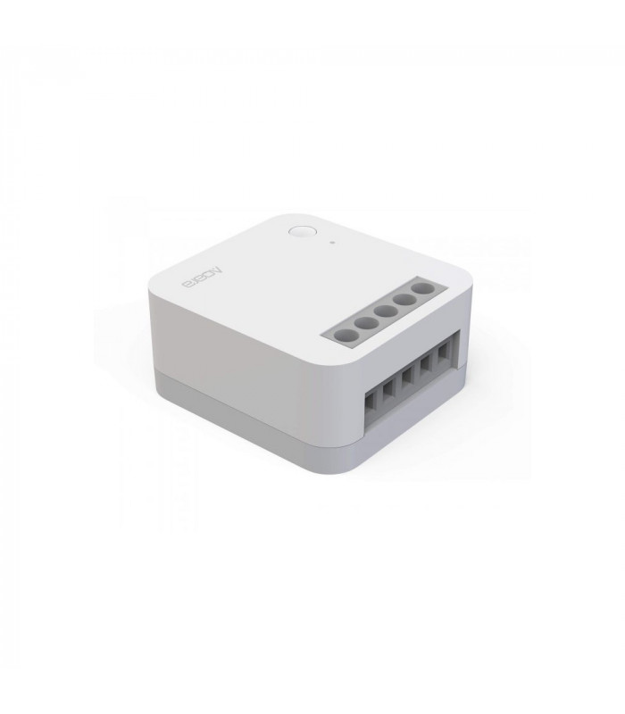|Xiaomi|AQARA - Micromodule on/off avec neutre|Contacteur,Compteur,Puissance||[Acheter](https://www.domadoo.fr/fr/peripheriques/5386-aqara-micromodule-onoff-zigbee-30-2500w-avec-neutre-6970504213296.html)|
||Xiaomi|||||
||Xiaomi|XIAOMI AQARA - Interrupteur mural double intelligent H1 ZigBee 3.0 (avec neutre) +  Mesure de consommation|||[Documentation](https://cdn.aqara.com/cdn/website/mainland/static/docs/Smart-Wall-Switch-H1-With-Neutral_Manual_EN.pdf) [Acheter](https://www.domadoo.fr/fr/peripheriques/5729-xiaomi-aqara-interrupteur-mural-double-intelligent-h1-zigbee-30-avec-neutre-ws-euk04-6970504214804.html)|
|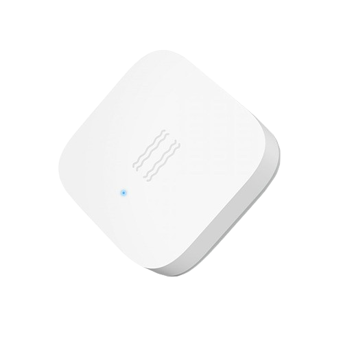|Xiaomi|AQARA - Capteur de vibration|Détecteur,Porte,Vibration||[Acheter](https://www.domadoo.fr/fr/peripheriques/4667-xiaomi-capteur-de-vibration-zigbee-aqara-192784000113.html)|
||Xiaomi|AQARA - Capteur de température/pression/humidité|||[Acheter](https://www.domadoo.fr/fr/peripheriques/4515-aqara-capteur-de-temperature-et-d-humidite-zigbee-6970504212510.html)|
||Xiaomi|AQARA - Capteur de luminosité||||
||Xiaomi|MI - Capteur de luminosité|||[Acheter](https://www.domadoo.fr/fr/peripheriques/5486-xiaomi-mi-capteur-de-luminosite-zigbee-30-6934177710865.html)|
||Xiaomi|AQARA - Capteur de d'occupation FP1||||
|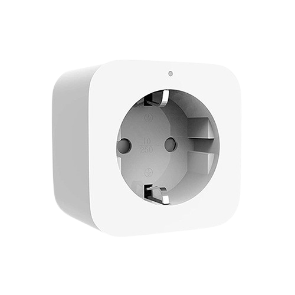|Xiaomi|MI - Prise connectée ON/OFF + Mesure de consommation|||[Acheter](https://www.domadoo.fr/fr/peripheriques/5305-xiaomi-prise-connectee-zigbee-mi-smart-plug-6934177706493.html)|
|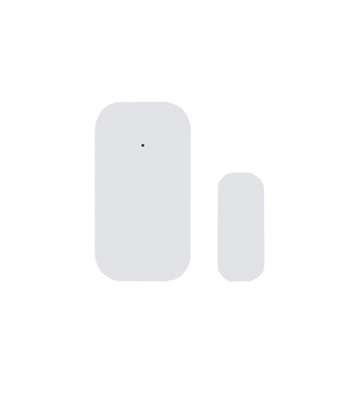|Xiaomi|AQARA - Détecteur d'ouverture intelligent|||[Acheter](https://www.domadoo.fr/fr/peripheriques/4514-xiaomi-detecteur-d-ouverture-portefenetre-zigbee-aqara.html)|
|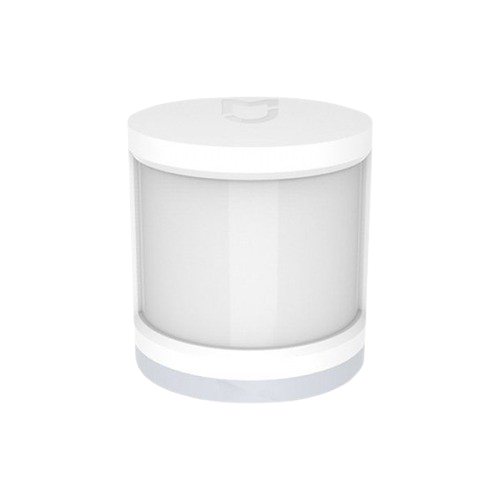|Xiaomi|AQARA - Détecteur de mouvement intelligent v2|||[Acheter](https://www.domadoo.fr/fr/peripheriques/4518-xiaomi-detecteur-de-mouvement-zigbee-aqara-192784000090.html)|
||Xiaomi|MIJIA - Interrupteur sans fil intelligent|Interrupteur,Télécommande|||
|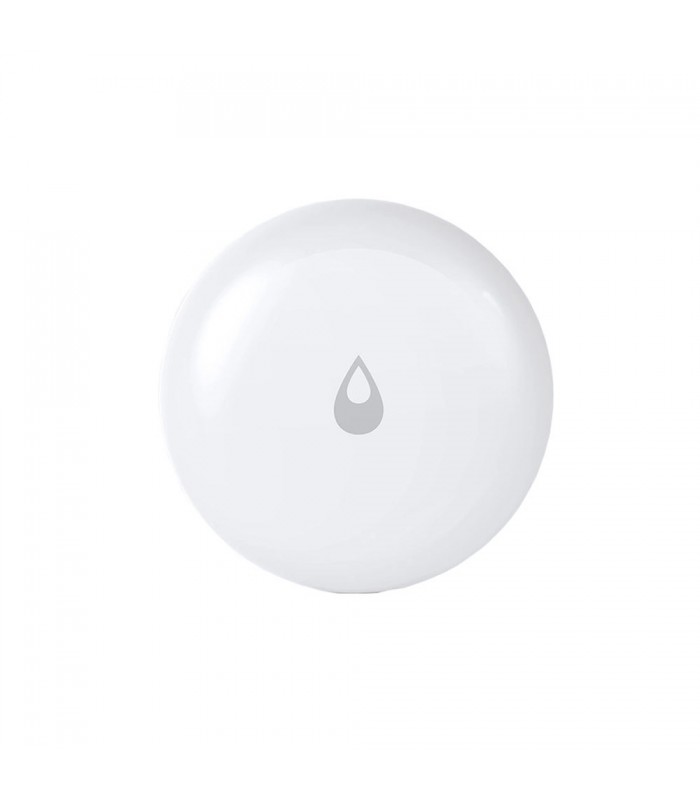|Xiaomi|AQARA - Détecteur d'inondation intelligent|||[Acheter](https://www.domadoo.fr/fr/peripheriques/4519-xiaomi-capteur-d-eau-zigbee-aqara-6970504210257.html)|
||Xiaomi|AQARA - Capteur de vibration|Détecteur,Porte,Vibration||[Acheter](https://www.domadoo.fr/fr/peripheriques/4667-xiaomi-capteur-de-vibration-zigbee-aqara-192784000113.html)|

Cette liste est basee sur des retours utilisateurs, l\'équipe Jeedom ne peut donc garantir que tous les modules de cette liste sont 100% fonctionnels

2023-12-24 01:32:12
