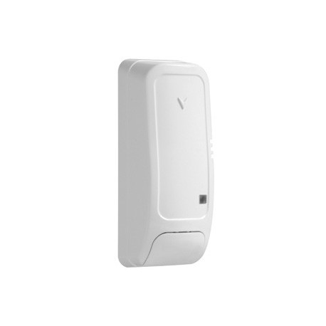
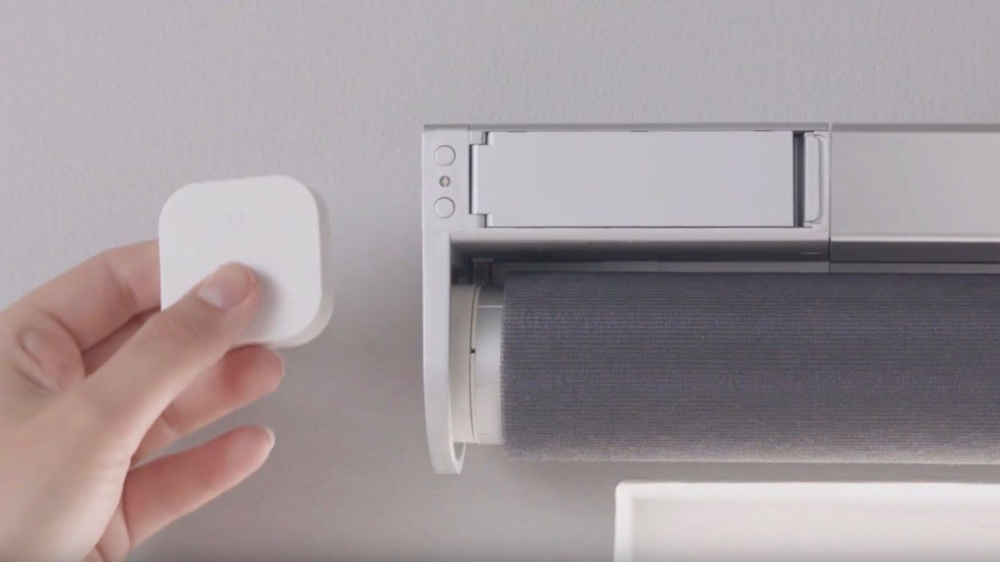

# Compatibilité des modules Zigbee

# Legrand

|Image|Marque|Nom|Type|Remarque|Lien|
|---|---|---|---|---|---|
||Legrand|Legrand cable outlet||||
||Legrand|Legrand micro module||||
||Legrand|Legrand prise mobile Céliane||||

# TYZB01

|Image|Marque|Nom|Type|Remarque|Lien|
|---|---|---|---|---|---|
||TYZB01|GR-SMARTHOME VANNE 1/4 DE TOUR|||[Acheter](https://www.domadoo.fr/fr/peripheriques/5264-gr-smarthome-motorisation-zigbee-30-pour-vanne-14-de-tour.html)|

# Danalock

|Image|Marque|Nom|Type|Remarque|Lien|
|---|---|---|---|---|---|
||Danalock|Danalock V3 Zigbee||||

# Danfoss

|Image|Marque|Nom|Type|Remarque|Lien|
|---|---|---|---|---|---|
||Danfoss|Danfoss eTRV0100||Pour réinitialiser la vanne, enlever les piles et les remettre en appuyant sur le bouton jusqu'au second rallumage de l'écran.|[Acheter](https://www.domadoo.fr/fr/peripheriques/5156-danfoss-tete-electronique-ally-zigbee-30-5702425245008.html)|

# Generic

|Image|Marque|Nom|Type|Remarque|Lien|
|---|---|---|---|---|---|
||Generic|Light RGB||Equipement générique pour une lumiere RGB||
||Generic|On/Off||Equipement générique pour une prise ou tout module On/Off||
||Generic|Opening/Motion||Equipement générique pour les ouvrants ou capteur de mouvement||

# Ikea

|Image|Marque|Nom|Type|Remarque|Lien|
|---|---|---|---|---|---|
||Ikea|Ikea repeateur||||
||Ikea|Ikea télécommande 2 boutons||||
||Ikea|Ikea télécommande 2 boutons store||||
||Ikea|Ikea télécommande 5 boutons||||
||Ikea|Ikea Fyrtur||Pour l'inclusion il est conseillé de faire une remise à zéro du store (en pressant les 2 boutons jusqu'a ce que la diode s'allume), puis mettre Jeedom en mode inclusion, retirer la betarie et remettre la batterie du store||
||Ikea|Ikea Kadrilj||Pour l'inclusion il est conseillé de faire une remise à zéro du store (en pressant les 2 boutons jusqu'a ce que la diode s'allume), puis mettre Jeedom en mode inclusion, retirer la betarie et remettre la batterie du store||
||Ikea|Ikea motion sensor||||

# Philips

|Image|Marque|Nom|Type|Remarque|Lien|
|---|---|---|---|---|---|
||Philips|Philips mouvement||||

# Sonoff

|Image|Marque|Nom|Type|Remarque|Lien|
|---|---|---|---|---|---|
||Sonoff|Sonoff Basic ZBR3|||[Acheter](https://www.domadoo.fr/fr/peripheriques/5258-sonoff-module-commutateur-10a-zigbee-30.html)|
||Sonoff|Sonoff porte||Attetion il y a un bug dans le firmware qui le fait remonter comme un module de température et d'humidité il faut donc suite à l'inclusion remettre le bon model et supprimer les commandes de température et d'humidité|[Acheter](https://www.domadoo.fr/fr/peripheriques/5261-sonoff-detecteur-de-mouvement-zigbee-30.htm)|
||Sonoff|Sonoff mouvement|||[Acheter](https://www.domadoo.fr/fr/peripheriques/5261-sonoff-detecteur-de-mouvement-zigbee-30.html)|
||Sonoff|Sonoff Température/humidité|||[Acheter](https://www.domadoo.fr/fr/peripheriques/5260-sonoff-capteur-de-temperature-et-d-humidite-zigbee-30.html)|
||Sonoff|Sonoff bouton|||[Acheter](https://www.domadoo.fr/fr/peripheriques/5259-sonoff-interrupteur-sans-fil-zigbee-30.html)|

# Sunricher

|Image|Marque|Nom|Type|Remarque|Lien|
|---|---|---|---|---|---|
||Sunricher|Sunricher motor controller||||
||Sunricher|Sunricher RGB-CCT||||
||Sunricher|Sunricher ZG2858A||||

# Xiaomi

|Image|Marque|Nom|Type|Remarque|Lien|
|---|---|---|---|---|---|
||Xiaomi|Xioami interrupteur double|||[Acheter](https://www.domadoo.fr/fr/peripheriques/4517-xiaomi-interrupteur-mural-double-sans-fil-zigbee-aqara-6970504210042.html)|
||Xiaomi|Xioami Aquara Vibration|||[Acheter](https://www.domadoo.fr/fr/peripheriques/4667-xiaomi-capteur-de-vibration-zigbee-aqara-192784000113.html)|
||Xiaomi|Xiaomi Aquara porte|||[Acheter](https://www.domadoo.fr/fr/peripheriques/4514-xiaomi-detecteur-d-ouverture-portefenetre-zigbee-aqara.html)|
||Xiaomi|Xiaomi Aquara mouvement|||[Acheter](https://www.domadoo.fr/fr/peripheriques/4518-xiaomi-detecteur-de-mouvement-zigbee-aqara-192784000090.html)|
||Xiaomi|Xiaomi Aquara inondation|||[Acheter](https://www.domadoo.fr/fr/peripheriques/4519-xiaomi-capteur-d-eau-zigbee-aqara-6970504210257.html)|

Cette liste est basee sur des retours utilisateurs, l\'équipe Jeedom ne peut donc garantir que tous les modules de cette liste sont 100% fonctionnels

2020-09-25 00:32:01
