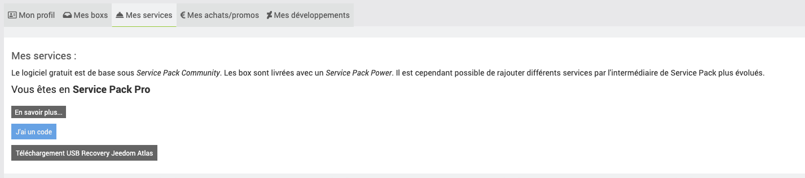
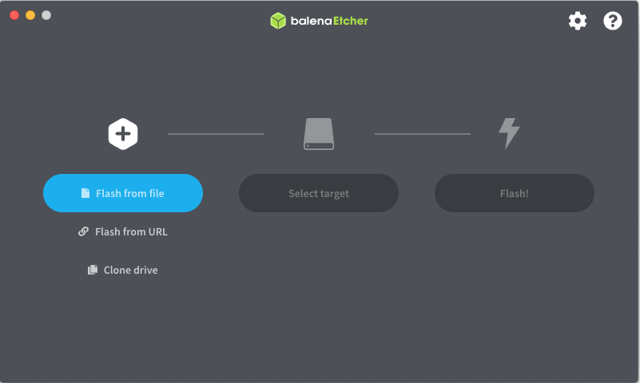

# Zurücksetzen eines Jeedom Atlas auf die Werkseinstellungen

## Sicherung von Jeedom

Zunächst einmal **ist es unerlässlich, ein Backup von Jeedom zu erstellen**, das nach Abschluss des Vorgangs wiederhergestellt werden kann.

1. Rufen Sie die Jeedom-Benutzeroberfläche auf und klicken Sie dann auf das Menü **Einstellungen > System > Backups**.

2. Klicken Sie auf die Schaltfläche **Sicherung starten**.

3. Wenn die Sicherung abgeschlossen ist, klicken Sie auf **Sicherung herunterladen**.

4. Sobald die Jeedom-Sicherung heruntergeladen ist, schalten Sie das System über das Menü **Einstellungen > System > Herunterfahren** aus.

## Übersicht

Der Jeedom Atlas ist mit einem eMMC-Speicher ausgestattet, der eine höhere Zuverlässigkeit als eine SD-Karte gewährleistet, allerdings ist dieser Speicher nicht direkt zugänglich.

Der USB-Wiederherstellungsmodus umfasst sowohl das System als auch das Betriebssystem und die Jeedom-App.

Es ermöglicht:

- Zurücksetzen des Jeedom Atlas auf die Werkseinstellungen (OS+Jeedom).
- Das Zurücksetzen des Jeedom Atlas auf die „Werkseinstellungen“ und anschließendes Wiederherstellen des Jeedom-Backups.

Zur Erinnerung: Die Verwaltung von Backups und Wiederherstellungen ist in Jeedom im Menü „Einstellungen“ oben rechts und anschließend unter „Backups“ verfügbar.

Jeedom bietet einen Abonnementdienst für automatische Backups in der privaten Jeedom-Cloud an, damit Sie sich um nichts mehr kümmern müssen. (Im Market, in Ihrem Konto, Menü links „Backup Cloud“).

## Funktionsweise des Wiederherstellungsmodus

>**Hinweis**
>
>Denken Sie daran, (lokal) eine Sicherungskopie der Jeedom-Konfiguration anzulegen

>**Wichtig**
>
>Die Durchführung eines Recovery-Vorgangs führt zu einer Änderung der MAC-Adresse Ihrer Jeedom-Box. In diesem Fall müssen Sie Ihre IP-Reservierung in den Einstellungen Ihres DHCP-Servers ändern, falls Sie einen solchen nutzen.

>**Wichtig**
>
>Je nachdem, ob Sie noch Zugriff auf Ihre Box haben oder nicht, ist die Vorgehensweise unterschiedlich.

Benötigtes Material: ein USB-Stick (mindestens 16 GB).

FALL 1: SIE HABEN ZUGANG ZU IHRER ATLAS-BOX

Öffnen Sie das Atlas-Plugin (Hausautomations-Gateway/Atlas-Plugin), klicken Sie auf „Recovery“ und befolgen Sie die Anweisungen.

***

FALL 2: SIE HABEN KEINEN ZUGRIFF AUF IHRE ATLAS-BOX

- Laden Sie das Recovery-Tool über Ihr Profil im Market herunter: Profil / Meine Dienste und klicken Sie auf „USB Recovery Atlas herunterladen“

- Software herunterladen [Balena Etcher](https://www.balena.io/etcher/)
- Wählen Sie in der Software Ihr heruntergeladenes Bild und anschließend Ihren USB-Stick aus

- Sobald der Stick bereit ist, stecken Sie ihn in den unteren USB-2-Anschluss (schwarzer USB-Anschluss) und schalten Sie dann Ihre Atlas-Box ein.
- Etwa 5 bis 10 Minuten warten
- Dann besuchen Sie http://jeedomatlasrecovery.local/
- Geben Sie den Benutzernamen und das Passwort ein: admin/admin, ändern Sie anschließend das Passwort. WICHTIG: Richten Sie ein Market-Konto ein.
- Sobald dies erledigt ist, startet Jeeasy und führt Sie durch den Wiederherstellungsvorgang.
- Befolgen Sie die Anleitung

Dieser Wiederherstellungsmodus ist nur mit dem Jeedom Atlas kompatibel.
