# Die Debian-Umgebung eines Smart aktualisieren

Wir werden den Vorgang der **Migration der Debian-Umgebung der Smart-Box** im Detail erläutern, damit Sie sich vor der Durchführung einen Überblick über die verschiedenen Schritte verschaffen können. Beachten Sie, dass alle Schritte im Verlauf der Migration auch auf dem Bildschirm erklärt werden.

## Voraussetzungen

Die Migration der Debian-Umgebung und des Kernels des Smart ist ein langwieriger und komplexer Prozess, daher müssen vor Beginn des Vorgangs mehrere unverzichtbare Voraussetzungen berücksichtigt werden.

Dazu gehört insbesondere:

- Sie müssen während des gesamten Vorgangs **auf der Migrationsseite bleiben** *(dies dauert etwa 1 Stunde und 30 Minuten)*,
- vorbereiten [ein als **FAT32** formatierter USB-Stick](https://fr.wikihow.com/formater-en-FAT32){:target="\_blank"} und über **mehr als 8 GB freien Speicherplatz** verfügt,
- Sie müssen sich im **selben lokalen Netzwerk** wie die Smart-Box befinden und über deren **interne Adresse** darauf zugreifen.

>**WICHTIG**
>
>Wie immer wird dringend empfohlen, vorab eine **aktuelle Sicherungskopie** Ihres Jeedom bereitzuhalten.

## Migration

### Migration einleiten

Sie haben zwei Möglichkeiten, den Migrationsvorgang zu starten:

- Gehen Sie dazu in das Menü **Einstellungen → System → Bildwiederherstellung**:
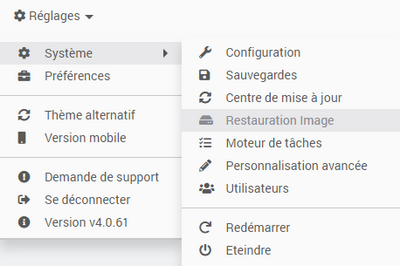

- Wenn Sie im **Update-Center** dazu aufgefordert werden, sobald dies erforderlich ist:
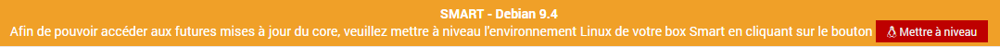

### Schritt 1

Der erste Schritt der Migration besteht darin, die Hardware vorzubereiten und zu überprüfen. Die zuvor genannten Voraussetzungen werden in einem Popup-Fenster angezeigt, und Sie werden aufgefordert, einen USB-Stick *(im FAT32-Format formatiert)* mit mehr als 8 GB freiem Speicherplatz in die Smart-Box einzustecken.

Sobald der USB-Stick eingesteckt ist, können Sie auf den Pfeil klicken, um den Vorgang zu starten:

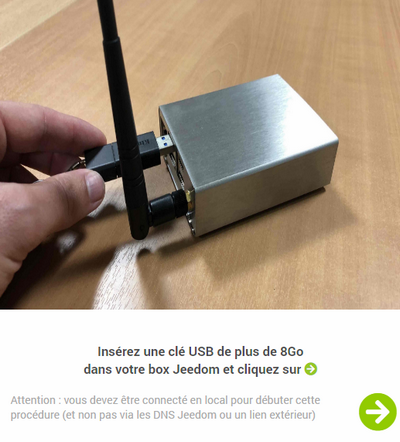

Sobald die Voraussetzungen erfüllt sind, können wir mit Schritt 2 fortfahren:

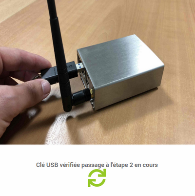

>**INFORMATION**
>
>Sie müssen während des gesamten Vorgangs nicht vor dem Bildschirm sitzen bleiben. Der Vorgang läuft automatisch ab, bis Sie aufgefordert werden, ein Backup wiederherzustellen.

### Schritt 2

Im zweiten Schritt wird ein Backup Ihres Jeedom erstellt, von dem eine Kopie sicher auf dem USB-Stick gespeichert wird. Dieses Backup kann am Ende des Migrationsprozesses auf Wunsch wiederhergestellt werden. Bei Bedarf finden Sie das Backup in einem Verzeichnis namens ``Backup`` auf dem USB-Stick.

Wir empfehlen Ihnen dennoch, sicherzustellen, dass Sie zusätzlich über ein aktuelles Backup von Jeedom verfügen.

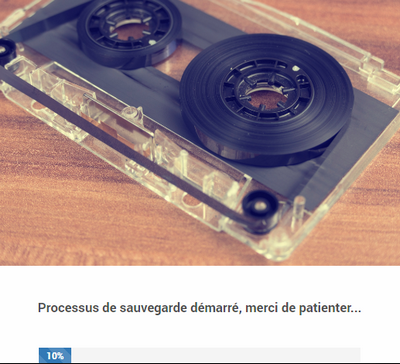

Die Dauer der Sicherungsphase hängt von der Größe Ihrer Anlage und den eingerichteten Optionen für die externe Sicherung ab. Sie haben die Möglichkeit, den Vorgang zu beschleunigen, indem Sie zuvor die Übertragung der Market- und/oder Samba-Sicherungen deaktivieren.

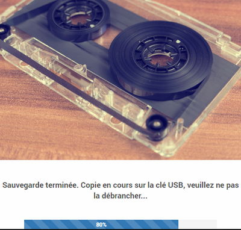

### Schritt 3

Im dritten Schritt wird das Image mit der neuen Version der Debian-Umgebung heruntergeladen und nach dem Herunterladen auf seine Gültigkeit überprüft:

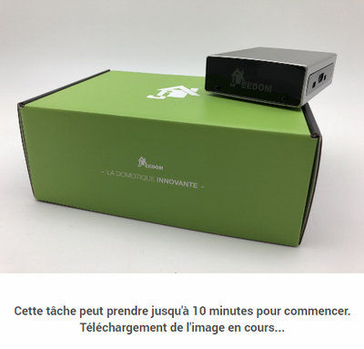

Dieser Vorgang kann eine gewisse Zeit in Anspruch nehmen und hängt von der Geschwindigkeit Ihrer Internetverbindung sowie von der Lese-/Schreibgeschwindigkeit des USB-Sticks ab:

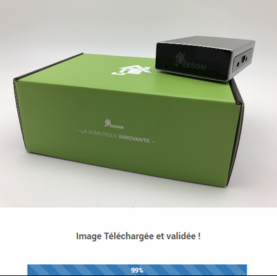

### Schritt 4

Dies ist bei weitem der wichtigste Schritt, da es sich um die eigentliche Migration der Hardware handelt. Der USB-Stick darf während dieser Phase auf keinen Fall abgezogen und die Stromversorgung des Smart-Geräts darf nicht unterbrochen werden!

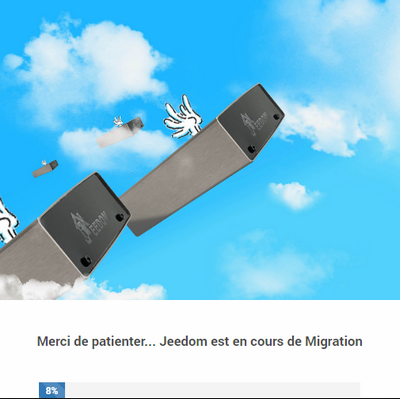

Dieser Schritt dauert etwa 30 Minuten. Danach wird die Smart-Box neu gestartet. Dieser erste Neustart kann eine gewisse Zeit in Anspruch nehmen:

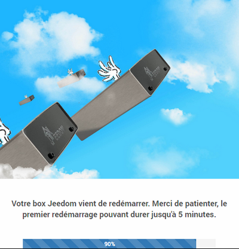

### Abschluss der Migration

Nach Abschluss des Migrationsprozesses befindet sich die Smart-Box nun in einer aktuellen Umgebung, jedoch mit einem leeren Jeedom. Der Abschluss des Vorgangs besteht daher entweder darin, mit einer leeren Installation neu zu beginnen oder das im ersten Schritt erstellte Backup wiederherzustellen:

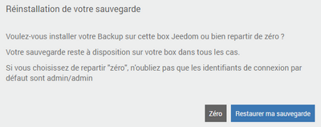

>**WICHTIG**
>
>**Achten Sie darauf, den USB-Stick nach Abschluss des Vorgangs aus der Smart-Box zu entfernen.**

Herzlichen Glückwunsch, **Ihre Smart-Box ist nun auf dem neuesten Stand und betriebsbereit**!

## Häufig gestellte Fragen

>**Der Migrationsvorgang verläuft einwandfrei, doch nach dem Neustart der Box scheinen keine Änderungen stattgefunden zu haben?**
>Das bedeutet, dass der verwendete USB-Stick vom Migrationstool nicht richtig erkannt wird. Bitte wiederholen Sie den Vorgang mit einem anderen USB-Stick oder [Ihren USB-Stick neu partitionieren](https://fr.wikihow.com/partitionner-une-cl%C3%A9-USB){:target="\_blank"} Achten Sie darauf, **nur eine einzige Partition** *(Single partition)* zu erstellen.

>**Nach der Migration der Umgebung kann ich mich nicht mehr bei Jeedom anmelden.**
>Da Jeedom nach dem Update der Debian-Umgebung neu installiert wurde, lauten die Standard-Anmeldedaten ***admin/admin***, solange Sie noch kein Backup wiederhergestellt oder einen neuen Benutzer angelegt haben.

>**Meine Box ist nach der Migration der Umgebung nicht mehr erreichbar.**
>Überprüfen Sie über die Benutzeroberfläche Ihres Routers, ob die Jeedom-Box erreichbar ist und welche IP-Adresse sie hat, falls sich diese geändert haben sollte.

>**Einige Plugins funktionieren nach der Migration nicht mehr.**
>Stellen Sie sicher, dass Sie die Abhängigkeiten für die Plugins, die diese benötigen, neu installiert haben *(siehe die Konfigurationsseite des Plugins)*.
