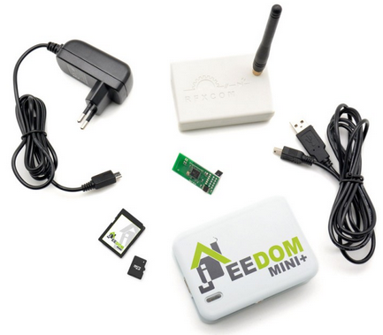
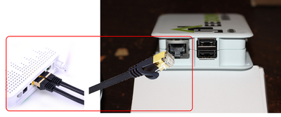
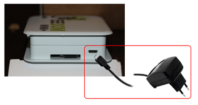
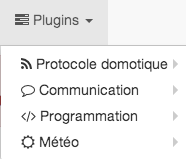
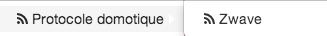
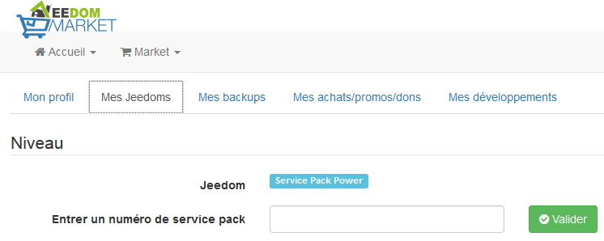

# Mini+ Start

Zunächst einmal vielen Dank für den Kauf des Jeedom Mini+. Hier finden Sie eine ausführliche Anleitung zur Inbetriebnahme dieses Geräts und können so die Hausautomation mit Jeedom kennenlernen.

Der Karton mit dem Jeedom Mini+, den Sie erhalten haben, sollte Folgendes enthalten:

-   Eine Jeedom Mini+ Box (JeedomBoard Mono-Karte – ARM Cortex A9 1,2 GHz & 512 MB RAM)
-   Ein 5-V-2-A-Netzladegerät.
-   Eine Micro-SD-Karte mit vorinstallierter Jeedom-Software. (Diese Karte ist normalerweise bereits in die Box eingelegt.)
-   Ein MicroSD-/SD-Kartenadapter.
-   Ein Jeedom-Aufkleber.
-   *Ein RFXcom 433E-Modul mit USB-Kabel.* (Nur, wenn Sie das Starterpaket mit RFXcom-Schnittstelle gekauft haben).
-   *Eine RaZberry Z-Wave+-Karte.* (Nur, wenn Sie das Z-Wave+-kompatible Starter-Paket gekauft haben.) (Diese Karte ist normalerweise bereits in der Box installiert.)

Bevor Sie das Gerät nutzen können, müssen Sie Ihre Jeedom Mini+ an Ihr lokales Netzwerk (an einen Router, Switch oder Ihre Internet-Box…) sowie an das Stromnetz anschließen.

Bevor Sie beginnen, beachten Sie bitte, dass Jeedom mit Plugins arbeitet. Auf Ihrem Jeedom Mini+ sind mehrere Plugins vorinstalliert:

Das Z-Wave-Plugin, mit dem man sein Z-Wave-Netzwerk konfigurieren und weitere
neue Z-Wave-Module.

Das Mail-Plugin.

Die Widget- und Skript-Plugins.

Das Wetter-Plugin.

Zahlreiche weitere Plugins finden Sie direkt über die Jeedom-Benutzeroberfläche im Jeedom Market.

Vergessen Sie außerdem nicht, dass Ihnen zwei Rabattgutscheine (per E-Mail versandt) zur Verfügung stehen, mit denen Sie zwei kostenpflichtige Plugins (RFXCOM und Alarme) kostenlos installieren können. Um diese einzulösen, müssen Sie ein Konto im Jeedom Market erstellen. Weitere Informationen finden Sie in der Dokumentation: [Doc Market](/premiers-pas).

In der E-Mail, die Sie erhalten haben, ist auch die Nummer des Service Packs für den Jeedom Mini+ angegeben. Sie können diese in Ihrem Market-Profil eingeben. Dadurch erhalten Sie unter anderem Zugriff auf die verschiedenen Dienste, die Ihrem Service Pack entsprechen.

Sie können nun der Dokumentation folgen: [Erste Schritte mit Jeedom](/premiers-pas) Damit können Sie die IP-Adresse Ihres Jeedom Mini+ ermitteln und eine Verbindung herstellen, um mit der Konfiguration und Nutzung zu beginnen.

Um mehr über Jeedom zu erfahren und es besser nutzen zu können, steht Ihnen eine umfassende Dokumentation zur Verfügung: [Jeedom-Dokumentation](/) sowie einen Bereich mit Video-Anleitungen: [Video-Anleitungen](/presentation#tocAnchor-1-3). Bei weiteren Fragen können Sie gerne das Jeedom-Forum besuchen: [Jeedom-Community](https://community.jeedom.com/).

Vielen Dank und viel Spaß beim Entdecken der Hausautomation mit Jeedom.
