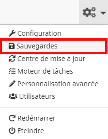
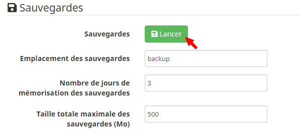
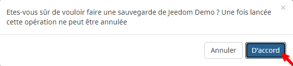
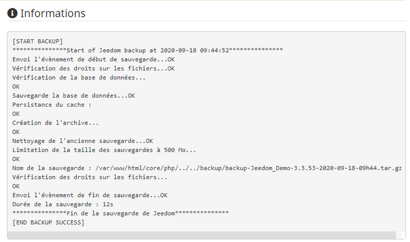
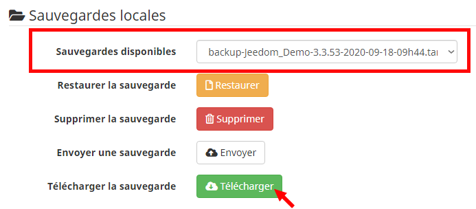
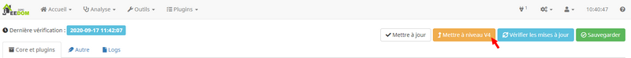
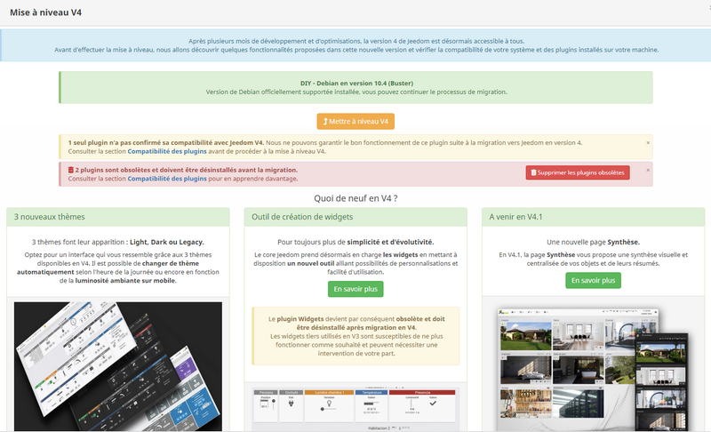
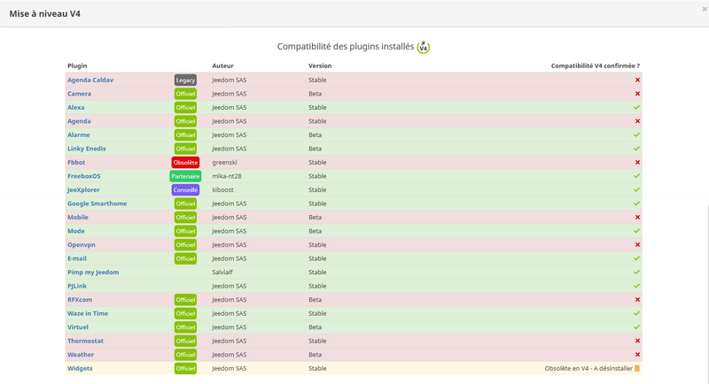
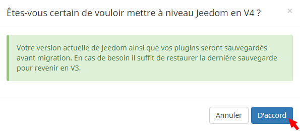
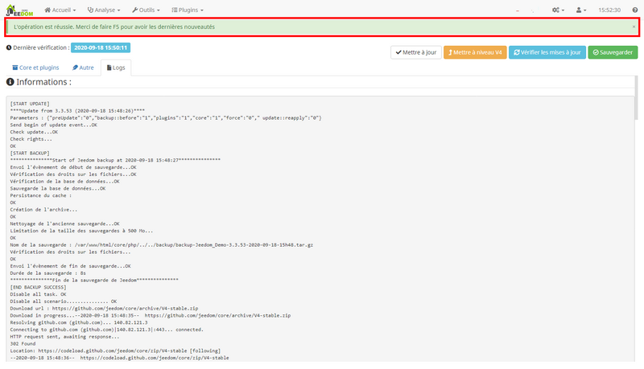

# Upgrade (V3 → V4)

Let’s explore together the key actions to take to migrate from one version of Jeedom to another under the best possible conditions. This tutorial is based on a real-world example of a migration from V3 to V4.

## Jeedom Backup

Before updating Jeedom, it is important to ensure that you have taken the necessary precautions to quickly restore a fully functional home automation system in case of any issues.

### Creating the backup

First, we'll generate a backup file of your current setup.

Let's go to the **gear-shaped menu** at the top of the navigation bar, to the left of the clock, and then click on the **Backups** submenu to access the [component that manages backups](/core/backup):

To create the backup, click the green **Start** button in the section titled **Backups**:

Confirm the message asking you to confirm that you want to back up Jeedom by clicking the **OK** button:

The backup process is starting. This may take some time; you can monitor its progress in the window labeled **Information**:

If everything goes as expected, the end of the process is indicated by the message:
``***************Fin de la sauvegarde de Jeedom*************** [END BACKUP SUCCESS]``

The backup file was successfully generated in Jeedom.

### Downloading the backup

As it stands, the backup generated earlier is only accessible from Jeedom. However, if problems arise during an update, Jeedom or the server hosting it may become inaccessible. We will therefore look at how to retrieve the backup file on a computer outside of Jeedom.

In the **Local Backups** section, make sure that the backup created in the previous step is listed under **Available Backups** by verifying the date and time shown in the file name. If this is the case, you can now click the green **Download** button:

The backup file will then be downloaded to your computer. Be sure to keep it in a safe place, as it contains a complete copy of your Jeedom system as of the time of the backup.

## Easy migration tool

Now that we've secured our Jeedom backup, we can proceed with the upgrade with peace of mind.

Starting with version 3.3.54, an easy-to-use migration tool has been added to the **Update Center**. To access it, go to the **gear-shaped menu** at the top of the navigation bar, to the left of the clock, and then click on the **Update Center** submenu.

Once you're in the update center, click the orange button labeled **Upgrade to V4** to open the migration modal window:

### Prerequisites

The upgrade window will analyze the system and all plugins installed on your device from the Jeedom Market to verify their advertised compatibility with V4. It consists of two parts:

- The top section features a few new features to explore in V4, along with a banner that provides a general overview of the compatibility of the installed plugins:

>**IMPORTANT**
>
>It will not be possible to perform the migration on a system running an environment older than ``Debian Stretch 9.X`` *(``Debian 8.X Jessie`` or lower)*. You will also be asked to remove any plugins identified as obsolete.

- The lower section consists of a table listing all installed plugins and indicating whether their compatibility with this new version has been confirmed or not:

> **IMPORTANT**
>
>This new version of Jeedom introduces major changes. As a result, third-party widgets and certain design customizations used in V3 may no longer display or function as intended and may require action on your part following the upgrade to V4.

### Upgrade

Now that we’ve reviewed all the important information to know before upgrading our Jeedom, we can start the migration by clicking the orange **Upgrade to V4** button in the upper-right corner of the modal window.

> **GOOD TO KNOW**
>
>The **Upgrade to V4** button becomes clickable only after the entire window has been viewed. Be sure to scroll all the way to the bottom of the page.

A pop-up window appears, informing us that a full backup will be performed automatically before migration so that we can quickly and easily revert to V3 if necessary.
To start the migration process, click **OK**:

You will then be redirected to the page containing the migration logs, which will begin by backing up the current installation before updating the plugins and the core.

> **IMPORTANT**
>
>Depending on the hardware on which Jeedom is installed, this process may take several minutes. It is essential to let the migration process run until it is complete.

Once the migration is complete, a green banner will appear at the top of the screen with the message ***The operation was successful. Please `F5` to get the latest updates***:

All you have to do now is press the button `F5` Press the *key* (or refresh the page) to verify that the upgrade to V4 was successful. Some plugins may need to be updated again following the migration; please feel free to update them immediately.
