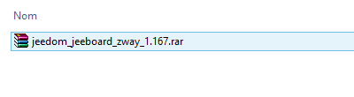
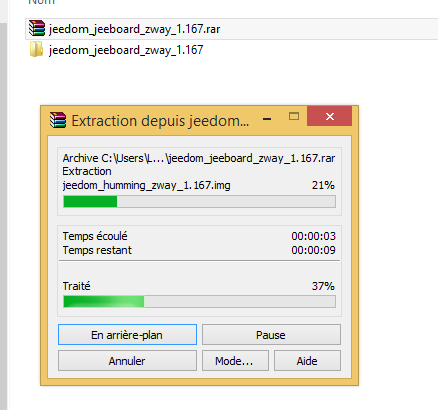
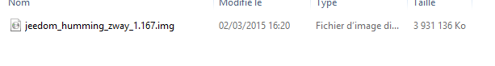

# Installing Jeeodm on a Mini+

> **Tip**
>
> The name of the Jeedom image may differ from that of the screenshots included in this documentation

## Installing Etcher

You need to download the Etcher software [here](https://etcher.io/) then install it on your PC

## Retrieving the Jeedom image

You need to go [here](https://images.jeedom.com/jeeboard/), then in the Images folder, retrieve the image jeedom-jeeboard-\*.rar

## Unzipping the Jeedom image

Unzip the Jeedom image (if you don't have anything to unzip it, you can install [WinRAR](http://www.clubic.com/telecharger-fiche9632-winrar.html)), you should get:

## Writing the image to the SD card

Insert your SD card into your computer, then launch the Etcher software, specify the path to the image file and the path to the SD card, and click "Flash!" The software will flash the SD card and verify the flash operation.

All you have to do is insert the SD card into the Jeedomboard (or Hummingboard), connect it to the network and power supply, and your Jeedom will boot up (5 min) and you should see it on the network.

> **Tip**
>
> The SSH credentials are jeedom/Mjeedom96

For the next steps, please refer to the documentation [Getting Started with Jeedom](/premiers-pas)
