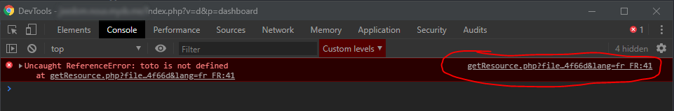
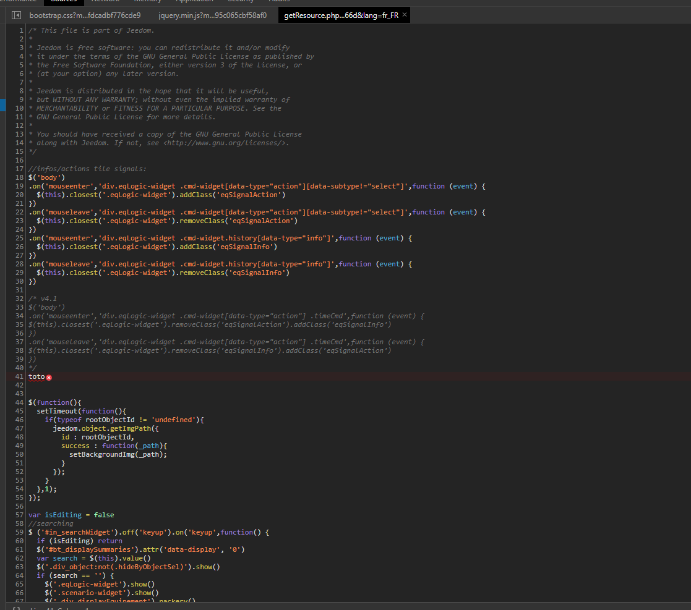

# How do I report a bug?

There are several ways to report an issue in Jeedom:

- Report the issue on the [community](https://community.jeedom.com)—that's usually where you'll get the quickest response.
- Report an issue to the Jeedom team:
  - **Support Request** (requires Power Service Pack or higher, or the issue must involve a paid plugin/service); this request is **private** and will put you in direct contact with the Jeedom support team, who will review your specific case.
  - **Bug report**—in this case, the request is **public** and will be posted to the community.
  - **Feature Request**—in this case, the request is **public** and will be posted in the community.

> **NOTE**
>
> If a support request is submitted for a third-party plugin, an email is sent to the plugin's developer.

> **IMPORTANT**
>
> Since support is provided exclusively via email, be sure to check your spam folder. In most cases, the support team responds quickly (average response time is less than 72 hours; please note that depending on the issue, it may take much longer).

## What information should I provide to get a solution as quickly as possible?

Regardless of the method you use to report the issue you’re experiencing, it’s very important to provide as much information as possible. In fact, much to our regret, 80% of requests receive the following standard initial type of response: “Please provide us with more information about the issue you’re experiencing so that we can help you. [...]” And yes… despite our best efforts, we can’t see your screen, we have no record of the steps you’ve taken, and we sometimes use different terms to describe the same things…

But since we really want to help you, here are a few tips to help us gather some valuable information:

- If your issue involves a graphical display problem (widget, page, text fields, etc.), even if it seems obvious to you when you explain it, please include a screenshot (you can actually upload the image directly to the community!). It takes just 30 seconds on your end, but it will save the person trying to help you several dozen minutes, and you’ll get a helpful response faster.
- If you're seeing a "500" error or "\{\{" characters on Jeedom, please attach the http.error file directly (you can find it quickly under Analysis -> Logs). Without it, we won't be able to figure out where the problem is coming from (once again, no one at Jeedom or among third-party developers has figured it out yet! ^^)
- You’re seeing a JavaScript error (warning banner in the top right corner) or, when you press F12 and go to the console, a red line appears. In this case, start by providing us with the full error message in question. Unfortunately, in most cases, this error message can be somewhat vague and isn’t enough on its own to identify the problem you’re experiencing. So, press F12 (in your browser, on the Jeedom tab where you’re experiencing the issue). Then click “Console,” and try to reproduce the problem (start by refreshing the page, and if necessary, repeat the same actions). You should normally see the error message again, but this time you’ll need to click at the end of the line (it may look like the screenshot below or take the form VMXXX.js):

Then take a screenshot of what appears on the screen, especially the line in red:

So, if you follow these steps carefully, you should get answers to your problem much faster and much more accurately—and you might even help the person who helped you assist someone else more quickly.

- Are you having trouble with a daemon? You must set its logging to "debug" mode; otherwise, we won't be able to help you. You can also include the dependency installation log (often found in \_update).
- Are you having trouble installing dependencies? You must include the installation log (often in \_update).

# Assistance and Support Requests (or tickets)

If you haven't found a solution to your problem, you can submit a support request to the Jeedom team.
This request must be submitted via a support ticket.

Support is available depending on your Service Pack
- Community Service Pack (free version of Jeedom): 2 support tickets per month for paid plugins only
- Power and Ultimate Service Pack: 10 tickets/month
- Service Pack Pro: 100 tickets/month

There are several ways to submit a request:
[Documentation: Support Requests or Tickets](/premiers-pas#Les%20demandes%20de%20support%20\(ou%20tickets\))

>**IMPORTANT**
>
>Please note: We’re seeing many users with “mailinblack” email accounts, which, during the first exchange, ask the sender to click a link to prove they’re human. This system isn’t compatible with our ticketing system, so even if we reply to you, you’ll never receive the response in your inbox because the system blocks it. Please make sure to enter an email address on your Market profile page that does not use this system; otherwise, you will never receive our reply.

