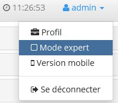
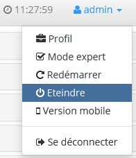
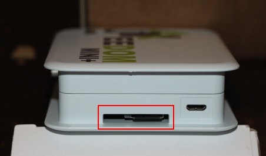
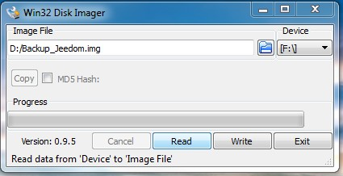
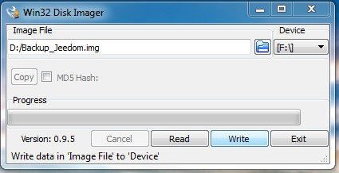
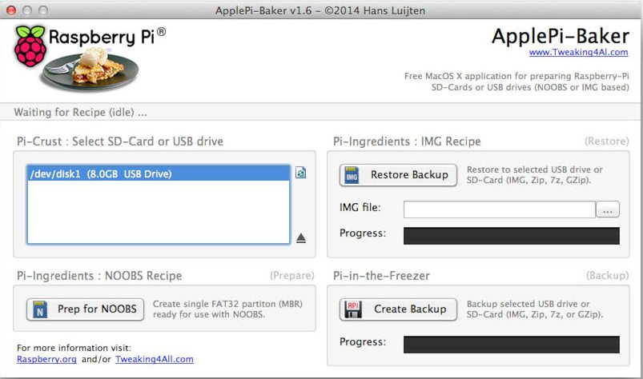
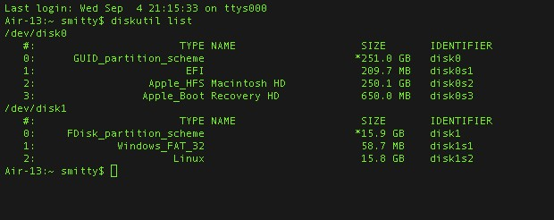

# How to Back Up Your Data

There are two ways to back up Jeedom, and each has its pros and cons.

You can create a backup from the Jeedom interface. This backup applies only to the Jeedom software and its data. One advantage is that it can be performed without shutting down the system, and the backup file can be exported to other storage media.

It is also possible to create a backup by creating a disk image of the microSD card (mini and mini+). This method has the advantage of providing a complete backup of the system, as well as Jeedom and its data. However, you must shut down Jeedom and connect the microSD card to another computer to do this.

The best way to ensure peace of mind is to do both: Back up the microSD card from time to time and set up a regular backup of Jeedom.

> **Tip**
>
> The microSD card restoration procedure may be useful for restoring a Jeedom to its default settings using the image provided by the team. See [here](/installation).

# Jeedom Backup/Restore

Documentation is already available explaining the Administration→Backups page. You can find it [here](/core/backup).

# Backing Up/Restoring the microSD Card

## Preparations

These backups and restores are performed from another computer to create a "clean image" of the SD card. First, you must shut down the mini+. To do this, switch Jeedom to expert mode in the user menu in the upper-right corner.



And click "Turn Off"



Next, remove the microSD card from the mini+ and connect it to your computer using an adapter, card reader, etc.



## On Windows

First, you'll need to download third-party software, such as: [Win32 Disk Imager](http://sourceforge.net/projects/win32diskimager/)

### Backup

-   Launch the software and verify that the letter listed under *Device* matches the letter assigned to your card or card reader.
-   In the *Image File* field, enter the name of the image file you want to create and the location where it will be saved.
-   Finally, click the *Read* button to create the image.



### Food Service

-   Launch the software and verify that the letter listed under *Device* matches the letter assigned to your card or card reader.
-   In the *Image File* field, browse to the image file you want to restore.
-   Finally, click the *Write* button to restore this image to the microSD card.



## On macOS

To make things easier for you, you can download the software [ApplePi-Baker](http://www.tweaking4all.com/hardware/raspberry-pi/macosx-apple-pi-baker/)



### Backup

-   With ApplePi-Baker: Select the correct board from the *Pi-Crust* list, and click *Create Backup* to create an image file of your microSD card.

-   In the command line:
 -   To find the drive letter associated with the card, open a terminal and enter the following command: ``diskutil list``

 -   Start creating the image by entering the command: ``sudo dd if=/dev/disk1 of=~/Desktop/Backup_Jeedom.img bs=1m`` *Note: In this example, the drive letter for the card is `/dev/disk1`, so you need to enter the following in the backup command: \`/dev/disk1\`*

### Food Service

-   With ApplePi-Baker: Select the correct card from the *Pi-Crust* list, enter the path to the image file you want to restore in the *IMG file* field in the *Pi-Ingredients* section, and click *Restore Backup* to restore the image to the microSD card.
-   In the command line:
    -   To find the drive corresponding to the card, open a terminal and enter the same command as for the backup: ``diskutil list``
 -   Remove the partitions from the card by typing the following command: ``sudo diskutil unmountDisk /dev/disk1``
 -   Restore the image to the microSD card by entering the following command: ``sudo dd bs=1m if=~/Desktop/Backup_Jeedom.img of=/dev/disk1`` *Note: In this example, the drive letter for the card is `/dev/disk1`, so you must enter the following in the save command: \`/dev/disk1\`*

## On Linux

### Backup

-   To find the drive letter associated with the card, open a terminal and enter the following command: ``sudo fdisk -l | grep Dis``
    ````
    $ sudo fdisk -l | grep Dis
    Disk /dev/sda: 320.1 GB, 320072933376 bytes
    Disk /dev/sdb: 16.0 GB, 16012804096 bytes
    Disk /dev/sdc: 8.0 GB, 8006402048 bytes
    ````
-   Start creating the image by entering the command: ``sudo dd if=/dev/sdc of=Backup_Jeedom.img bs=1m`` *Note: In this example, the device name for the card is /dev/sdc.*

### Food Service

-   To find the drive letter associated with the card, open a terminal and enter the following command: ``sudo fdisk -l | grep Dis``
-   Remove the partitions from the card by entering the following command (replacing the X with the partition numbers): ``sudo umount /dev/sdcX``
-   Restore the image to the microSD card by entering the following command: ``sudo dd if=Backup_Jeedom.img of=/dev/sdc bs=1m`` *Note: In this example, the device name for the card is /dev/sdc.*
