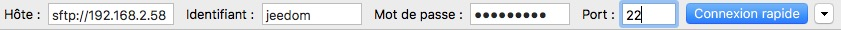
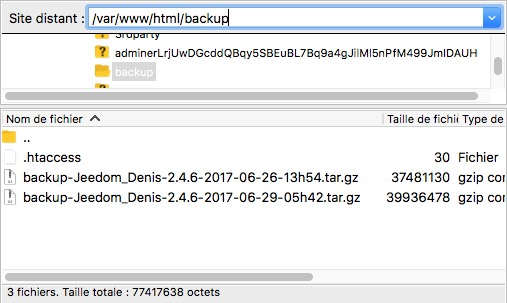
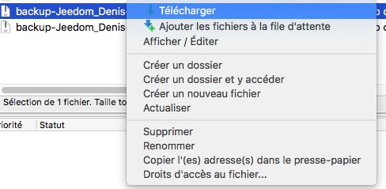

# Restoring a Backup

This procedure will allow you to connect to your router via SFTP to retrieve the daily backups it creates.

> **Tip**
>
> Please note: For this procedure to work, the box's SSH server must be up and running at all times.

## Installing FileZilla

FileZilla is free software available on all platforms. It allows you to transfer files using various protocols (FTP, FTPS, SFTP, etc.). It can be downloaded from this [link](https://filezilla-project.org/download.php?type=client)

## Connecting to the router

To connect to your router, simply fill in the fields at the top of the FileZilla window:

-   Host: Jeedom IP address (``sftp://`` is added automatically)
-   Username: ``jeedom``
-   Password: ``Mjeedom96``
-   Port: 22

Then click "Quick Connect"

## Navigating to the backup directory

Once the connection is established, you need to navigate to the Jeedom backup directory.

2 scenarios:

-   Apache Server (Jeedom Smart Box): ``/var/www/html/backup``
-   Nginx server:  ``/usr/share/nginx/www/jeedom/backup``

The path is specified in the remote site section.

## Downloading the backup

On the backup list, you can right-click to start the download.

