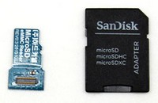
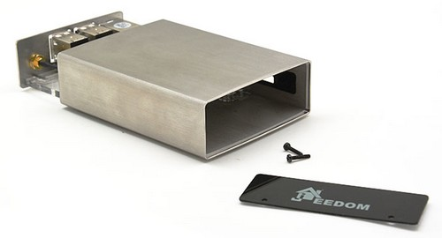
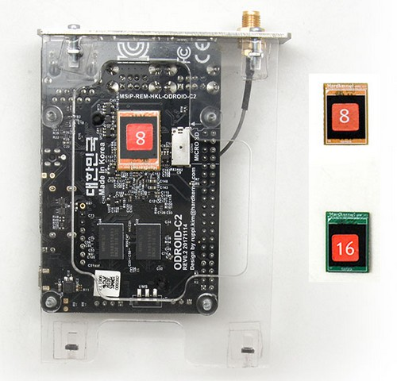
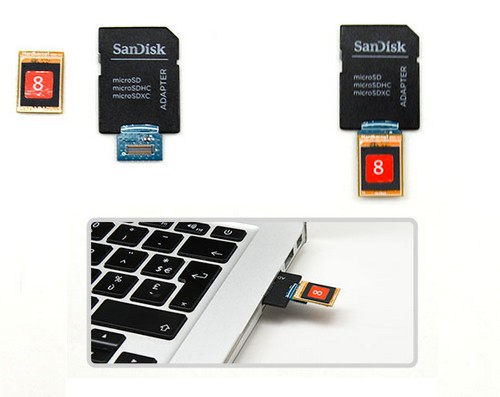
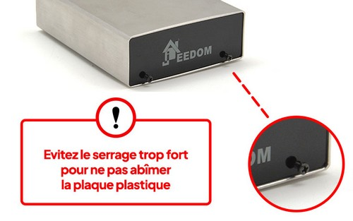

# Jeedom Smart System Restore

## Jeedom Backup

First and foremost, **it is essential to back up Jeedom** so that it can be restored once the procedure is complete.

1. Go to the Jeedom interface, then click on the **Settings > System > Backups** menu.

2. Click the **Start Backup** button.

3. When the backup is complete, click **Download Backup**.

4. Once the Jeedom backup has been downloaded, shut down the system via the **Settings > System > Shut Down** menu.

## System Restore via eMMC

This procedure explains how to update the system environment of a Jeedom Smart box still running **Debian 10 Buster**. You must flash the internal storage *(eMMC)* directly by following the steps below.

>**IMPORTANT**
>
>**Before you get started, be sure to watch the video on replacing the eMMC, which details how to disassemble and reassemble the Jeedom Smart box** *(2 minutes)*:
>
>{:target="_blank"}

### Prerequisites

To update the system, you must:

- Get a **small Phillips-head screwdriver** to open the box

---

- Purchase [**a replacement eMMC card**](https://www.domadoo.fr/fr/controleurs-adaptateurs/5539-jeedom-carte-memoire-emmc-16go-de-remplacement-pour-jeedom-smart.html){:target="_blank"}

**OR**

- Download the latest [**Image of the Jeedom Smart system provided by the team**](https://images.jeedom.com/smart/){:target="_blank"}
- Get an **Odroid-C2-compatible eMMC-to-USB/SD/µSD adapter** to flash the image from a computer, for example:

### Disassembling the Jeedom Smart box

1. Unplug all external devices connected to the Smart *(power, Ethernet, USB, HDMI, etc.)* and unscrew the antenna from the internal controller.

2. Unscrew the 2 screws on the front of the box near the Plexiglas plate ***(Caution: Fragile!)***.

3. Slide the motherboard toward the back of the case:

### eMMC Programming

1. Unclip the eMMC storage module located under the motherboard:

>**INFORMATION**
>
>**If you are replacing the original eMMC** with an eMMC that has Jeedom preinstalled on Debian 11, **snap the new eMMC** into place in place of the old one **and then proceed directly to the step of [rewinding](#Remontage%20de%20la%20box%20Jeedom%20Smart)**.

2. Snap the eMMC onto the adapter and plug it into a computer:

3. Open the burning software *(such as balenaEtcher)*.

4. Select **the system image file as the source**, **the eMMC as the destination**, and then start the burn process.

5. Once the burning process is complete, unplug the adapter from the computer, then unclip the eMMC and clip it back into place under the Smart's motherboard.

### Reassembly of the Jeedom Smart box

1. Slide the motherboard from the back to the front through the case.

2. Replace the plexiglass and then tighten the two screws on the front of the box without using excessive force:

3. Screw the antenna back on, then reconnect the external devices, finishing with the power cord.

## Automatic system restore or USB restore

Once Debian version 11 or higher is installed, system updates can then be performed directly from the Jeedom core by following [The new installation procedure on Smart](/installation/recovery)

## Getting Started with the New System

### First-time setup

When the system is first started, the file system is resized to use all available space before the box automatically restarts.

>**INFORMATION**
>
>This step may take up to 2 minutes.

### Access to Jeedom

Since the system has been reinstalled, you must log in to the Jeedom interface for the first time using your credentials `admin`/`admin`.

### Jeedom Restoration

1. Go to the **Settings > System > Backups** menu.

2. Click **Add Backup** and select the backup you created earlier.

3. Click **Restore Backup**.

### Changing the Internal Controller Port

**Starting with Debian 11, you need to change the port for the internal controller**, which is no longer `/dev/ttyS1` but `/dev/ttyAML1` on this new system.
