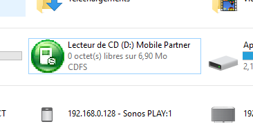
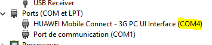
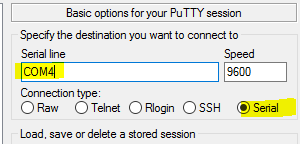

# Huawei-GSM-Modus als Modemkarte

In 90 % der Fälle ist es nicht erforderlich, die GSM-Sticks ausschließlich in den GSM-Modus zu versetzen (anstelle von GSM + CD-ROM + Kartenleser). Der einzige Fall, in dem dies zwingend erforderlich ist, ist, wenn Sie den Stick in einem Jeedom auf einer VM (VMware ESXi) verwenden möchten. Wenn Sie den Schlüssel nicht in den reinen GSM-Modus versetzen, erscheint er nämlich nicht in der Liste der USB-Geräte, die Sie an die VM weiterleiten können.

> **Wichtig**
>
> Diese Anleitung wurde unter Windows 10 erstellt

# Installation der Treiber

Sobald der Stick an einen Windows-10-PC angeschlossen ist, sollte ein neues CD-ROM-Laufwerk angezeigt werden. Doppelklicken Sie darauf und installieren Sie die angebotene Software (es müssen keine Einstellungen geändert werden, folgen Sie einfach den Anweisungen).

# Abruf des COM-Ports

Als Nächstes müssen Sie die Nummer des Kommunikationsanschlusses ermitteln. Gehen Sie zum Menü „Start“ und suchen Sie nach „Geräte-Manager“. Starten Sie diesen und klappen Sie den Abschnitt „Anschlüsse (COM und LPT)“ auf. Dort sollte ein Eintrag mit dem Namen „HUAWEI“ zu finden sein. Notieren Sie sich anschließend einfach die Nummer des COM-Anschlusses:

# Putty herunterladen

Laden Sie anschließend PuTTY herunter [hier](https://the.earth.li/~sgtatham/putty/latest/x86/putty.exe) und starten Sie die heruntergeladene Datei

# Konfiguration von PuTTY und Umschaltung auf den reinen GSM-Modus

Nach dem Start konfigurieren Sie PuTTY wie folgt (geben Sie dabei unbedingt Ihre eigene COM-Port-Nummer ein, siehe Schritt oben):

Es erscheint ein schwarzes Fenster (gelegentlich kann dort die Meldung „boot…​“ erscheinen; das ist normal und bedeutet, dass Sie ordnungsgemäß mit dem GSM-Stick verbunden sind). Geben Sie in diesem Fenster Folgendes ein und drücken Sie anschließend die Eingabetaste:

``AT^u2diag=0``

> **Wichtig**
>
> Bitte beachten Sie: Wenn Sie den Text eingeben, wird er auf dem Bildschirm nicht angezeigt – das ist normal, der Text wird dennoch korrekt erfasst.

Normalerweise sollten Sie als Antwort ein „OK“ erhalten.

So, das war's. Ihr Schlüssel befindet sich nun ausschließlich im GSM-Modus und Sie können ihn nun über VMware nutzen.
