# Synology VPN-Nutzung

Über einen Webbrowser auf einem Computer, der mit demselben Netzwerk wie das Synology-Gerät verbunden ist

Rufen Sie die DSM-Benutzeroberfläche auf, melden Sie sich mit einem Admin-Konto an, gehen Sie dann zum Hauptmenü und wählen Sie „Package Center“ aus.

Führen Sie oben links im Fenster eine Suche mit dem Begriff „VPN“ durch. „VPN-Server“ sollte angezeigt werden; klicken Sie dann auf „Installieren“.

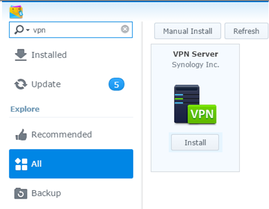

Kehren Sie zum Hauptmenü zurück und wählen Sie „VPN-Server“ aus

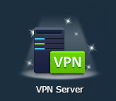

Wenn sich das Fenster öffnet, gehen Sie zu L2TP/IPSEC

Wählen Sie die Option „L2TP/IPsec-VPN-Server aktivieren“

Geben Sie unter „Dynamic IP Address“ eine Zahl ein, die dem Subnetz entspricht, dem die IP-Adressen Ihrer Geräte im VPN im internen Netzwerk Ihres Netzwerks zugeordnet sind. Hinweis: Wählen Sie nicht dasselbe Subnetz wie das Standard-Subnetz Ihrer Router-Box. Bei Free beispielsweise lautet das Subnetz der Geräte 192.168.1.0, daher geben wir im Beispiel 2 ein.

Geben Sie anschließend die maximale Anzahl der Verbindungen ein, die Sie auf dem VPN-Server zulassen möchten, sowie die maximale Anzahl gleichzeitiger Verbindungen pro Benutzer

Geben Sie abschließend einen Freigabeschlüssel ein. Hinweis: Dabei handelt es sich um ein Passwort, das Sie bei der VPN-Einrichtung auf Ihrem Smartphone oder Tablet eingeben müssen.

Anschließend „Apply“ klicken

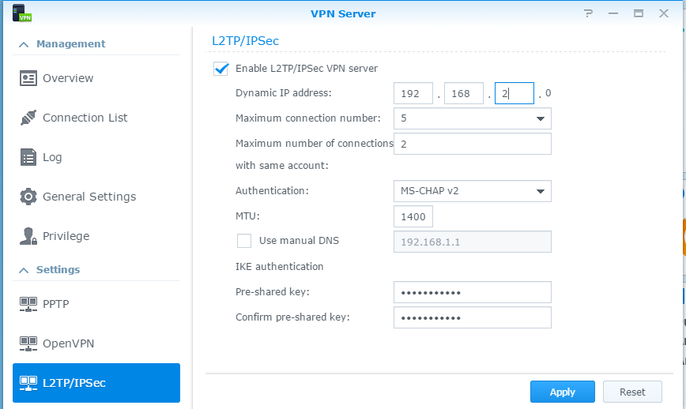

Eine Meldung zeigt Ihnen dann an, welche Ports auf Ihrer Internet-Box zu Ihrem NAS weitergeleitet werden müssen.

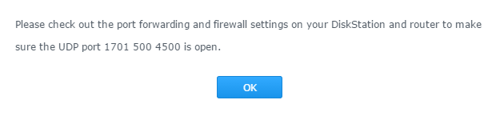

# Benutzern die Nutzung des VPN-Dienstes auf dem NAS gestatten

Kehren Sie zum Hauptmenü zurück und wählen Sie „VPN-Server“ aus

Wählen Sie auf der linken Seite „Privilegien“ aus

Deaktivieren Sie alle Kontrollkästchen unter „PPTP OpenVPN“ und „L2TP“

Aktivieren Sie nur das Kontrollkästchen neben dem Benutzer, dem Sie die Nutzung des VPN gestatten möchten.

> **Tipp**
>
> Es wird empfohlen, einen Benutzer anzulegen, der ausschließlich für das VPN bestimmt ist und über keine weiteren Rechte oder Berechtigungen verfügt, außer die Nutzung des VPN.

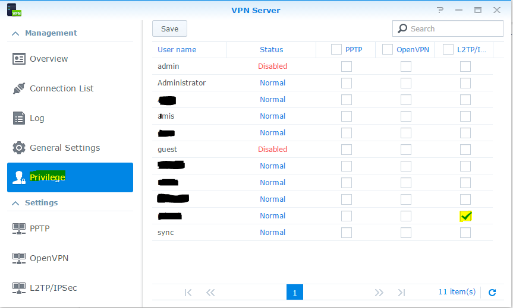

# Portweiterleitung Ihrer Box

Geben Sie im Browser 192.168.1.1 ein. Klicken Sie auf „Einstellungen“ der Freebox.

Erweiterten Modus auswählen

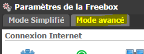

„Port-Verwaltung“ auswählen

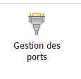

Weiterleitung hinzufügen

Geben Sie die Parameter wie folgt ein.

> **Tipp**
>
> Die Ziel-ID ist das Einzige, was von Ihrer Installation abhängt. Geben Sie hier die IP-Adresse Ihres Synology-NAS ein.

Sichern

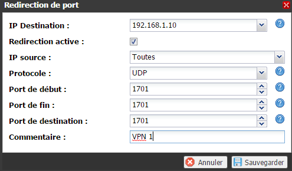

Man stellt fest, dass die Einstellung berücksichtigt wird

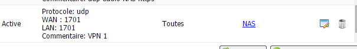

Wiederholen Sie den Vorgang mit den UDP-Ports 500 und 4500

# VPN auf Ihrem Smartphone einrichten

Öffnen Sie die App und wählen Sie „Einstellungen“ aus

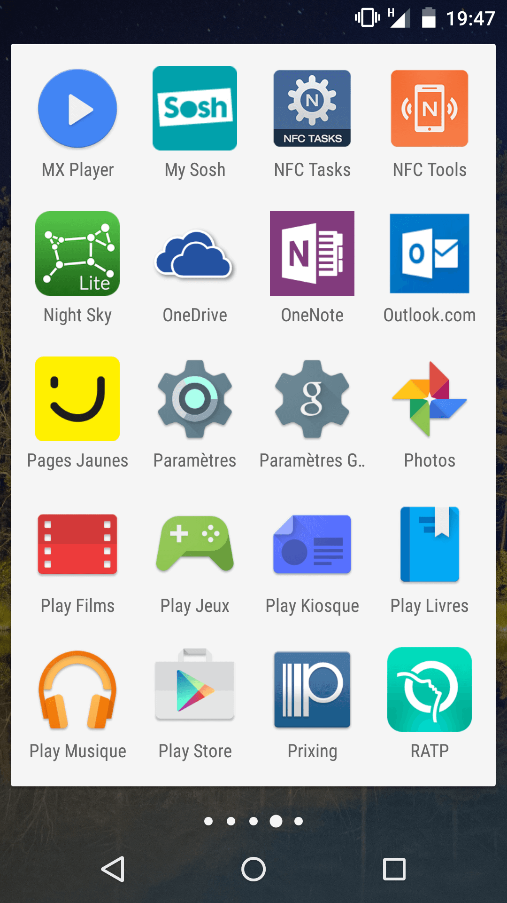

Klicken Sie auf … Mehr

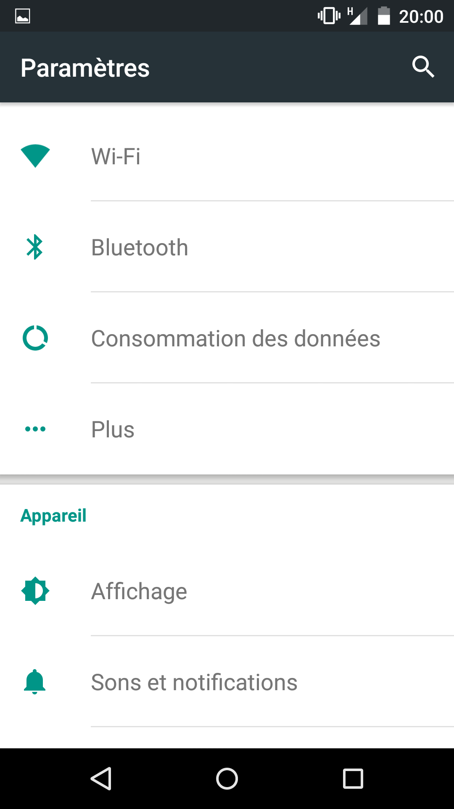

Auf „VPN“ klicken

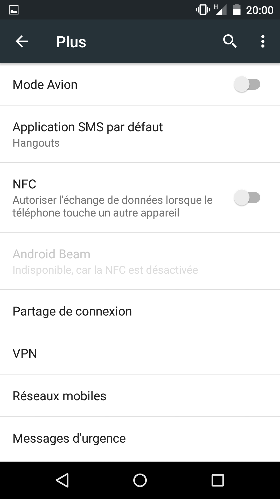

Klicken Sie oben rechts auf das „+“

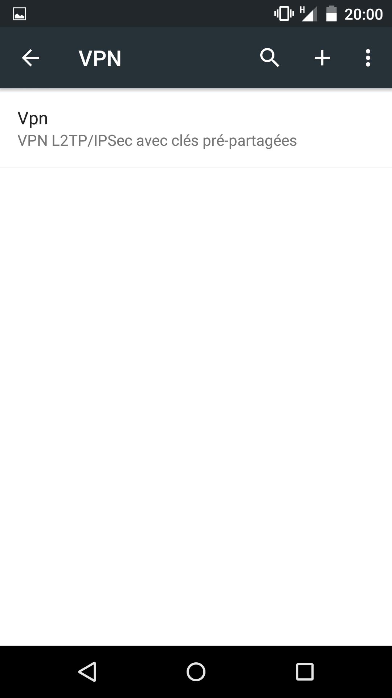

Geben Sie dem VPN-Zugang einen Namen, wählen Sie als Typ „L2TP/IPSec PSK“, geben Sie die öffentliche Adresse Ihrer Internet-Router ein (oder einen DNS-Namen, falls Sie einen haben) und geben Sie den gemeinsamen Schlüssel ein, der im Abschnitt „VPN-Server konfigurieren“ angegeben ist:

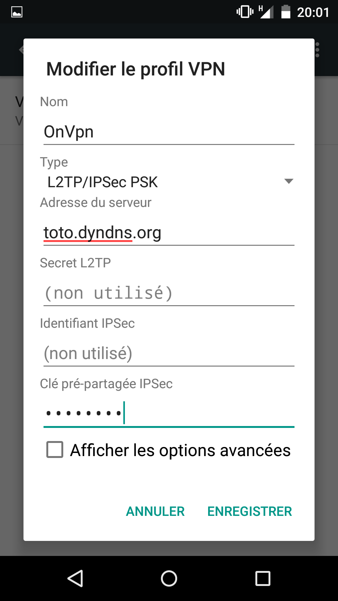

Um das VPN nun zu starten, klicken Sie einfach auf die neue Zeile, die mit dem Namen Ihres VPN-Tunnels angezeigt wird.

Geben Sie nun den Benutzernamen und das Passwort des Benutzers ein, der im Abschnitt „VPN-Server konfigurieren“ eingerichtet wurde.

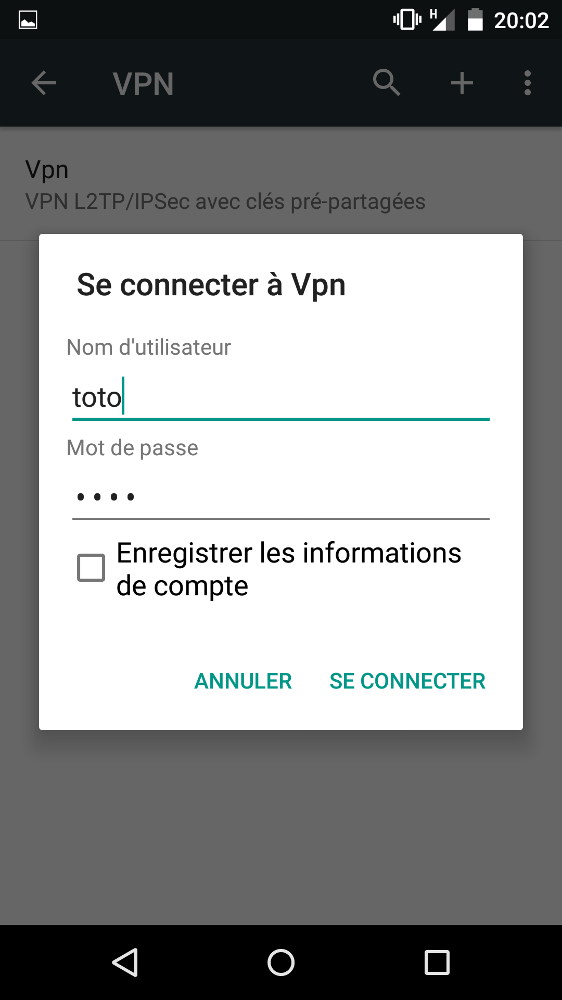

Und schon können Sie alles auf Ihrem Smartphone so nutzen, als wären Sie zu Hause im WLAN!
