# Android AutoVoice

The object of this article is to guide you through using Android to interact with Jeedom. We’ll use Jeedom’s interaction engine, which allows you to make requests and have Jeedom respond to them (and, if desired, activate various scenarios or components).

# Installation

## Prerequisites

Of course, you'll need an Android device (tablet, phone, or PC with a microphone and speakers) and install [Tasker](https://play.google.com/store/apps/details?id=net.dinglisch.android.taskerm&hl=fr) and [AutoVoice](https://play.google.com/store/apps/details?id=com.joaomgcd.autovoice&hl=fr). This feature lets you create your own voice commands for Google Now to automate tasks using your voice.

Note: AutoVoice is only the component for speaking to Jeedom; it does not allow Jeedom to respond. To enable Jeedom to respond, you don’t need the Tasker plugin. You can also use this example by replacing AutoVoice’s voice recognition with an NFC tag, geolocation, a received text message, etc.

## The Concept

We’ll use a Tasker profile triggered by a condition. This will be a voice recognition task using AutoVoice. Then, as part of the task, we’ll instruct Tasker to perform two actions. The first will be to call Jeedom and send it the text result of the voice recognition. The second will be to announce Jeedom’s response.

# Profile Creation

Add a new profile with a **status** as the trigger.

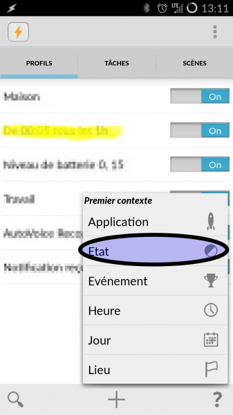

Select **Plugin** on the first screen.

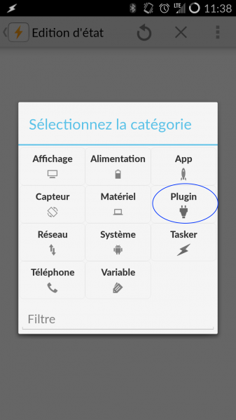

For the plugin type, select **AutoVoice**.

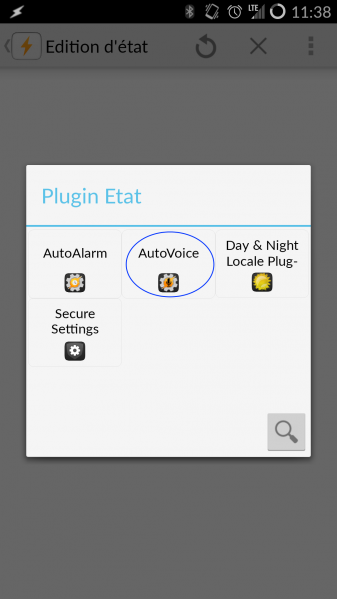

In the **AutoVoice** submenu, select **Recognized**.

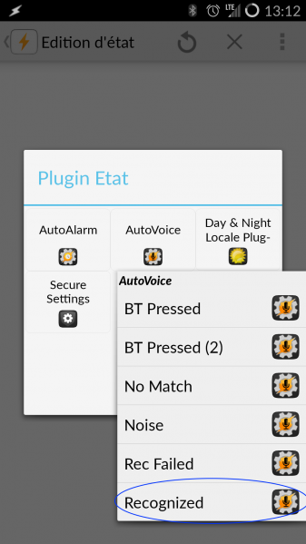

You can save the default configuration, unless you want to
Specify keywords or other parameters.

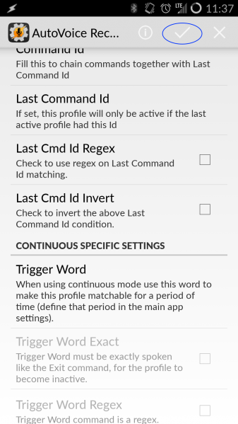

You can name the profile something like "Jeedom Interactions," and it will be saved after linking it to a task.

# The task

Add a **new task** to the newly created profile. For example, it could be named "Jeedom API."

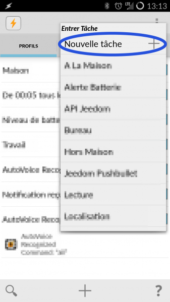

The task will ultimately consist of two actions: **API call** and **reporting the response**.

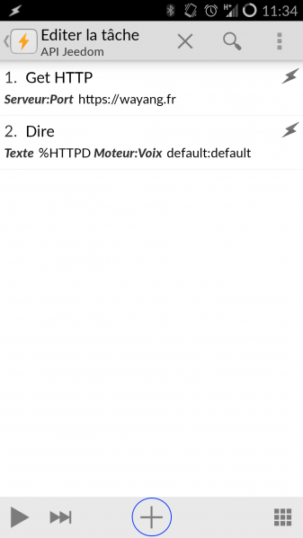

First, we'll add a **Network** type action.

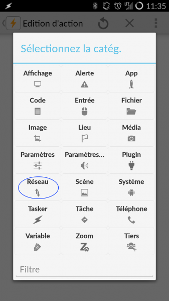

Then select **Get HTTP**.

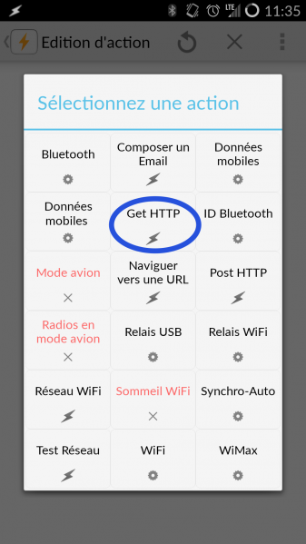

Now we'll fill in the Jeedom information. Here's what you need to enter:

-   Server:Port: ``https://mondomain.tld``
-   Path: ``/jeedom/core/api/jeeApi.php?apikey=votreclef&type=interact&query=%avcommnofilter&utf8=1``

Don't forget to replace the string "your key" with your API key. Be sure to leave ``%avcommonfilter`` Eventually, this will be replaced by the return of Autovoice.

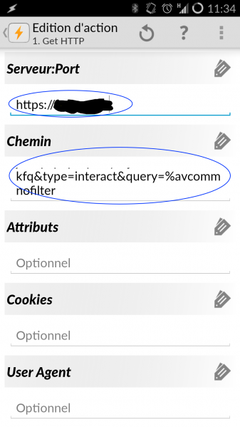

Add an action of the **Say** type. To do this, filter the actions by entering "say" in the search bar.

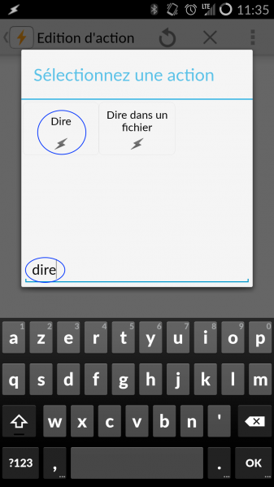

And we're heading home ``%HTTPD`` in the text field.

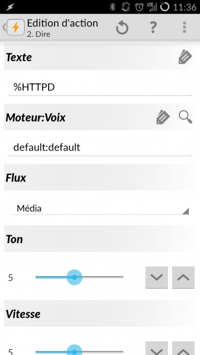

That's it. When AutoVoice recognizes your voice command, it will trigger Jeedom, and your phone will read back the response you've configured in the interactions. Don't forget to set up your Jeedom interactions, and you'll be able to ask it anything you want—from "What's the temperature in the living room?" to "Turn on the living room light."

> **Tip**
>
> If it doesn't work right away, it's often because AutoVoice isn't active. To make it active, launch the app, click on "Google Now Integration," select the first option at the very top, and authorize AutoVoice.

> **Tip**
>
> By default, AutoVoice disables Google Now search. You can change this behavior by opening Tasker, tapping your profile, then "Edit" (the small pencil icon), then "Advanced" (at the very bottom), and unchecking "Do Google Now Search" (at the very bottom).
