# Debian Installation

Here, we'll look at how to install Debian, either as a VM or directly on a physical machine

# Retrieving sources

You can find the latest Debian version as a netinstall (minimal size, but requires an internet connection for installation) [here](https://www.debian.org/CD/netinst) (you need to download the amd64 image) or click directly [here](http://cdimage.debian.org/debian-cd/10.4.0/amd64/iso-cd/debian-10.4.0-amd64-netinst.iso) to download the ISO.

# Starting the installation

## On a physical machine

You must either burn the ISO to a CD and insert the CD into the computer (though CD drives are becoming increasingly rare these days) or create a bootable USB drive.

To create a bootable USB drive, you need to download Rufus [there](http://rufus.akeo.ie/downloads/rufus-2.9.exe), launch it and configure it as follows:

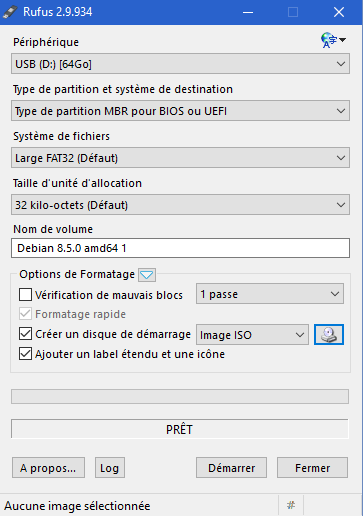

> **Note**
>
> Be sure to select the ISO file you downloaded just before

All you have to do is click "Start," then insert the USB drive into the computer and boot from it.

## On a VM

The process is fairly simple: create a new virtual machine, connect it, set up a virtual CD drive that points to the ISO file (be sure to connect it), and start the machine. See [here](vmware.creer_une_vm) for more details.

# Installation

Press Enter to start the installation:

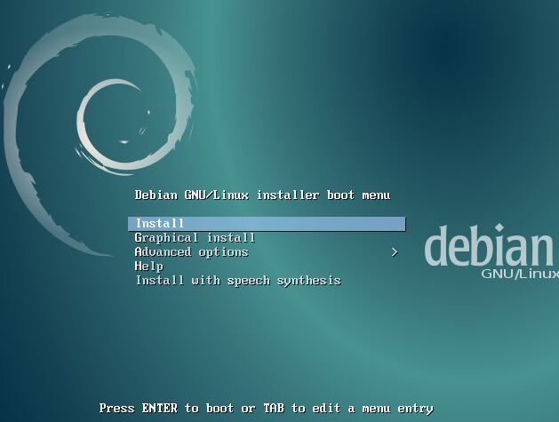

Select "French" and press Enter

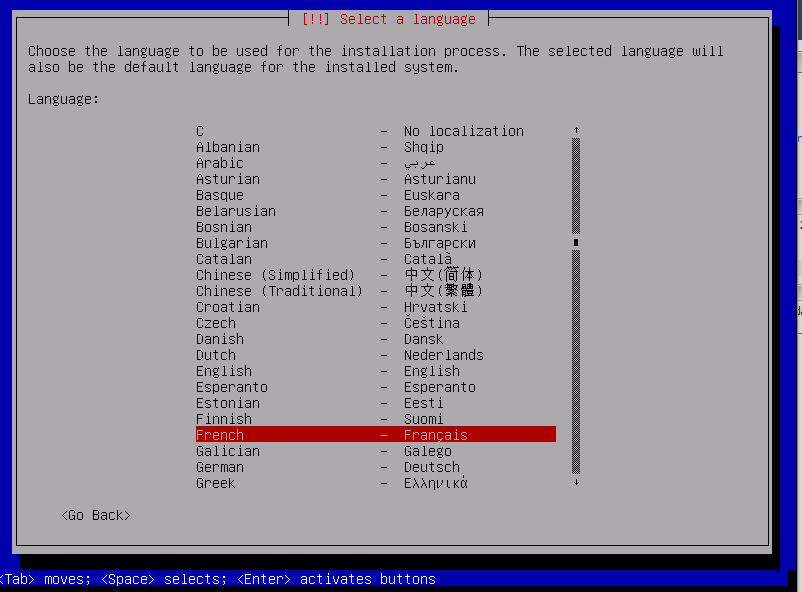

Here, you need to select "French" (Français)

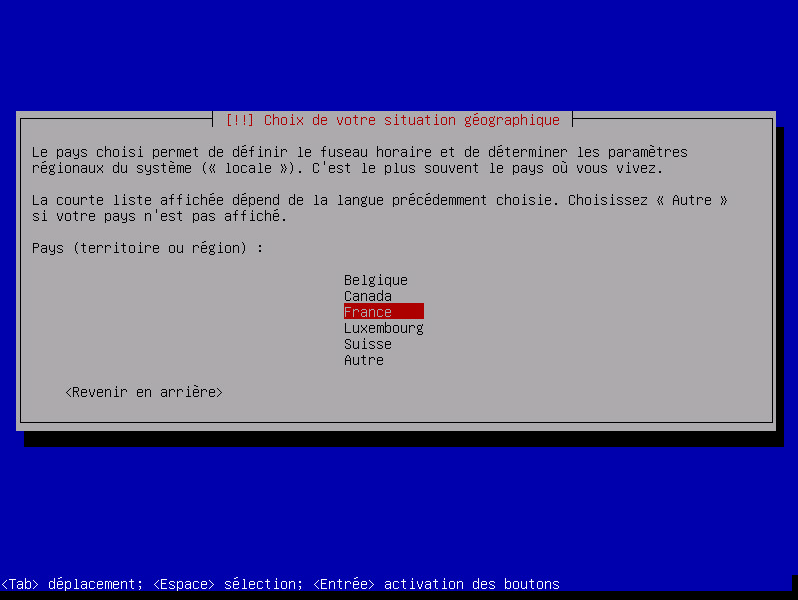

Same as above:

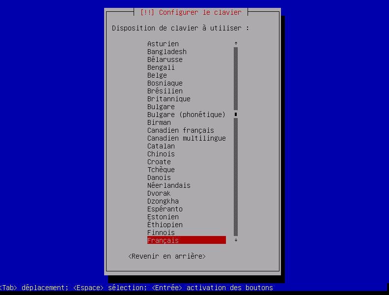

Enter the name of your device (here it's "nabaztag," but if it's a Jeedom, enter "jeedom")

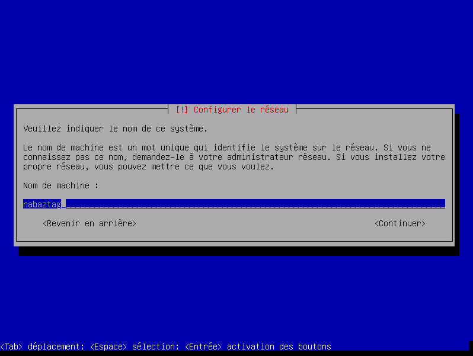

Just press Enter:

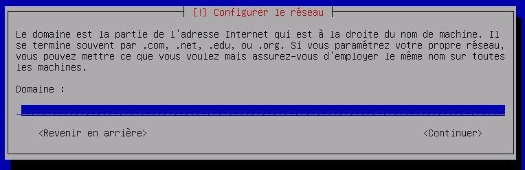

Set a password; I recommend a simple one here (such as oooo). It can be changed later (using the `passwd` command):

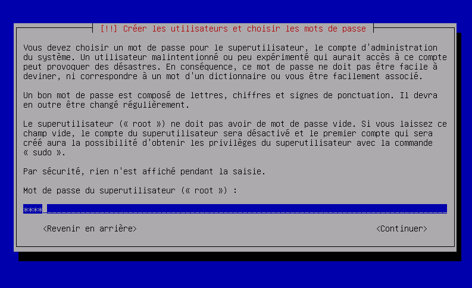

Just put it back:

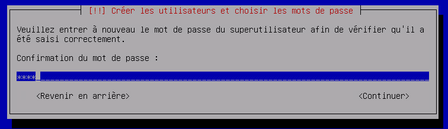

Enter the name of the primary user (here, "nabaztag," but if it's a Jeedom, enter "jeedom")

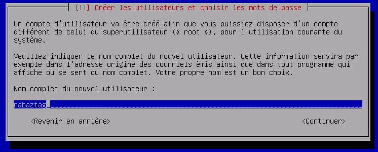

Enter the same thing:

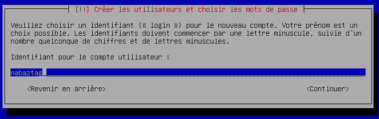

Set a password; I recommend a simple one here (such as oooo). It can be changed later (using the `passwd` command):

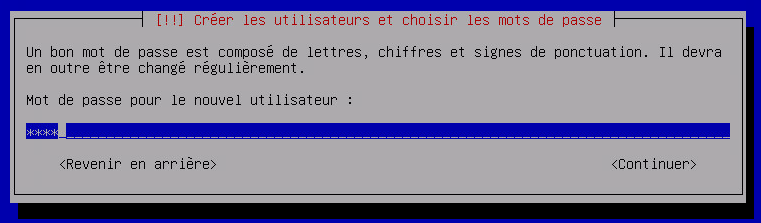

Enter the same thing:

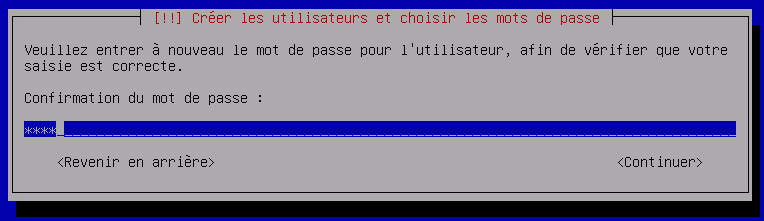

Confirm by pressing Enter:

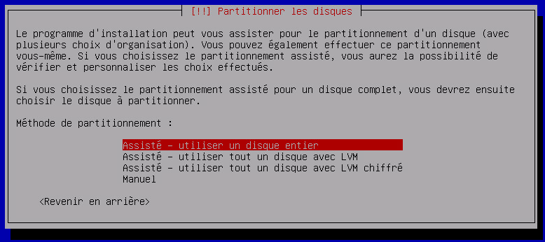

Same as above:

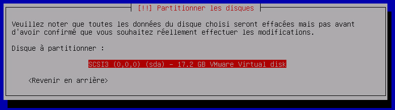

Confirm again by pressing Enter:

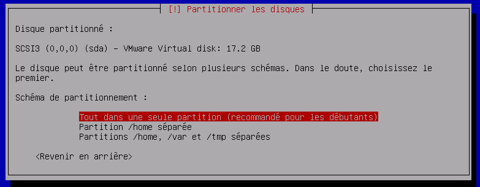

We're still validating:

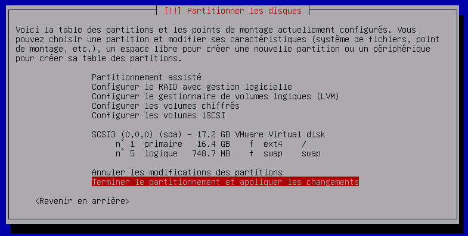

And also:

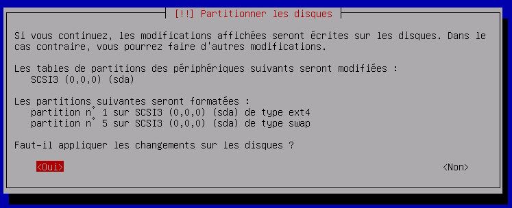

Select "France" and confirm:

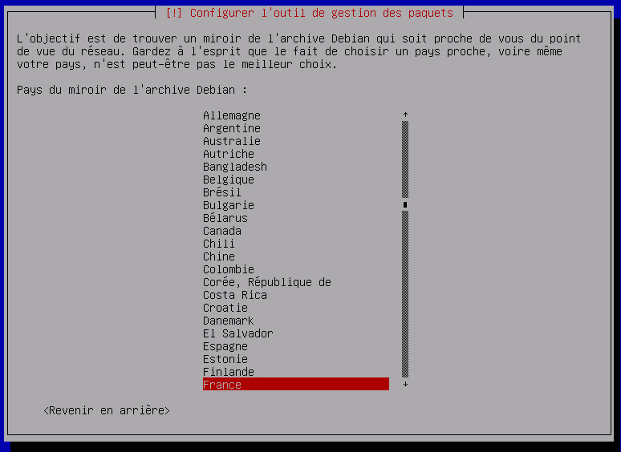

Confirm by pressing Enter:

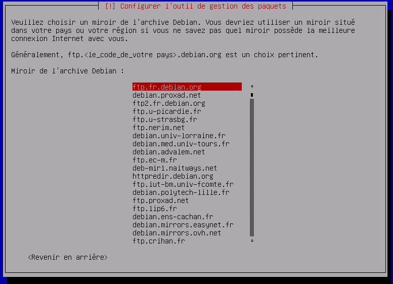

Same as above:

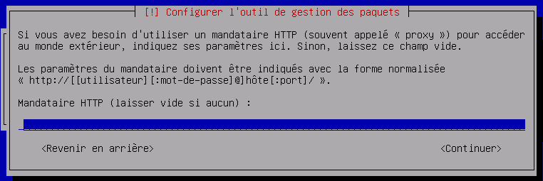

And more (yes, there’s a lot to configure on a Debian installation):

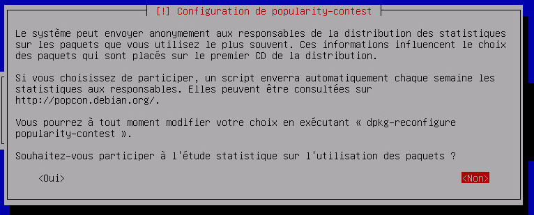

Now it gets a little more complicated: you need to deselect "Debian desktop environment" by pressing the spacebar and select "SSH server" by pressing the spacebar (use the arrow keys to navigate), then confirm by pressing Enter:

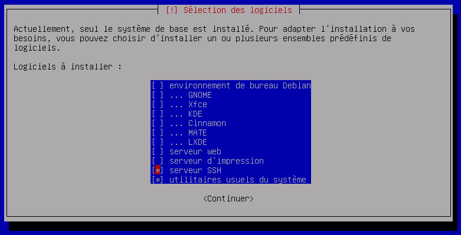

Let's confirm again:

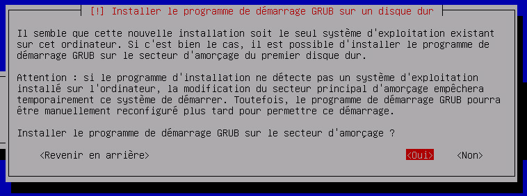

Select /dev/sda and then confirm:

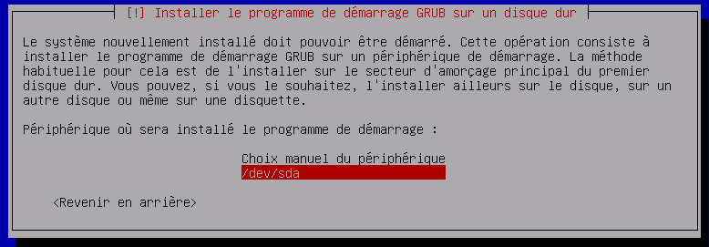

Now all you have to do is remove the USB drive, CD-ROM, or virtual CD-ROM and press Enter:

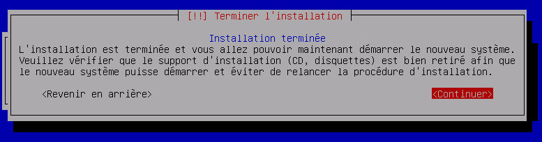

That's it—your Debian installation is complete. You can stop the tutorial here if you'd like, or follow the next steps to make a few system changes (especially useful for Jeedom).

# Optimization for Jeedom

To prepare for the Jeedom installation, you can make a few optimizations:

## Add vim and sudo

``sudo apt-get install -y vim sudo``

## Add fail2ban

Fail2ban is a program that helps secure access to your Debian system; if there are too many failed login attempts, it blocks access from the IP address in question (so not everyone, just the attacker) for a certain amount of time.

``sudo apt-get install -y fail2ban``

## Add Open VMware Tools

Open VMware Tools installs drivers specific to the installed operating system and provides optimizations for that OS running on an ESXi hypervisor.

``sudo apt-get install -y open-vm-tools``

All you have to do now is install Jeedom by following [this](/installation/cli)
