# Create a VM in VMware

Here, we'll look at how to create a VM in VMware.

First, there’s one important thing to know about VMware: there are two ways to manage it:

-   The web interface (available by default in 6.0 Update 2, or via a VIB for other versions) can be accessed at IP\_ESXI/ui
-   VMware's legacy desktop client (vSphere Client)

Here, I’ll mainly be using the web interface because I think that’s the future of VMware, which is increasingly moving away from the thick client (in fact, none of the new features introduced since version 5.1 are compatible with the thick client).

Also note that the web interface is still being rolled out at VMware, so you’ll likely encounter a few bugs or slowdowns, but just refresh the page and it’ll work fine again.

# Logging in to the web interface

Go to IP\_ESXI/ui in your web browser; you should see:

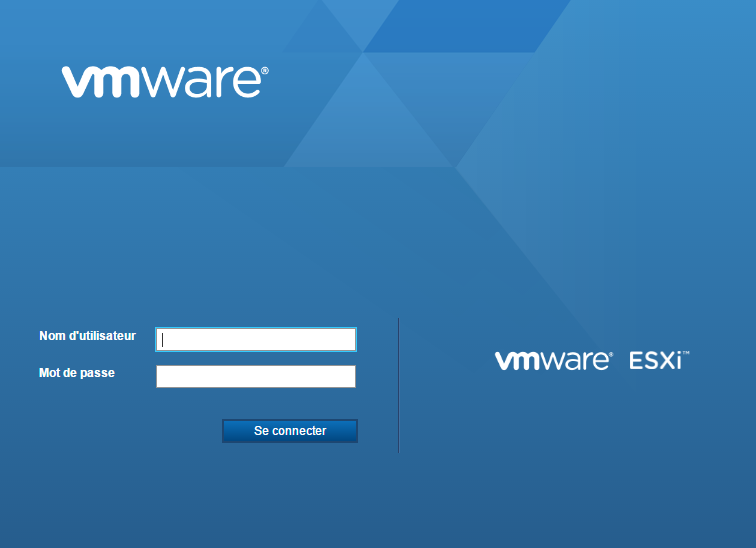

> **Note**
>
> If you don't have anything set up yet, I recommend installing the web interface; all the information [here](vmware.trucs_et_astuces)

Enter your ESXi login credentials:

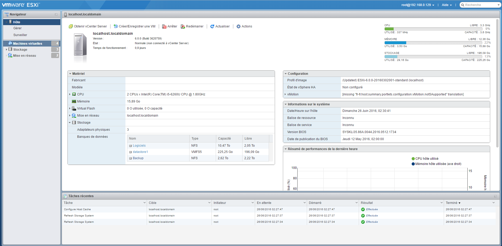

As you can see, the interface is pretty cool and lets you do quite a few things. I won’t go into detail, but from this screen alone, you can already:

-   Shut down/restart ESXi
-   View resource usage (CPU, memory, and disk)
-   Get information about your system (uptime, VMware version, BIOS version, datastore view)
-   button to create a VM (we'll use it right after this)
-   an action button that, among other things, lets you switch to maintenance mode (useful if you have an ESXi cluster; otherwise, you’ll never use it) and enable or disable the SSH service (used in the backup configuration tutorial)

# Sending the installation ISO

After downloading your installation ISO ([here](https://cdimage.debian.org/cdimage/archive/11.8.0/amd64/iso-cd/debian-11.8.0-amd64-netinst.iso) (for example, for Debian 11.8 via netinstall), you'll need to place it on your datastore.

To do this, click on "datastore":

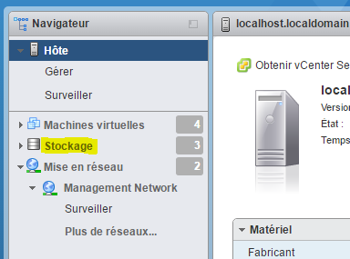

Select your datastore (usually named datastore1):

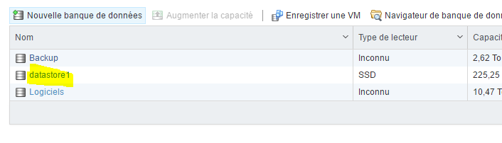

Click "Database Browser":

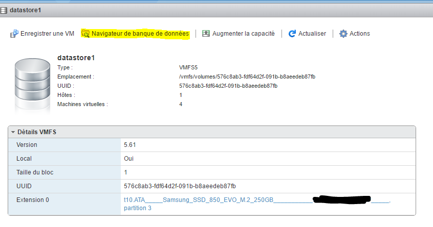

Click "Download" (the first one):

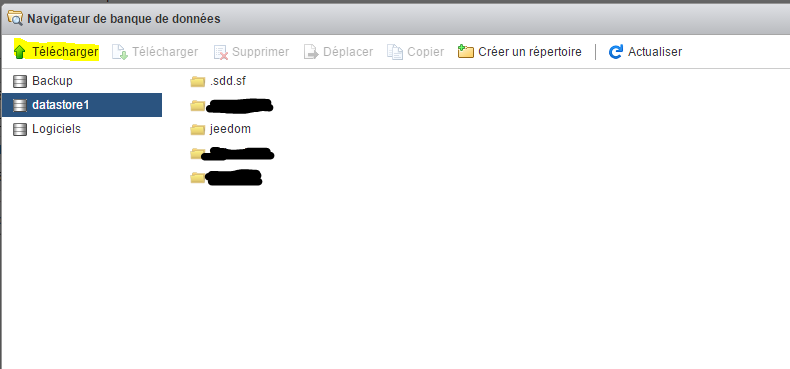

Select the previously downloaded ISO file and confirm:

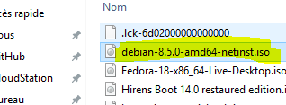

You can then track the progress of the shipment:

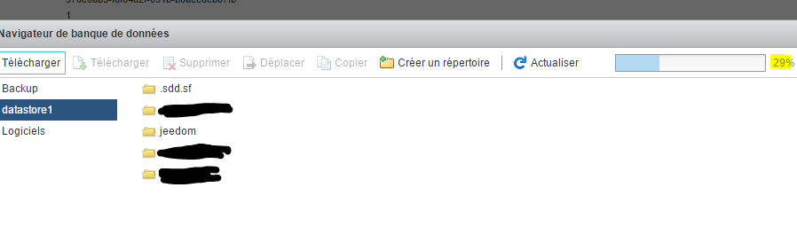

Once it's finished, you can see that your ISO has been successfully uploaded to the datastore:

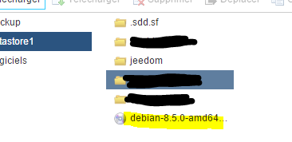

# Creating Your First VM

Click the "Create/Save a VM" button:

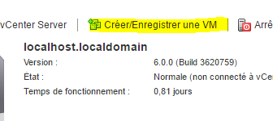

Click Next:

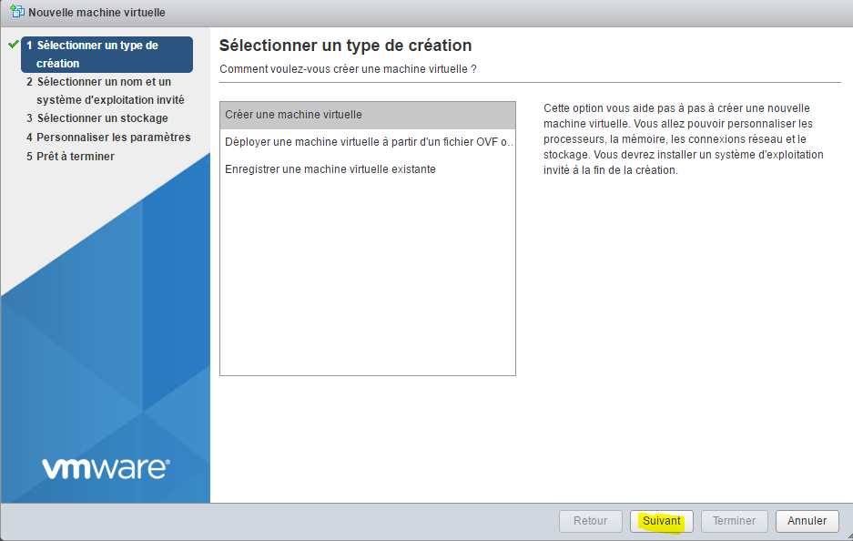

Next, give your machine a name and specify its operating system (here we’ll be installing Debian):

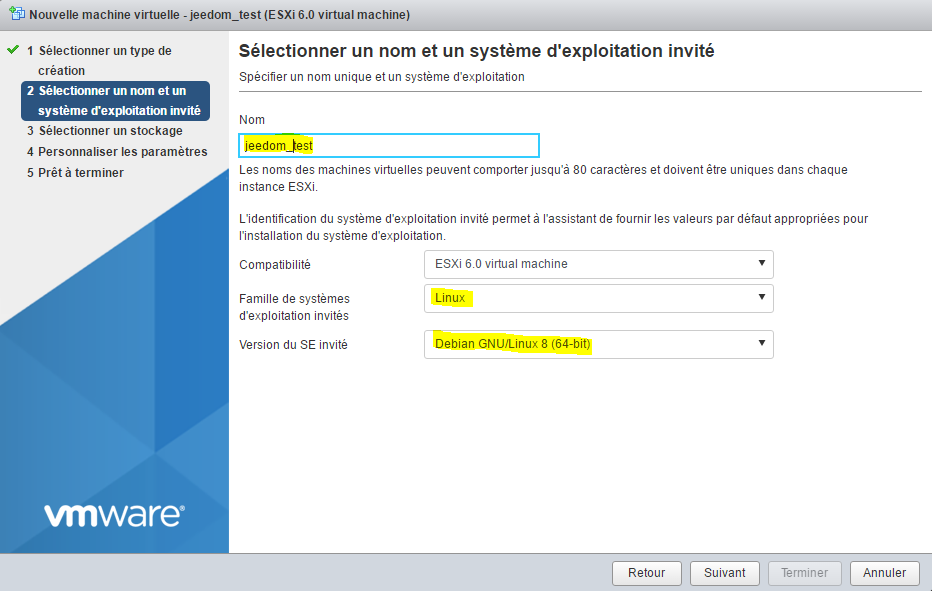

Specify the target datastore:

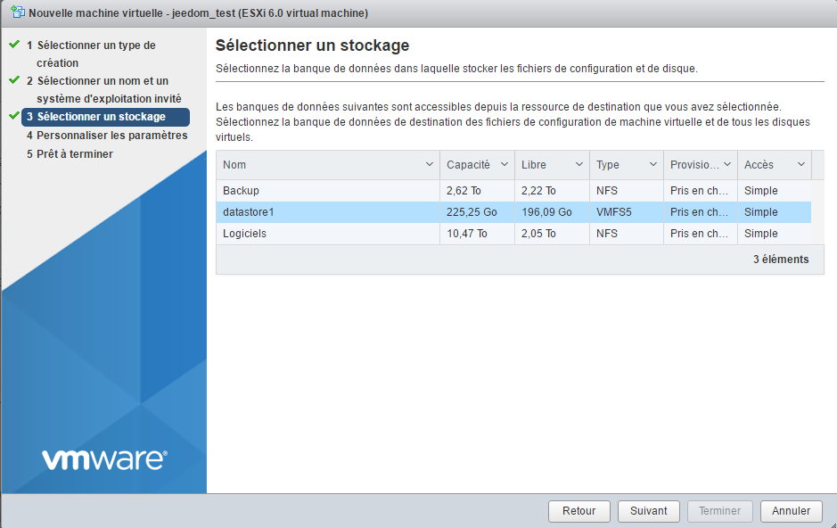

Here you can configure your machine's settings (hard drive, CPU, memory, etc.):

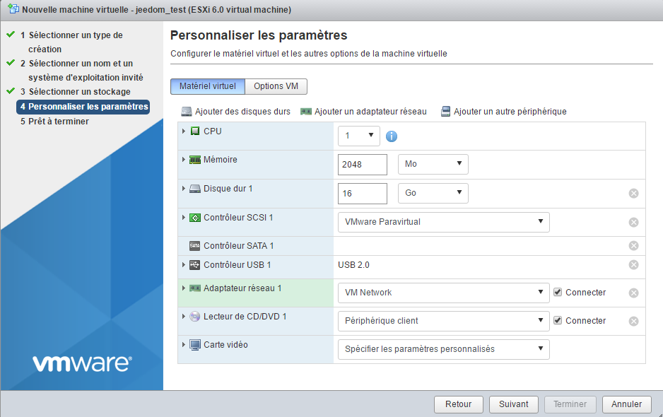

> **Note**
>
> All of these settings can be changed later without any issues. Note, however, that it’s not truly possible to reduce the size of a hard drive; you can increase it (but you’ll need to manage that at the OS level afterward), but not decrease it.

In the CD/DVD drive, select "Database ISO File":

Next, select the location where your ISO file is stored (see the previous section) and confirm:

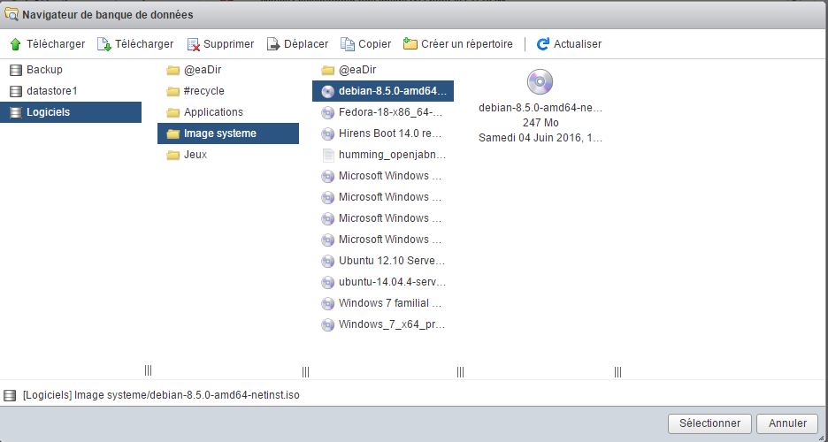

Next, do the following:

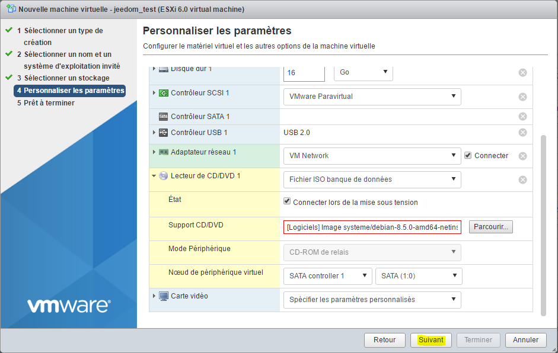

You will then see a summary of your configuration; click "Finish":

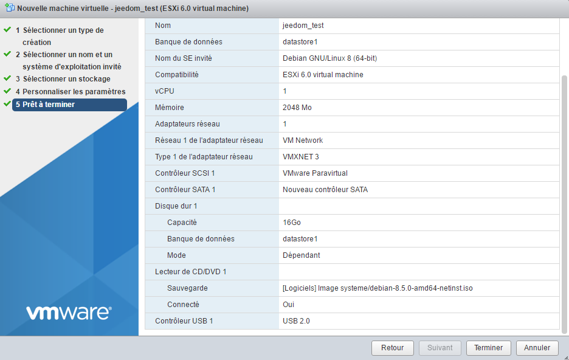

A message at the top will let you know that everything is set; then click on "Virtual Machines":

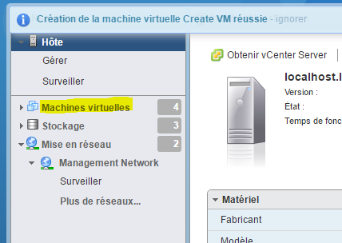

You should see your virtual machine (if not, click "Refresh"); click on it:

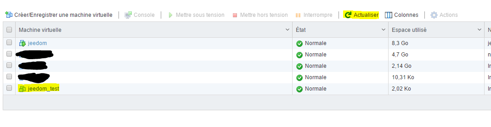

You should see a page of this type; click the play button:

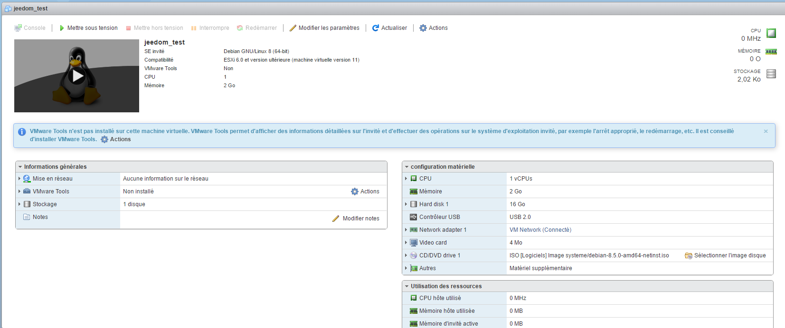

Your machine will start up, and you'll be able to install your operating system:

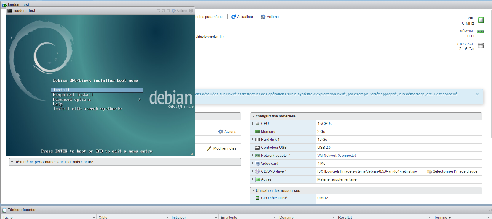

> **Important**
>
> Once your machine is installed, you MUST install the VMware Tools (this allows VMware to access information about your VM and shut it down properly). On Debian, simply run "sudo apt-get -y install open-vm-tools".

For the rest of the installation, please read this [tutorial](debian.installation)

# Mount USB devices in the VM

> **Note**
>
> If you don't see the options below, you need to update the ESXi Embedded Host Client. All the information [here](vmware.trucs_et_astuces)

This is a fairly rare need, but I had to use it for Jeedom. In fact, I have Z-Wave, RFXcom, Edisio, enOcean, and GSM devices connected to my ESXi server, and I needed to link them to my Jeedom VM in order to use them.

> **Note**
>
> For Z-Wave, RFXcom, Edisio, and enOcean, there are no issues; for GSM dongles, you'll need to follow these [tutorial](gsm.huawei_mode_modem) First, force the key to modem-only mode; otherwise, it won't be recognized properly on ESXi.

Go to your VM and click "Edit Settings":

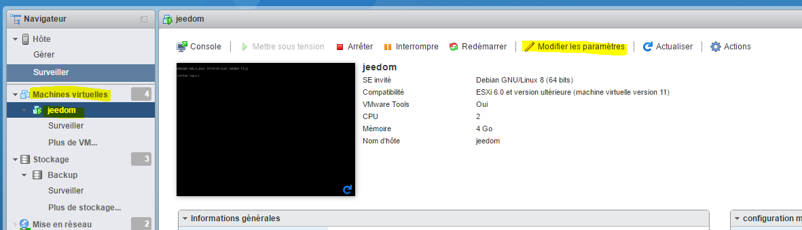

Click "Add Another Device," then select USB controller:

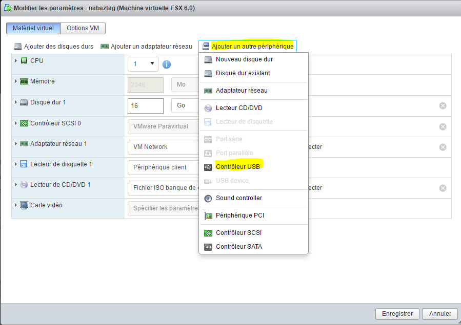

> **Note**
>
> The following step must be repeated for each USB device you want to connect

Save, go back to "Edit Settings," then select "Add Another Device" and "USB Device":

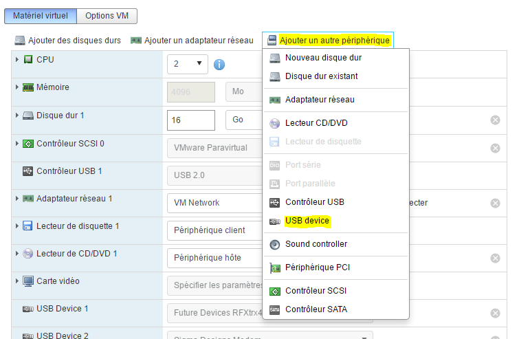

Select your USB device from the drop-down list:

There you go—your device is now connected to your VM. Every time you reboot, it will automatically reconnect to the VM, and if you physically disconnect or reconnect it, it will reconnect to your VM. In other words, using it is now completely seamless.
