# VMware Tips and Tricks

This isn't really a true how-to guide, but more of a collection of tips and tricks for VMware

# Add your license

Once you're logged in to the web interface ``IP_ESXI/ui`` Go to "Manage":

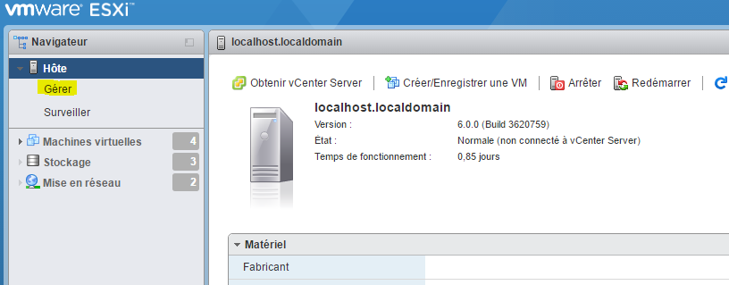

Then go to "License Assignment" and click "Assign a License"

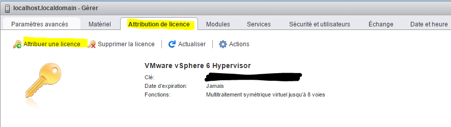

And enter your license key

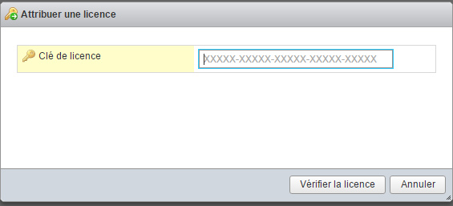

> **Note**
>
> Just a reminder: if you don't do this, your ESXi may stop working after 60 days

# Setting up an NFS datastore with a Synology

Here, we’ll look at how to set up an NFS share from a Synology device on VMware. This allows you, for example, to store virtual machines on the Synology device (which may have more storage space than the ESXi host) or to back up the virtual machines to the Synology device.

## Synology Setup

Go to the Control Panel, then "File Services," and check the "Enable NFS" box:

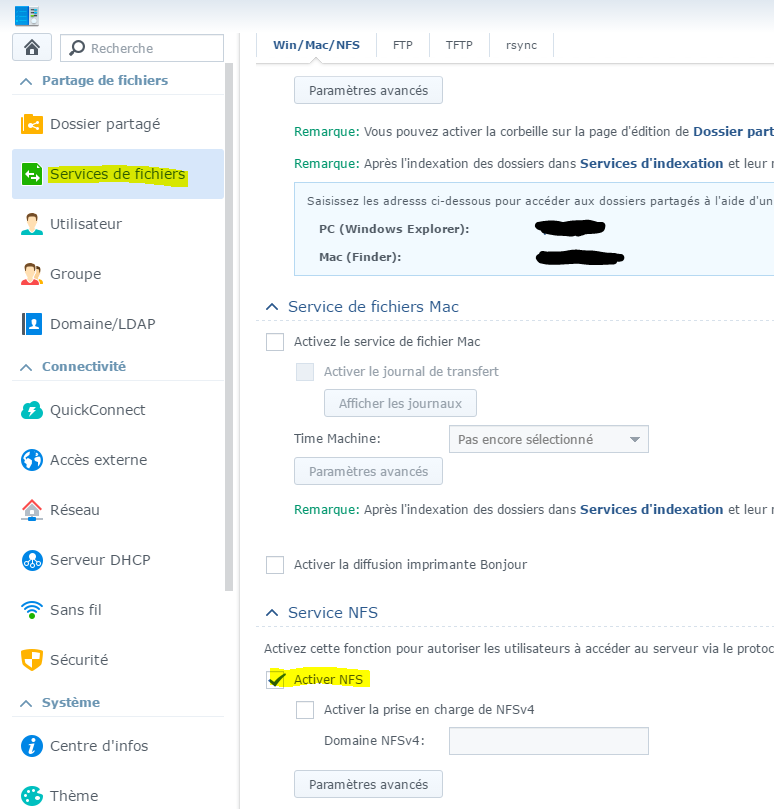

Next, click on "Shared Folder," then select the folder you want to share (in this case, "Backup"), click "Edit," then "NFS Permissions," and finally "Create" (in this case, I already have one; your list should be empty):

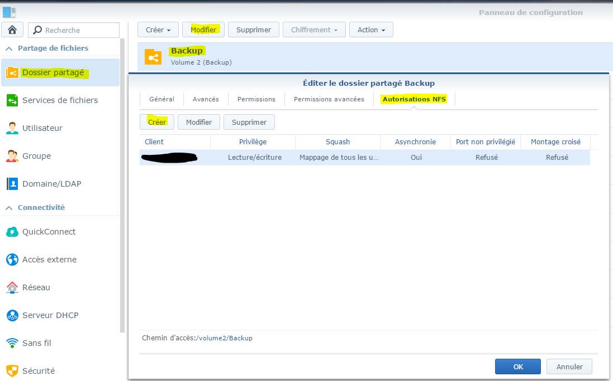

Next, enter the IP address of your ESXi, and under "Squash," select "Map all users to admin," then click OK:

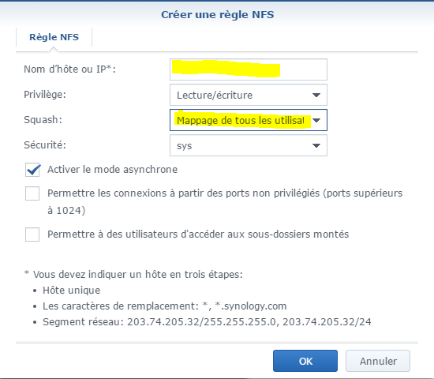

Next, you need to retrieve the path to the share (here ``/volume2/Backup``) :

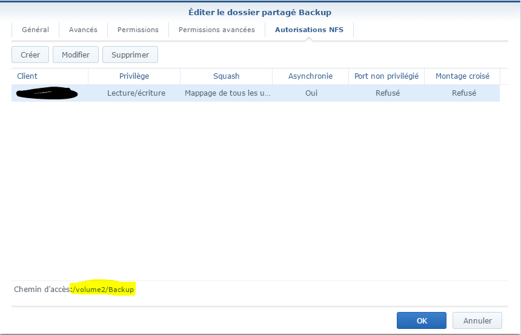

That's it for Synology—now we're moving on to ESXi

## ESXi Configuration

Go to "Storage":

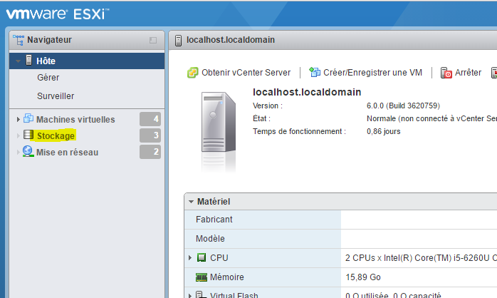

Then click on "New database":

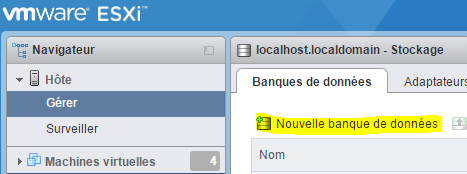

Here, select "Mount an NFS database" and then do the following:

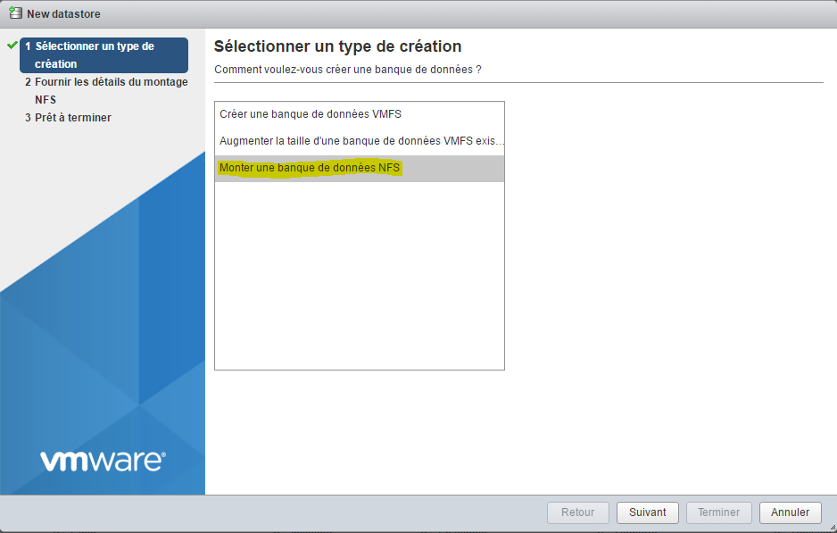

Enter the name of the datastore you want to create (be sure to avoid spaces and special characters), enter the IP address of your Synology device, enter the path to the share (see above), and finally click OK:

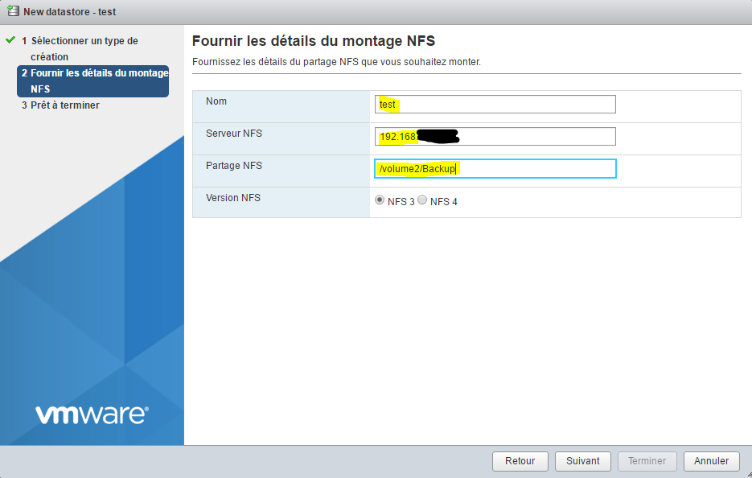

Click "Finish":

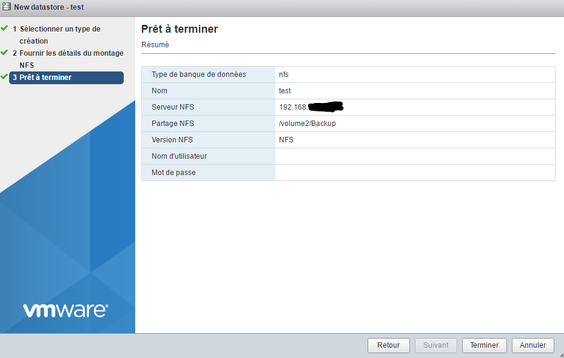

And there you go—your new datastore should appear (if not, click "Refresh").

# Add the Synology VAAI plugin for NFS mounting

Adding this plugin enables hardware acceleration on NFS mounts (for an explanation, see [here](http://www.virtual-sddc.ovh/exploiter-les-vaai-nfs-avec-un-nas-synology/))

To see if you have it, you need to log in using the desktop client (I couldn't find this information on the web client) and go to Settings → Storage:

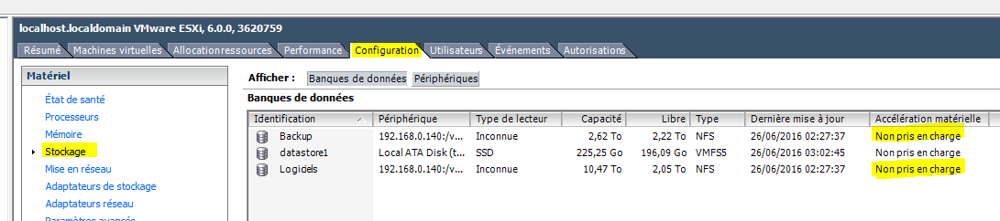

Setup is fairly simple. First, you need to enable the SSH service on the ESXi (in the web interface, go to Action ⇒ Services ⇒ Enable Secure Shell), then connect to it via SSH (the login credentials are the same as those used to access the interface). Next, simply do the following:

``esxcli software vib install -v https://global.download.synology.com/download/Tools/NFSVAAIPlugin/1.0-0001/VMware_ESXi/esx-nfsplugin.vib -f``

You must have:

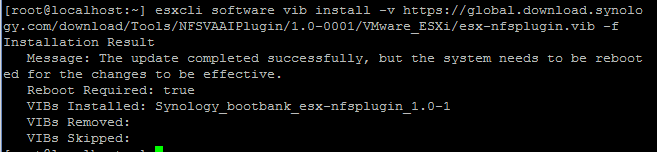

Next, you need to restart the ESXi. To verify that everything is working properly, go back to the thick client and navigate to Configuration → Storage:

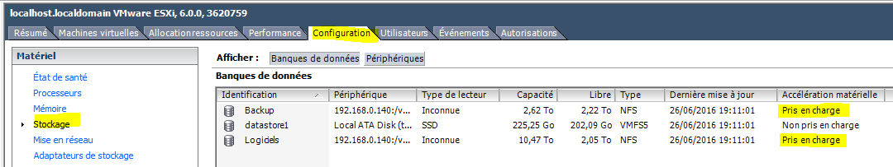

# Install/Update the ESXi Embedded Host Client

ESXi Embedded Host Client is an HTML5 web interface for ESXi that eliminates the need for the full-featured client in 95% of cases. It is included by default in version 6.0 Update 2, but if you are using version 1.0, it is strongly recommended that you update it.

You'll find all the information
[here](https://labs.vmware.com/flings/esxi-embedded-host-client)

To see if you have access to the web interface, simply go to the following URL in your browser: ``IP_ESXI/ui`` If you don't have it installed, you'll need to install it. First, connect to the ESXi via SSH, then run the following command:

``esxcli software vib install -v http://download3.vmware.com/software/vmw-tools/esxui/esxui-signed-latest.vib``

If you already have it, to update it, do the following:

``esxcli software vib update -v http://download3.vmware.com/software/vmw-tools/esxui/esxui-signed-latest.vib``

# Installing the thick client

This section is optional if you don't need to manage USB.

Using your web browser, go to the ESXi's IP address and then click the link ``Download vSphere Client for Windows`` :

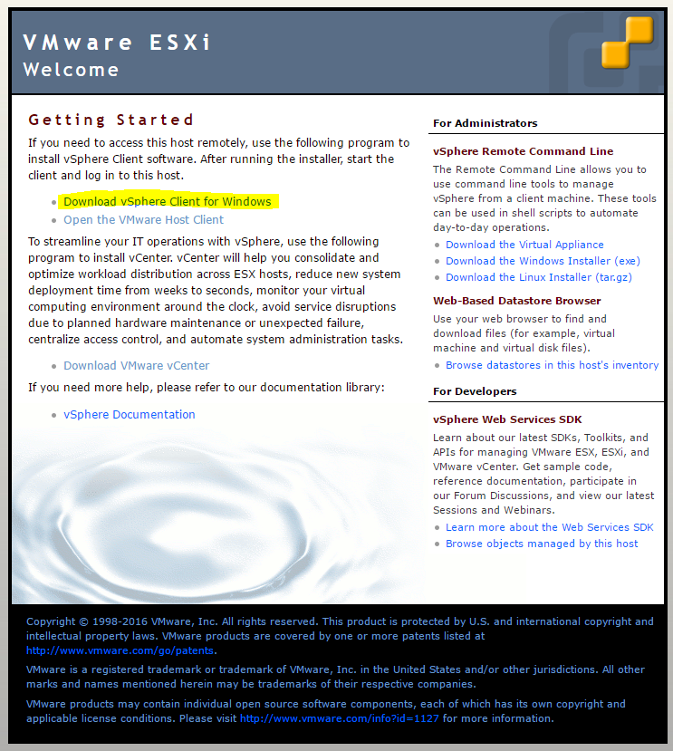

Once downloaded, simply start the installation (I’m skipping this part on purpose since all you have to do is click “OK” through the prompts).

Next, launch VMware vSphere Client. You should see:

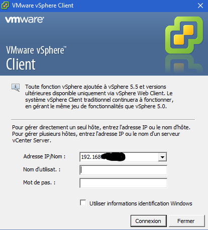

Just enter your ESXi's IP address, username, and password, and you'll be logged in:

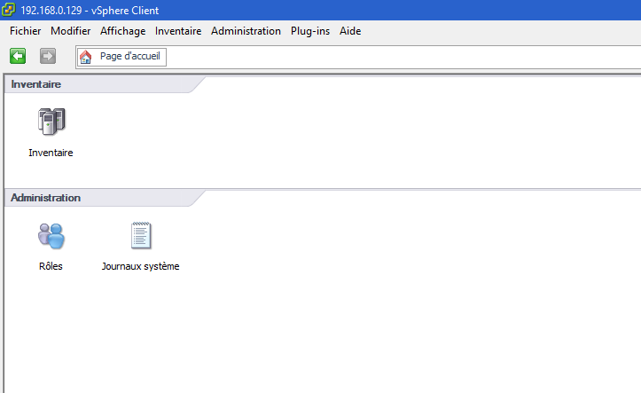

# ESXi Update

The process is pretty easy. First, you need to download the patch by going to [here](https://my.vmware.com/group/vmware/patch#search) (You'll likely need to log in with your VMware account). On the list ``Select a Product`` set ``ESXi (Embedded and Installable)``, on the other hand, keep the latest version of VMware and do the following ``Search``. Then download the desired patch (usually the latest one). The build number (the first number, not the one starting with "KB") tells you the patch version, which you can compare with your build number.

Next, transfer the ZIP file to one of your datastores and run the following command:

``esxcli software vib update -d /vmfs/volumes/576c8ab3-fdf64d2f-091b-b8aeedeb87fb/ESXi600-201605001.zip``

> **Note**
>
> Be sure to replace the path and the ZIP file name according to your configuration

> **Important**
>
> Make sure to enter the full path to the ZIP file; otherwise, it won't work.

The command above only updates the VIBs that need updating, but you can force the installation of all VIBs in the package (so be careful—this may result in a downgrade) by running:

``esxcli software vib install -d /vmfs/volumes/576c8ab3-fdf64d2f-091b-b8aeedeb87fb/ESXi600-201605001.zip``

# NTP Configuration

By default, ESXi does not use NTP, which means it is not set to the correct time and the VMs are not set to the correct time either. Fixing this is very simple. From the web interface, go to Manage → System → Date and Time, then click "Edit Settings":

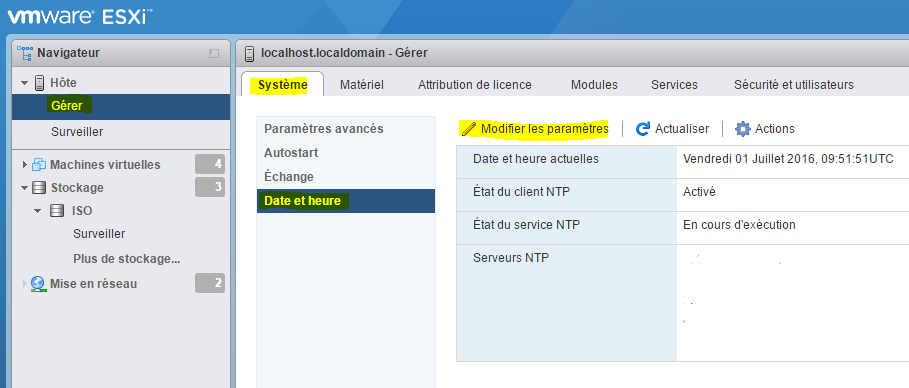

And in the "NTP Server" field, enter: ``0.debian.pool.n, 1.debian.pool.n, 2.debian.pool.n, 3.debian.pool.n, time.nist.gov``

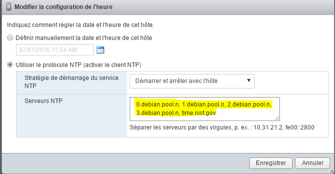

Next, under Actions → NTP Service → Strategy, click "Start and stop with the host":

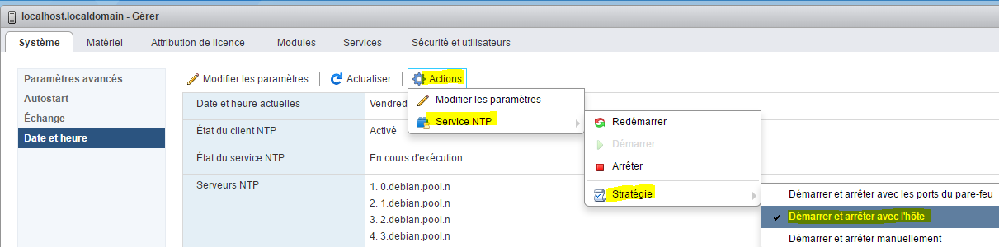

Still in Actions → NTP Service, click "Start"

There you go—your ESXi should now set the correct time on its own.

# External Access to ESXi

To access ESXi from outside your network, you need to:

-   Open port 443 to port 443 on the ESXi server
-   Open port 902 to port 902 on the ESXi server

And that's it. Here's a quick tip: if you have a Synology NAS, you can do the following (be sure to follow these steps carefully):

-   Open port 443 to port 5001 on the Synology NAS
-   Open port 80 to port 80 on the NAS (only needed to generate Let’s Encrypt certificates)
-   Open port 902 to port 902 on the ESXi server

Next, on the NAS, go to the Control Panel, then Application Portal and Reverse Proxy (note: DSM 6 is required):

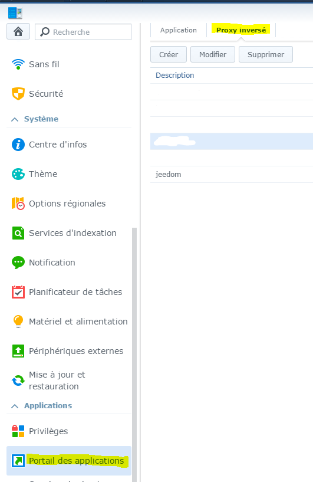

Click "Create" and enter:

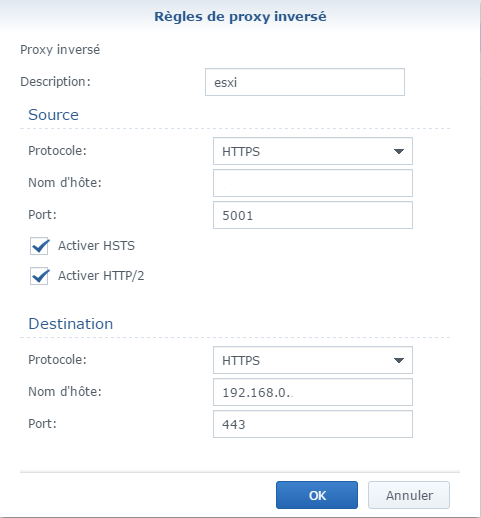

In "Host Name" (under Source), enter the desired DNS (for example, monesxi.mondsn.synology.me), and in "Host Name" (under Destination), enter the ESXi IP address

> **Note**
>
> You can also do the same thing to access Jeedom, but this time enter Jeedom's IP address (the VM's IP address if you're using virtualization) and port 80.

> **Note**
>
> Once you’ve done that and if your DNS is correctly pointing to the NAS, you can generate a valid SSL certificate for free with Let’s Encrypt by going to Security ⇒ Certificate and clicking Add. Then, don’t forget to click Configure to assign it to your reverse proxy.

Next, to access your ESXi, simply open your browser, go to your DNS or external IP address, add /ui at the end, and you're all set.

> **Important**
>
> If you go through the NAS's reverse proxy, the VMs' web-based console won't work in the mode (because it uses WebSockets); however, if you use VMware Remote Console, everything should work fine (it uses port 902).

> **Note**
>
> There is also a VMware Watchlist app for Android that provides access to ESXi as well as the VM consoles

# SSL Certificate

You can import VMware certificates directly onto your PC to stop the alert from appearing.

In order, you need to:

-   Have a URL (DNS) to access your ESXi; here, we'll use ``esxi1.lan``
-   Configure the name of your ESXi server. Connect to it via SSH and run the following command: ``esxcli system hostname set --host=esxi1``
-   Configure the FQDN: ``esxcli system hostname set --fqdn=esxi1.lan``
-   Retrieve the ESXi root certificate; it is located in ``/etc/vmware/ssl/castore.pem``

Right-click on the entry, then install the certificate and place it in "Trusted Root Certification Authorities."
