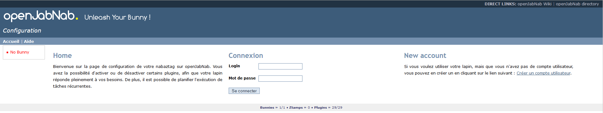
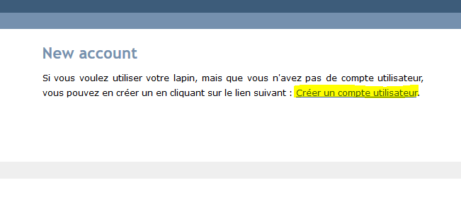
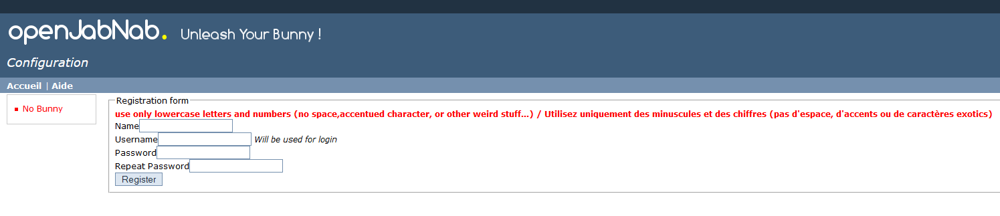
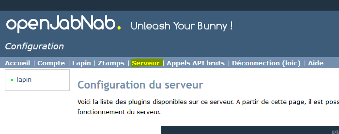
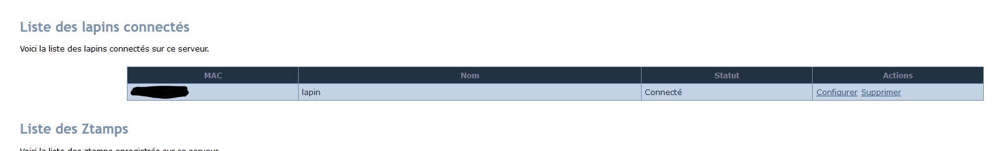
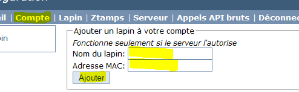
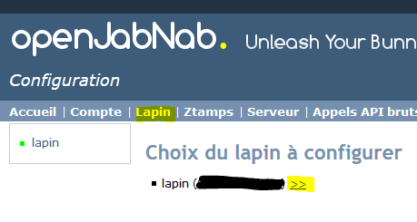
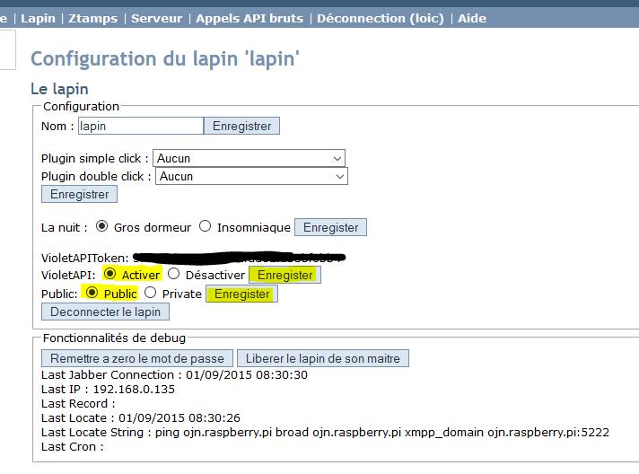
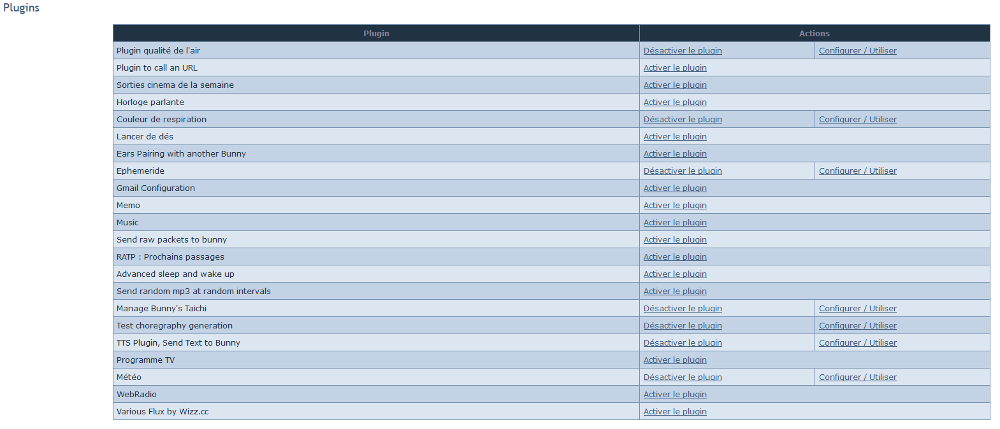
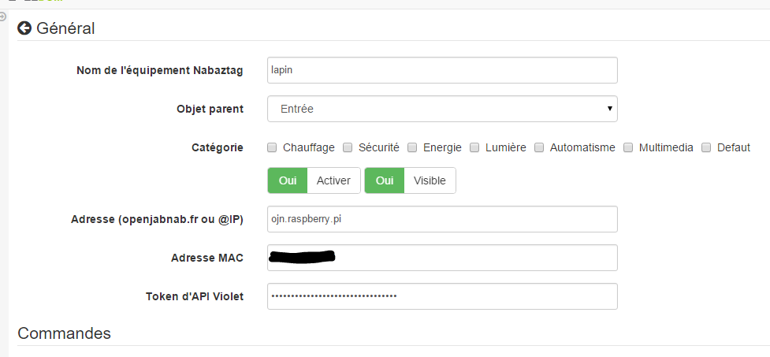

# Instalación de OpenJabNab

Aquí tienes un tutorial sobre cómo instalar OpenJabnab de forma local (en una RPi o un Humming).

> **Nota**
>
> Este tutorial se inspira en gran medida en [este](http://jetweb.free.fr/nabaztag_rpi/Tutoriel_OJN_RPi_v1-1.pdf)

# Instalación de los edificios anexos

Una vez instalado el sistema, en SSH, ejecuta:

````
apt-get update
apt-get dist-upgrade
apt-get install ssh
apt-get install apache2 php5 php5-mysql libapache2-mod-php5
a2enmod rewrite
apt-get install make
apt-get install build-essential
apt-get install libqt4-dev --fix-missing
apt-get install qt4-dev-tools
apt-get install bind9
apt-get install git
````

# Configuración de la red

A continuación, hay que obtener la dirección IP del sistema:

``ifconfig``

El resultado es:

````
eth0      Link encap:Ethernet  HWaddr d0:63:b4:00:54:98
          inet addr:192.168.0.162  Bcast:192.168.0.255  Mask:255.255.255.0
          inet6 addr: fe80::d263:b4ff:fe00:5498/64 Scope:Link
          UP BROADCAST RUNNING MULTICAST  MTU:1500  Metric:1
          RX packets:10721 errors:0 dropped:0 overruns:0 frame:0
          TX packets:6477 errors:0 dropped:0 overruns:0 carrier:0
          collisions:0 txqueuelen:1000
          RX bytes:2032942 (1.9 MiB)  TX bytes:1230703 (1.1 MiB)
````

En este caso, la dirección IP es 192.168.0.162.

> **Nota**
>
> En el resto del tutorial utilizaré esta dirección IP, que, por supuesto, deberás sustituir por la que tengas realmente.

A continuación, edita el archivo ``/etc/resolv.conf``

``vim  /etc/resolv.conf``

Y añade:

``nameserver 192.168.0.162``

# Configuración del DNS

Edita el archivo ``/etc/bind/named.conf.local``

````
cd /etc/bind/
vim named.conf.local
````

Y añade:

````
zone "raspberry.pi"{
 type master;
 file "/etc/bind/db.raspberry.pi";
};
zone "0.168.192.in-addr.arpa"{
 type master;
 file "/etc/bind/db.192.168.0.inv";
};
````

Crea el archivo ``db.raspberry.pi``

``vim db.raspberry.pi ---``

E introduce lo siguiente:

````
$TTL 604800
@ IN SOA ojn.raspberry.pi. root.raspberry.pi. (
 1 ; Serial
 604800 ; Refresh
 86400 ; Retry
 2419200 ; Expire
 604800 ) ; Negative Cache TTL
;
@ IN NS ojn.raspberry.pi.
ojn IN A 192.168.0.162
192.168.0.162 IN A 192.168.0.162
````

A continuación, crea este archivo ``db.192.168.0.inv``

``vim db.192.168.0.inv``

Y escribe:

````
$TTL 604800
@ IN SOA ojn.raspberry.pi. root.localhost. (
 2 ; Serial
 604800 ; Refresh
 86400 ; Retry
 2419200 ; Expire
 604800 ) ; Negative Cache TTL
;
@ IN NS ojn.raspberry.pi.
162 IN PTR ojn.raspberry.pi.
````

> **Importante**
>
> No olvides sustituir el 162 de la última línea por la última parte de la dirección IP de tu sistema

Iniciar el DNS:

``/etc/init.d/bind9 start``

Comprueba si funciona:

``ping ojn.raspberry.pi``

Deberías tener:

````
root@cubox-i:/home/ojn# ping ojn.raspberry.pi
PING ojn.raspberry.pi (192.168.0.162) 56(84) bytes of data.
64 bytes from ojn.raspberry.pi (192.168.0.162): icmp_seq=1 ttl=64 time=0.069 ms
64 bytes from ojn.raspberry.pi (192.168.0.162): icmp_seq=2 ttl=64 time=0.067 ms
64 bytes from ojn.raspberry.pi (192.168.0.162): icmp_seq=3 ttl=64 time=0.059 ms
64 bytes from ojn.raspberry.pi (192.168.0.162): icmp_seq=4 ttl=64 time=0.068 ms
^C
--- ojn.raspberry.pi ping statistics ---
4 packets transmitted, 4 received, 0% packet loss, time 3000ms
rtt min/avg/max/mdev = 0.059/0.065/0.069/0.010 ms
````

> **Nota**
>
> Hay que pulsar Ctrl+C para salir del ping

Por seguridad, también vamos a añadir la resolución en /etc/hosts. Haz lo siguiente:

``vim /etc/hosts``

Y añade:

``192.168.0.162 ojn.raspberry.pi``

# Recuperación de openjabnab

Primero vamos a crear el usuario:

````
adduser ojn
cd /home/ojn
````

A continuación, clona openjabnab:

````
git clone https://github.com/OpenJabNab/OpenJabNab.git
chown -R ojn:ojn /home/ojn/OpenJabNab/
chmod 0777 /home/ojn/OpenJabNab/http-wrapper/ojn_admin/include
````

# Configuración del servidor web

Haz lo siguiente:

````
cd /etc/apache2/sites-available/
vim ojn.conf
````

Y añade:

````
<VirtualHost *:80>
        DocumentRoot /home/ojn/OpenJabNab/http-wrapper/
        ServerName ojn.raspberry.pi
         <Directory />
                 Options FollowSymLinks
                AllowOverride None
         </Directory>
         <Directory /home/ojn/OpenJabNab/http-wrapper/>
                 Options Indexes FollowSymLinks MultiViews
                 AllowOverride all
                Order allow,deny
                 allow from all
         </Directory>
</VirtualHost>
````

A continuación, activa la página web:

``a2ensite ojn``

A continuación, hay que autorizar el directorio del servidor openjabnab. Haz lo siguiente:

``vim /etc/apache2/apache2.conf``

Y añade:

````
<Directory /home/ojn/>
        Options Indexes FollowSymLinks
        AllowOverride None
        Require all granted
</Directory>
````

A continuación, reiniciamos Apache:

``service apache2 reload``

# Instalación de openjabnab

Haz lo siguiente:

````
su ojn
cd /home/ojn/OpenJabNab/server
qmake -r
make
````

> **Nota**
>
> Este paso puede tardar bastante (hasta 45 minutos)

# Configuración de openjabnab

Haz lo siguiente:

````
cp openjabnab.ini-dist bin/openjabnab.ini
vim bin/openjabnab.ini
````

Y cambia las siguientes líneas:

````
StandAloneAuthBypass = true
AllowAnonymousRegistration = true
AllowUserManageBunny = true
AllowUserManageZtamp = true
````

Y sustituye todos los *my.domain.com* por *ojn.raspberry.pi*

# Configuración del servidor web OpenJabnab

En tu publicación debes editar el archivo ``C:\Windows\System32\drivers\etc`` y añadir:

``192.168.0.162 ojn.raspberry.pi``

A continuación, ve a:

``http://ojn.raspberry.pi/ojn_admin/install.php``

Confirma todo

# Inicio del servidor

Ya está todo listo, solo queda iniciar el servidor:

````
su ojn
cd ~/OpenJabNab/server/bin
./openjabnab
````

Ahora ve a:

``http://ojn.raspberry.pi/ojn_admin/index.php``

> **Nota**
>
> Si todo va bien, deberías ver las estadísticas que aparecen en la parte inferior

# Configuración del «lapin»

Configurar el conejito es bastante sencillo: hay que desenchufarlo y, al volver a enchufarlo, mantener pulsado su botón. Normalmente, debería encenderse en azul.

A continuación, en tu ordenador deberías ver una nueva red wifi llamada «nabaztagXX»; conéctate a ella introduciendo 192.168.0.1.

Una vez allí, introduce tu configuración de wifi y los siguientes datos:

````
DHCP enabled : no
Local Mask : 255.255.255.0
Local gateway : 192.168.0.1 ou 192.168.0.254 (en fonction de votre réseau)
DNS server : 192.168.0.162
````

# Supervisión del servidor openjabnab e inicio automático

Como habrás observado, si cierras sesión, el servidor openjabnab se detiene. Por lo tanto, hay que añadir un pequeño script para supervisar el servidor y arrancarlo automáticamente. Haz lo siguiente:

````
cd /home/ojn
vim checkojn.sh
````

Y añade lo siguiente:

````
if [ $(ps ax | grep openjabnab | grep -v grep | wc -l) -eq 0 ]; then
    su ojn; cd /home/ojn/OpenJabNab/server/bin;nohup ./openjabnab >> /dev/null 2>&1 &
fi
````

A continuación, haz lo siguiente:

``chmod +x checkojn.sh``

Ahora hay que añadir el script al inicio del sistema y una comprobación cada 15 minutos, por ejemplo:

``crontab -e``

Y añade:

````
@reboot /home/ojn/checkojn.sh
*/15 * * * * /home/ojn/checkojn.sh
````

> **Importante**
>
> Es imprescindible añadirlo al crontab de root; si todavía estás con el usuario ojn, pulsa Ctrl+D.

# Configuración de tu «lapin» en OpenJabNab

Ve a:

``http://ojn.raspberry.pi/ojn_admin/index.php``

Debes tener:



Ahora tienes que crear una cuenta haciendo clic en «Crear usuario»:



Introduce los datos solicitados e inicia sesión:



Una vez conectado, ve al servidor:



A continuación, desplázate hacia abajo para ver la lista de dispositivos «lapins» conectados y obtener su dirección MAC:



A continuación, ve a «Cuenta» y rellena los campos «Nombre» y «Dirección MAC del conejo» y, a continuación, confirma:



Ahora encontrarás a tu conejito en la página «lapin»; haz clic en él para abrir su configuración:



Ahora tienes que activar la API de Violet y configurarla como pública; aquí también encontrarás la clave de la API de Violet que necesitarás para Jeedom:



A continuación encontrarás la lista de complementos; no olvides activarlos (como TTS o el control de los oídos):



# Configuración de Jeedom

La configuración en Jeedom es bastante sencilla: primero hay que conectarse por SSH a Jeedom (si tienes un dispositivo Jeedom, los datos de acceso se encuentran en la documentación de instalación). A continuación, edita el archivo /etc/hosts

``vim /etc/hosts``

Y añade la siguiente línea:

``192.168.0.162 ojn.raspberry.pi``

A continuación, todo se gestiona en Jeedom. Una vez creado tu «conejo», esta es la configuración que debes aplicar:



¡¡¡¡Ya tienes a tu conejito con su propia madriguera aquí mismo!!!!!

# Configurar el TTS de forma local

Todo es local, excepto el TTS, que pasa por la página web de Acapela, pero es posible, modificando algunos archivos, hacerlo de forma local.

> **Nota**
>
> Voy a dar por hecho que OpenJabNab está instalado en /home/ojn/OpenJabNab y que has iniciado sesión como el usuario de OpenJabNab, en este caso «ojn».

## Creación del TTS de Jeedom

Tienes que crear una carpeta «jeedom» en «servver/tts»:

``mkdir /home/ojn/OpenJabNab/server/tts/jeedom``

A continuación, hay que crear tres archivos:

-   ``jeedom.pro``

````
######################################################################
# Automatically generated by qmake (2.01a) sam. janv. 19 19:10:01 2008
######################################################################

TEMPLATE = lib
CONFIG -= debug
CONFIG += plugin qt release
QT += network xml
QT -= gui
INCLUDEPATH += . ../../server ../../lib
TARGET = tts_jeedom
DESTDIR = ../../bin/tts
DEPENDPATH += . ../../server ../../lib
LIBS += -L../../bin/ -lcommon
MOC_DIR = ./tmp/moc
OBJECTS_DIR = ./tmp/obj
win32 {
  QMAKE_CXXFLAGS_WARN_ON += -WX
}
unix {
  QMAKE_LFLAGS += -Wl,-rpath,\'\$$ORIGIN\'
  QMAKE_CXXFLAGS += -Werror
}

# Input
HEADERS += tts_jeedom.h
SOURCES += tts_jeedom.cpp
````

-   ``tts\jeedom.h``

````
#ifndef _TTSACAPELA_H_
#define _TTSACAPELA_H_

#include <QHttp>
#include <QMultiMap>
#include <QTextStream>
#include <QThread>
#include "ttsinterface.h"

class TTSJeedom : public TTSInterface
{
  Q_OBJECT
  Q_INTERFACES(TTSInterface)

public:
  TTSJeedom();
  virtual ~TTSJeedom();
  QByteArray CreateNewSound(QString, QString, bool);

private:
};

#endif
````

-   ``tts\jeedom.cpp``

````
#include <QDateTime>
#include <QUrl>
#include <QCryptographicHash>
#include <QMapIterator>
#include "tts_jeedom.h"
#include "log.h"
#include <QNetworkReply>
#include <QNetworkRequest>
#include <QNetworkAccessManager>

Q_EXPORT_PLUGIN2(tts_jeedom, TTSJeedom)

TTSJeedom::TTSJeedom():TTSInterface("jeedom", "Jeedom")
{
  voiceList.insert("fr", "fr");
}

TTSJeedom::~TTSJeedom()
{
}

QByteArray TTSJeedom::CreateNewSound(QString text, QString voice, bool forceOverwrite)
{
  QEventLoop loop;
  if(!voiceList.contains(voice))
    voice = "fr";
  // Check (and create if needed) output folder
  QDir outputFolder = ttsFolder;
  if(!outputFolder.exists(voice))
    outputFolder.mkdir(voice);

  if(!outputFolder.cd(voice))
  {
    LogError(QString("Cant create TTS Folder : %1").arg(ttsFolder.absoluteFilePath(voice)));
    return QByteArray();
  }

  // Compute fileName
  QString fileName = QCryptographicHash::hash(text.toAscii(), QCryptographicHash::Md5).toHex().append(".mp3");
  QString filePath = outputFolder.absoluteFilePath(fileName);

  if(!forceOverwrite && QFile::exists(filePath))
    return ttsHTTPUrl.arg(voice, fileName).toAscii();

  // Fetch MP3
  QHttp http("TODO_IP_JEEDOM");
  QObject::connect(&http, SIGNAL(done(bool)), &loop, SLOT(quit()));

  QByteArray ContentData;
  ContentData += "apikey=TODO_API_JEEDOM&text="+QUrl::toPercentEncoding(text);

  QHttpRequestHeader Header;
  Header.addValue("Host", "TODO_IP_JEEDOM");

  Header.setContentLength(ContentData.length());
  Header.setRequest("GET", "/core/api/tts.php?apikey=TODO_API_JEEDOM&text="+QUrl::toPercentEncoding(text), 1, 1);

  http.request(Header, ContentData);
  loop.exec();

  QFile file(filePath);
  if (!file.open(QIODevice::WriteOnly))
  {
    LogError("Cannot open sound file for writing : "+filePath);
    return QByteArray();
  }
  file.write(http.readAll());
  file.close();
  return ttsHTTPUrl.arg(voice, fileName).toAscii();
}
````

> **Nota**
>
> No te olvides de sustituir los «TODO»

A continuación, hay que activar el TTS de Jeedom modificando el archivo ``/home/ojn/OpenJabNab/server/tts/tts.pro`` añadiendo Jeedom a ``SUBDIRS`` :

````
TEMPLATE = subdirs
SUBDIRS = acapela google jeedom
````

## Recompilación

````
cd /home/ojn/OpenJabNab/server
qmake -r
make
````

## Modificación del servicio de síntesis de voz

Hay que editar el archivo ``/home/ojn/OpenJabNab/server/bin/openjabnab.ini`` y cambiar ``TTS=acapela`` por ``TTS=jeedom``

## Relanzamiento de openjabnab

Lo más sencillo es reiniciar el equipo para volver a iniciar openjabnab
