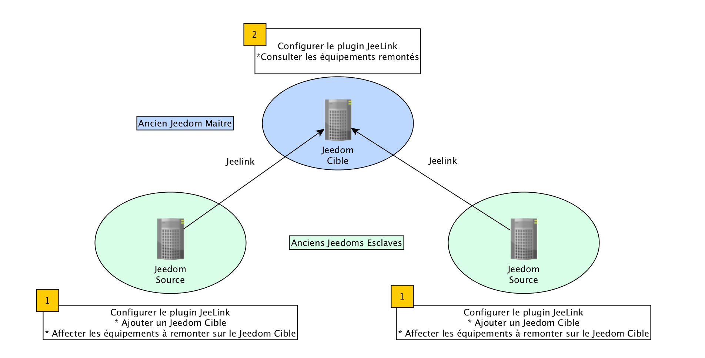
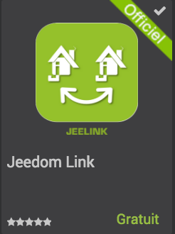
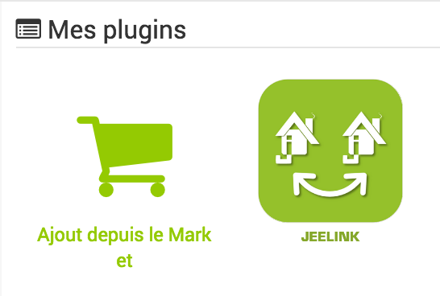
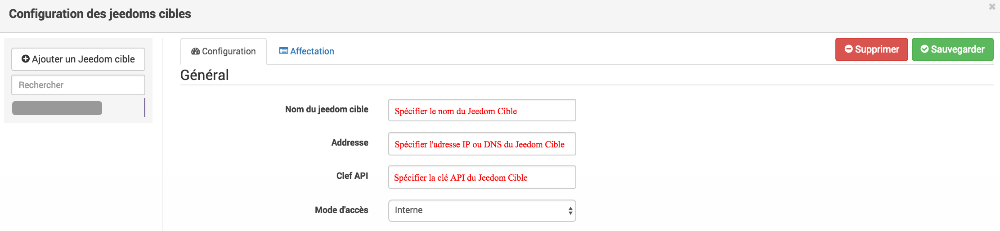
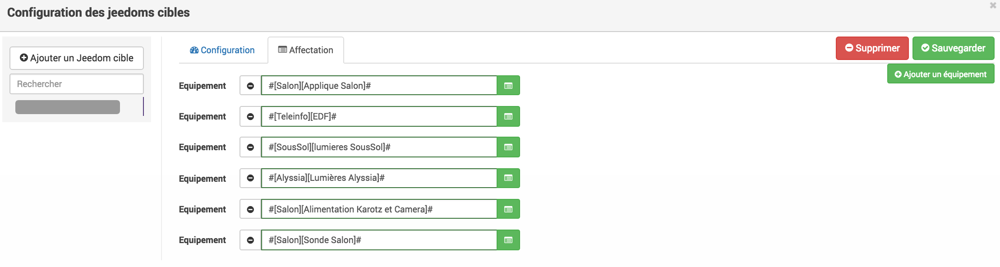
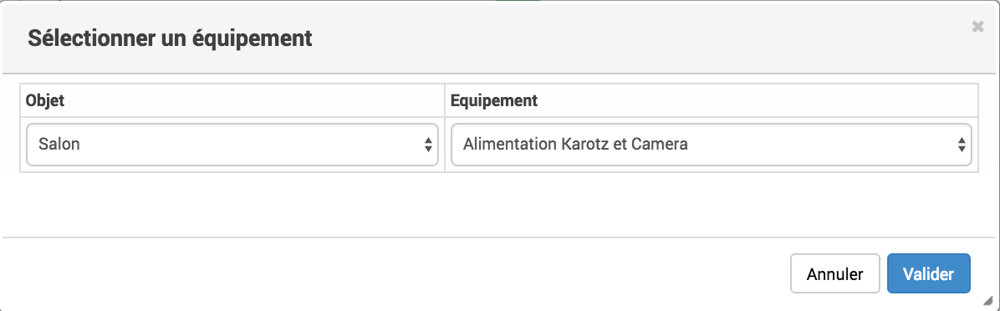
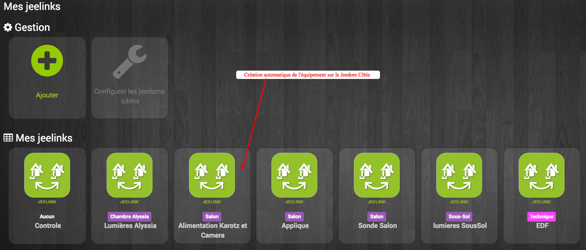
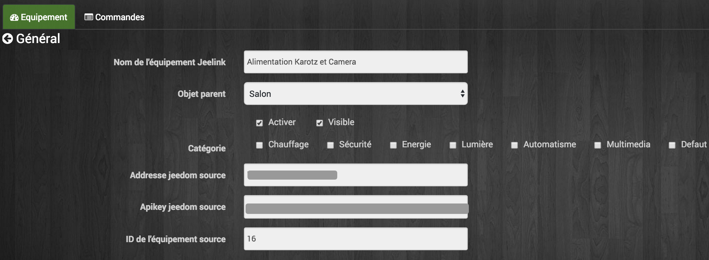
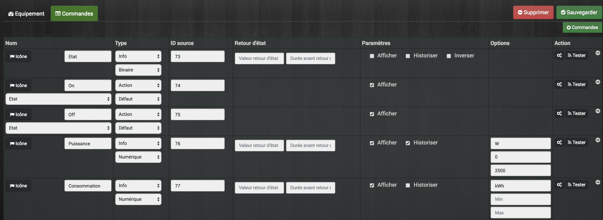

# Migración a Jeelink

Aquí veremos cómo migrar una instalación con Jeedom en modo esclavo a un Jeedom con el complemento «Jeedom Link». Dado que el modo esclavo de Jeedom se ha dejado de utilizar con la actualización a la versión 3.0, es necesario realizar primero la migración al nuevo modo de funcionamiento.

# Preparación previa a la migración

> **Advertencia**
>
> Es importante leer esta documentación en su totalidad antes de  iniciar la migración. La información relevante sobre  los requisitos previos para la actualización, la copia de seguridad y la recuperación  de datos es imprescindible para comprender correctamente  el proceso que se va a llevar a cabo. No leer esta documentación puede provocar daños en su instalación. Si hay algún punto que no entienda, ¡no dude en plantear sus preguntas en el foro antes de comenzar el procedimiento!

> **Importante**
>
> Ten mucho cuidado de no crear bucles de dispositivos al configurar el plugin «Jeedom Link». Por ejemplo, no conectes un dispositivo X en un Jeedom1 que se transmita a un Jeedom2 y luego vuelva de nuevo al Jeedom1. ¡Esto podría provocar que tus Jeedoms dejen de funcionar!

> **Nota**
>
> Para facilitar la lectura y la comprensión de este tutorial, a continuación se explican los términos utilizados:
>
> - **Jeedom de destino**: servidor (tu antiguo Jeedom maestro) que centraliza los dispositivos del **Jeedom o Jeedoms de origen**. Las capturas de pantalla con fondo negro corresponden al **Jeedom de destino**.
>
> - **Jeedom Fuente**: servidor (tu(s) antiguo(s) esclavo(s) de Jeedom) que transmite los datos de tus dispositivos al **Jeedom Destino**.
>
> - Los conceptos de **Jeedom maestro** y **Jeedom esclavo** ya no están vigentes. El nuevo modo de funcionamiento de la sincronización de dispositivos entre varios Jeedoms puede ser bidireccional. Un servidor Jeedom puede ser ahora tanto **Fuente** como **Destino**, mientras que el modo anterior solo permitía la transmisión de datos de los dispositivos del **Esclavo** al **Maestro**. Con el nuevo modo, también es posible tener varios **Jeedom Destino** para un mismo **Jeedom Fuente**. La comunicación entre los Jeedoms ahora también puede realizarse a distancia a través de Internet (DNS de Jeedom u otro).

## Actualizaciones y comprobación de la configuración

-   Actualiza el **Jeedom Maître** a la última versión (aunque no se te ofrezca ninguna actualización).
-   Actualiza los complementos de **Jeedom Maître** a las últimas versiones disponibles.
-   Comprueba en la página «Salud» que la configuración de red interna del **Jeedom Maestro** sea correcta (y la externa si tus **Jeedoms Fuente** van a estar en una ubicación remota).

## Recopilación de información útil

En función de los complementos instalados en tu **Jeedom Esclave**, es necesario recopilar la siguiente información:

### Complemento Z-Wave

-   En la página «Salud» del complemento Z-Wave del **Jeedom Maestro**, selecciona tu **Esclavo** en el menú desplegable y haz una captura de pantalla, para disponer así de una lista de los dispositivos que provienen de él.
-   Anota para cada dispositivo procedente de **l’Esclave**: el objeto principal, el nombre, el ID (Node) y el modelo.
-   Recupera el archivo Zwcfg: *Plugins ⇒ Gestión de plugins ⇒ Z-wave*. Haz clic en el botón rojo *Zwcfg* y copia el contenido en un archivo de texto en tu ordenador.

### Complemento RFXcom

-   Anota para cada dispositivo procedente de **l’Esclave**: el objeto principal, el nombre, el ID (lógico), el tipo y el modelo.

> **Nota**
>
> Hay disponible una ficha no exhaustiva con la información que hay que tener en cuenta para la migración [aquí](../images/MemoMigration.xls)

## Copias de seguridad preventivas

-   Hacer una [copia de seguridad de Jeedom](/core/backup) de tu **Jeedom maestro** y de tu(s) **Jeedom esclavo(s)** y recuperarlas en tu PC/NAS…​.
-   Hacer una [copia de seguridad en tarjeta SD/disco duro](/howto/sauvegarde.comment_faire#_sauvegarde_restauration_de_la_carte_microsd) de tu **Jeedom maestro** y de tu(s) **Jeedom esclavo(s)** y guardarlas en tu PC/NAS…​.

# Migración

> **Nota**
>
> Por el momento, no elimines los antiguos dispositivos de **el Esclavo** en **el Maestro**.

## Instala y activa el complemento «Jeedom Link» en el **Jeedom de destino** (antiguo maestro).

En tu **Jeedom de destino**, *Plugins ⇒ Gestión de plugins*:

## Instalación de **Jeedom Source**

> **Nota**
>
> Si dispones de una Raspberry Pi adicional y de otra tarjeta SD, puedes realizar la migración protocolo por protocolo instalando un nuevo **Jeedom Source** en paralelo sin tener que tocar tu **Jeedom Esclave** actual. Por supuesto, irás trasladando los posibles controladores de uno a otro a medida que avances.

> **Advertencia**
>
> Si utilizas tu Raspberry Pi actual, asegúrate de haber seguido las instrucciones del capítulo sobre copias de seguridad de esta documentación.

> **Nota**
>
> Si utilizas la Raspberry Pi que ya tienes y que actualmente funciona como **esclavo de Jeedom**, te recomendamos que utilices una tarjeta SD/microSD nueva. Esto te permitirá volver atrás fácilmente si fuera necesario.

-   Instala un nuevo Jeedom en una nueva tarjeta SD (ya sea para incorporarlo a tu **Jeedom esclavo** actual o para una nueva Raspberry Pi) siguiendo las instrucciones de la [documentación de instalación](/installation).
-   Actualiza **Jeedom Source** a la última versión (aunque no se te ofrezca ninguna actualización).
-   Comprueba en la página «Salud» que la configuración de red interna (y externa, si es necesario) de **Jeedom Source** sea correcta.

## Configuración de Jeedom Source

-   Cambiar la contraseña del usuario «admin» o configurar un nuevo usuario.
-   Configura tu cuenta de Jeedom Market (*Configuración ⇒ Actualizaciones y archivos ⇒ pestaña «Market»*). Haz clic en «Probar» después de guardar para validar los datos de acceso a Jeedom Market.
-   Instalación y activación del complemento «Jeedom Link» en el nuevo **Jeedom Source**.

-   Instalación y activación de los complementos que desees utilizar. (Se recomienda hacerlo uno por uno, comprobando cada vez que las dependencias y los posibles servicios estén correctos).
-   Recrea la estructura de objetos (solo aquellos que te vayan a ser útiles) del **Jeedom de destino** (antiguo maestro) en tu nuevo **Jeedom de origen** (antiguo esclavo).

## Configuración de los dispositivos en **Jeedom Source**

Para enviar un dispositivo presente en el **Jeedom de origen** al **Jeedom de destino** a través del complemento «Jeedom Link», es necesario que este último ya esté operativo en tu nuevo **Jeedom de origen**.

> **Nota**
>
> A medida que avances, piensa en desactivar el historial de comandos y la información de cada dispositivo que se encuentre en el **Jeedom de origen** para ahorrar espacio en su tarjeta SD (el historial se guardará en el **Jeedom de destino**).

> **Nota**
>
> También puedes ir asignando los dispositivos a los objetos recreados en el **Jeedom de origen** para que, más adelante, se asignen automáticamente al objeto correcto en el **Jeedom de destino** al declararlos en el plugin «Jeedom Link». En caso de que el nombre coincida con el de un dispositivo que ya esté presente entre los objetos de **Jeedom de destino**, el complemento añadirá «remote XXXX» al nombre del dispositivo.

### Complemento Z-Wave

-   Haz clic en el botón «Sincronizar» para recuperar los módulos asociados a tu controlador. (Estos se guardan en la memoria del mismo)
-   Sustituye el archivo *Zwcfg*: *Plugins ⇒ Gestión de plugins ⇒ Z-wave*. Haz clic en el botón rojo *Zwcfg* y pega el contenido del archivo de texto que has creado previamente en tu ordenador. *Guarda los cambios*.
-   Cambia el nombre de tus módulos y colócalos en los objetos deseados siguiendo las indicaciones de tu nota de migración.

### Complemento Rfxcom:

#### Sondas, sensores, detectores,…​

-   Poner el plugin en modo de inclusión.
-   Repite el proceso de incorporación hasta que hayas incluido todos tus dispositivos de este tipo.
-   Cambia el nombre de tus dispositivos y colócalos en las categorías deseadas siguiendo las indicaciones de tu guía de migración.

#### Actuadores, enchufes, …​

-   Añadir un nuevo dispositivo.
-   Define el nombre, el ID, el objeto principal, el tipo de equipo y el modelo con la ayuda de tu nota de migración.
-   Repite el proceso con todos tus dispositivos de este tipo.

## Configuración del complemento «Jeedom Link»

El complemento «Jeedom Link», instalado en el **Jeedom Source**, permitirá la integración de los dispositivos en el **Jeedom Cible** (tu antiguo controlador).

> **Nota**
>
> Recordatorio, para facilitar la lectura y la comprensión de este tutorial:
>
> - Las capturas de pantalla con fondo negro corresponden a **Jeedom Cible**.
> - Las capturas de pantalla con fondo blanco corresponden a **Jeedom Source**.

En **Jeedom Source**,
[configurar](/plugins/communication/jeelink)
el complemento «Jeedom Link» especificando:

-   El nombre del **Jeedom de destino**.
-   La dirección IP o el nombre DNS del **Jeedom de destino**.
-   La clave API de **Jeedom Cible**.

Y guarda la configuración.

En la pestaña *Asignación*, añade los dispositivos que desees conectar al **Jeedom de destino**.

Haz clic en *Añadir un dispositivo*. Selecciona el objeto y el dispositivo que deseas añadir:

Tras actualizar la página *Mis JeeLinks* del **Jeedom de destino**, deberías ver que el dispositivo se ha creado automáticamente:

Al igual que con cualquier dispositivo de Jeedom, puedes activar o desactivar el dispositivo, mostrar o ocultar el dispositivo y sus controles… o cambiar la categoría:

En la pestaña *Controles* puedes acceder a todos los parámetros de control de los equipos:

## Recuperación de historiales

> **Nota**
>
> Se debe realizar en el **Jeedom Cible** (antiguo «Maître») para cada comando: información de los dispositivos del antiguo **«Esclave»** de los que se desea recuperar el historial.

-   Ve a la configuración del mando (*rueda dentada a la derecha*).
-   Ve a la pestaña *Configuración avanzada*.
-   Haz clic en el botón *Copiar el historial de este pedido a otro pedido*.
-   Busca el comando correspondiente al nuevo dispositivo JeeLink y confírmalo.

## Sustitución de los antiguos dispositivos esclavos en los escenarios/virtuales/…​

> **Nota**
>
> Se debe realizar en el **Jeedom Cible** (antiguo Maestro) para cada comando  info/acción de los dispositivos del antiguo **Esclavo** cuyas instancias se deseen  sustituir en los escenarios/virtuales/…

-   Ve a la configuración del mando (*rueda dentada a la derecha*).
-   Ve a la pestaña *Información*.
-   Haz clic en el botón *Sustituir este comando por el comando*.
-   Busca el comando correspondiente al nuevo dispositivo JeeLink y confírmalo.

## Recuperación de las configuraciones avanzadas de visualización de los controles

> **Nota**
>
> Se debe realizar en el **Jeedom Cible** (antiguo «Maître») para cada comando  info/acción de los dispositivos del antiguo **«Esclave»** cuyos parámetros de visualización avanzados se deseen  recuperar.

-   Ve a la configuración del mando (*rueda dentada a la derecha*).
-   Haz clic en el botón «Aplicar a».
-   Busca y selecciona el comando correspondiente al nuevo dispositivo JeeLink y confirma.

## Copia de las configuraciones avanzadas de los controles

> **Nota**
>
> Se debe realizar en el **Jeedom Cible** (antiguo «Maître») para cada comando  info/acción de los dispositivos del antiguo **«Esclave»** de los que se desea  recuperar la configuración avanzada.

-   No hay una solución sencilla para esto, tendrás que tener dos pestañas o ventanas abiertas en tu navegador.
-   Abrir los controles de los dispositivos del antiguo **Esclavo** en una pestaña (Jeedom Destino).
-   Abrir los controles de los dispositivos jeeLink en la otra pestaña (Jeedom Cible).
-   Y copiar a mano los parámetros deseados.

> **Nota**
>
> Para evitar tener que repetir varias veces el mismo comando, las operaciones 2.6→2.9 pueden realizarse de forma consecutiva en un mismo comando antes de pasar a las siguientes.

> **Advertencia**
>
> Las interacciones en el **Jeedom de destino** no podrán iniciarse  a través de dispositivos de un **Jeedom de origen** transferidos mediante el  complemento «Jeedom Link».

# Gestión doméstica en **Jeedom Cible**

> **Nota**
>
> Una vez que hayas comprobado con certeza que tus equipos, escenarios, interacciones, elementos virtuales, etc. funcionan correctamente con el nuevo sistema Jeelink, puedes proceder a la limpieza.

-   Eliminar los dispositivos restantes del antiguo **Jeedom Esclave**.
-   Desactiva y elimina los complementos que ya no te sirvan (aquellos en los que solo tenías dispositivos en el esclavo).
-   En el complemento «Jeedom Link», cambia el nombre de los dispositivos que puedan tener un nombre que termine en «remote XXXX».
-   En la página «Red Jeedom», elimina el antiguo **Jeedom Esclavo**.
