# Tutorial de GitHub

Este tutorial te presenta:

-   Creación de una cuenta en GitHub
-   Bifurcación de Jeedom Core o de la documentación
-   Modificación de uno o varios archivos
-   Enviar una modificación
-   Actualización de tu fork

Para poder colaborar con Jeedom, tendrás que proponer modificaciones (PR: Pull Request).

# Creación de una cuenta en GitHub

En este tutorial vamos a explicar cómo crear una cuenta en GitHub para poder informar de errores (lo que en la jerga de GitHub se denomina «issue») o incluso proponer correcciones (lo que en la jerga de GitHub se denomina «Pull Request» o «PR») para todo el proyecto Jeedom, incluidos sus complementos gratuitos y la documentación, o para cualquier otro proyecto de GitHub en el que quieras participar.

Ir a [GitHub](https://github.com) y haz clic en el botón «Sign up». Deberías encontrarte en una página similar a la que se muestra a continuación, donde tendrás que introducir un nombre de usuario, una dirección de correo electrónico y una contraseña, y después hacer clic en **«Create an account»**.

Llegarás entonces a una segunda página como la que se muestra a continuación y, sin cambiar nada, haz clic en **Continuar**

Ya te has registrado y te encuentras en la página de configuración de las opciones de tu cuenta. Te recomiendo que compruebes la dirección de correo electrónico para poder recuperar tu cuenta en caso de que, por ejemplo, olvides la contraseña, pero también para poder enviar modificaciones. Te invito a que explores el resto de opciones si te pica la curiosidad.

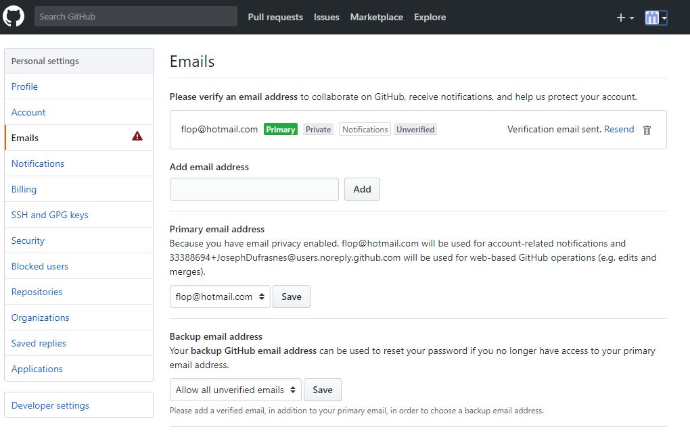

# Bifurcación de Jeedom Core o de la documentación

**Fork: por qué y cómo**

«Fork» consiste en copiar un proyecto a tu espacio de GitHub para poder modificar los archivos de código y la documentación, y posteriormente enviar una solicitud de incorporación de cambios (pull request) al proyecto original, que será evaluada por el desarrollador o los desarrolladores de dicho proyecto.

Ahora que ya tienes una cuenta de GitHub y has iniciado sesión con tu dirección de correo electrónico verificada, si vas a [aquí](https://github.com/jeedom/core) Estás en el proyecto Jeedom; a la derecha hay un botón «fork» que te permite copiarlo a tu espacio de GitHub.

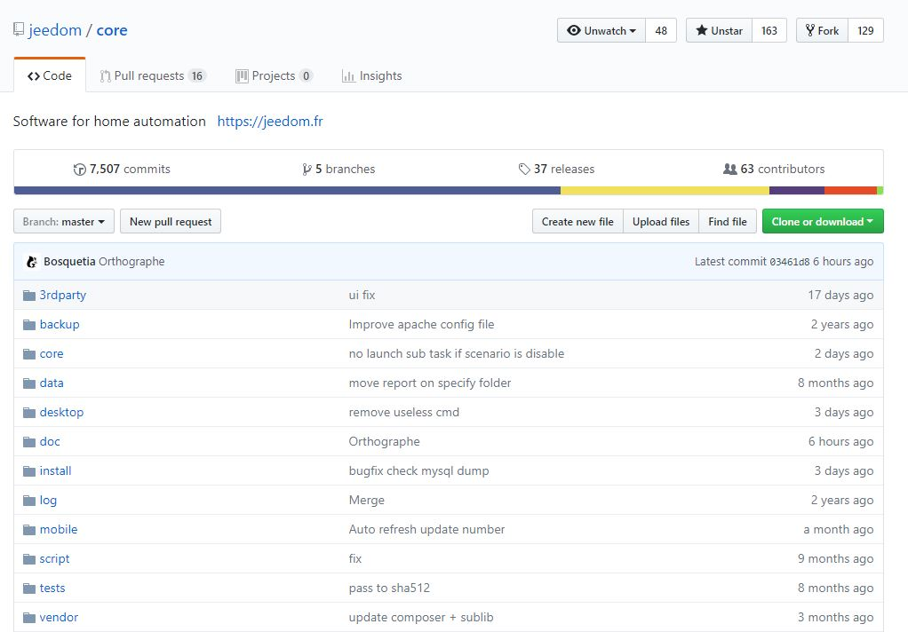

## Modificación de uno o varios archivos

En mi caso, quiero aplicar una modificación al archivo *history.class.php*. Este archivo se encuentra en el núcleo de Jeedom, concretamente aquí: core/class/

- Así que estamos en mi repositorio (TaGGoU91 / core), que aparece indicado como una bifurcación de Jeedom/core
- Así pues, nos dirigimos a /core/class (el primer «core» aparece en negrita; es el repositorio en el que me encuentro (core, véase Petit 1))
- Así que ya tenemos nuestro archivo *history.class.php*; hacemos clic en el archivo

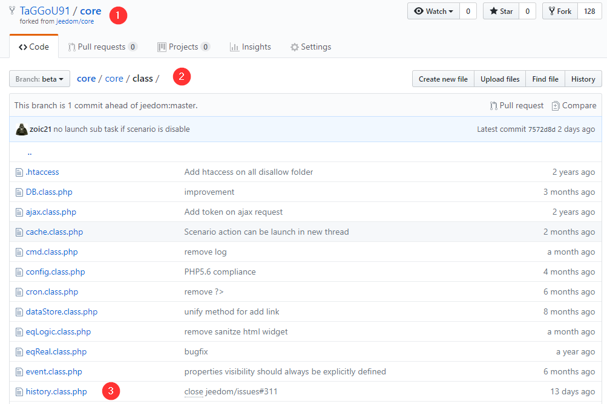

- Así que estamos en nuestro archivo
- Haz clic en el lápiz para acceder al modo de edición

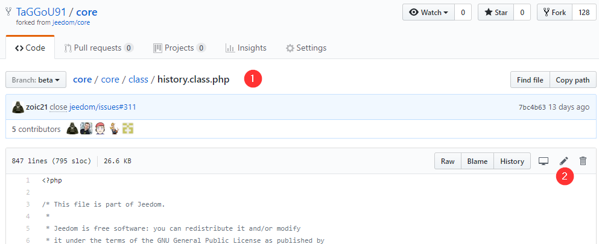

Para realizar una búsqueda en el archivo, sitúate en el bloque de texto del archivo que acabas de abrir en modo edición con el lápiz y pulsa «Ctrl + F» para activar la búsqueda. Pega o escribe el texto que buscas (un fragmento significativo y solo una línea, no todo un bloque de una vez). Pulsa «Intro» para iniciar la búsqueda.
> **Consejo**
>
> Si no haces clic en la ventana que contiene el texto o el código que estás buscando, se abrirá el buscador del navegador y, en mi caso, en Google Chrome, este no sabe buscar directamente en el código o en la documentación.

- El campo de búsqueda… sí, es bastante escaso en cuanto a información, la línea copiada es mucho más larga ;).

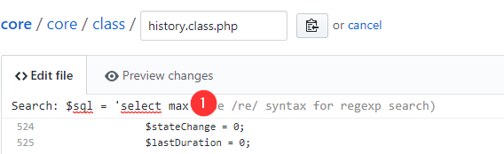

- En amarillo, el resultado de la búsqueda
- En azul, lo que acabo de seleccionar y que quiero modificar o sustituir por mi código. Mi modificación

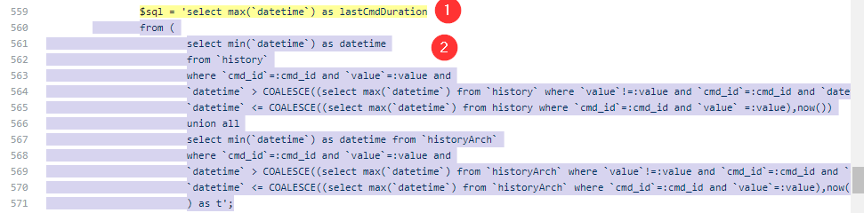

Así que elimino el bloque y luego lo sustituyo.

A continuación, en la parte inferior encontramos lo siguiente: 1. Se indica un título claro, si es posible. 2. Se introduce una descripción un poco más precisa (en mi caso, sería demasiado larga, el enlace al foro será más esclarecedor). 3. Nos aseguramos de que esté bien marcado así. 4. Se hace «commit» = Enviar el cambio.

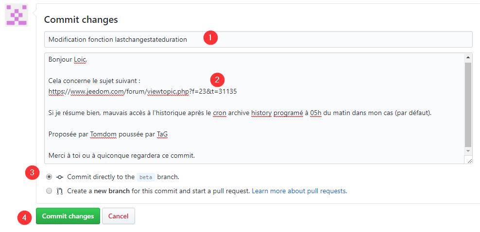

## Enviar una modificación

El **commit** realizado anteriormente solo afecta a la bifurcación del proyecto en tu espacio de GitHub. Para enviar los cambios al proyecto original, hay que crear una PR (solicitud de incorporación).

- Haz clic en la pestaña «Pull Request»
- Nueva solicitud de incorporación de cambios (PR, para los que están al tanto)

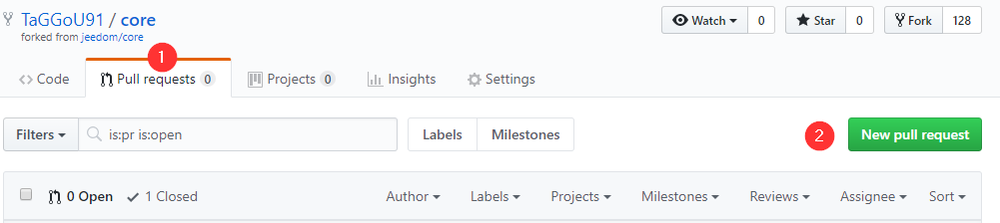

- El PR iniciará una comparación entre la base de datos de Jeedom y tu repositorio (el fork).
- Esto indica los cambios (el primero se debe a que me he puesto al día con Jeedom, y el segundo se refiere precisamente al cambio en la función «lastchangestateduration», ¡perfecto!).
- El código anterior
- El nuevo código
- Creamos la solicitud de incorporación de cambios (PR)

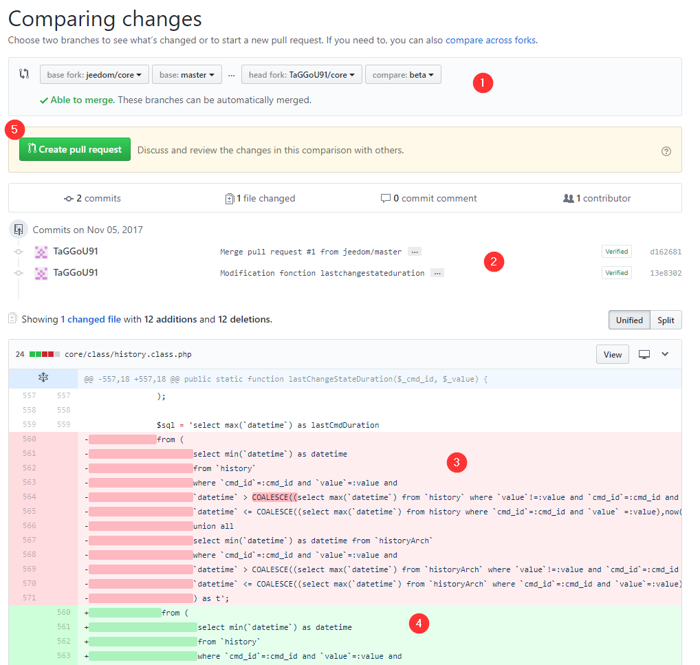

Es importante explicar bien los cambios propuestos para que los desarrolladores del proyecto original los entiendan y puedan validar tu solicitud.

- Haz clic en los tres puntitos
- Copiamos la información que hemos introducido anteriormente
- Lo mismo, lo copiamos (de ahí el uso de …​ en el paso 1 para evitar tener que volver a escribirlo)
- Haz clic en «Create Pull Request»

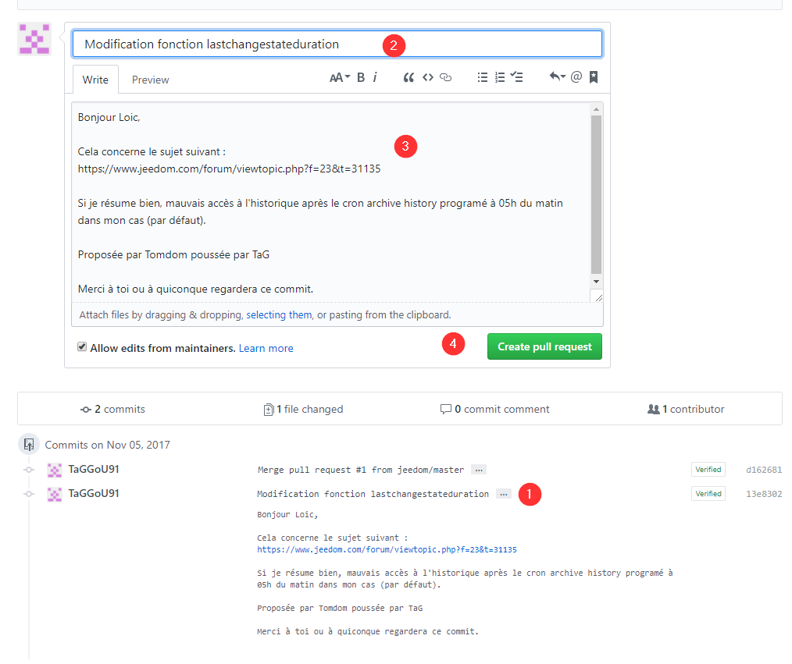

**Ya está.** Ahora solo tienes que esperar a que se apruebe tu PR.

Nota: Solo los usuarios con permiso de «push» en Jeedom pueden validar la solicitud de incorporación de cambios.

Para asegurarte de que tu modificación aparece en la lista, puedes hacer clic en «Pull Requests».

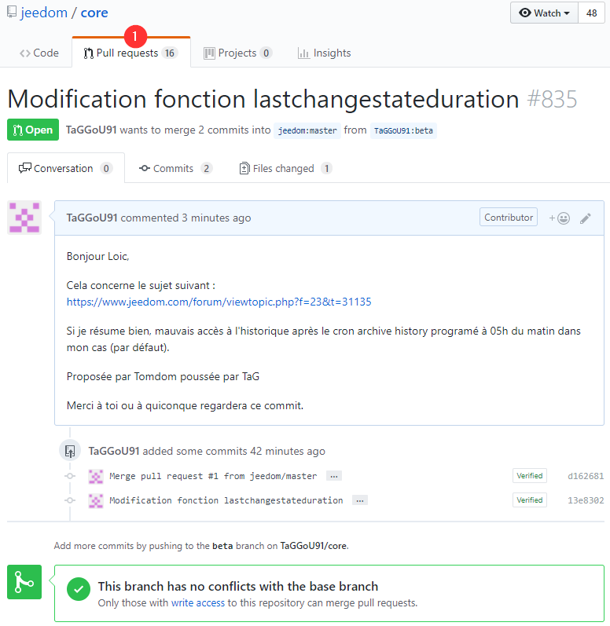

Se obtiene la lista de PR pendientes de validación. Se ve claramente el nuestro.

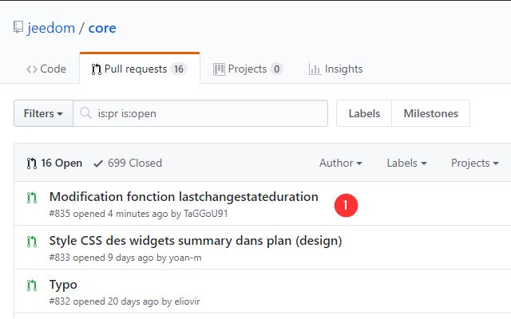
