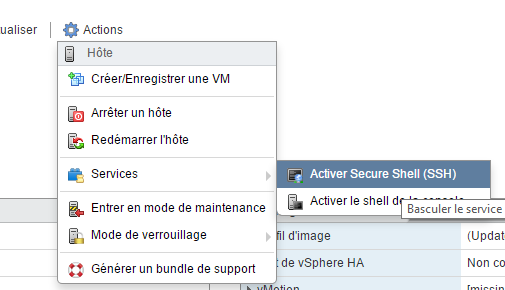
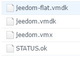

# Configuración de la copia de seguridad de VMware

Es importante disponer de copias de seguridad de las máquinas virtuales, y este es un aspecto que no debe descuidarse en absoluto; por no hablar de los fallos de hardware, es posible que algún día tengas que recurrir a una copia de seguridad tras un error de manejo o un problema derivado de una actualización. Ten en cuenta que aquí hablamos de una imagen completa de las máquinas virtuales, no se trata solo de una copia de seguridad de la aplicación, por lo que ocupará bastante espacio.

Una de las restricciones para realizar una copia de seguridad en VMware es que es imprescindible disponer de dos almacenes de datos. Para ello, tienes varias opciones:

-   2 discos duros/SSD con un almacén de datos en cada uno
-   un NAS (tipo Synology) que comparte un montaje NFS. En este caso, hay que añadir un sistema de archivos de red a VMware para que lo reconozca como un almacén de datos

Para este tutorial voy a utilizar la interfaz web de ESXi, que está disponible bien mediante la instalación de un VIB, bien a partir de la versión 6.0 Update 2. Como recordatorio, para acceder a esta interfaz basta con ir a IP\_ESXI/ui

> **Nota**
>
> Para este tutorial voy a utilizar la interfaz web de ESXi, que está disponible bien mediante la instalación de un VIB, bien a partir de la versión 6.0, actualización 2. Como recordatorio, para acceder a esta interfaz basta con ir a ``IP_ESXI/ui``

# Instalación de ghettoVCB

Hay que recuperar esto [script](https://raw.githubusercontent.com/lamw/ghettoVCB/master/ghettoVCB.sh) y transferirlo al ESXi (por ejemplo, al mismo almacén de datos que va a albergar las copias de seguridad).

> **Nota**
>
> En el resto de este tutorial, doy por hecho que has colocado el script ghettoVCB.sh en /vmfs/volumes/Backup/ghettoVCB.sh. Depende de ti adaptar los comandos y scripts proporcionados a tu configuración.

# Conexión por SSH

Tendrás que conectarte por SSH al ESXi; para ello, desde la interfaz



A continuación, con Putty o Kitty, conéctate introduciendo la dirección IP de tu ESXi y utilizando tus credenciales de acceso al mismo

# Creación del archivo de configuración

> **Nota**
>
> En el resto de este tutorial, daré por hecho que la ruta de tu almacén de datos de copia de seguridad es /vmfs/volumes/Backup; asegúrate de cambiarla si no es así en tu caso.

En el almacén de datos de copia de seguridad hay que crear un archivo ``ghettoVCB.conf`` que contiene:

````
VM_BACKUP_VOLUME=/vmfs/volumes/Backup/
DISK_BACKUP_FORMAT=thin
VM_BACKUP_ROTATION_COUNT=2
POWER_VM_DOWN_BEFORE_BACKUP=0
ENABLE_HARD_POWER_OFF=0
ITER_TO_WAIT_SHUTDOWN=3
POWER_DOWN_TIMEOUT=5
ENABLE_COMPRESSION=0
VM_SNAPSHOT_MEMORY=0
VM_SNAPSHOT_QUIESCE=0
ALLOW_VMS_WITH_SNAPSHOTS_TO_BE_BACKEDUP=0
ENABLE_NON_PERSISTENT_NFS=0
UNMOUNT_NFS=0
NFS_SERVER=172.30.0.195
NFS_MOUNT=/nfsshare
NFS_LOCAL_NAME=nfs_storage_backup
NFS_VM_BACKUP_DIR=mybackups
SNAPSHOT_TIMEOUT=15
EMAIL_LOG=0
EMAIL_SERVER=auroa.primp-industries.com
EMAIL_SERVER_PORT=25
EMAIL_DELAY_INTERVAL=1
EMAIL_TO=auroa@primp-industries.com
EMAIL_FROM=root@ghettoVCB
WORKDIR_DEBUG=0
VM_SHUTDOWN_ORDER=
VM_STARTUP_ORDER=
````

Los parámetros que debes ajustar son:

-   ``VM_BACKUP_VOLUME`` ⇒ Ubicación de tu almacén de datos de copia de seguridad
-   ``VM_BACKUP_ROTATION_COUNT`` ⇒ número de copias de seguridad por máquina virtual que hay que conservar

> **Nota**
>
> Puedes consultar [aquí](https://communities.vmware.com/docs/DOC-8760) La documentación completa de ghettoVCB con una descripción de cada parámetro

> **Importante**
>
> Asegúrate de poner bien el ``/`` valor final para el parámetro ``VM_BACKUP_VOLUME`` de lo contrario, el script dará un error

# Prueba de copia de seguridad

Aquí vamos a realizar una primera copia de seguridad inicial de todas las máquinas virtuales para comprobar que todo funciona correctamente. Posteriormente, la programaremos para que se realice de forma automática. Vuelve al ESXi mediante SSH (vuelve a conectarte si es necesario) y ejecuta:

``/vmfs/volumes/Backup/ghettoVCB.sh -a -g /vmfs/volumes/Backup/ghettoVCB.conf``

Esto iniciará una copia de seguridad de todas tus máquinas virtuales (por lo que puede tardar bastante tiempo). Al finalizar, deberías tener en tu almacén de datos de copia de seguridad una carpeta por cada máquina virtual y, dentro de cada carpeta de máquinas virtuales, una subcarpeta por fecha que contenga 4 archivos:



-   ``*-flat.vmdk`` ⇒ el disco virtual de tu equipo
-   ``*.vmdk`` ⇒ el identificador del disco
-   ``*.vmx`` ⇒ el archivo que contiene la configuración de tu equipo
-   ``STATUS.ok`` ⇒ indica que la copia de seguridad se ha realizado correctamente

Aquí tienes otra opción para la línea de comandos:

-   Simulación de copia de seguridad: ``/vmfs/volumes/Backup/ghettoVCB.sh -d dryrun -a -g /vmfs/volumes/Backup/ghettoVCB.conf``
-   Inicio en modo depuración: ``/vmfs/volumes/Backup/ghettoVCB.sh -d debug -a -g /vmfs/volumes/Backup/ghettoVCB.conf``
-   Hacer una copia de seguridad solo de la máquina virtual «toto» ``/vmfs/volumes/Backup/ghettoVCB.sh -m toto -a -g /vmfs/volumes/Backup/ghettoVCB.conf``

# Inicio automático de las copias de seguridad

Hay que añadir la línea de comando al crontab, pero en VMware el crontab es un poco especial y, sobre todo, se sobrescribe cada vez que se reinicia el sistema. Para evitarlo, hay que añadir un pequeño script que actualice el crontab al arrancar (no te preocupes, es bastante sencillo y rápido). Conectándote por SSH al ESXi, haz lo siguiente:

``vi /etc/rc.local.d/local.sh``

Y antes del ``exit 0`` Añade las siguientes líneas:

````
/bin/kill $(cat /var/run/crond.pid)
/bin/echo "0 0 1 * * /vmfs/volumes/Backup/ghettoVCB.sh -a -g /vmfs/volumes/Backup/ghettoVCB.conf >/dev/null 2>&1" >> /var/spool/cron/crontabs/root
/usr/lib/vmware/busybox/bin/busybox crond
````

> **Nota**
>
> Aquí he configurado una copia de seguridad para el primer día de cada mes; puedes cambiarlo modificando: ``0 0 1 * *``

> **Nota**
>
> Aquí estoy haciendo una copia de seguridad de todas las máquinas virtuales; puedes adaptar esto sustituyendo el ``-a`` por ``-m ma_vm``, atención: si quieres añadir varias máquinas virtuales, tienes que duplicar la línea ``/bin/echo "0 0 1 * *"``
````
/vmfs/volumes/Backup/ghettoVCB.sh -a -g
/vmfs/volumes/Backup/ghettoVCB.conf &gt;/dev/null 2>&1";
/var/spool/cron/crontabs/root" et en mettre une par VM à backuper
````

> **Importante**
>
> No olvides adaptar la ruta al archivo de configuración de ghettoVCB según tu configuración: ``/vmfs/volumes/Backup/ghettoVCB.conf``

Último paso: hay que reiniciar el ESXi para que se aplique la tarea cron. Puedes ver el resultado ejecutando (siempre a través de SSH):

``cat /var/spool/cron/crontabs/root``

Aquí debe haber una línea:

``0 0 1 * * /vmfs/volumes/Backup/ghettoVCB.sh -a -g /vmfs/volumes/Backup/ghettoVCB.conf >/dev/null 2>&1``
