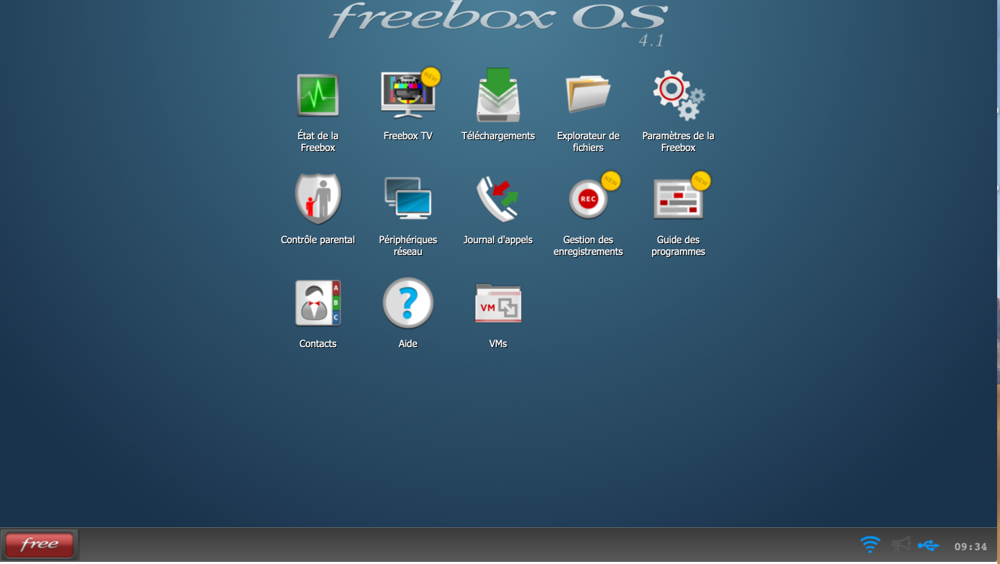
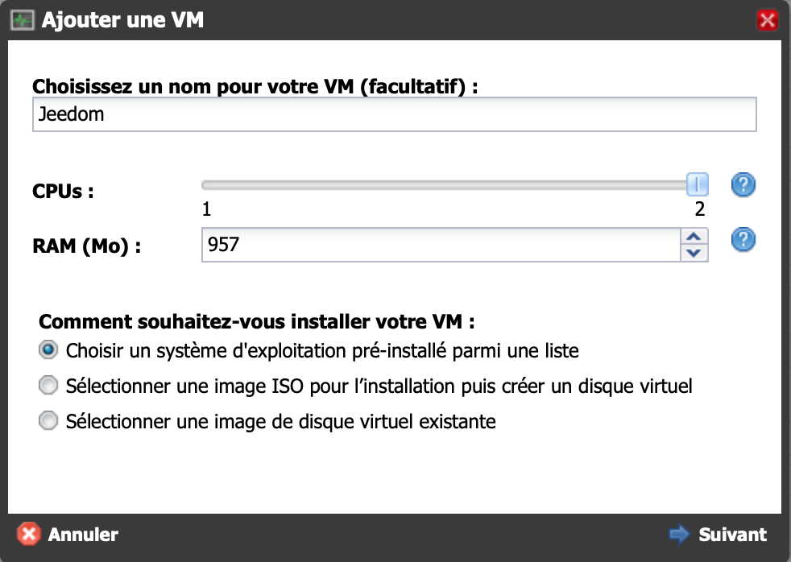
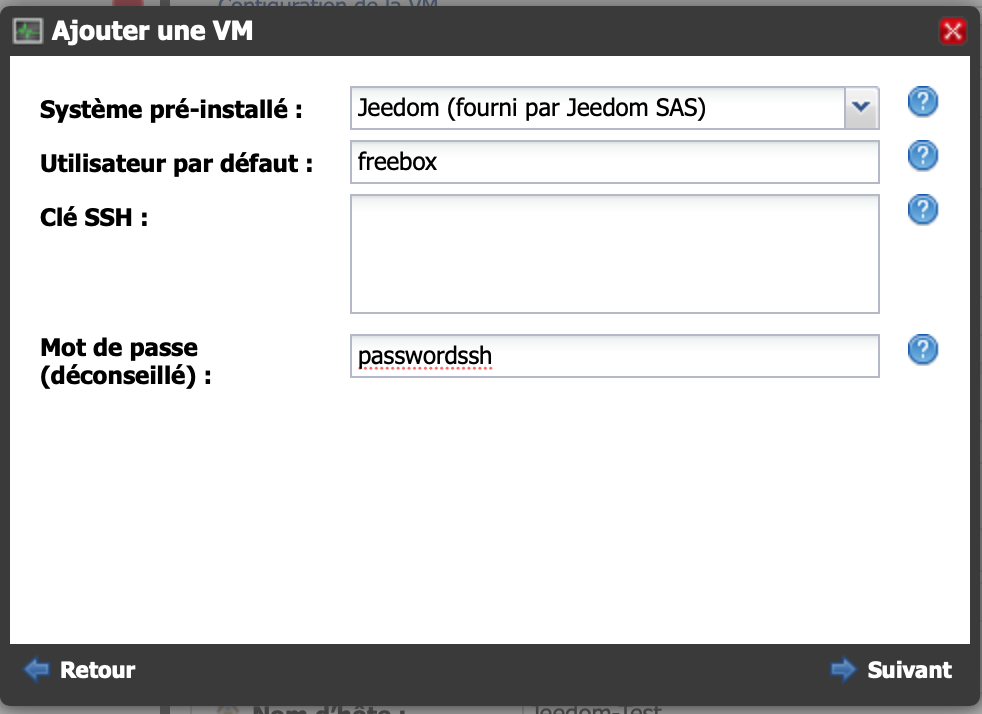
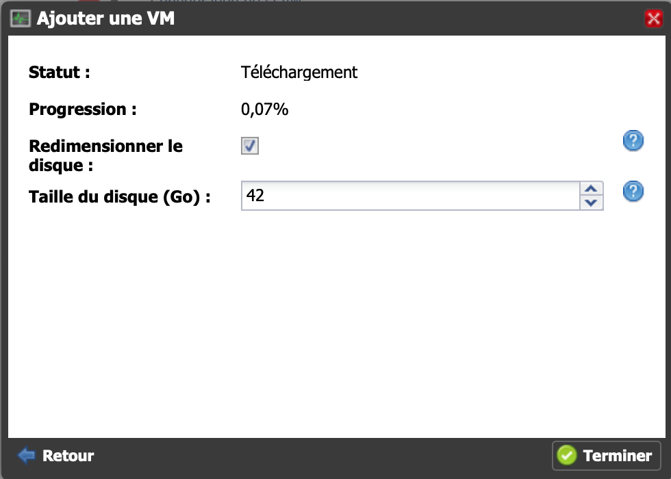
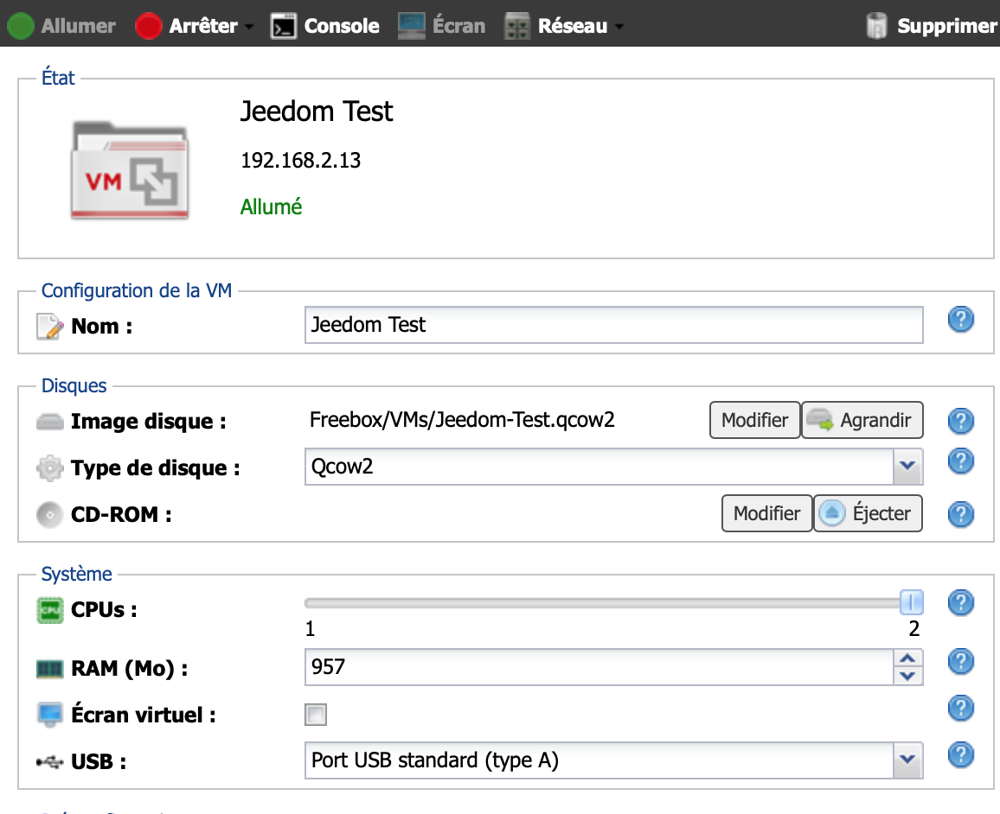

# Installation auf der Freebox Delta

Auf der Freebox Delta lässt sich Jeedom über das VM-System installieren.

## Anschluss an das Delta-Netz

Rufen Sie die Konfigurationsoberfläche Ihrer Freebox Delta auf. Klicken Sie anschließend auf „VMs“.

## Die verschiedenen Optionen einstellen

Klicken Sie auf „VM hinzufügen“

Konfigurieren Sie die Spezifikationen. Wir empfehlen Ihnen, 2 CPUs und die maximale RAM-Kapazität zu wählen.

Richten Sie den Benutzernamen und das Passwort ein. **Merken Sie sich diese unbedingt, da sie bei einer SSH-Verbindung abgefragt werden**:

## Installation läuft

Bitte haben Sie etwas Geduld, während das Bild heruntergeladen wird

## Melden Sie sich bei Ihrem Jeedom an

Sie können sich über die auf der Seite angegebene Adresse anmelden:

Denken Sie daran, den USB-Anschluss des Delta der VM zuzuweisen, wenn Sie eine Antenne verwenden möchten.

Aktivieren Sie **nicht** die Option „Bildschirm“ – dies hat auf dem Jeedom-Bildschirm keinen Nutzen (abgesehen von einem erhöhten Stromverbrauch).

Die IP-Adresse Ihres Jeedom auf der Freebox Delta ist oben unter dem Namen angegeben.

Der Standard-Benutzername und das Standard-Passwort lauten „admin/admin“, wenn Sie über Ihren Browser auf Jeedom zugreifen.

Für die weiteren Schritte können Sie der Dokumentation folgen [Erste Schritte mit Jeedom](/premiers-pas)
