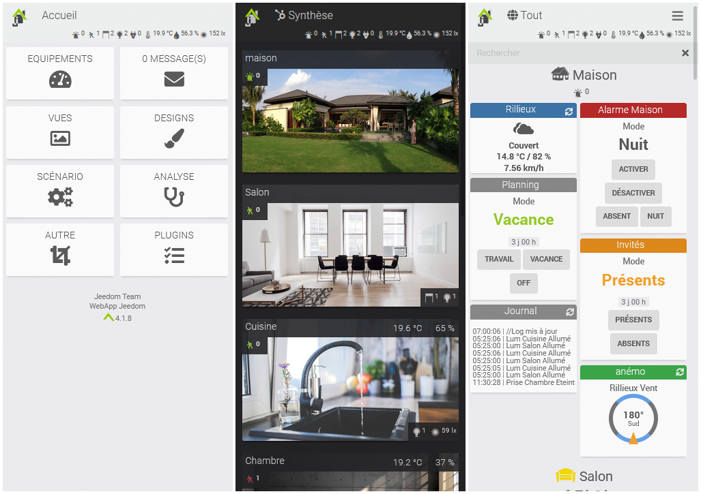
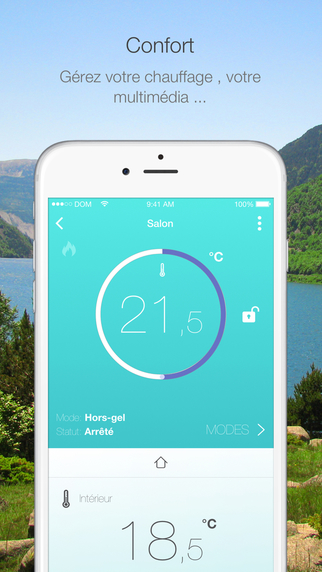
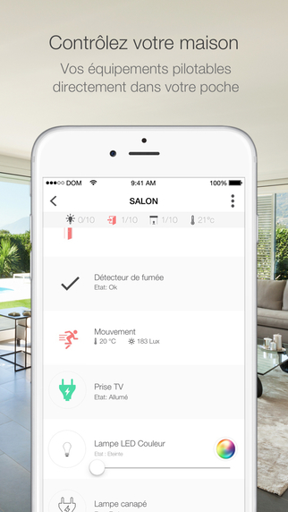
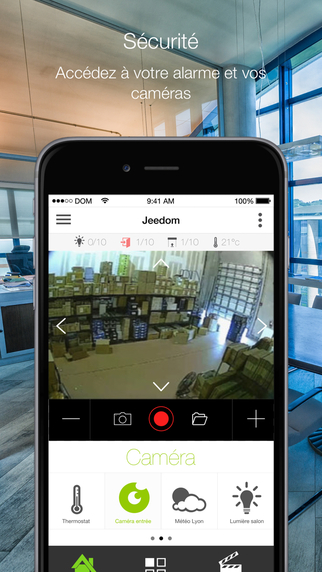
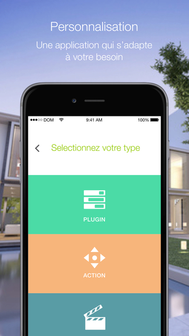
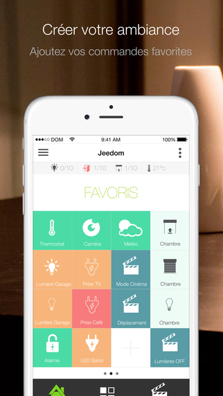

# Mobile version

Jeedom can be used on mobile devices in two ways.

## Web App

Jeedom offers a dedicated version for mobile and tablet devices. You can access it using the same URL in a mobile browser (Firefox, Chrome, Safari, etc.).

This adapted version has also been simplified for better display and performance.

- Devices: Access the dashboard by device. You can also view the Summary.
- Messages: Display the message center.
- Views: Access your Views.
- Designs: Access your Designs or 3D Designs. (Designs are displayed in full screen; use a three-finger tap to return to the home screen.)
- Scenario: Displays your scenario tiles by group, with the option to enable/disable or stop/start them. Clicking on the scenario title will take you to its log.
- Analysis: Access the Timeline, Logs, Device Analysis, Cron Jobs, Daemons, and Health.
- Other: Switch between the main and alternate themes, access the desktop version, force an update, access the documentation, view "About," or sign out.
- Plugins: Some plugins may have a dedicated view in the WebApp. They will be accessible here.

> Tips
>
> The WebApp home page can be configured on your Jeedom under Settings → Preferences.

The WebApp serves primarily as a reference tool. You can, of course, interact with your devices just as you would on the desktop version, but you won’t be able to, for example, edit a scenario, modify a device, or access Jeedom’s configuration.

## Jeedom App

The Jeedom mobile app (compatible with iOS/Android) lets you control your Jeedom home automation system, whether via your local Wi-Fi network or your carrier’s 3G/4G network. The app automatically connects to your Jeedom using a QR code—no configuration is required. You’ll find all the features of your Jeedom system on your phone (scenarios, connected devices and home automation devices, plugins). You can also customize your app with shortcuts and more...

	

    
