>**Wichtig**
>Nur offizielle Plugins haben hier ihre Dokumentation. Sie können die Dokumentation der anderen Plugins direkt im Jeedom Market einsehen. Klicken Sie im betreffenden Plugin auf Dokumentation.
>Sie können sehen [hier](https://market.jeedom.com/index.php?v=d&p=market&type=plugin&categorie=automation+protocol) Alle offiziellen Plugins in dieser Kategorie

| | | | |
|--- | --- | --- | ---|
|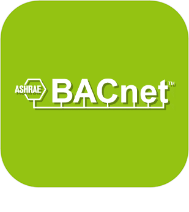|BACnet|Plugin zur Steuerung von Bacnet / IP-Geräten. Detection des équipements via broadcast, ou intégration manuelle. Gestion des Schedules. Import de fichier EDE|[Dokumentation Stall](../bacnet/de_DE/index.md) - [Beta-Dokumentation](../bacnet/beta/de_DE/index.md) [Markt](https://market.jeedom.com/index.php?v=d&p=market_display&id=4161) [Änderungsprotokoll stabil](../bacnet/de_DE/changelog.md) - [Changelog-Beta](../bacnet/beta/de_DE/changelog.md)|
|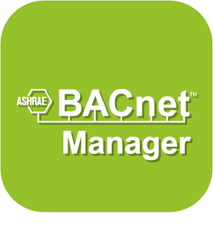|bacnetManager|Plugin zum Erstellen eines Bacnet/Jeedom-Geräts|[Dokumentation Stall](../bacnetManager/de_DE/index.md) - [Beta-Dokumentation](../bacnetManager/beta/de_DE/index.md) [Markt](https://market.jeedom.com/index.php?v=d&p=market_display&id=4551) [Änderungsprotokoll stabil](../bacnetManager/de_DE/changelog.md) - [Changelog-Beta](../bacnetManager/beta/de_DE/changelog.md)|
|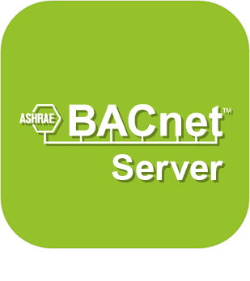|BACnetServer|ACHTUNG Plugin nur in Beta verfügbar Plugin zum Erstellen eines Bacnet/Jeedom-Geräts|[Beta-Dokumentation](../bacnetServer/beta/de_DE/index.md) [Markt](https://market.jeedom.com/index.php?v=d&p=market_display&id=4323) [Changelog-Beta](../bacnetServer/beta/de_DE/changelog.md)|
|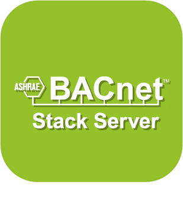|bacnetStackServer|Le plugin **BACnet Stack Server** permet de transformer votre Jeedom en serveur BACnet. Il expose vos équipements et commandes Jeedom sous forme d'objets BACnet accessibles par d'autres systèmes de GTB (Gestion Technique du Bâtiment).Integre desormais une partie Client BACnet pour permettre a Jeedom de se connecter a d'autres serveurs BACnet et d'en exploiter les objets.|[Dokumentation Stall](../bacnetStackServer/de_DE/index.md) - [Beta-Dokumentation](../bacnetStackServer/beta/de_DE/index.md) [Markt](https://market.jeedom.com/index.php?v=d&p=market_display&id=4611) [Änderungsprotokoll stabil](../bacnetStackServer/de_DE/changelog.md) - [Changelog-Beta](../bacnetStackServer/beta/de_DE/changelog.md)|
|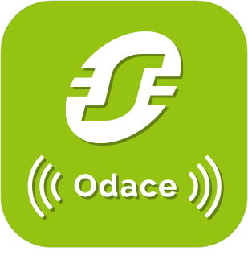|Odace SFSP|Plugin zur Unterstützung der Odace SFSP-Reihe (drahtlos ohne Akku) Schneider to Jeedom. Es ermöglicht die Information der Schalter (Fensterläden / Szenen / Einzel / Doppel). Es ermöglicht die Steuerung der Aktuatoren (Verschluss / dcl). Außerdem können Sie Szenen und Gruppen verwenden.|[Dokumentation Stall](../beagle/de_DE/index.md) - [Beta-Dokumentation](../beagle/beta/de_DE/index.md) [Markt](https://market.jeedom.com/index.php?v=d&p=market_display&id=3917) [Änderungsprotokoll stabil](../beagle/de_DE/changelog.md) - [Changelog-Beta](../beagle/beta/de_DE/changelog.md)|
|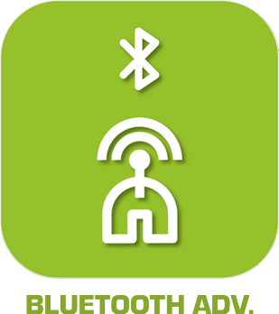|Bluetooth-Werbung|Plugin zur Verwaltung bestimmter Geräte, die in Bluetooth-Werbung funktionieren, wie der NIUS von Nodon Für den NIUS können die verschiedenen Unterstützungen erkannt werden. Bei einigen anderen Geräten ist Präsenz möglich. Kompatibel auch mit Ticatag-Tasten (mit der Verwaltung mehrerer Temperatur- und Aktionstasten, damit es klingelt) Kompatible Mi-Flora, Mi-Skala, Awox-Smartplug, Playbulb, Miband1 und 1s|[Dokumentation Stall](../blea/de_DE/index.md) - [Beta-Dokumentation](../blea/beta/de_DE/index.md) [Markt](https://market.jeedom.com/index.php?v=d&p=market_display&id=2554) [Änderungsprotokoll stabil](../blea/de_DE/changelog.md) - [Changelog-Beta](../blea/beta/de_DE/changelog.md)|
|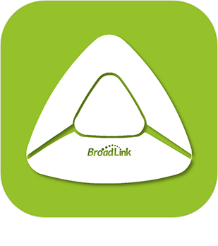|Broadlink|Plugin, das Unterstützung für bestimmte Broadlink-Produkte wie (RM, A1 usw.) hinzufügt)|[Dokumentation Stall](../broadlink/de_DE/index.md) - [Beta-Dokumentation](../broadlink/beta/de_DE/index.md) [Markt](https://market.jeedom.com/index.php?v=d&p=market_display&id=2699) [Änderungsprotokoll stabil](../broadlink/de_DE/changelog.md) - [Changelog-Beta](../broadlink/beta/de_DE/changelog.md)|
|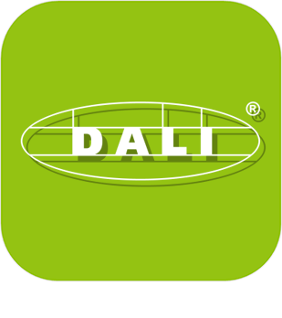|Dali|Dieses Plugin ermöglicht die Verwaltung des Dali-Protokolls, das nur mit dem HASSEB DaliMaster v2-Gateway kompatibel ist|[Dokumentation Stall](../dali/de_DE/index.md) - [Beta-Dokumentation](../dali/beta/de_DE/index.md) [Markt](https://market.jeedom.com/index.php?v=d&p=market_display&id=4223) [Änderungsprotokoll stabil](../dali/de_DE/changelog.md) - [Changelog-Beta](../dali/beta/de_DE/changelog.md)|
||Deconz|Mit diesem Plugin können Sie eine Vielzahl von ZigBee-Modulen (Ikea, Philips Hue, Xiaomi usw.) integrieren, ohne das Gateway mit dem Conbee / Conbee II-Schlüssel durchlaufen zu müssen. WICHTIG : Sie benötigen unbedingt einen Conbee-Schlüssel, um dieses Plugin zu verwenden. Ein weiterer Punkt ist das Lesen der Dokumentation und der kompatiblen Module.|[Dokumentation Stall](../deconz/de_DE/index.md) - [Beta-Dokumentation](../deconz/beta/de_DE/index.md) [Markt](https://market.jeedom.com/index.php?v=d&p=market_display&id=3610) [Änderungsprotokoll stabil](../deconz/de_DE/changelog.md) - [Changelog-Beta](../deconz/beta/de_DE/changelog.md)|
|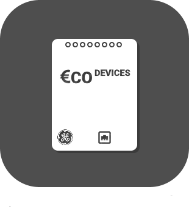|Eco-device||[Dokumentation Stall](../ecodevice/de_DE/index.md) - [Beta-Dokumentation](../ecodevice/beta/de_DE/index.md) [Markt](https://market.jeedom.com/index.php?v=d&p=market_display&id=342) [Änderungsprotokoll stabil](../ecodevice/de_DE/changelog.md) - [Changelog-Beta](../ecodevice/beta/de_DE/changelog.md)|
|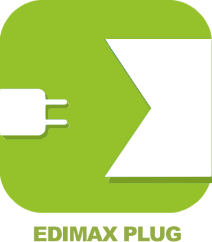|Edimax Plug||[Dokumentation Stall](../edimaxplug/de_DE/index.md) [Markt](https://market.jeedom.com/index.php?v=d&p=market_display&id=2455) [Änderungsprotokoll stabil](../edimaxplug/de_DE/changelog.md)|
||Edisio|Edisio-Plugin zur Verwaltung des Edisio-Protokolls mit dem Edisio-USB-Stick. So können Sie mit den Produkten der Edisio-Reihe kommunizieren.|[Dokumentation Stall](../edisio/de_DE/index.md) [Markt](https://market.jeedom.com/index.php?v=d&p=market_display&id=1541) [Änderungsprotokoll stabil](../edisio/de_DE/changelog.md)|
|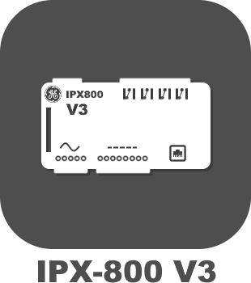|ipx800 V3||[Dokumentation Stall](../ipx800/de_DE/index.md) - [Beta-Dokumentation](../ipx800/beta/de_DE/index.md) [Markt](https://market.jeedom.com/index.php?v=d&p=market_display&id=344) [Änderungsprotokoll stabil](../ipx800/de_DE/changelog.md) - [Changelog-Beta](../ipx800/beta/de_DE/changelog.md)|
|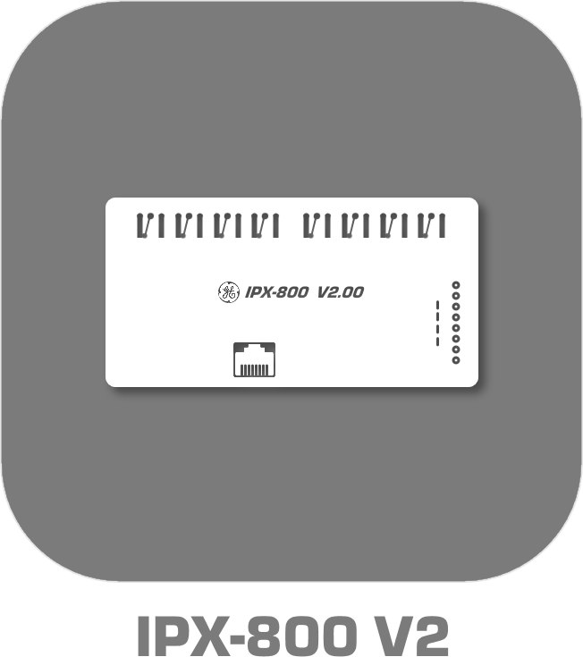|ipx800 V2|| [Markt](https://market.jeedom.com/index.php?v=d&p=market_display&id=1194)|
|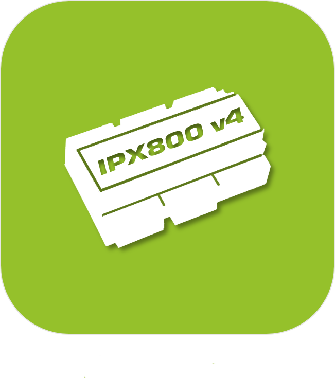|IPX 800 v4|Plugin zur Steuerung des IPX 800|[Dokumentation Stall](../ipx800v4/de_DE/index.md) - [Beta-Dokumentation](../ipx800v4/beta/de_DE/index.md) [Markt](https://market.jeedom.com/index.php?v=d&p=market_display&id=2046) [Änderungsprotokoll stabil](../ipx800v4/de_DE/changelog.md) - [Changelog-Beta](../ipx800v4/beta/de_DE/changelog.md)|
|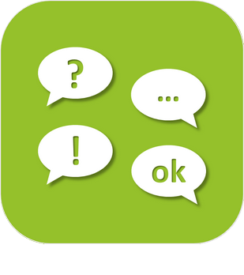|IPX800 v5|ACHTUNG Plugin nur in Beta verfügbar Plugin für ipx800v5.Beachten Sie die Komplexität der vom Hersteller bereitgestellten API, dieses Plugin wird für Anfänger nicht empfohlen. Wenn Sie stattdessen eine viel einfachere ipx800v4 verwenden können. Bitte beachte, dass das Plugin zahlt, wenn es in den Stall geht|[Beta-Dokumentation](../ipx800v5/beta/de_DE/index.md) [Markt](https://market.jeedom.com/index.php?v=d&p=market_display&id=4218) [Changelog-Beta](../ipx800v5/beta/de_DE/changelog.md)|
|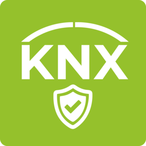|knxSecure|Plugin permettant de piloter et superviser des équipements KNX via une passerelle KNX/IP. Supporte KNX IP Secure (tunneling TCP), la lecture des projets ETS (.knxproj) et la gestion d'équipements virtuels.|[Dokumentation Stall](../knxsecure/de_DE/index.md) [Markt](https://market.jeedom.com/index.php?v=d&p=market_display&id=4677) [Änderungsprotokoll stabil](../knxsecure/de_DE/changelog.md)|
|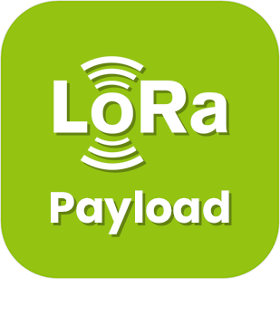|Lora Nutzlast|Plugin zur Dekodierung von Lora Payloads.|[Dokumentation Stall](../lorapayload/de_DE/index.md) - [Beta-Dokumentation](../lorapayload/beta/de_DE/index.md) [Markt](https://market.jeedom.com/index.php?v=d&p=market_display&id=4146) [Änderungsprotokoll stabil](../lorapayload/de_DE/changelog.md) - [Changelog-Beta](../lorapayload/beta/de_DE/changelog.md)|
||Modbus|Plugin Modbus - RTU - TCP|[Dokumentation Stall](../modbus/de_DE/index.md) - [Beta-Dokumentation](../modbus/beta/de_DE/index.md) [Markt](https://market.jeedom.com/index.php?v=d&p=market_display&id=4267) [Änderungsprotokoll stabil](../modbus/de_DE/changelog.md) - [Changelog-Beta](../modbus/beta/de_DE/changelog.md)|
|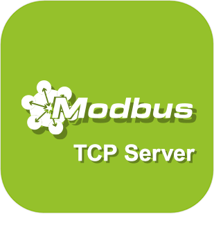|ModbusServer|ACHTUNG Plugin nur in Beta verfügbar Plugin zum Erstellen eines Modbus/Jeedom-Geräts|[Beta-Dokumentation](../modbusServer/beta/de_DE/index.md) [Markt](https://market.jeedom.com/index.php?v=d&p=market_display&id=4357) [Changelog-Beta](../modbusServer/beta/de_DE/changelog.md)|
||MyhomeSCS|Ermöglicht die Verwaltung des MyHome Bus-Protokolls.|[Dokumentation Stall](../myhomescs/de_DE/index.md) - [Beta-Dokumentation](../myhomescs/beta/de_DE/index.md) [Markt](https://market.jeedom.com/index.php?v=d&p=market_display&id=3107) [Änderungsprotokoll stabil](../myhomescs/de_DE/changelog.md) - [Changelog-Beta](../myhomescs/beta/de_DE/changelog.md)|
|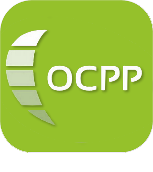|OCPP|ACHTUNG Plugin nur in Beta verfügbar Plugin permettant de contrôler les bornes de recharge de véhicules compatibles avec le protocole OCPP en faisant de Jeedom un système central OCPP.|[Beta-Dokumentation](../ocpp/beta/de_DE/index.md) [Markt](https://market.jeedom.com/index.php?v=d&p=market_display&id=4569) [Changelog-Beta](../ocpp/beta/de_DE/changelog.md)|
||EnOcean|Plugin ajoutant le support du EnOcean à Jeedom https://compatibility.jeedom.com/index.php?v=d&p=home&search=&plugin=openenocean Viele Module werden schnell und kontinuierlich hinzugefügt. Wir raten Ihnen, mit Vorsicht zu migrieren|[Dokumentation Stall](../openenocean/de_DE/index.md) - [Beta-Dokumentation](../openenocean/beta/de_DE/index.md) [Markt](https://market.jeedom.com/index.php?v=d&p=market_display&id=2622) [Änderungsprotokoll stabil](../openenocean/de_DE/changelog.md) - [Changelog-Beta](../openenocean/beta/de_DE/changelog.md)|
|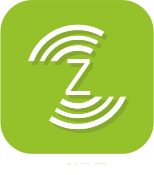|Z-Wave|Plugin zur Steuerung von ZWave-Geräten über einen openWave-kompatiblen ZWave-Schlüssel|[Dokumentation Stall](../openzwave/de_DE/index.md) - [Beta-Dokumentation](../openzwave/beta/de_DE/index.md) [Markt](https://market.jeedom.com/index.php?v=d&p=market_display&id=185) [Änderungsprotokoll stabil](../openzwave/de_DE/changelog.md) - [Changelog-Beta](../openzwave/beta/de_DE/changelog.md)|
|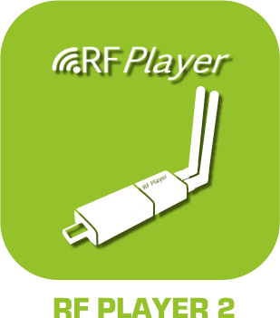|RfPlayer2|Plugin, das Unterstützung für den RfPlayer-Schlüssel von Ziblue zu Jeedom hinzufügt. Dieses Plugin wird eventuell das erste Plugin ersetzen. Es wird allen Besitzern des ersten Plugins zur Verfügung gestellt. Dadurch kann jeder ruhig migrieren. Da sich die Philosophie des Plugins geändert hat und auch die IDs, müssen Sie Ihre Geräte in dieses neue Plugin aufnehmen.|[Dokumentation Stall](../rfplayer2/de_DE/index.md) - [Beta-Dokumentation](../rfplayer2/beta/de_DE/index.md) [Markt](https://market.jeedom.com/index.php?v=d&p=market_display&id=3349) [Änderungsprotokoll stabil](../rfplayer2/de_DE/changelog.md) - [Changelog-Beta](../rfplayer2/beta/de_DE/changelog.md)|
|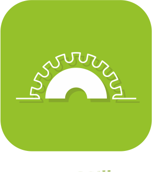|RFXcom|Plugin zur Verwendung des RFXcom USB. Ermöglicht die Steuerung von 433-MHz-Hausautomationsgeräten (Chacon, Oregon, La Crosse, X10, DI-O, Blyss)...)|[Dokumentation Stall](../rfxcom/de_DE/index.md) - [Beta-Dokumentation](../rfxcom/beta/de_DE/index.md) [Markt](https://market.jeedom.com/index.php?v=d&p=market_display&id=52) [Änderungsprotokoll stabil](../rfxcom/de_DE/changelog.md) - [Changelog-Beta](../rfxcom/beta/de_DE/changelog.md)|
|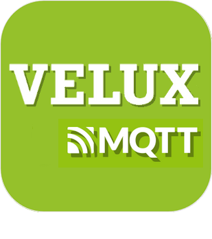|Velux-MQTT|ACHTUNG Plugin nur in Beta verfügbar Dieses Plugin ermöglicht die Steuerung von Dachfenstern und „io-homecontrol“-Öffnungen, die mit der VELUX KLF 200-Schnittstelle kompatibel sind (z. B. Somfy-Rollläden)). Offizielle Plug-ins für Docker Management und MQTT Manager müssen installiert, konfiguriert und funktionsfähig sein.|[Beta-Dokumentation](../vlx2mqtt/beta/de_DE/index.md) [Markt](https://market.jeedom.com/index.php?v=d&p=market_display&id=4275) [Changelog-Beta](../vlx2mqtt/beta/de_DE/changelog.md)|
|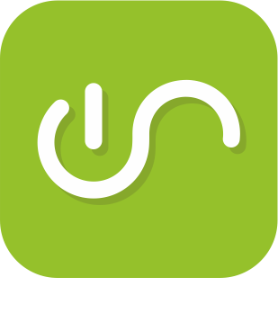|Wattlet|Mit diesem Plugin können Sie die Wattcubes-Module von Wattlet über das Wattcube Web steuern.|[Dokumentation Stall](../wattlet/de_DE/index.md) [Markt](https://market.jeedom.com/index.php?v=d&p=market_display&id=2600) [Änderungsprotokoll stabil](../wattlet/de_DE/changelog.md)|
|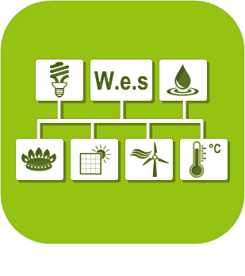|Wes|Mit diesem Plugin können Sie eine CartElectronics wes integrieren|[Dokumentation Stall](../wes/de_DE/index.md) [Markt](https://market.jeedom.com/index.php?v=d&p=market_display&id=1336) [Änderungsprotokoll stabil](../wes/de_DE/changelog.md)|
||JeeZigbee|Plugin, das die Verwendung von Zigbee ermöglicht, basierend auf zigbee2mqtt.|[Dokumentation Stall](../z2m/de_DE/index.md) - [Beta-Dokumentation](../z2m/beta/de_DE/index.md) [Markt](https://market.jeedom.com/index.php?v=d&p=market_display&id=4351) [Änderungsprotokoll stabil](../z2m/de_DE/changelog.md) - [Changelog-Beta](../z2m/beta/de_DE/changelog.md)|
|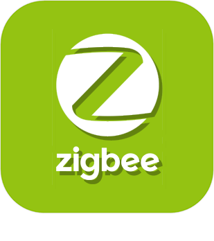|Zigbee|WICHTIG Dieses Plugin wird durch Jeezigbee ersetzt (Dokumentation in Arbeit)). Plugin mit allgemeiner Kompatibilität mit verschiedenen Arten von ZigBee-Controllern wie deCONZ und EZSP (Silicon Labs) sowie Beta-Unterstützung : Zigate, XBee und Texas Instruments.    Es ist wichtig, die Plugin-Dokumentation vor dem Kauf sorgfältig zu lesen.|[Dokumentation Stall](../zigbee/de_DE/index.md) - [Beta-Dokumentation](../zigbee/beta/de_DE/index.md) [Markt](https://market.jeedom.com/index.php?v=d&p=market_display&id=4050) [Änderungsprotokoll stabil](../zigbee/de_DE/changelog.md) - [Changelog-Beta](../zigbee/beta/de_DE/changelog.md)|
|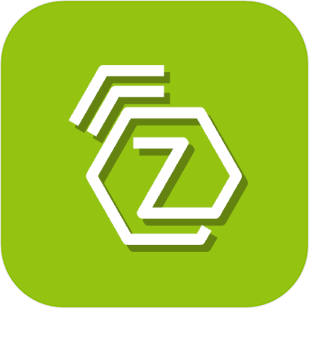|Z-Wave JS|Plugin zur Steuerung von Z-Wave-Geräten|[Dokumentation Stall](../zwavejs/de_DE/index.md) - [Beta-Dokumentation](../zwavejs/beta/de_DE/index.md) [Markt](https://market.jeedom.com/index.php?v=d&p=market_display&id=4306) [Änderungsprotokoll stabil](../zwavejs/de_DE/changelog.md) - [Changelog-Beta](../zwavejs/beta/de_DE/changelog.md)|
