>**Important**
>Only official plugins have their documentation here. You can consult the documentation of the other plugins directly from the Jeedom Market. Once on the plugin in question, click on documentation.
>You can see [here](https://market.jeedom.com/index.php?v=d&p=market&type=plugin&categorie=communication) all official plugins in this category

| | | | |
|--- | --- | --- | ---|
|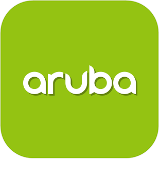|Aruba|ATTENTION plugin available only in beta | [Market](https://market.jeedom.com/index.php?v=d&p=market_display&id=4108)|
|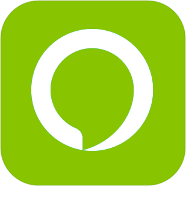|Alexa|Plugin to use Amazon Alexa (echo, dot ...) to control your Jeedom. Important : The plugin requires a subscription to voice services . Pour gérer cet abonnement : https://www.jeedom.com/market/index.php?v=d&p=profils#services|[Documentation Stable](../ash/en_US/index.md) - [Beta documentation](../ash/beta/en_US/index.md) [Market](https://market.jeedom.com/index.php?v=d&p=market_display&id=3409) [Changelog Stable](../ash/en_US/changelog.md) - [Changelog beta](../ash/beta/en_US/changelog.md)|
|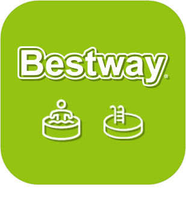|Bestway|Plugin to control Bestway connected equipment. For the moment, only the Milan SPA has been tested (the only connected spa in the range).|[Documentation Stable](../bestway/en_US/index.md) - [Beta documentation](../bestway/beta/en_US/index.md) [Market](https://market.jeedom.com/index.php?v=d&p=market_display&id=4014) [Changelog Stable](../bestway/en_US/changelog.md) - [Changelog beta](../bestway/beta/en_US/changelog.md)|
|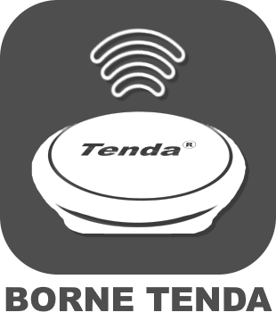|Tenda W301A bollard|Plugin author : Thomas Guenneguez PLEASE NOTE, this is not an official Jeedom plugin but a plugin developed by a third person and whose development has been abandoned. The Jeedom technical team will provide assistance with this plugin without obligation of result. Plugin to manage Tenda W301A Terminals.|[Documentation Stable](../bornetenda/en_US/index.md) [Market](https://market.jeedom.com/index.php?v=d&p=market_display&id=1299) [Changelog Stable](../bornetenda/en_US/changelog.md)|
|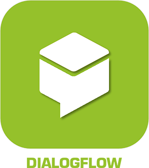|Dialog flow|Plugin allows talking to Google Home / Assistant through Jeedom interactions|[Documentation Stable](../dialogflow/en_US/index.md) [Market](https://market.jeedom.com/index.php?v=d&p=market_display&id=3215) [Changelog Stable](../dialogflow/en_US/changelog.md)|
|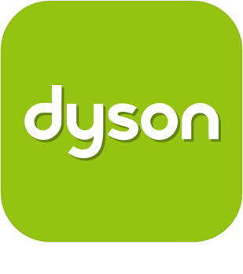|Dyson|Plugin to control Dyson Link equipment (pure link, hot + cool, humidify + cool...). For the moment the vacuum cleaner is not supported.|[Documentation Stable](../dyson/en_US/index.md) [Market](https://market.jeedom.com/index.php?v=d&p=market_display&id=4002) [Changelog Stable](../dyson/en_US/changelog.md)|
||Gcast|Plugin allowing a CAST device to speak. It also allows you to adjust the volume. When used in combination with a Google home, it allows you to bridge interactions and have voice feedback, it also allows you to use the ask function.|[Documentation Stable](../gcast/en_US/index.md) - [Beta documentation](../gcast/beta/en_US/index.md) [Market](https://market.jeedom.com/index.php?v=d&p=market_display&id=3057) [Changelog Stable](../gcast/en_US/changelog.md) - [Changelog beta](../gcast/beta/en_US/changelog.md)|
|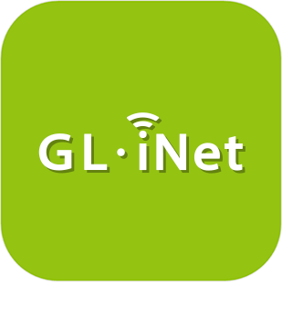|GL-iNet|GliNet management plugin (sms, connection)|[Documentation Stable](../glinet/en_US/index.md) - [Beta documentation](../glinet/beta/en_US/index.md) [Market](https://market.jeedom.com/index.php?v=d&p=market_display&id=4181) [Changelog Stable](../glinet/en_US/changelog.md) - [Changelog beta](../glinet/beta/en_US/changelog.md)|
|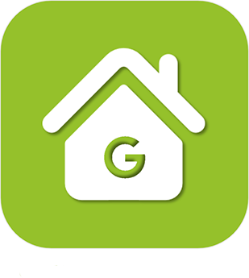|Google Smarthome|Plugin to drive Jeedom with a Google Home. Important : the plugin requires a subscription to voice services (3 months free when purchasing the plugin) for easy configuration. Pour gérer cet abonnement : https://www.jeedom.com/market/index.php?v=d&p=profils#services Vous pouvez utiliser aussi le mode standalone mais sa configuration est plus complexe, nous vous conseillons vivement de lire la documentation avant tout achat si vous souhaitez utiliser ce mode.|[Documentation Stable](../gsh/en_US/index.md) - [Beta documentation](../gsh/beta/en_US/index.md) [Market](https://market.jeedom.com/index.php?v=d&p=market_display&id=3412) [Changelog Stable](../gsh/en_US/changelog.md) - [Changelog beta](../gsh/beta/en_US/changelog.md)|
|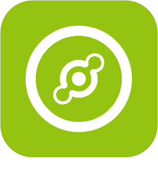|Helium Hotspot|Plugin to retrieve information from Helium hotspots|[Documentation Stable](../heliumhotspot/en_US/index.md) - [Beta documentation](../heliumhotspot/beta/en_US/index.md) [Market](https://market.jeedom.com/index.php?v=d&p=market_display&id=4315) [Changelog Stable](../heliumhotspot/en_US/changelog.md) - [Changelog beta](../heliumhotspot/beta/en_US/changelog.md)|
|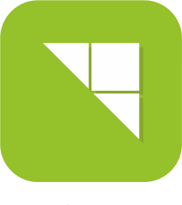|IFTTT|Thanks to this plugin, you can benefit from the countless recipes available on IFTT. Thus a Jeedom event can become an entry point for an IFTT recipe and trigger events of all kinds.|[Documentation Stable](../ifttt/en_US/index.md) - [Beta documentation](../ifttt/beta/en_US/index.md) [Market](https://market.jeedom.com/index.php?v=d&p=market_display&id=1705) [Changelog Stable](../ifttt/en_US/changelog.md) - [Changelog beta](../ifttt/beta/en_US/changelog.md)|
|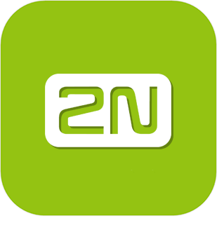|inter2N|ATTENTION plugin available only in beta Plugin to manage inter2N intercoms|[Beta documentation](../inter2N/beta/en_US/index.md) [Market](https://market.jeedom.com/index.php?v=d&p=market_display&id=4166) [Changelog beta](../inter2N/beta/en_US/changelog.md)|
|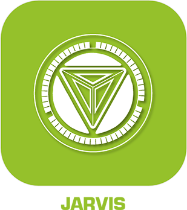|Jarvis|Plugin to manage one or more Jarvis|[Documentation Stable](../jarvis/en_US/index.md) - [Beta documentation](../jarvis/beta/en_US/index.md) [Market](https://market.jeedom.com/index.php?v=d&p=market_display&id=2577) [Changelog Stable](../jarvis/en_US/changelog.md) - [Changelog beta](../jarvis/beta/en_US/changelog.md)|
|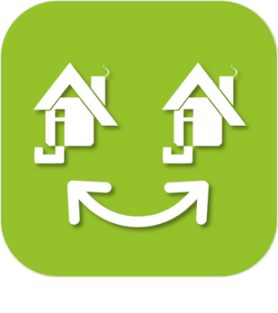|Jeedom Link|This plugin will allow you to link several Jeedom installations in order to transfer equipment from one or more "source Jeedoms" to one or more "target Jeedoms".|[Documentation Stable](../jeelink/en_US/index.md) - [Beta documentation](../jeelink/beta/en_US/index.md) [Market](https://market.jeedom.com/index.php?v=d&p=market_display&id=2530) [Changelog Stable](../jeelink/en_US/changelog.md) - [Changelog beta](../jeelink/beta/en_US/changelog.md)|
|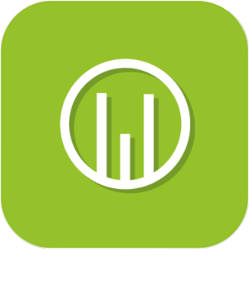|LaMetric|Plugin to display notifications on LaMetric Time.|[Documentation Stable](../lametric/en_US/index.md) - [Beta documentation](../lametric/beta/en_US/index.md) [Market](https://market.jeedom.com/index.php?v=d&p=market_display&id=2818) [Changelog Stable](../lametric/en_US/changelog.md) - [Changelog beta](../lametric/beta/en_US/changelog.md)|
||Mail|This plugin allows you to send emails from Jeedom. This allows you to notify you directly by email during an alert or simply for a daily report. You can define as many recipients as you want, this is useful for sending personalized reports or targeting alerts for this or that recipient.|[Documentation Stable](../mail/en_US/index.md) - [Beta documentation](../mail/beta/en_US/index.md) [Market](https://market.jeedom.com/index.php?v=d&p=market_display&id=22) [Changelog Stable](../mail/en_US/changelog.md) - [Changelog beta](../mail/beta/en_US/changelog.md)|
||Mobile App|L'app V2 nécessite Android14 ou IOS 12.4 minimum.   Attention, l'app v1 n'est pas compatible avec le dernier Android. L'application officielle Jeedom permet le pilotage de votre système domotique Jeedom, que ce soit en Wifi local, ou sur le réseau 4G/%G de votre opérateur.   The app automatically connects to your Jeedom with automatic initialization by QRcode, no configuration is necessary. (possibility to do it manually) You will find all the features of your Jeedom on your mobile. You will be able to customize your application with shortcuts and more...  Current features: - Managing your scenarios. - Management of your home automation according to your parts and equipment. - Maj et retour d'état automatique - Interface personnalisable avec les raccourcis Notifications (avec prise en charge du ASK Other features and compatibilities are coming in the next updates !  Respect for private life. No data (home automation or personal) is stored or kept on our servers.|[Documentation Stable](../mobile/en_US/index.md) - [Beta documentation](../mobile/beta/en_US/index.md) [Market](https://market.jeedom.com/index.php?v=d&p=market_display&id=2030) [Changelog Stable](../mobile/en_US/changelog.md) - [Changelog beta](../mobile/beta/en_US/changelog.md)|
|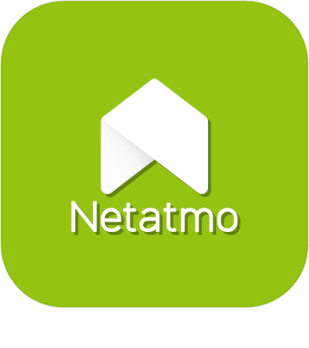|Netatmo|Plugin to recover Netatmo equipment (Weather, Energy, Security). Through the Jeedom cloud. Attention for the moment it is not possible to have the flow of the cameras.|[Documentation Stable](../netatmo/en_US/index.md) - [Beta documentation](../netatmo/beta/en_US/index.md) [Market](https://market.jeedom.com/index.php?v=d&p=market_display&id=4062) [Changelog Stable](../netatmo/en_US/changelog.md) - [Changelog beta](../netatmo/beta/en_US/changelog.md)|
|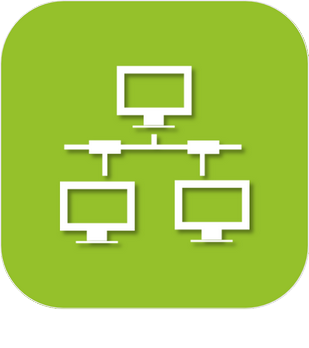|Network|Plugin allowing network management of equipment : ping (ip, arp, port) and wake on lan|[Documentation Stable](../networks/en_US/index.md) - [Beta documentation](../networks/beta/en_US/index.md) [Market](https://market.jeedom.com/index.php?v=d&p=market_display&id=1950) [Changelog Stable](../networks/en_US/changelog.md) - [Changelog beta](../networks/beta/en_US/changelog.md)|
|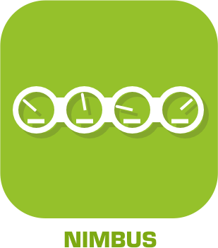|Nimbus|Plugin to control your Nimbus.  You can control the displayed text, the position of the hands. All via scenario or via the dashboard.  A customizable representation of the nimbus on your dash will enhance the whole  The dashboard is completely customizable  You can change the position of each needle and change the text of each screen independently (either via the dashboard or via scenario)  There is also a demo command and an all command (to act on all screens at the same time), as well as a phrase command to split a phrase on the 4 screens.   Read the documentation|[Documentation Stable](../nimbus/en_US/index.md) [Market](https://market.jeedom.com/index.php?v=d&p=market_display&id=1506) [Changelog Stable](../nimbus/en_US/changelog.md)|
|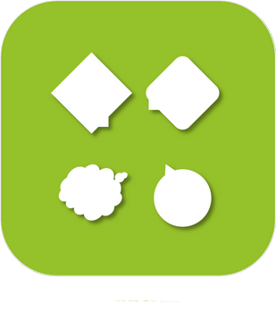|Notification Manager|This plugin is used to manage notifications (recovery in case of error, generation of text, etc...).|[Documentation Stable](../notificationmanager/en_US/index.md) - [Beta documentation](../notificationmanager/beta/en_US/index.md) [Market](https://market.jeedom.com/index.php?v=d&p=market_display&id=3315) [Changelog Stable](../notificationmanager/en_US/changelog.md) - [Changelog beta](../notificationmanager/beta/en_US/changelog.md)|
|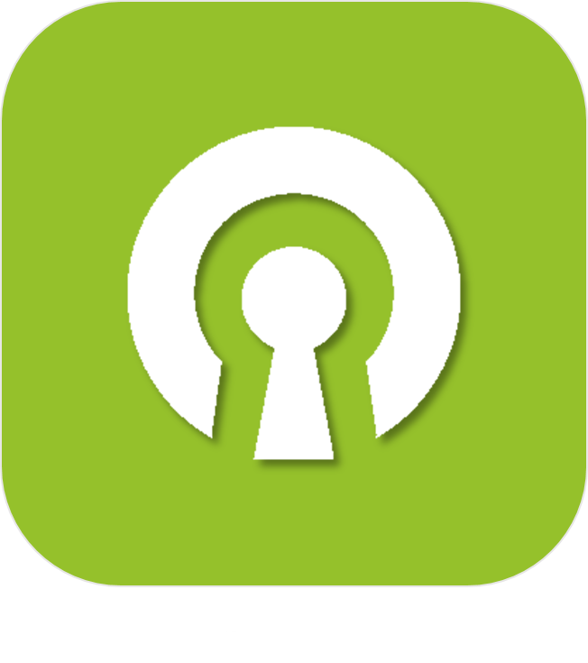|Openvpn|Plugin to manage the connection to an openvpn server.|[Documentation Stable](../openvpn/en_US/index.md) - [Beta documentation](../openvpn/beta/en_US/index.md) [Market](https://market.jeedom.com/index.php?v=d&p=market_display&id=1965) [Changelog Stable](../openvpn/en_US/changelog.md) - [Changelog beta](../openvpn/beta/en_US/changelog.md)|
|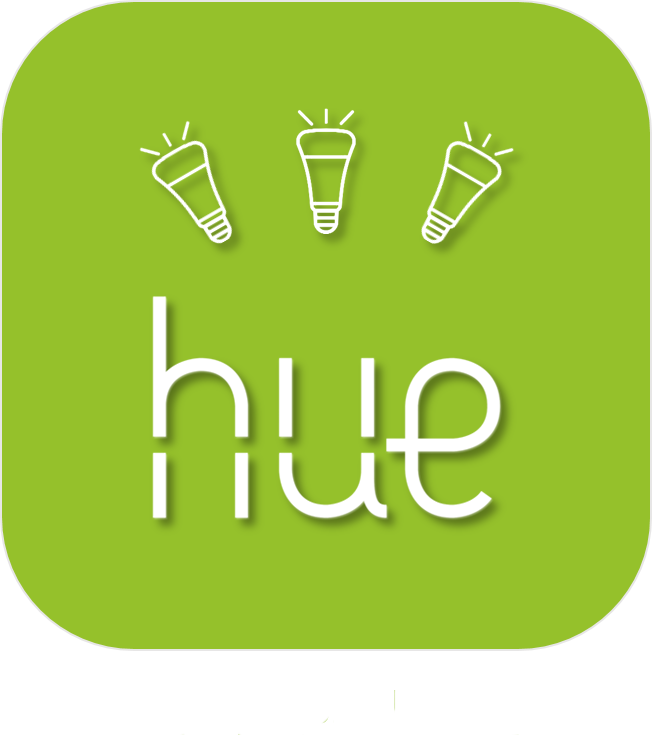|Philips Hue|Plugin to integrate a Philips Hue ecosystem in Jeedom. The plugin is able to manage up to 2 bridges simultaneously.|[Documentation Stable](../philipsHue/en_US/index.md) - [Beta documentation](../philipsHue/beta/en_US/index.md) [Market](https://market.jeedom.com/index.php?v=d&p=market_display&id=190) [Changelog Stable](../philipsHue/en_US/changelog.md) - [Changelog beta](../philipsHue/beta/en_US/changelog.md)|
||Phone market|Plugin to use the market as an SMS gateway and to make calls|[Documentation Stable](../phonemarket/en_US/index.md) - [Beta documentation](../phonemarket/beta/en_US/index.md) [Market](https://market.jeedom.com/index.php?v=d&p=market_display&id=1694) [Changelog Stable](../phonemarket/en_US/changelog.md) - [Changelog beta](../phonemarket/beta/en_US/changelog.md)|
|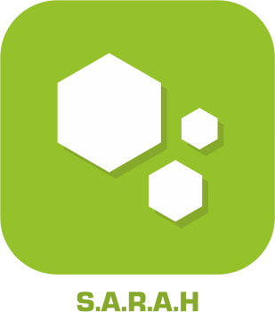|Sarah|Plugin pour utiliser Sarah (http://encausse.wordpress.com/s-a-r-a-h/)|[Documentation Stable](../sarah/en_US/index.md) [Market](https://market.jeedom.com/index.php?v=d&p=market_display&id=17) [Changelog Stable](../sarah/en_US/changelog.md)|
|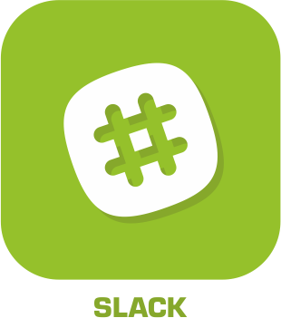|Slack|Plugin to link Jeedom to Slack|[Documentation Stable](../slack/en_US/index.md) [Market](https://market.jeedom.com/index.php?v=d&p=market_display&id=1689) [Changelog Stable](../slack/en_US/changelog.md)|
||SMS|Plugin adding the management (sending / receiving) of SMS to Jeedom. With this plugin you can be notified by SMS, even ask a question or trigger an action via SMS thanks to the interaction engine. (Requires a 3G key and a SIM card ).|[Documentation Stable](../sms/en_US/index.md) - [Beta documentation](../sms/beta/en_US/index.md) [Market](https://market.jeedom.com/index.php?v=d&p=market_display&id=16) [Changelog Stable](../sms/en_US/changelog.md) - [Changelog beta](../sms/beta/en_US/changelog.md)|
|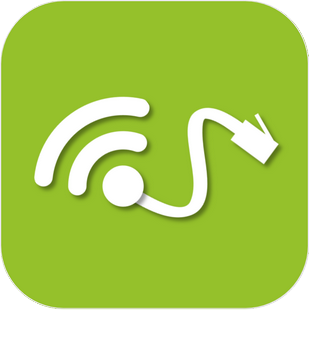|Wifip|Plugin to manage the wifi of your box as well as fix the IP.|[Documentation Stable](../wifip/en_US/index.md) [Market](https://market.jeedom.com/index.php?v=d&p=market_display&id=2286) [Changelog Stable](../wifip/en_US/changelog.md)|
|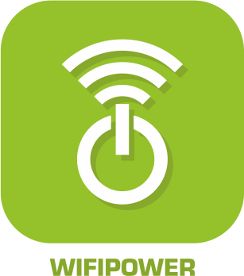|Wifipower|Wifipower equipment management plugin|[Documentation Stable](../wifipower/en_US/index.md) [Market](https://market.jeedom.com/index.php?v=d&p=market_display&id=1046) [Changelog Stable](../wifipower/en_US/changelog.md)|
||Wireguard|Plugin to manage the connection to a wireguard server. Only compatible with Jeedom DNS for the moment|[Documentation Stable](../wireguard/en_US/index.md) - [Beta documentation](../wireguard/beta/en_US/index.md) [Market](https://market.jeedom.com/index.php?v=d&p=market_display&id=4222) [Changelog Stable](../wireguard/en_US/changelog.md) - [Changelog beta](../wireguard/beta/en_US/changelog.md)|
