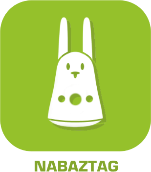

>**Wichtig**
>Nur offizielle Plugins haben hier ihre Dokumentation. Sie können die Dokumentation der anderen Plugins direkt im Jeedom Market einsehen. Klicken Sie im betreffenden Plugin auf Dokumentation.
>Sie können sehen [hier](https://market.jeedom.com/index.php?v=d&p=market&type=plugin&categorie=devicecommunication) Alle offiziellen Plugins in dieser Kategorie

| | | | |
|--- | --- | --- | ---|
||Blink(1)|Plugin zur Steuerung eines Blinkschlüssels (1)|[Dokumentation Stall](../blink1/de_DE/index.md) [Markt](https://market.jeedom.com/index.php?v=d&p=market_display&id=1244) [Änderungsprotokoll stabil](../blink1/de_DE/changelog.md)|
||Husqvarna|| [Markt](https://market.jeedom.com/index.php?v=d&p=market_display&id=3101)|
||Ikea|Mit dem IkeaLight-Plugin kann eine Verbindung zum Ikea Tradfri-Gateway hergestellt werden. Sie können Ihre Lichter steuern und Echtzeit-Status-Feedback erhalten.|[Dokumentation Stall](../ikealight/de_DE/index.md) - [Beta-Dokumentation](../ikealight/beta/de_DE/index.md) [Markt](https://market.jeedom.com/index.php?v=d&p=market_display&id=3039) [Änderungsprotokoll stabil](../ikealight/de_DE/changelog.md) - [Änderungsprotokoll Beta](../ikealight/beta/de_DE/changelog.md)|
||Karotz|Plugin um den Karotz zu bestellen|[Dokumentation Stall](../karotz/de_DE/index.md) - [Beta-Dokumentation](../karotz/beta/de_DE/index.md) [Markt](https://market.jeedom.com/index.php?v=d&p=market_display&id=148) [Änderungsprotokoll stabil](../karotz/de_DE/changelog.md) - [Änderungsprotokoll Beta](../karotz/beta/de_DE/changelog.md)|
||Lifx|Plugin zur Steuerung von Lifx-Lampen|[Dokumentation Stall](../lifx/de_DE/index.md) - [Beta-Dokumentation](../lifx/beta/de_DE/index.md) [Markt](https://market.jeedom.com/index.php?v=d&p=market_display&id=2070) [Änderungsprotokoll stabil](../lifx/de_DE/changelog.md) - [Änderungsprotokoll Beta](../lifx/beta/de_DE/changelog.md)|
||Nabaztag|Plugin um den Nabaztag zu bestellen|[Dokumentation Stall](../nabaztag/de_DE/index.md) [Markt](https://market.jeedom.com/index.php?v=d&p=market_display&id=151) [Änderungsprotokoll stabil](../nabaztag/de_DE/changelog.md)|
