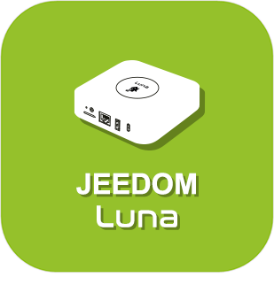
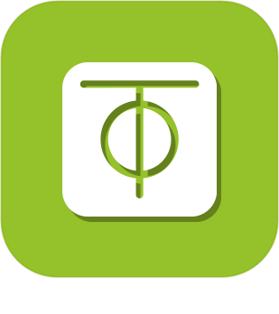

>**Important**
>Only official plugins have their documentation here. You can consult the documentation of the other plugins directly from the Jeedom Market. Once on the plugin in question, click on documentation.
>You can see [here](https://market.jeedom.com/index.php?v=d&p=market&type=plugin&categorie=home+automation+protocol) all official plugins in this category

| | | | |
|--- | --- | --- | ---|
||Atlas|Specialized plugin for the Jeedom Atlas box.|[Documentation Stable](../atlas/en_US/index.md) - [Beta Documentation](../atlas/beta/en_US/index.md) [Market](https://market.jeedom.com/index.php?v=d&p=market_display&id=4195) [Changelog Stable](../atlas/en_US/changelog.md) - [Changelog Beta](../atlas/beta/en_US/changelog.md)|
||Luna|Specialized plugin for the Jeedom Luna box.|[Documentation Stable](../luna/en_US/index.md) - [Beta Documentation](../luna/beta/en_US/index.md) [Market](https://market.jeedom.com/index.php?v=d&p=market_display&id=4346) [Changelog Stable](../luna/en_US/changelog.md) - [Changelog Beta](../luna/beta/en_US/changelog.md)|
||zeroTier|ZeroTier Plugin with Client Mode or Admin Mode|[Documentation Stable](../zeroTier/en_US/index.md) - [Beta Documentation](../zeroTier/beta/en_US/index.md) [Market](https://market.jeedom.com/index.php?v=d&p=market_display&id=4518) [Changelog Stable](../zeroTier/en_US/changelog.md) - [Changelog Beta](../zeroTier/beta/en_US/changelog.md)|
