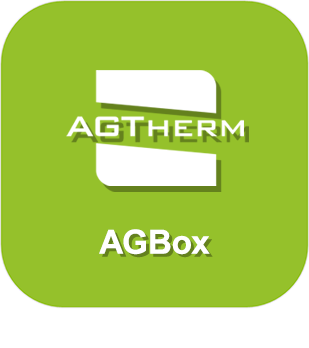

>**Importante**
>Solo los complementos oficiales tienen su documentación aquí. Puede consultar la documentación de los otros complementos directamente desde Jeedom Market. Una vez en el complemento en cuestión, haga clic en la documentación.
>Podéis ver [aquí](https://market.jeedom.com/index.php?v=d&p=market&type=plugin&categorie=monitoring) todos los complementos oficiales en esta categoría

| | | | |
|--- | --- | --- | ---|
||JeeDashboard-Agbox|Complemento utilizado para configurar JeeDashboard|[Documentación estable](../jeeDashboardAgbox/es_ES/index.md) - [Documentación beta](../jeeDashboardAgbox/beta/es_ES/index.md) [Mercado](https://market.jeedom.com/index.php?v=d&p=market_display&id=4523) [Registro de cambios estable](../jeeDashboardAgbox/es_ES/changelog.md) - [Lista de cambios beta](../jeeDashboardAgbox/beta/es_ES/changelog.md)|
||JeeDashboard-Monitoring|Plugin de publication notification Cloud.|[Documentación estable](../jeeDashboardMonitoring/es_ES/index.md) - [Documentación beta](../jeeDashboardMonitoring/beta/es_ES/index.md) [Mercado](https://market.jeedom.com/index.php?v=d&p=market_display&id=4606) [Registro de cambios estable](../jeeDashboardMonitoring/es_ES/changelog.md) - [Lista de cambios beta](../jeeDashboardMonitoring/beta/es_ES/changelog.md)|
||JeeDashboard-Publish|Complemento que le permite publicar valores de Jeedom en MQTT|[Documentación estable](../jeeDashboardPublish/es_ES/index.md) - [Documentación beta](../jeeDashboardPublish/beta/es_ES/index.md) [Mercado](https://market.jeedom.com/index.php?v=d&p=market_display&id=4482) [Registro de cambios estable](../jeeDashboardPublish/es_ES/changelog.md) - [Lista de cambios beta](../jeeDashboardPublish/beta/es_ES/changelog.md)|
||JeeDashboard-SunPulse|Plugin de communication MADEnR|[Documentación estable](../jeeDashboardSunPulse/es_ES/index.md) - [Documentación beta](../jeeDashboardSunPulse/beta/es_ES/index.md) [Mercado](https://market.jeedom.com/index.php?v=d&p=market_display&id=4574) [Registro de cambios estable](../jeeDashboardSunPulse/es_ES/changelog.md) - [Lista de cambios beta](../jeeDashboardSunPulse/beta/es_ES/changelog.md)|
||JeeDashboard-Voe|Plugin de publication Cloud|[Documentación estable](../jeeDashboardVoe/es_ES/index.md) - [Documentación beta](../jeeDashboardVoe/beta/es_ES/index.md) [Mercado](https://market.jeedom.com/index.php?v=d&p=market_display&id=4570) [Registro de cambios estable](../jeeDashboardVoe/es_ES/changelog.md) - [Lista de cambios beta](../jeeDashboardVoe/beta/es_ES/changelog.md)|
||Monitoring|Complemento de monitoreo local y remoto por SSH|[Documentación estable](../monitoring2/es_ES/index.md) - [Documentación beta](../monitoring2/beta/es_ES/index.md) [Mercado](https://market.jeedom.com/index.php?v=d&p=market_display&id=3317) [Registro de cambios estable](../monitoring2/es_ES/changelog.md) - [Lista de cambios beta](../monitoring2/beta/es_ES/changelog.md)|
||Inversor (TUERCA)|Complemento para recuperar información de los inversores a través de la tuerca|[Documentación estable](../nut/es_ES/index.md) - [Documentación beta](../nut/beta/es_ES/index.md) [Mercado](https://market.jeedom.com/index.php?v=d&p=market_display&id=1500) [Registro de cambios estable](../nut/es_ES/changelog.md) - [Lista de cambios beta](../nut/beta/es_ES/changelog.md)|
||Octoprint|Plugin para monitorear sus servidores de impresión 3D|[Documentación estable](../octoprint/es_ES/index.md) [Mercado](https://market.jeedom.com/index.php?v=d&p=market_display&id=3295) [Registro de cambios estable](../octoprint/es_ES/changelog.md)|
||Ubiquiti Unifi proteger|Complemento para conectar Jeedom a Unifi Protect|[Documentación estable](../unifiprotect/es_ES/index.md) - [Documentación beta](../unifiprotect/beta/es_ES/index.md) [Mercado](https://market.jeedom.com/index.php?v=d&p=market_display&id=4188) [Registro de cambios estable](../unifiprotect/es_ES/changelog.md) - [Lista de cambios beta](../unifiprotect/beta/es_ES/changelog.md)|
||Ventilairsec||[Documentación estable](../ventilairsec/es_ES/index.md) - [Documentación beta](../ventilairsec/beta/es_ES/index.md) [Mercado](https://market.jeedom.com/index.php?v=d&p=market_display&id=3895)|
