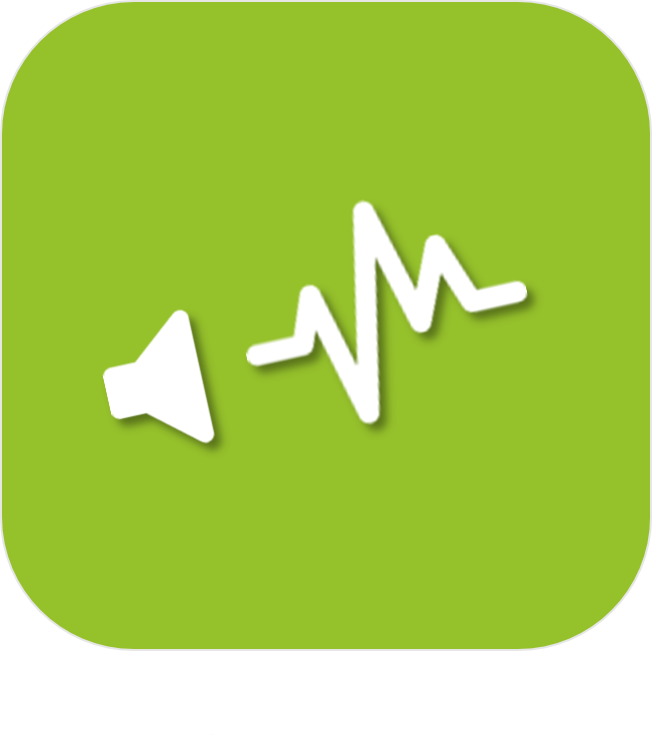
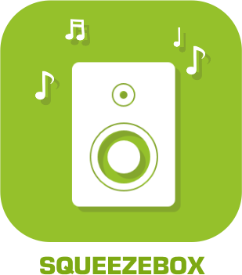

# Multimédia

>**IMPORTANT**
>Seuls les plugins officiels ont leur documentation ici. Vous pouvez consulter les documentations des autres plugins directement depuis le Market Jeedom. Une fois sur le plugin en question, cliquez sur documentation.
>Vous pouvez voir [ici](https://market.jeedom.com/index.php?v=d&p=market&type=plugin&categorie=multimedia) tous les plugins officiels de cette catégorie

| | | | |
|--- | --- | --- | ---|
||Denon|Plugin permettant de piloter les amplificateurs Denon|[Documentation](../denonavr/pt_PT/index.md) [Market](https://market.jeedom.com/index.php?v=d&p=market_display&id=2077) [Changelog](../denonavr/pt_PT/changelog.md)|
||Harmony Hub|Plugin pour controller votre Harmony Hub|[Documentation](../harmonyhub/pt_PT/index.md) [Market](https://market.jeedom.com/index.php?v=d&p=market_display&id=1599) [Changelog](../harmonyhub/pt_PT/changelog.md)|
||Ambilight|Plugin hyperion pour le controle de celui-ci|[Documentation](../hyperion2/pt_PT/index.md) [Market](https://market.jeedom.com/index.php?v=d&p=market_display&id=1909) [Changelog](../hyperion2/pt_PT/changelog.md)|
||Kodi|Plugin pour envoyer et recevoir des commandes à/depuis Kodi|[Documentation](../kodi/pt_PT/index.md) [Market](https://market.jeedom.com/index.php?v=d&p=market_display&id=1398) [Changelog](../kodi/pt_PT/changelog.md)|
||Pulseaudio|Auteur du plugin : Slobberbone. ATTENTION, il ne s’agit pas d’un plugin Officiel Jeedom mais d’un plugin développé par une tierce personne et dont l’évolution a été abandonnée. L’équipe technique Jeedom assurera l’assistance sur ce plugin sans obligation de résultat.|[Documentation](../pulseaudio/pt_PT/index.md) [Market](https://market.jeedom.com/index.php?v=d&p=market_display&id=2704) [Changelog](../pulseaudio/pt_PT/changelog.md)|
||Roku|Plugin pour gérer vos rokus|[Documentation](../roku/pt_PT/index.md) [Market](https://market.jeedom.com/index.php?v=d&p=market_display&id=2301) [Changelog](../roku/pt_PT/changelog.md)|
||Sons|Plugin permettant d'ajouter des MP3 pour etre jouer par des plugins TTS (utilisant le TTS Jeedom)|[Documentation](../songs/pt_PT/index.md) [Market](https://market.jeedom.com/index.php?v=d&p=market_display&id=3794) [Changelog](../songs/pt_PT/changelog.md)|
||Sonos controller|Plugin de controle de Sonos/Ikea Symfonisk. ATTENTION : il faut au minimum PHP 7.0|[Documentation](../sonos3/pt_PT/index.md) [Market](https://market.jeedom.com/index.php?v=d&p=market_display&id=1502) [Changelog](../sonos3/pt_PT/changelog.md)|
||SqueezeBox Control|Ce plugin vous permet de contrôler vos Squeezebox.Il fait de l'autodecouverte, il attribue vos squeezebox aux bons objets si elles contiennent le nom de l'objet.Il permet aussi une gestion complète multidirectionnelle de la synchro. La possibilité de synchroniser toutes les squeezebox en un clic, toutes les allumer, toutes les éteindre etc.... Une fonction TTS est aussi disponibleUn panel dédié simple (mais qui va vouloir devenir très complet) est aussi disponible.De nombreuses autres fonctions sont aussi présentes|[Documentation](../squeezeboxcontrol/pt_PT/index.md) [Market](https://market.jeedom.com/index.php?v=d&p=market_display&id=1710) [Changelog](../squeezeboxcontrol/pt_PT/changelog.md)|
