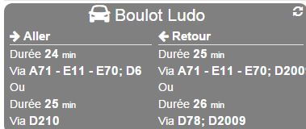
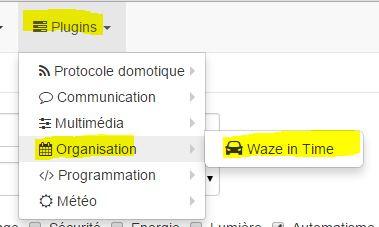
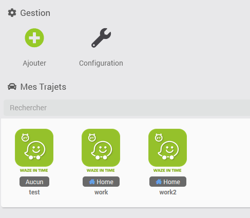
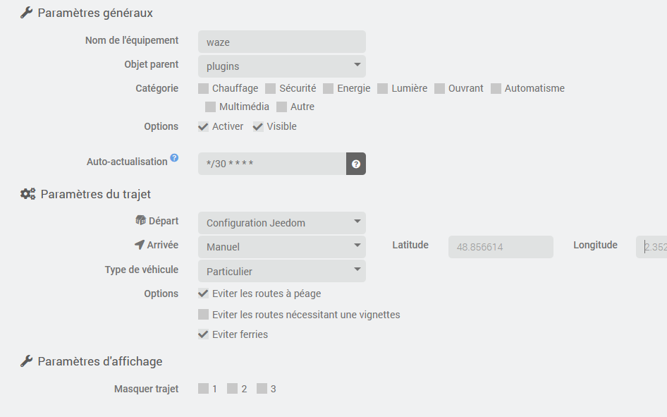

# Waze in Time plugin

This plugin provides trip information (including traffic conditions) via Waze. This plugin may stop working if Waze no longer allows queries to its website.

# Setup

## Plugin configuration

To use the plugin, you must download, install, and activate it just like any other Jeedom plugin.

Next, you'll need to create your route(s). Go to the Plugins/Organization menu, where you'll find the Waze in Time plugin:

You will then be taken to a page that lists your devices (you may have multiple Routes) and allows you to create new ones by clicking the "Add" button:

You will then be taken to the configuration page for your route:

On this page, you'll find three sections:

### General settings

In this section, you’ll find all Jeedom configurations. These include the name of your device, the object you want to associate it with, the category, whether you want the device to be active or not, and whether you want it to be visible on the dashboard.

Finally, you can configure auto-refresh if you wish. If you do not configure anything, the trip information will not be updated automatically.

### Trip parameters

This section is one of the most important; it allows you to set the start and end times.

- These infos must be the latitudes and longitudes of the positions
- You can find them by using the website provided—just click the link on the page (simply enter an address and click “Get GPS Coordinates”)

There are several ways to provide them:

- manually, you must then directly encode the latitude and longitude
- via an info command from another Jeedom plugin; you must then select the command that returns the information in the 'latitude,longitude' format
- via the Jeedom settings (see the Jeedom settings menu)
- by directly selecting a command from the geoloc or geoloc_ios plugin, if these plugins exist (this option should no longer be used for new devices; instead, use the command selection option explained above)

You can also set the route calculation options:

- **Vehicle type**: Select “Private” (default), “Taxi,” or “Motorcycle.”
- **Avoid toll roads**: When this option is checked, Waze tries to calculate a route that avoids tolls.
- **Avoid roads requiring a toll sticker**: Request a route that avoids roads subject to a toll sticker or subscription fee.
- **Avoid ferries**: Request a route that doesn't include a ferry crossing.

These options apply to the calculation of round-trip routes.

### Display settings

This setting simply hides the selected routes in the widget on the dashboard; however, they will still be updated when the device is refreshed.

# The widget

- The button in the upper right corner refreshes the information.
- All information is visible (for routes, if the route is long, it may be truncated, but the full version is visible when you hover over it with the mouse)

# How are routes updated?

The information is refreshed based on the device's auto-refresh settings. If nothing is configured, the routes will never be updated automatically.
You can refresh them on demand using a scenario with the "refresh" command, or via the dashboard using the double arrows.
