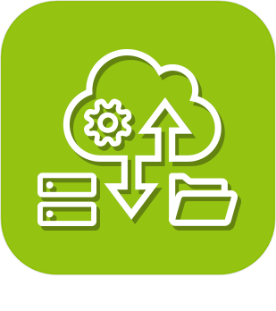
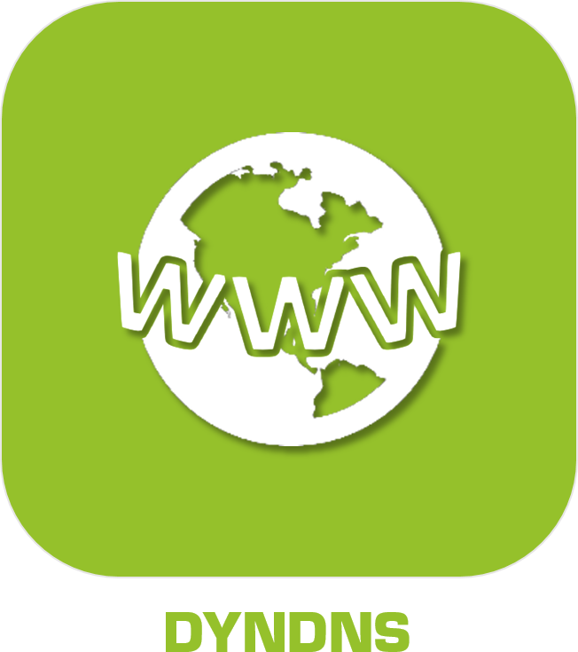
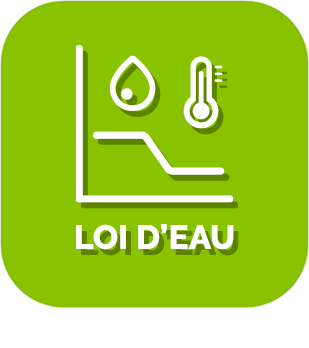

>**Wichtig**
>Nur offizielle Plugins haben hier ihre Dokumentation. Sie können die Dokumentation der anderen Plugins direkt im Jeedom Market einsehen. Klicken Sie im betreffenden Plugin auf Dokumentation.
>Sie können sehen [hier](https://market.jeedom.com/index.php?v=d&p=market&type=plugin&categorie=programming) Alle offiziellen Plugins in dieser Kategorie

| | | | |
|--- | --- | --- | ---|
||Atlas|ACHTUNG Plugin nur in Beta verfügbar Spezialisierte Plugins für den Atlas|[Beta-Dokumentation](../atlas/beta/de_DE/index.md) [Markt](https://market.jeedom.com/index.php?v=d&p=market_display&id=4195) [Changelog-Beta](../atlas/beta/de_DE/changelog.md)|
||Klicken Sie auf den Link|Dieses Plugin ermöglicht die Verwaltung von Links und Ereignissen direkt auf der Jeedom-Oberfläche. Sie können beispielsweise einen Befehl erstellen, der ein Modal (Dialogfenster) mit einer Ansicht öffnet, die Ihre Kameras enthält. Dies ermöglicht es, wenn jemand an Ihrer Tür klingelt, die Eingangskamera auf Ihrem Jeedom anzuzeigen.|[Dokumentation Stall](../clink/de_DE/index.md) - [Beta-Dokumentation](../clink/beta/de_DE/index.md) [Markt](https://market.jeedom.com/index.php?v=d&p=market_display&id=1867) [Änderungsprotokoll stabil](../clink/de_DE/changelog.md) - [Changelog-Beta](../clink/beta/de_DE/changelog.md)|
||DataService|ACHTUNG Plugin nur in Beta verfügbar Plugin für die Wiederherstellung verschiedener Daten (ejp, Vakanz, Heiliger des Tages ...) und das Versenden verschiedener Daten (Sms, Mail) sowie das Teilen von Daten in der Community (Temperatur, Luftfeuchtigkeit)...)|[Beta-Dokumentation](../dataservice/beta/de_DE/index.md) [Markt](https://market.jeedom.com/index.php?v=d&p=market_display&id=3886) [Changelog-Beta](../dataservice/beta/de_DE/changelog.md)|
||Docker-Verwaltung|Docker-Plugin zum Verwalten von Containern in Jeedom.|[Dokumentation Stall](../docker2/de_DE/index.md) - [Beta-Dokumentation](../docker2/beta/de_DE/index.md) [Markt](https://market.jeedom.com/index.php?v=d&p=market_display&id=4204) [Änderungsprotokoll stabil](../docker2/de_DE/changelog.md) - [Changelog-Beta](../docker2/beta/de_DE/changelog.md)|
||Dyndns|Plugin zum dynamischen Aktualisieren von DNS|[Dokumentation Stall](../dyndns/de_DE/index.md) - [Beta-Dokumentation](../dyndns/beta/de_DE/index.md) [Markt](https://market.jeedom.com/index.php?v=d&p=market_display&id=1928) [Änderungsprotokoll stabil](../dyndns/de_DE/changelog.md) - [Changelog-Beta](../dyndns/beta/de_DE/changelog.md)|
||Allgemeiner Typ|Generischer Plugin-Typ|[Dokumentation Stall](../genTypePerso/de_DE/index.md) - [Beta-Dokumentation](../genTypePerso/beta/de_DE/index.md) [Markt](https://market.jeedom.com/index.php?v=d&p=market_display&id=4494) [Änderungsprotokoll stabil](../genTypePerso/de_DE/changelog.md) - [Changelog-Beta](../genTypePerso/beta/de_DE/changelog.md)|
||HTML-Anzeige|Plugin zum Einfügen von HTML-Code in ein Geräte-Widget (zum Beispiel zum Erstellen eines eigenen Menüs für Designs).|[Dokumentation Stall](../htmldisplay/de_DE/index.md) - [Beta-Dokumentation](../htmldisplay/beta/de_DE/index.md) [Markt](https://market.jeedom.com/index.php?v=d&p=market_display&id=3843) [Änderungsprotokoll stabil](../htmldisplay/de_DE/changelog.md) - [Changelog-Beta](../htmldisplay/beta/de_DE/changelog.md)|
||JeeDashboard-Agbox|Plugin zur Konfiguration von JeeDashboard|[Dokumentation Stall](../jeeDashboardAgbox/de_DE/index.md) - [Beta-Dokumentation](../jeeDashboardAgbox/beta/de_DE/index.md) [Markt](https://market.jeedom.com/index.php?v=d&p=market_display&id=4523) [Änderungsprotokoll stabil](../jeeDashboardAgbox/de_DE/changelog.md) - [Changelog-Beta](../jeeDashboardAgbox/beta/de_DE/changelog.md)|
||Jeeasy|Plugin zur einfachen Konfiguration von Jeedom|[Dokumentation Stall](../jeeasy/de_DE/index.md) - [Beta-Dokumentation](../jeeasy/beta/de_DE/index.md) [Markt](https://market.jeedom.com/index.php?v=d&p=market_display&id=3828) [Änderungsprotokoll stabil](../jeeasy/de_DE/changelog.md) - [Changelog-Beta](../jeeasy/beta/de_DE/changelog.md)|
||LNS|Plugin zur Installation von Chirpstack V3 auf Jeedom Luna Lora|[Dokumentation Stall](../lns/de_DE/index.md) - [Beta-Dokumentation](../lns/beta/de_DE/index.md) [Markt](https://market.jeedom.com/index.php?v=d&p=market_display&id=4408) [Änderungsprotokoll stabil](../lns/de_DE/changelog.md) - [Changelog-Beta](../lns/beta/de_DE/changelog.md)|
||Wasserrecht|Plugin, mit dem Sie das Wasserrecht verwalten können|[Dokumentation Stall](../loideau/de_DE/index.md) - [Beta-Dokumentation](../loideau/beta/de_DE/index.md) [Markt](https://market.jeedom.com/index.php?v=d&p=market_display&id=4491) [Änderungsprotokoll stabil](../loideau/de_DE/changelog.md) - [Changelog-Beta](../loideau/beta/de_DE/changelog.md)|
||MQTT-Manager|Plugin als Basis für Plugins mit MQTT|[Dokumentation Stall](../mqtt2/de_DE/index.md) - [Beta-Dokumentation](../mqtt2/beta/de_DE/index.md) [Markt](https://market.jeedom.com/index.php?v=d&p=market_display&id=4213) [Änderungsprotokoll stabil](../mqtt2/de_DE/changelog.md) - [Changelog-Beta](../mqtt2/beta/de_DE/changelog.md)|
||Script|Plugin, das Skriptunterstützung in Jeedom hinzufügt. Die Skripte sind Programme in Python / PHP / Shell / Ruby usw., mit denen Jeedom Funktionen hinzugefügt werden können|[Dokumentation Stall](../script/de_DE/index.md) - [Beta-Dokumentation](../script/beta/de_DE/index.md) [Markt](https://market.jeedom.com/index.php?v=d&p=market_display&id=20) [Änderungsprotokoll stabil](../script/de_DE/changelog.md) - [Changelog-Beta](../script/beta/de_DE/changelog.md)|
||Anwesenheitssimulation|Plugin zur Anwesenheitssimulation|[Dokumentation Stall](../simupre/de_DE/index.md) - [Beta-Dokumentation](../simupre/beta/de_DE/index.md) [Markt](https://market.jeedom.com/index.php?v=d&p=market_display&id=3762) [Änderungsprotokoll stabil](../simupre/de_DE/changelog.md) - [Changelog-Beta](../simupre/beta/de_DE/changelog.md)|
||sunPulseEasy|Wizard de configuration pour les installateurs SunPulse|[Dokumentation Stall](../sunPulseEasy/de_DE/index.md) - [Beta-Dokumentation](../sunPulseEasy/beta/de_DE/index.md) [Markt](https://market.jeedom.com/index.php?v=d&p=market_display&id=4583) [Änderungsprotokoll stabil](../sunPulseEasy/de_DE/changelog.md) - [Changelog-Beta](../sunPulseEasy/beta/de_DE/changelog.md)|
||Virtuel|Plugin zum Erstellen virtueller Geräte in Jeedom.|[Dokumentation Stall](../virtual/de_DE/index.md) - [Beta-Dokumentation](../virtual/beta/de_DE/index.md) [Markt](https://market.jeedom.com/index.php?v=d&p=market_display&id=21) [Änderungsprotokoll stabil](../virtual/de_DE/changelog.md) - [Changelog-Beta](../virtual/beta/de_DE/changelog.md)|
||Widget|Plugin zum Anwenden / Ändern / Erstellen von Widgets|[Dokumentation Stall](../widget/de_DE/index.md) [Markt](https://market.jeedom.com/index.php?v=d&p=market_display&id=9) [Änderungsprotokoll stabil](../widget/de_DE/changelog.md)|
