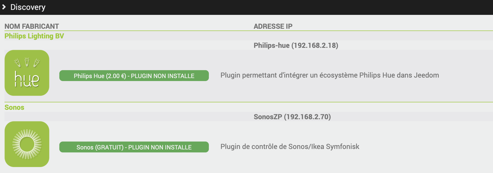

# Complemento Jeeasy

Jeeasy es el asistente de configuración oficial de Jeedom. Te guía paso a paso en la puesta en marcha de tu instalación: idioma, parámetros principales, instalación de complementos y creación de tus primeras estancias.

>**IMPORTANTE**
>
>Es necesario disponer de una cuenta de Market para instalar y utilizar el asistente de configuración.

## Iniciar el asistente

Al conectarse por primera vez a una nueva instalación, Jeedom le propone iniciar el proceso con el asistente de configuración. Si aún no ha introducido sus datos de acceso a Market, se le solicitarán antes de que se inicie el asistente.

<!-- Capture : fenêtre de première utilisation (choix assistant / sauvegarde) -->

El asistente también se puede volver a activar en cualquier momento:

- desde el botón **Asistente de configuración** de la ventana **Acerca de**, a la que se accede haciendo clic en la versión de Jeedom en el menú de usuario situado en la esquina superior derecha,
- desde la página del complemento, a través de **Complementos → Programación → Jeeasy**, haciendo clic en **Asistente de configuración**.

## Navegar por el asistente

El asistente se muestra a pantalla completa en forma de una sucesión de pasos. Las flechas de la parte inferior de la pantalla permiten pasar al siguiente paso o volver al anterior, y los botones numerados permiten acceder directamente a un paso concreto.

<!-- Capture : assistant en plein écran avec les pastilles de navigation -->

El botón **Cerrar el asistente**, situado en la parte superior de la pantalla, permite salir del asistente en cualquier momento. En ese caso, algunas configuraciones no se llevarán a cabo y los complementos propuestos no se instalarán.

## Los pasos del asistente

### Inicio

Selecciona el idioma y el país de tu instalación.

### Configuración general

Modifica el nombre de tu instalación y su zona horaria.

### Interfaz

Elige el tema de la interfaz y decide si quieres que los iconos aparezcan en color o no.

### Redes

Comprueba las direcciones de acceso a tu instalación:

- **Local**: la dirección de acceso desde tu red local, gestionada automáticamente por defecto,
- **Externo**: la dirección de acceso desde el exterior. Si tu paquete de servicios incluye el acceso remoto, puedes activarlo directamente desde este paso.

### Complementos

Dependiendo de tu paquete de servicios, el asistente te ofrece una selección de complementos. En un router **Atlas**, **Luna** o **Freebox Delta**, el complemento específico para tu router aparece en primer lugar de la lista. Haz clic en los que quieras instalar; se instalarán y activarán tras confirmarlo al pasar al siguiente paso, con la gestión automática de sus dependencias y su servicio en segundo plano.

<!-- Capture : étape Plugins avec quelques plugins sélectionnés -->

### Objetos

Elige el objeto principal que mejor se adapte a tu instalación (un piso, una casa o un edificio) y, a continuación, selecciona las estancias que quieras crear. También puedes optar por no definir ningún objeto principal.

<!-- Capture : étape Objets, choix des pièces -->

### Servicios

Descubre los servicios de Jeedom que completan tu instalación: copias de seguridad en la nube, acceso remoto, asistentes de voz, supervisión, SMS y llamadas.

### Listo para empezar

Tu instalación ya está configurada. Los complementos seleccionados pueden seguir instalándose en segundo plano durante unos minutos, hasta 30 minutos dependiendo del número de ellos, y puedes empezar a utilizar Jeedom mientras tanto. Haz clic en la marca de verificación situada en la parte inferior derecha para salir del asistente.

## Página del complemento

La página del complemento, a la que se puede acceder a través de **Complementos → Programación → Jeeasy**, también ofrece otras herramientas:

- **Detectar mis dispositivos**: analiza tu red local en busca de dispositivos y te sugiere los complementos compatibles para controlarlos,
- **Configurar mi casa**: crea una nueva estancia o modifica una ya existente,
- **Añadir un dispositivo**: te guía en el proceso de añadir un módulo según su tecnología,
- **Configurar un dispositivo**: te guía en la configuración de un dispositivo existente según su tipo.

<!-- Capture : page du plugin (remplace menuJeeasy.png) -->

