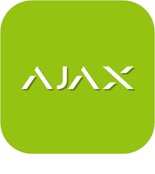
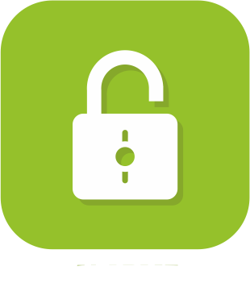
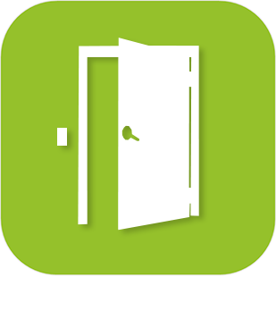
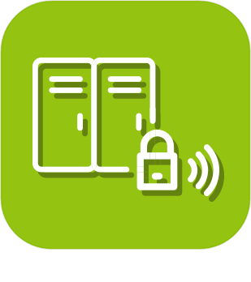
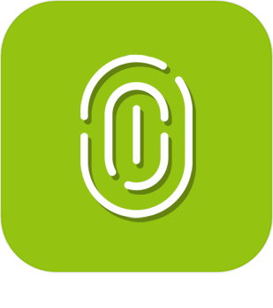
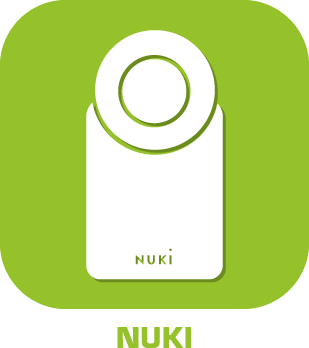
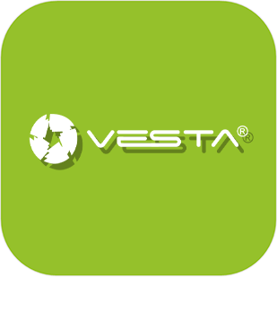

>**Wichtig**
>Nur offizielle Plugins haben hier ihre Dokumentation. Sie können die Dokumentation der anderen Plugins direkt im Jeedom Market einsehen. Klicken Sie im betreffenden Plugin auf Dokumentation.
>Sie können sehen [hier](https://market.jeedom.com/index.php?v=d&p=market&type=plugin&categorie=security) Alle offiziellen Plugins in dieser Kategorie

| | | | |
|--- | --- | --- | ---|
||Ajax-Systeme|Plugin zum Verbinden mit einem Ajax-Alarm|[Dokumentation Stall](../ajaxSystem/de_DE/index.md) - [Beta-Dokumentation](../ajaxSystem/beta/de_DE/index.md) [Markt](https://market.jeedom.com/index.php?v=d&p=market_display&id=4150) [Änderungsprotokoll stabil](../ajaxSystem/de_DE/changelog.md) - [Changelog-Beta](../ajaxSystem/beta/de_DE/changelog.md)|
||Alarme|Sicherheitsmanagement-Plugin. Erstellen Sie Ihren Alarm einfach (ohne Programmierung), vollständig und anpassbar.|[Dokumentation Stall](../alarm/de_DE/index.md) - [Beta-Dokumentation](../alarm/beta/de_DE/index.md) [Markt](https://market.jeedom.com/index.php?v=d&p=market_display&id=26) [Änderungsprotokoll stabil](../alarm/de_DE/changelog.md) - [Changelog-Beta](../alarm/beta/de_DE/changelog.md)|
||Kamera|Plugin zur Anzeige von IP-Kameras. Die Videoanzeige der Kamera erfolgt jede Sekunde durch aufeinanderfolgende Schnappschüsse (Aufnahmen). Das Plugin ist mit RTSP-Kameras kompatibel.|[Dokumentation Stall](../camera/de_DE/index.md) - [Beta-Dokumentation](../camera/beta/de_DE/index.md) [Markt](https://market.jeedom.com/index.php?v=d&p=market_display&id=70) [Änderungsprotokoll stabil](../camera/de_DE/changelog.md) - [Changelog-Beta](../camera/beta/de_DE/changelog.md)|
||Zugriffsverwaltung|Plugin, mit dem Sie die Zugriffskontrolle eines Gebäudes über die Erstellung von Benutzern, Gruppen, Zeitfenstern und Lesern / Aktoren verwalten können. Achtung : PREMIUM-Plugins sind in keinem Service Pack enthalten. Sie sind nur auf Anfrage bei Jeedom erhältlich (Kontakt über unsere Website).|[Dokumentation Stall](../gestAccess/de_DE/index.md) - [Beta-Dokumentation](../gestAccess/beta/de_DE/index.md) [Markt](https://market.jeedom.com/index.php?v=d&p=market_display&id=3686) [Änderungsprotokoll stabil](../gestAccess/de_DE/changelog.md) - [Changelog-Beta](../gestAccess/beta/de_DE/changelog.md)|
||jeelocker|ACHTUNG Plugin nur in Beta verfügbar Jeelocker ist ein Plugin für die Schließfachzugriffsverwaltung|[Beta-Dokumentation](../jeelocker/beta/de_DE/index.md) [Markt](https://market.jeedom.com/index.php?v=d&p=market_display&id=4238) [Changelog-Beta](../jeelocker/beta/de_DE/changelog.md)|
||Netatmo Sicherheit|Plugin für Netatmo Security. Achtung, um den Videostream anzuzeigen, benötigen Sie das Kamera-Plugin|[Dokumentation Stall](../netatmoWelcome/de_DE/index.md) - [Beta-Dokumentation](../netatmoWelcome/beta/de_DE/index.md) [Markt](https://market.jeedom.com/index.php?v=d&p=market_display&id=1967) [Änderungsprotokoll stabil](../netatmoWelcome/de_DE/changelog.md) - [Changelog-Beta](../netatmoWelcome/beta/de_DE/changelog.md)|
||Nuki|Mit diesem Plugin können Sie Nuki-verbundene Schlösser über die Brücke steuern. Außerdem kann die Bridge im Push-Modus konfiguriert werden|[Dokumentation Stall](../nuki/de_DE/index.md) - [Beta-Dokumentation](../nuki/beta/de_DE/index.md) [Markt](https://market.jeedom.com/index.php?v=d&p=market_display&id=2819) [Änderungsprotokoll stabil](../nuki/de_DE/changelog.md) - [Changelog-Beta](../nuki/beta/de_DE/changelog.md)|
||Simons Voss|Plugin für Simons Voss Smart Intego-Sperren|[Dokumentation Stall](../simonsvoss/de_DE/index.md) - [Beta-Dokumentation](../simonsvoss/beta/de_DE/index.md) [Markt](https://market.jeedom.com/index.php?v=d&p=market_display&id=3906)|
||Ubiquiti Unifi-Schutz|ACHTUNG Plugin nur in Beta verfügbar Plugin zum Verbinden von Jeedom mit Unifi Protect|[Beta-Dokumentation](../unifiprotect/beta/de_DE/index.md) [Markt](https://market.jeedom.com/index.php?v=d&p=market_display&id=4188) [Changelog-Beta](../unifiprotect/beta/de_DE/changelog.md)|
||Vesta|Plugin zur Steuerung von Vesta-Alarmzentralen|[Dokumentation Stall](../vesta/de_DE/index.md) - [Beta-Dokumentation](../vesta/beta/de_DE/index.md) [Markt](https://market.jeedom.com/index.php?v=d&p=market_display&id=4330) [Änderungsprotokoll stabil](../vesta/de_DE/changelog.md) - [Changelog-Beta](../vesta/beta/de_DE/changelog.md)|
