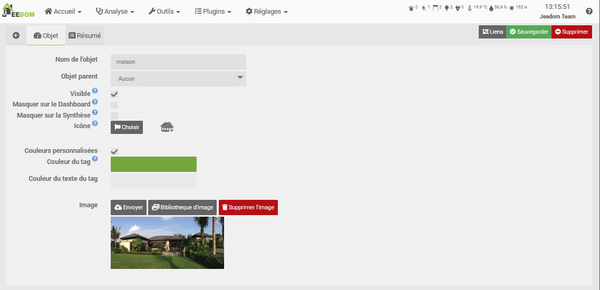
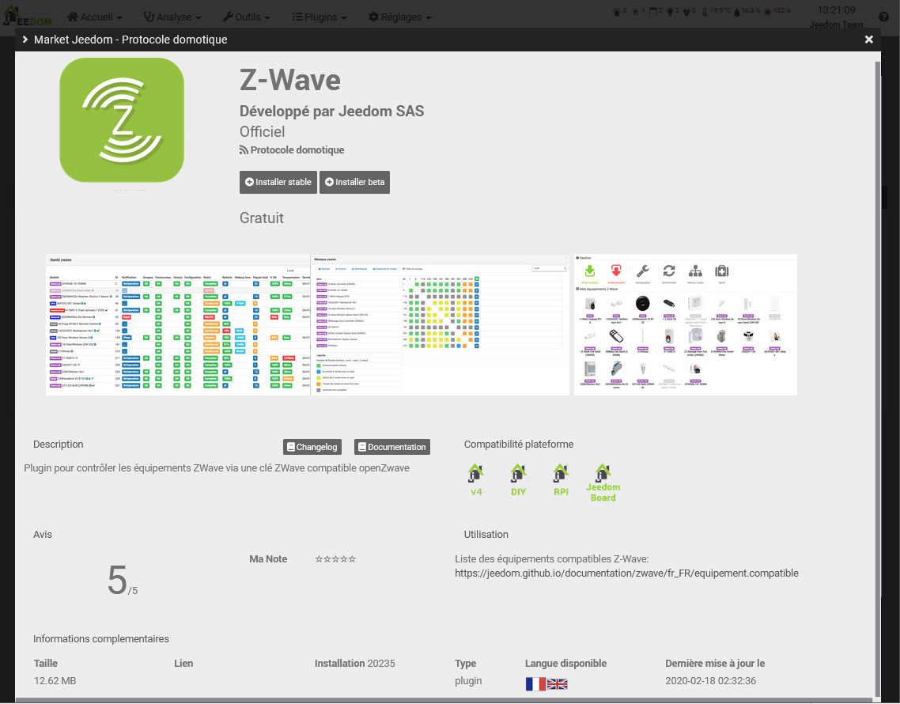

# Primeros pasos con Jeedom

Esta documentación describe los pasos que debes seguir tras la puesta en marcha de tu dispositivo Jeedom.

## Interfaz

Se puede acceder a su instancia de Jeedom a través de su interfaz web en su dirección de la red local.

### Acceso local

Para acceder a la interfaz de Jeedom, es necesario conocer la dirección IP o el nombre de host del dispositivo en la red local. A continuación se indican varios métodos para obtenerla:

#### Detección automática

La tienda de Jeedom ofrece [**una herramienta de detección que permite obtener las direcciones IP de las instancias de Jeedom conectadas a la misma red local**](https://www.jeedom.com/market/index.php?v=d&p=find){:target="_blank"}.

>**IMPORTANTE**
>
>Es necesario que el dispositivo lleve varios minutos encendido para que funcione la detección de Jeedom.\
>Además, esta función depende de la configuración de red aplicada a nivel local y puede que no funcione en determinadas condiciones.

#### Router

Puedes encontrar la dirección IP de tu dispositivo Jeedom accediendo a la interfaz de administración de tu router o módem.

La mayoría ofrece una lista de los dispositivos conectados, con su nombre de host, dirección MAC y dirección IP. Busca un dispositivo llamado «Jeedom» o identifícalo mediante su dirección MAC.

>**IMPORTANTE**
>
>Consulte el manual del fabricante si tiene dificultades para acceder a la interfaz de administración del router.

#### Nombre de host

También se puede acceder a la interfaz de Jeedom mediante el nombre de host del equipo.

- En caso de utilizar una [imagen oficial del sistema](/compatibility/#Images%20système%20officielles) Para instalar Jeedom, se conoce el nombre de host y se debe poder acceder a Jeedom en:

| Dispositivo | Interfaz Jeedom   |
|--------------------|--------------------|
| **Luna** | [http://jeedomluna.local](http://jeedomluna.local){:target="_blank"} |
| **Atlas** | [http://jeedomatlas.local](http://jeedomatlas.local){:target="_blank"} |
| **Inteligente** | [http://jeedomsmart.local](http://jeedomsmart.local){:target="_blank"} |
| **Ordenador/hipervisor** *(instalación automática)* | [http://jeedom.local](http://jeedom.local){:target="_blank"} |
| **Freebox** | [http://jeedomfreebox.local](http://jeedomfreebox.local){:target="_blank"} |

- Si has instalado Debian tú mismo, el nombre de host es el nombre del equipo que definiste durante la instalación (`MACHINE`). `DOMAIN = local` por defecto, o el nombre de dominio específico indicado durante la instalación, si procede.

La dirección de la interfaz de Jeedom debería ser, normalmente: `http://MACHINE.DOMAIN`.

#### Consola del sistema

Desde hace un [imagen oficial del sistema](/compatibility/#Images%20système%20officielles): cada vez que se accede directamente a la consola, se muestra inmediatamente la dirección de la interfaz de Jeedom:



La dirección IP también se puede visualizar introduciendo el comando:
```sh
ip addr | grep 'inet ' | tail -n 1
```

### Primera conexión

[Una vez que se conoce la dirección de Jeedom](#Accès%20local), introdúzcala en su navegador de Internet para acceder a la página de inicio de sesión:

{% include lightbox.html src="../images/FirstStep_box_connect.jpg" data="FirstStep_box_connect" title="Connexion Jeedom" imgstyle="width:75%;display:block;margin:0 auto;" %}

>**IMPORTANTE**
>
>Los datos de acceso predeterminados son: `admin/admin`.

Cuando inicias sesión con los datos de acceso predeterminados, Jeedom te pide que cambies la contraseña `admin`. **Solo tienes que introducir dos veces la nueva contraseña para proteger el acceso de este usuario**.

También es posible cambiar la contraseña del usuario `admin` haciendo clic en el botón **Contraseña** de la página de gestión de usuarios *(a la que se accede desde el menú **Configuración → Sistema → Usuarios**)*:

{% include lightbox.html src="../images/FirstStep_boxPassword.jpg" data="FirstStep_boxPassword" title="Mot de passe admin" imgstyle="width:75%;display:block;margin:0 auto;" %}

>**IMPORTANTE**
>
>Recuerda bien la nueva contraseña, ya que te permite acceder a la interfaz de Jeedom.

## Mercado

El mercado permite consultar, instalar e incluso publicar complementos fácilmente, registrar tus instancias de Jeedom o disfrutar de los servicios de Jeedom, entre otras cosas.

### Registro

Para crear una cuenta en el mercado de Jeedom, solo tienes que [**Rellena los campos obligatorios de la página de registro**](https://www.jeedom.com/market/index.php?v=d&p=register){:target="_blank"} :

{% include lightbox.html src="../images/FirstStep_market1.jpg" data="FirstStep_market1" title="Inscription Market Jeedom" imgstyle="width:75%;display:block;margin:0 auto;" %}

Una vez validado, se conectará a su cuenta y se le redirigirá a la página de inicio:

{% include lightbox.html src="../images/FirstStep_market2.jpg" data="FirstStep_market2" title="Accueil Market Jeedom" imgstyle="width:75%;display:block;margin:0 auto;" %}

### Paquete de servicio

Los dispositivos oficiales de Jeedom incluyen un código de **Service Pack**, que se recibe por correo electrónico y que permite disfrutar de complementos y servicios de forma gratuita.

Para activar tu Service Pack, debes introducir este código cuando se te solicite, tras hacer clic en el botón **Tengo un código** de la pestaña [**Mis servicios según tu perfil de mercado**](https://www.jeedom.com/market/index.php?v=d&p=profils#services){:target="_blank"}.

>**INFORMACIÓN**
>
>Ponte en contacto con tu distribuidor si no has recibido el código del Service Pack tras la compra de un dispositivo oficial de Jeedom.

### Conexión con Jeedom

Para que tu instancia de Jeedom pueda comunicarse con el market, debes introducir los datos de acceso de tu perfil en la configuración general, accediendo a través del menú **Ajustes → Sistema → Configuración**.

A continuación, ve a la pestaña **Actualizaciones/Market**, a la subpestaña **Configuración de repositorios: Market** y rellena los siguientes campos antes de guardar:

- Activar Market: marcar la casilla
- Dirección: `https://market.jeedom.com`
- Nombre de usuario: identificador de tu perfil de Market
- Contraseña: la contraseña de tu perfil de Market

>**INFORMACIÓN**
>
>Puedes hacer clic en el botón **Probar** para comprobar que la conexión se establece correctamente.

### Acceso remoto

Tanto si dispone de un Service Pack como si se ha suscrito al servicio **Acceso remoto simplificado** *(DNS Jeedom)*, Jeedom genera una dirección de acceso remoto que permite conectarse desde fuera de la red local.

Para activar este servicio, solo tienes que ir al menú **Ajustes → Sistema → Configuración**, pestaña **Redes**:

{% include lightbox.html src="../images/FirstStep_dns.jpg" data="FirstStep_dns" title="Réseaux Jeedom" imgstyle="width:75%;display:block;margin:0 auto;" %}

Marca la casilla **Activar DNS Jeedom** y, a continuación, haz clic en el botón **(Re)iniciar**. Tras unos instantes y una vez que el servicio se haya iniciado, aparecerá en pantalla la dirección de acceso remoto.

>**INFORMACIÓN**
>
>Dependiendo de las circunstancias, el acceso remoto puede tardar varias horas en estar totalmente operativo.

Puedes personalizar la dirección de acceso remoto haciendo clic en el botón **Configuración** del servicio desde [**tu perfil de mercado**](https://www.jeedom.com/market/index.php?v=d&p=profils#services){:target="_blank"}.

Encuentra toda la información en [Documentación sobre el servicio de acceso remoto - DNS Jeedom](/howto/mise_en_place_dns_jeedom).

## Crear mi primer dispositivo

Vas a crear tu primer objeto, pero primero tienes que saber qué es un objeto.

En Jeedom, puede ser cualquier cosa, pero se recomienda configurarlo en función de tus habitaciones.

> **Consejo**
>
> Es posible definir relaciones entre los objetos. Ejemplo: el salón pertenece al objeto «planta baja», que a su vez pertenece al objeto «casa».

Crear un objeto no puede ser más sencillo:

-   Ve a Herramientas → Objetos.
-   Haz clic en el botón «Añadir».
-   Jeedom te pedirá que le pongas un nombre. Confirma. Ya tienes tu primer dispositivo creado:



Para obtener más información sobre esta sección, consulta *Manual de usuario -> Objeto*.

## Instalar mi primer complemento

Un complemento permite añadir funcionalidades a Jeedom. Hay cientos de ellos. Muchos son gratuitos, mientras que otros pueden ser de pago. Para acceder a la página de complementos, ve a Complementos → Gestión de complementos.

A continuación, solo tienes que hacer clic en «Market»:

A continuación, aparecerá la lista de todos los complementos que se pueden instalar.

> **Importante**
>
> Atención: algunos son oficiales y otros no. En caso de que surja algún problema con un complemento no oficial, el equipo de Jeedom no se hace responsable.


Al hacer clic en un complemento, aparecerá su ficha:



Encontrarás lo siguiente:

- Botones para instalar el complemento: se recomienda encarecidamente la versión estable,
- Un botón para eliminar el complemento,
- Una breve descripción,
- Un enlace a la documentación del complemento,
- Un enlace al registro de cambios (las últimas modificaciones realizadas),
- La compatibilidad con las distintas plataformas,
- Opiniones de los usuarios,
- Cómo utilizar el complemento,
- Información adicional, como el autor, el enlace al hilo del foro sobre este complemento, la fecha de la última actualización, etc.

Para obtener más información sobre los complementos, *Manual de usuario -> Complementos*.

# Asistencia técnica

Jeedom abarca ámbitos muy amplios que evolucionan día a día.
No obstante, tienes a tu disposición numerosos medios para obtener ayuda y plantear tus dudas.

## El foro

Lo encontrarás [aquí](https://community.jeedom.com/).

El foro es muy activo y contiene muchísima información. Si tienes alguna pregunta, no dudes en plantearla. Recibirás una respuesta en menos de una hora (de media). Sin embargo, ten en cuenta que el foro lo gestiona la comunidad de Jeedom, formada por voluntarios, y no la empresa Jeedom.

## Las solicitudes de asistencia (o tickets)

> **Importante**
>
> Atención: para solicitar asistencia es imprescindible tener una cuenta en el Market.

Si no has encontrado una solución a tu problema, como último recurso, puedes solicitar asistencia al equipo de Jeedom. Esta solicitud se realiza a través de un ticket. Hay varias formas de abrir uno:

-   Directamente desde Jeedom (método recomendado): Menú Ajustes → Solicitud de asistencia.
-   Si por cualquier motivo no tienes acceso a tu Jeedom, siempre puedes abrir un ticket desde el Market:
    -   o bien haciendo clic en tu nombre y, a continuación, en *Solicitud de asistencia*,
    -   O bien, accede a tu perfil y, en la sección **Tickets**, utiliza el botón «Abrir una solicitud de asistencia».


Todas las comunicaciones posteriores se realizarán por correo electrónico.

> **Consejo**
>
> Si, al abrir un ticket, aparece un error indicando que has alcanzado tu cuota, significa que tienes un límite de solicitudes de asistencia al mes, en función de tu Service Pack.

Los distintos paquetes de servicios son:
- Comunidad (gratis): 2 tickets al mes (solo para plugins de pago)
- Power: 10 tickets al mes
- Pro: 100 tickets al mes

Aquí puedes consultar los detalles de los paquetes de servicios [aquí](https://www.jeedom.com/site/fr/soft.html#obtenir).

>**IMPORTANTE**
>
>Atención: vemos que muchos usuarios tienen direcciones de correo electrónico «mailinblack», que en el primer intercambio piden al remitente que valide un enlace para demostrar que se trata de una persona real. Este sistema no es compatible con nuestro sistema de gestión de incidencias, por lo que, aunque te respondamos, nunca recibirás la respuesta en tu buzón de correo, ya que este nos bloquea. Por lo tanto, te agradecemos que, en tu página de perfil del mercado, indiques una dirección de correo electrónico que no utilice este sistema; de lo contrario, nunca recibirás nuestra respuesta.
