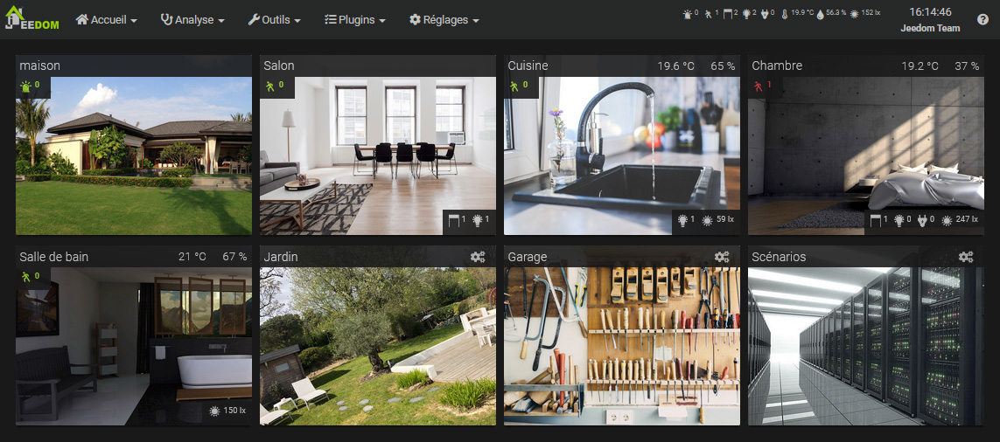
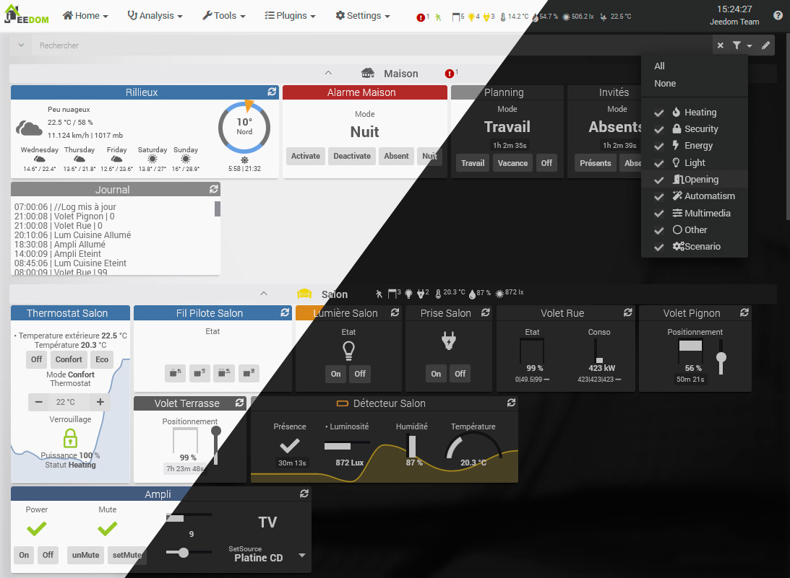
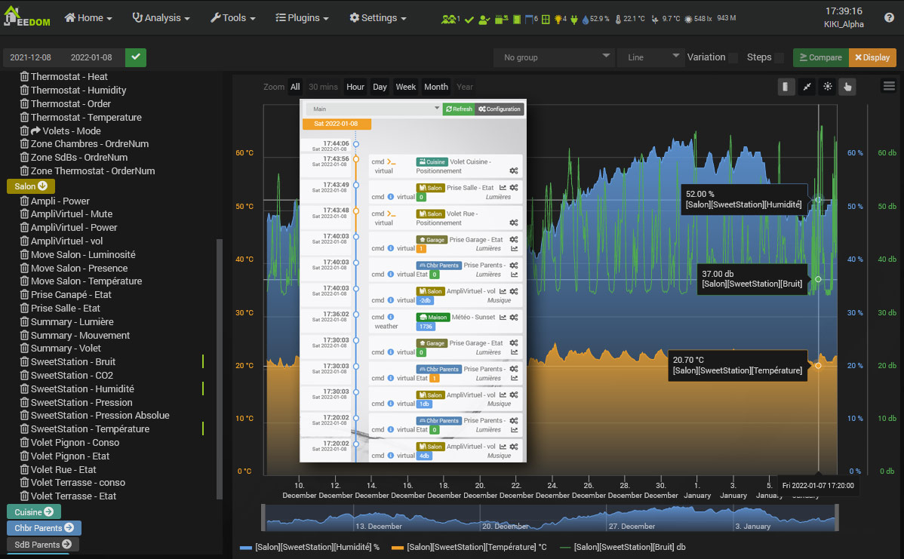
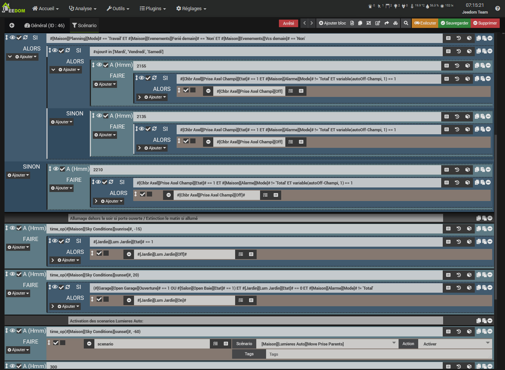
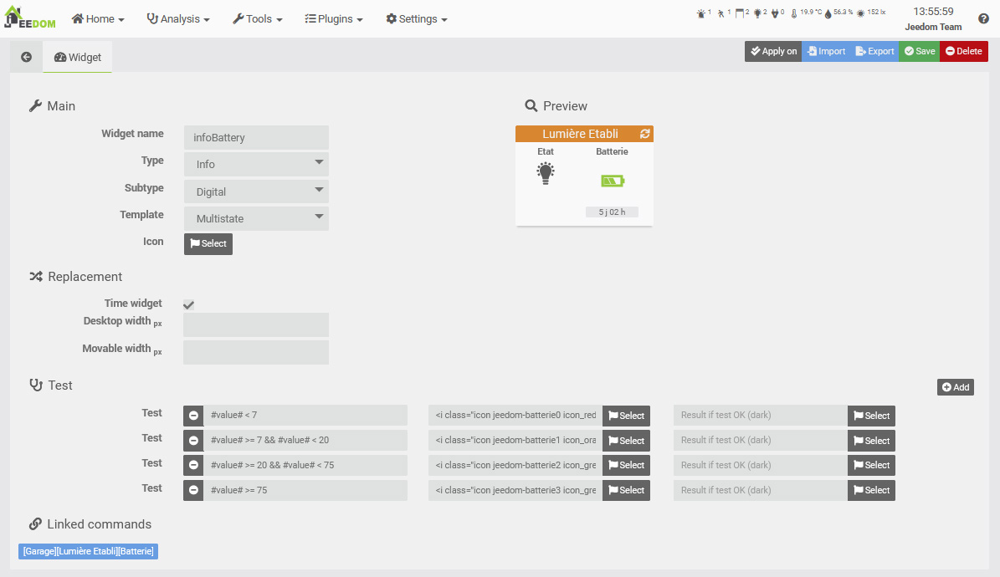
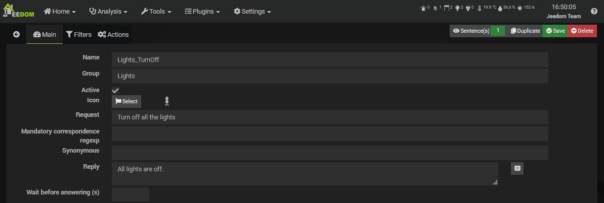
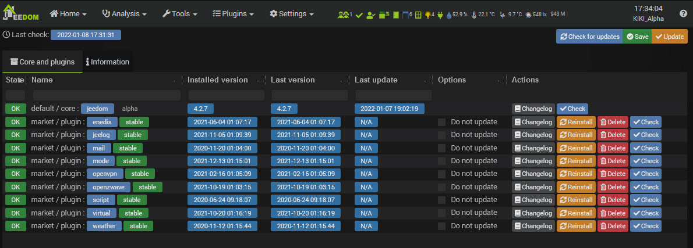
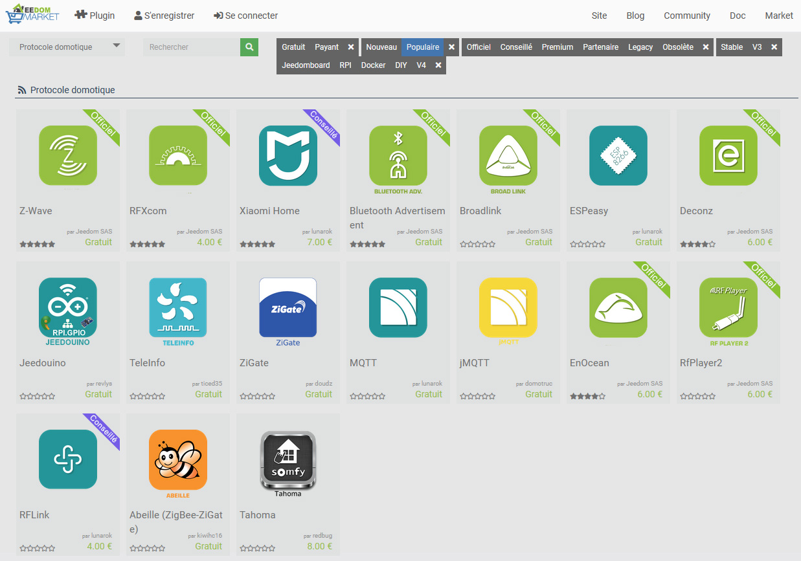

# Overview

Jeedom is free, open-source software that can be installed on any Linux system. It is based on a core with multiple features: scenario management, interaction with the home automation system via text and audio, viewing history and generating charts and graphs, connecting all devices and smart objects, customizing the interface, and more. Its clear and intuitive interface allows you to set up a complete solution without any programming knowledge.

Jeedom does not require access to external servers to function. Your entire system is managed locally, so only you have access to it, ensuring complete privacy.

Thanks to its flexibility and numerous customization options, every user can create their own Jeedom home automation system. Using widgets, views, and designs, you have complete freedom to design your own interface if you wish.

Jeedom offers many features, including:

- Managing the security of property and people,
- Automate your heating system for greater comfort and energy savings,
- Monitor and manage energy consumption to anticipate costs and reduce usage,
- Communicate via voice, text messages, emails, or mobile apps,
- Manage all of your home's automated systems—shutters, gate, lights, etc.,
- Manage your audio and video multimedia devices and your connected objects.

Jeedom is based on the Core, which contains the central structure and functions.

Various [plugins](https://market.jeedom.com) can then offer new features.

The Core includes, among other things:

## Dashboard / Overview

*Devices, including actuators and sensors, are organized into objects. Objects can, for example, represent physical rooms.*

[Summary](/core/overview)

[Dashboard](/core/dashboard)

## History

*All information can be logged (temperature graphs, energy consumption, door openings, etc.) and is accessible under Analysis → History or from the Dashboard tiles.*

[History](/core/history)

[Timeline](/core/timeline)

## Scenarios

*Scenarios allow you to automate all or part of your devices. They are built using different blocks: conditional blocks (If, Then, Else), action blocks, scheduling blocks (IN x minutes or At hhmm), loop blocks, comment blocks, and PHP code blocks. All blocks can be nested within one another, offering endless possibilities.*

[My First Scenario](/concept/#tocAnchor-4)

## Creating widgets

*Jeedom offers a widget creation engine for device commands. This allows you to create your own widgets in addition to the basic ones. Advanced users can also create widgets directly from code.*

## Interactions

*Jeedom’s interaction system allows you to perform actions using text or voice commands.*

## Update Center

*The update center allows you to update all Jeedom features, including the core software and its plugins. Other extension management functions are available (remove, reinstall, check, etc.).*

# Market

Plugins of all kinds can be added to this core:

-   Home automation protocols (Z-Wave, RFXcom, EnOcean…),
-   IP protocol (KNX, xPL…),
-   Smart objects (Nest, Netatmo…),
-   High-level functions (alarm, thermostat…),
-   Organization (calendar, Google Calendar),
-   Development (script).

These plugins can be installed from the Market and allow you to expand Jeedom's capabilities.

Jeedom allows any plugin to communicate with another on a standardized basis. This makes it possible, for example, to use thermostat or alarm plugins with any home automation protocol, or even an IP plugin or connected object…
