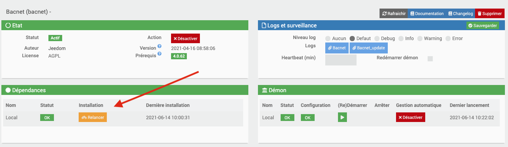
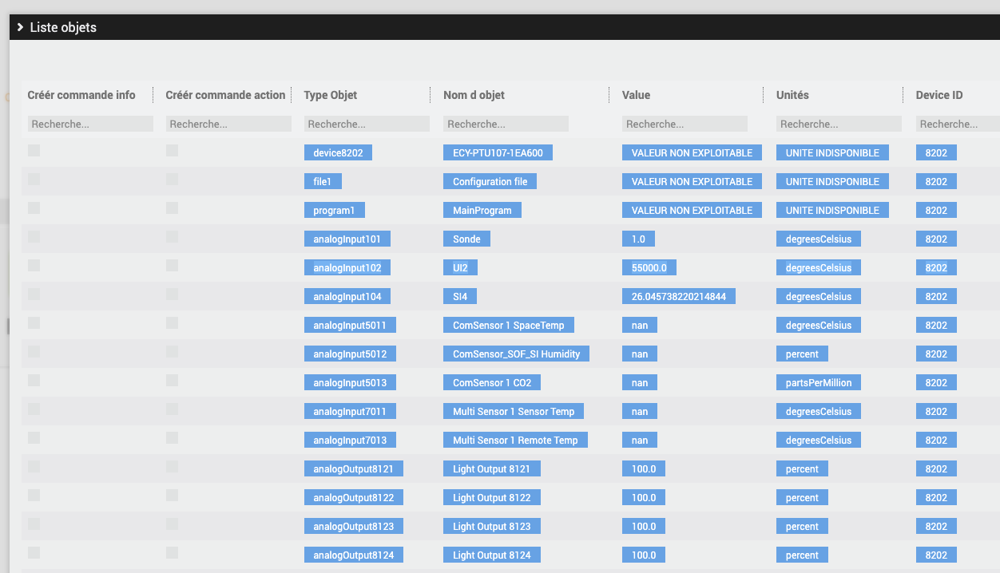

# Bacnet

#Description

O plugin Bacnet permite que você recupere informações de seu equipamento Bacnet / Ip e interaja com ele a partir de seu Jeedom.

# Configuração de plug-in

Depois de baixar o plugin, você deve primeiro ativá-lo, como qualquer plugin Jeedom :

Em seguida, você deve iniciar a instalação das dependências (mesmo que pareçam OK) :

Finalmente, devemos iniciar o demônio :

Rien n'est à modifier dans le champ « Port socket interne » de la section « Configuration ».

Nesta mesma aba, você deve escolher o valor Cron para atualizar seu equipamento.

# Como declarar um novo dispositivo Bacnet no Jeedom

>**IMPORTANTE**
>
>Seu equipamento BACNET deve estar na mesma rede que seu Jeedom para ser detectado por ele.

Rendez-vous dans le menu « Plugins → Energie → Bacnet » :

Você chega na próxima página:

Vous devez donc cliquer sur l'option « Nouvel équipement / Création commandes » :

Uma varredura automática de sua rede será lançada para detectar os dispositivos Bacnet presentes nela.
Pode demorar cerca de vinte segundos.

Após a varredura, uma tabela com todas as entradas / saídas do seu equipamento será exibida.

O menu da tabela onde você pode pesquisar por coluna :

Um exemplo de detecção de equipamento Bacnet :

Dependendo do fabricante do equipamento, alguns valores não estão disponíveis;

Tudo o que você precisa fazer é selecionar os pedidos a serem criados marcando uma das opções de acordo com a sua escolha (tipo de comando informação ou tipo de ação):

Valide, atualize a página, e o equipamento correspondente terá sido criado em seu Jeedom; por padrão, ele será nomeado com o DeviceID do seu equipamento Bacnet fornecido pelo fabricante (você é livre para renomeá-lo )

 Cliquez ensuite sur votre équipement créé, puis cocher « Activer » et « Visible » pour le voir apparaitre sur votre dashboard.

Para adicionar comandos posteriormente a um equipamento existente, você deve refazer a operação anterior : « Nouvel équipement / Création commandes » , et sélectionnez les commandes que vous désirez.

# As ordens

Rendez-vous dans l'onglet « Commandes » de la page de configuration du nouvel équipement Bacnet.

Ici vous pouvez masquer et rendre visibles les différentes commandes de type « action » et « info » disponibles (les commandes de type « info » peuvent également être historisées) :

Todos os equipamentos criados terão 2 comandos por padrão : une commande info « Connexion Bacnet » et une commande action « Refresh » , qui serviront à voir l'état de la connexion Bacnet sur votre dashboard, et à rafraichir les valeurs de vos commandes.

>**IMPORTANTE**
>
>Em relação à escrita: para segurança, o protocolo Bacnet fornece por padrão um sistema de escrita com níveis de prioridade nas entradas / saídas de seu equipamento.
Existem 16 níveis de prioridade (o nível mais baixo tem prioridade sobre todos os outros)). Seu equipamento pode ser programado de forma que a função de escrita desenvolvida neste plugin não tenha prioridade sobre a programação lógica do equipamento / sistema por default.
Para o tipo de saída I / O, o plugin é configurado com prioridade 8 de escrita (Operador manual).
Mais informações sobre o assunto :

https://store.chipkin.com/articles/bacnet-why-doesnt-the-present-value-change

Para uma gravação em um dispositivo Bacnet, estendemos no PresentValue da entrada / saída correspondente.
Você deve saber que os PresentValues do tipo de entradas / saídas: Saída analógica, saída binária e saída multiestado são sempre controláveis.
As entradas / saídas AnalogValue, BinaryValue ou MultistateValue podem ser solicitadas se o fabricante tiver implementado esse recurso. Fica a critério exclusivo do fabricante. Verifique a documentação do seu equipamento para saber mais sobre isso.

Ao criar os pedidos do tipo de gravação escolhidos, um pedido de ação associado também será criado, por padrão não visível no painel.
Ao clicar nele, ele redefine a tabela de prioridade de gravação de uma entrada / saída para o padrão.
Terá um nome com << resetPrioritesEcriture >>
Para tornar este comando visível no seu painel, acesse os comandos do seu equipamento e marque a opção “Mostrar"

# Lista na Ação de Comando (para MultiStateValue)

Quando você criou um comando Write como de costume a partir dos resultados da verificação, é básico em Slider ou On Off, dependendo do tipo de ponto Bacnet retornado (analógico, binário) : agora, se você escolher um multiState, o comando será do tipo Slider por padrão, mas você pode listá-lo na lista de comandos do equipamento; um novo campo Lista de valores aparecerá;
Você pode colocar os valores que quiser, separados por um -, sem espaço : por exemplo 1-4-5-8
Ao salvar o equipamento, este colocará esses valores na lista do pedido no Dashboard
Ao alterar este valor, enviará a escrita do valor no ponto parametrizado.

# Prioridade de gravação

    A Manuseie com cuidado

    Um campo de prioridade de gravação está disponível em cada pedido criado

    De acordo com a documentação :

    No BACnet, o objeto para o qual podemos escrever geralmente fornece o que é chamado de priorityArray. Esta matriz contém 16 níveis nos quais podemos escrever (1 sendo a prioridade mais alta).

    O uso típico de prioridade é :

    1 Segurança de Vida Manual 2 Segurança de Vida Automática 3 Disponível 4 Disponível 5 Controle de Equipamento Crítico 6 Mínimo On/Off 7 Disponível 8 Operador Manual (Substituir) 9 Disponível 10 Disponível (Controle Típico de um Supervisor) 11 Disponível 12 Disponível 13 Disponível 14 Disponível 15 Disponíveis (Agenda) 16 Disponíveis

    Você pode escolher uma prioridade de gravação nos comandos desejados, escolhendo um número entre 1 e 16

    Se nenhum valor for inserido em um comando de gravação, por padrão, o valor será definido como 8.
