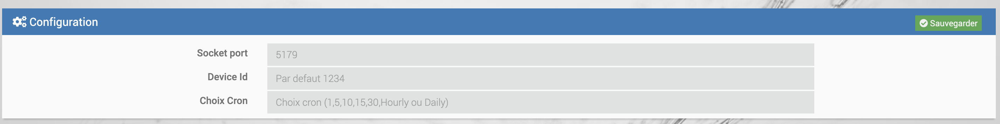

# Documentation du Plugin BacnetManager

>**IMPORTANTE**
>
>Le plugin BacnetManager n'est pas compatible avec le plugin officiel Jeedom Bacnet. Une seule instance Bacnet peut être créée sur une box Jeedom.

# Description

Le plugin BacnetManager permet de créer un équipement Bacnet sur votre Jeedom, ainsi que ses commandes d'information (« Infos Jeedom »), afin qu'il soit visible sur le réseau par un superviseur Bacnet. Il permet également d'associer des commandes d'action (« Actions Jeedom ») provenant d'autres plugins, pour piloter Jeedom via Bacnet lorsque des écritures sont détectées sur ces points Bacnet.

# Configuration du plugin

Après avoir téléchargé le plugin, commencez par l'activer depuis la gestion des plugins Jeedom.

Ensuite, lancez l'installation des dépendances, même si elles apparaissent comme « OK ».

Enfin, démarrez le démon depuis la page de configuration.

Port socket interne : Ne modifiez pas ce champ dans la section « Configuration ».

Cron : Configurez la fréquence du cron, qui permettra de lire les valeurs des points Bacnet pour détecter d'éventuelles écritures externes.

# Fonctionnement du plugin

>**Pré-requis**
>
>Réseau : Vos équipements Bacnet doivent être sur le même réseau que votre Jeedom pour être détectés.

#### <u>Création de l'équipement jeeBacnetManager</u>

Par défaut, un équipement nommé jeeBacnetManager est créé. Cet équipement représente le « serveur Bacnet » qui sera visible par votre superviseur Bacnet.

Você pode configurar seu deviceId na configuração do plugin

#### <u>Ajout de commandes Jeedom au jeeBacnetManager</u>

Cliquez sur Ajouter Commandes au Serveur.

Une fenêtre modale s'ouvre, listant toutes les commandes de type « Infos » présentes dans les différents plugins de votre Jeedom.

>**IMPORTANTE**
>
>Les équipements doivent être actifs pour que leurs commandes soient détectées.
>Évitez d'utiliser des espaces dans les noms des commandes.

>**FACULTATIF**
>
>Remplissez le champ « Nom de point Bacnet » (facultatif). Si ce champ est vide, le nom de la commande Jeedom sera utilisé comme nom du point Bacnet.

Sélectionnez les commandes souhaitées, puis validez.

Après validation, quittez la fenêtre et cliquez sur Cmds Jeed Server pour afficher la liste des commandes ajoutées.

#### <u>Points Bacnet créés</u>
Cette modale va s'afficher :

Pour chaque commande ajoutée, deux points Bacnet sont créés :

- Commande « info » : Mise à jour via le cron pour le monitoring.

- Commande « Write » : Utilisée pour détecter les écritures depuis un équipement Bacnet. Si une écriture est détectée, la commande d'action associée est exécutée.

#### <u>Paramétrage des Commandes</u>
 

1. **Escolha da Ação de Comando** : Selecione um comando de ação com base no plugin escolhido.
2. **Valor Inicial** : Defina um valor inicial para inicializar o ponto Bacnet pela primeira vez.
3. **Usar valor Bacnet** : Marque esta opção para usar o valor Bacnet. Caso esta opção não esteja marcada, deverá preencher o campo “Valor a enviar para a ação”".

#### <u>Mise à jour des valeurs</u>

Configurez la fréquence du cron dans la configuration du plugin pour actualiser les valeurs.

Ao executar o cron, o sistema irá verificar se houve alteração no valor do ponto Bacnet (escrevendo). Nesse ponto, ele enviará este valor Bacnet ou o valor inserido em "Enviar para Ação" para o comando Ação Parametrizada.

Une fois toutes les commandes configurées, on envoie toutes ces commandes sur le device Bacnet, en cliquant sur Envoyer au Serveur

# Importe/exporte o jeeBacnetManager (em breve)):

Para evitar necessidades, 2 opções são fornecidas : 

- Exportar dispositivo :

Ao clicar neste botão, ele fará o download de um arquivo Json contendo a configuração do dispositivo, bem como seus comandos.

- Importar dispositivo :

Ao clicar neste botão, você pode importar o arquivo json de configuração do jeeBacnetManager que você teria baixado, para usar os comandos que foram configurados neste

# ANNEXE:

# Lista de Unidades de Engenharia BACnet)

| Unidades de engenharia               |
|---------------------------------|
| ampereSegundos                   |
| ampereSquareHours               |
| amperesQuadradoMetros              |
| amperes                         |
| amperesPorMetro                 |
| amperesPerSquareMeter           |
| bares                            |
| bequerels                      |
| btus                            |
| btusPorHora                     |
| btusPorPound                    |
| tusPerPoundDryAir               |
| candela                        |
| candelasPerSquareMeter          |
| centímetros                     |
| centímetrosDeMercúrio            |
| centímetrosDeÁgua              |
| pés cúbicos                       |
| pés cúbicos por dia                 |
| pés cúbicos por hora                |
| pés cúbicos por minuto              |
| pés cúbicos por segundo              |
| Metros cúbicos                     |
| metros cúbicos por dia               |
| metros cúbicos por hora              |
| metros cúbicos por minuto            |
| metros cúbicos por segundo            |
| moeda1                       |
| moeda10                      |
| moeda2                       |
| moeda3                       |
| moeda4                       |
| moeda5                       |
| moeda6                       |
| moeda7                       |
| moeda8                       |
| moeda9                       |
| ciclosPorHora                   |
| ciclosPerMinute                 |
| dias                            |
| decibéis                        |
| decibéisA                       |
| decibéisMillivolt               |
| decibéisVolt                    |
| grauDiasCelsius               |
| grauDiasFahrenheit            |
| grausAngular                  |
| graus Celsius                  |
| grausCelsiusPorHora           |
| grausCelsiusPorMinuto         |
| graus Fahrenheit               |
| grausFahrenheitPorHora        |
| grausFahrenheitPorMinuto      |
| grausKelvin                   |
| grausKelvinPorHora            |
| grausKelvinPorMinuto          |
| grausFase                    |
| deltaGrausFahrenheit          |
| deltaGrausKelvin              |
| farads                          |
| pés                            |
| pésPorMinuto                   |
| pésPerSecond                   |
| velas                     |
| gramas                           |
| gramasDeÁguaPorQuilogramaAr Seco   |
| gramasPorCúbicoCentímetro         |
| gramasPerCubicMeter              |
| gramasPorGram                    |
| gramasPor quilograma                |
| gramasPorLitro                   |
| gramasPorMilitro              |
| gramasPorMinuto                  |
| gramasPorSegundo                  |
| gramasPerSquareMeter             |
| cinza                            |
| hectopascais                    |
| Henrique                          |
| hertz                           |
| cavalos de potência                      |
| horas                           |
| centésimosSegundos               |
| imperialGalões                 |
| imperialGalõesPorMinuto        |
| polegadas                          |
| polegadasOfMercury                 |
| polegadasOfWater                   |
| jouleSegundos                    |
| joules                          |
| joulesPerCubicMeter             |
| joulesPerDegreeKelvin           |
| joulesPorhoras                  |
| joulesPorKilogramaGrauKelvin   |
| joulesPorKilogramaSecoAir         |
| quiloBtus                        |
| quiloBtusPorHora                 |
| quilobecquerels                  |
| quilogramas                       |
| quilogramasPorCubicMeter          |
| quilogramas por hora                |
| quilogramasPorquilograma            |
| quilogramas por minuto              |
| quilogramas por segundo              |
| quilohertz                       |
| quilohms                         |
| quilojoules                      |
| quilojoulesPerDegreeKelvin       |
| quilojoulesPor quilograma           |
| quilojoulesPorquilogramaSecoAir     |
| quilômetros                      |
| quilômetrosPorhora               |
| quilopascais                     |
| quilovoltAmpereHoras             |
| quilovoltAmpereHorasReativo     |
| quilovoltAmperes                 |
| quilovoltAmperesReativo         |
| quilovolts                       |
| quilowatt-horas                   |
| quilowattHoursPerSquareFoot      |
| quilowattHoursPerSquareMeter     |
| quilowattHorasReativo           |
| quilowatts                       |
| litros                          |
| litrosPorHora                   |
| litrosPorMinuto                 |
| litrosPorSegundo                 |
| lúmens                          |
| luxos                           |
| megaBtus                        |
| megabecquerels                  |
| megahertz                       |
| megajoules                      |
| megajoulesPerDegreeKelvin       |
| megajoulesPorquilogramaSecoAir     |
| megajoulesPerSquareFoot         |
| megajoulesPerSquareMeter        |
| megaAVoltAmpereHoras             |
| megaAVoltAmpereHorasReativo     |
| megaAVoltAmperes                 |
| megaAVoltAmperesReativo         |
| megaAVolts                       |
| megawatthoras                   |
| megawattHorasReativo           |
| megawatts                       |
| megohms                         |
| metros                          |
| metrosPorhora                   |
| metrosPorMinuto                 |
| metrosPorSegundo                 |
| metrosPerSecondPerSecond        |
| microSiemens                    |
| microgramasPerCubicMeter         |
| microgramasPorLitro              |
| microcinza                       |
| micrômetros                     |
| microsieverts                   |
| microsievertsPorhora            |
| milhasPorhora                    |
| miliamperes                    |
| milibares                       |
| miligramas                      |
| miligramasPerCubicMeter         |
| miligramasPorgrama               |
| miligramasPor quilograma           |
| miligramasPorLitro              |
| miligray                       |
| mililitros                     |
| mililitros por segundo            |
| milímetros                     |
| milímetros de Mercúrio            |
| milímetros de água              |
| milímetrosPorMinuto            |
| milímetrosPorSegundo            |
| miliohms                       |
| milissegundos                    |
| milisiemens                    |
| milisieverts                   |
| milivolts                      |
| miliwatts                      |
| minutos                         |
| minutosPorDegreeKelvin          |
| meses                          |
| nanogramasPerCubicMeter          |
| nefelométricoTurbidityUnit      |
| Newton                          |
| newtonMetros                    |
| newtonSegundos                   |
| newtonsPerMeter                 |
| noUnitsohmMeterPerSquareMeter   |
| ohm Metros                       |
| ohms                            |
| pH                              |
| partesPorBillion                 |
| ações por milhão                 |
| pascalSegundos                   |
| pascais                         |
| por hora                         |
| porMilha                        |
| por minuto                       |
| por segundo                       |
| por cento                         |
| porcentagemObscuraçãoPerFoot       |
| porcentagemObscurationPerMeter      |
| porcentagem por segundo                |
| porcentagem de umidade relativa         |
| librasForcePerSquareInch        |
| librasMassa                      |
| librasMassaPorHora               |
| librasMassaPorMinuto             |
| librasMassPerSecond             |
| fator de potência                     |
| psiPerDegreeFahrenheit          |
| radianos                         |
| radianosPerSecond                |
| revoluçõesPorMinuto            |
| segundos                         |
| siemens                         |
| siemensPerMeter                 |
| sieverts                        |
| quadradoCentímetros               |
| pés quadrados                      |
| Polegadas quadradas                    |
| metros quadrados                    |
| Metros quadradosPorNewton           |
| Tesla                          |
| térmico                          |
| suas horas                        |
| tons                            |
| tonsPerHour                     |
| tonsRefrigeração               |
| nósGalões                       |
| nósGalõesPorHora                |
| nósGalõesPorMinuto              |
| voltAmpereHoras                 |
| voltAmpereHorasReativo         |
| voltAmperes                     |
| voltAmperesReativo             |
| volts                           |
| voltsPerDegreeKelvin            |
| voltsPorMetro                   |
| voltsQuadradoHoras                |
| watthoras                       |
| wattHoursPerCubicMeter          |
| wattHorasReativo               |
| watts                           |
| wattsPerMeterPerDegreeKelvin    |
| wattsPerSquareFoot              |
| wattsPerSquareMeter             |
| wattsPerSquareMeterGrauKelvin |
| Weber                          |
| semanas                           |
| anos                           |

