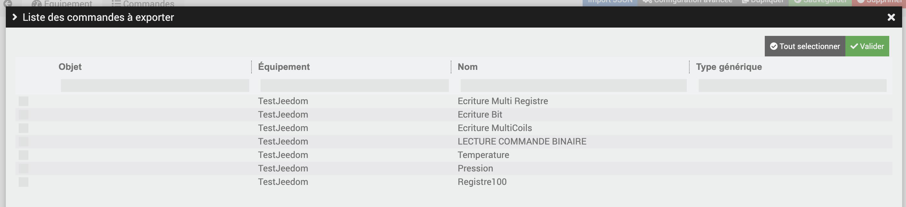

# Modbus

#Description

Plugin para leitura e escrita em seus dispositivos ModbusTCP/IP e RTU
Wago incompatível com o horário atual

# Configuração do plug-in

Depois de baixar o plugin, você deve primeiro ativá-lo, como qualquer plugin Jeedom :

Então, você deve iniciar a instalação das dependências (mesmo que elas apareçam OK) :

Finalmente, inicie o daemon :

Rien n'est à modifier dans le champ « Port socket interne » de la section « Configuration ».

Nesta mesma aba, você deve escolher o valor de descanso entre atualizar seu equipamento (por padrão 5 seg)

Você também pode optar por colocar um Retry para reexecutar a solicitação em um comando/equipamento que estaria em erro (por padrão False)
Você também pode escolher o número de tentativas e o atraso entre essas tentativas.

 :warning: Escolha do nível de registro da biblioteca Modbus :

 Por padrão, está configurado para ERRO, sendo a biblioteca detalhada
 Você pode alterar seu nível : você precisará salvar e reiniciar o daemon

# Uso do plug-in

IMPORTANTE :

Para usar o plugin, você precisa conhecer os parâmetros de suas entradas/saídas de seus periféricos modbus (formato de dados, ordem de bits, etc...)

Para comandos, existem parâmetros para selecionar :

Detalhes do parâmetro :
- Valor negativo : para formatos do tipo LONG/INT, você deve especificar se o valor de gravação/leitura será negativo
- Desvio : isto é, se o deslocamento é ou não considerado nos números de registro em determinados dispositivos Modbus
- Escolha o tom do controle deslizante : Isto serve para escolher o passo do cursor no caso de um comando do tipo Action/Slider se quiser enviar valores não inteiros.

IMPORTANTE :

Dado o tempo gasto para por vezes configurar determinados equipamentos, é possível exportar os comandos de um equipamento já criado, para baixá-lo localmente em .json.

Você pode, portanto, importá-lo em outra caixa facilmente em um novo equipamento do mesmo tipo (apenas para alterar o que difere em termos de conexão)

Na página do equipamento, no canto inferior direito, você tem este encarte :

Clique em Lista de pedidos para exportar; abre-se uma janela com os comandos existentes neste equipamento:

Você pode selecioná-los todos, se necessário, usando o botão na parte superior da janela.
Quando os comandos forem escolhidos, clique em Validar.

Agora você verá os pedidos escolhidos e prontos para serem exportados nesta caixa :

Você só precisa clicar em Download Config dos pedidos que acabaram de aparecer.

Para importar comandos para equipamentos : clique no canto superior direito do equipamento no botão Importar Json :

Você também pode escolher diretamente um modelo de equipamento disponível na configuração do plugin, para carregar comandos fornecidos neste modelo;
Escolha o modelo escolhido e, em seguida, Valide. Então você pode salvar.

DETALHES DO MODBUS :

O tamanho de um registro Modbus é de 2 bytes (2 bytes), ou seja, 16 bits

CONTROLES DE REPRODUÇÃO :

Para entradas de bobinas  :  
  - Você adiciona um Novo Comando Modbus e nomeia o comando. Você escolhe um comando de tipo de informação, em tipo binário ou numérico.
  - Escolha o código de função correspondente : FC01
  - É então necessário escolher o registo inicial bem como o número de registos a ler
  Ao salvar, o comando criado será deletado, para criar tantos comandos quanto o número de registradores especificado.
  Ex: Se você escolher um registro inicial de 1 e um número de registros de 4, os comandos serão criados : ReadCoil_1, ReadCoil_2, ReadCoil_3, ReadCoil_4
  - Você pode, é claro, renomear os ReadCoils ao seu gosto.

Para Fc2 Leitura discreta :

- Crie um pedido do tipo Info, sob outro tipo
- Escolha fc02
- Escolha Bits, Big Endian, formato Big Word
- Complete o cadastro
- E preencha o campo : Número de bits a ler (0 a 15)

Ao retornar da leitura, você terá um comando do tipo string com o valor dos bits solicitados

  Para Registros de Participações e Registros de Entradas:
  - Você adiciona um Novo Comando Modbus e nomeia o comando. Você escolhe um comando de tipo de informação, em tipo numérico.
  - Escolha o formato correspondente : Float , Long/Integer ou Bits
  - Escolha o código de função correspondente : FC04 ou FC03
  - O registro inicial, bem como o número de registros : para floats, o valor é codificado em no máximo 4 registradores, o mínimo é 2.

Alguns registradores só podem ser lidos lendo vários registradores ao mesmo tempo no mesmo comando :

exemplo : Criamos um comando, escolhemos Info e outro subtipo, especificando 10 registros;
Ver Parâmetros Específicos no final da documentação

COMANDOS DE ESCREVA:

 No seu equipamento, por padrão, serão criados 3 comandos do tipo Ação/mensagem; Gravação MultiRegister, Gravação de Bit e Gravação Multicoil

IMPORTANTE :

 Seu princípio de funcionamento:

 :warning: NOVO MÉTODO DE ESCRITA DE UM BIT :

 Para alterar um bit específico em um registro : você pode criar um comando do tipo Action e escolher a função de código 'Write Bit'. Isso mostrará apenas os 2 campos a serem preenchidos : Registro inicial e posição do bit. 
 Ao salvar, isso criará 2 comandos de ação : um para enviar 0 e outro para enviar 1, e isso excluirá aquele que você configurou.
 Os dois novos comandos terão seu nome de tipo :

 WriteBit_Register(RegisterNum)_Position(BitPosition)_1 e WriteBit_Register(RegisterNum)_Position(BitPosition)_0

 

  MUDANÇA DE BITS DE UM REGISTRO (método antigo):

  Para alterar o bit de um registrador, deve-se utilizar o comando message WriteBit; na configuração do comando, no campo Registro inicial, você deve escolher o número do registro para escrever. Nenhuma outra configuração necessária
  Em seguida, no corpo da mensagem do comando no painel, você deve usar a seguinte sintaxe : bitValue&indexbit
  Possível valor de bit 0 ou 1
  indexBit é o valor entre 0 e 15 (valores incluídos)
  Consulte a documentação do seu equipamento para o índice do bit a ser alterado

   NOVA GRAVAÇÃO EM VÁRIOS REGISTROS PARA UM PEDIDO:

      - Criando um comando Ação -> Outro subtipo, escolhendo Fc16 e preenchendo o Registro inicial e a nova linha da Tabela de registros nos Parâmetros de comando, podemos executar este comando para escrever a partir do registro inicial os valores inseridos :

      Ex : Iniciar Registro : 10
      Registro de Tabela de Linhas : 10-45-22-25.6-2360
      Enviaremos nos cadastros 10,11,12,13 e 14, os valores 10,45,22,22.6 e 2360
      Os valores devem ser separados por um - , e para números decimais, coloque um .

  - Gravação de vários registros : na configuração do comando, deve-se informar o registrador inicial, assim como a ordem dos bytes e da palavra.
  Por padrão, o functionCode é FC16. Por favor, deixe esta configuração como padrão.

  Para alterar os valores nos registros, use esta sintaxe:
  - valuetoend&nbofregister, separados por | :   Ex:  120&1|214.5&4 Enviamos o inteiro 120 para um registrador, a partir do registrador inicial configurado,
  então 214.5 em float em 4 registros seguindo o anterior.

  Para tipos float, escreva o valor como acima, com um .

  - Gravação MultiCoil : na configuração do comando, você deve inserir o registro inicial
      Por padrão, o functionCode é fc15. Por favor, deixe esta configuração como padrão.

      Para alterar os valores nos registros, use esta sintaxe:
      Ex : 01110111 Então isso vai enviar do registrador inicial configurado os valores True(1) ou False(0) para os registradores

  - Escrever Bit : na configuração do comando, você precisa da ordem dos bytes e da palavra.
     Por padrão, o functionCode é fc03, pois este comando dará o valor do registrador configurado em binário para o comando info "infobitbinary".

     Por favor, deixe esta configuração como padrão.

     No comando info "infobitbinary", você terá o valor binário do registrador de parâmetro no comando Write Bit.
     Para alterar o bit no registro :

        valorparaenviar&PosicionarBit&Registrar :   Ex:  1&4 Enviamos o valor 1 para a posição 4 do bit à direita, para o registrador especificado
        No comando info "infobitbinary", você vê o valor 10000101, que corresponde ao valor binário do registrador de parâmetro.
        Ao escrever 1&6, você terá agora o valor : 10100101 no registrador configurado.

IMPORTANTE :

Alguns CPs não possuem a função fc06
  Ver Parâmetros Específicos no final da documentação

Para escrever em uma bobina :

Exemplo para registro 1 On:
- Você adiciona um Novo Comando Modbus e nomeia o comando. Você escolhe um comando de tipo de ação, em tipo padrão.
- Escolha Fc5 Write Single Coil
- Registro de partida : 1
- Número de bytes : 1
- Coloque 1 no valor para enviar

Exemplo para registro 1 Off:
- Você adiciona um Novo Comando Modbus e nomeia o comando. Você escolhe um comando de tipo de ação, em tipo padrão.
- Escolha Fc5 Write Single Coil
- Registro de partida : 1
- Número de bytes : 1
- Coloque 0 no valor para enviar

Ao agir sobre esses comandos de ação em seu painel, você enviará True ou False para suas bobinas.

Para gravar em um registro de retenção :

- Você adiciona um Novo Comando Modbus e nomeia o comando. Você escolhe um comando de tipo de ação, em tipo de controle deslizante.
- Escolha também um valor Min e Max para esta barra (lembre-se de tomar um valor mínimo para enviar um valor negativo)
- Escolha Bc6 Write Single Register
- Escolha o número de registros : 1
- Escolha o passo do controle deslizante (para decimais, escreva com um .   ex: 0.2)

Quando uma gravação é concluída, seja bem-sucedida ou não, uma mensagem aparece no Jeedom.
Você pode desabilitar/habilitar esta mensagem na configuração do plugin.

# Parâmetros Específicos

RETORNO HEX :
  Para ter um comando que retorna o valor do cadastro em HexaDecimal (para um comando que informa os erros de um equipamento por exemplo), você cria seu comando, configura como de costume,
  e marque Retorno Hexa.

  Isso criará um novo comando no retorno que terá o nome do comando original, seguido por _HEXAVALUE

LEITURA DE MÚLTIPLOS REGISTROS :
  marcando LectureMultiRegistres, isso criará automaticamente tantos novos comandos quanto o número especificado em Number of registers, usando o nome do comando original, mais o id do comando na iteração. É claro que você pode renomear os comandos; ao ler o comando original, seu valor conterá uma cadeia de caracteres dos 10 valores de registro e atualizará os 10 comandos correspondentes.

Fc16 REGISTROS NÃO RASTREADOS :
  Alguns CPs não possuem a função fc06
  Você pode criar um comando de ação, em tipo de mensagem, e escolher fc16
  Verifique o registro Fc16 não rastreado
  No painel, você deve usar esta sintaxe :
  registro de partida ! value & nregisters separados por um |

  Ex: 7!122,5&2|10!22&2

  Vamos escrever do registrador 7, o valor 122.5 em 2 registradores e também do registrador 10, o valor 22, em 2 registradores

OPERAÇÃO POR ORDEM :
  Para uma operação sobre o retorno de valor : no campo Operação do pedido, você pode preencher uma operação matemática colocando a tag #value# para indicar o valor deste comando :
  exemplo : (#value# / 10) * 2
  O cálculo será realizado no retorno dos dados deste comando.
  Faça bom uso de * para multiplicações

# Importar/Exportar Comandos XLSX

Após a criação de um equipamento, você pode importar um arquivo xlsx para a criação de seus pedidos
O arquivo de modelo pode ser encontrado em plugins/modbus/data/templateXlsx/exportModbus.xls
Você pode acessá-lo e baixá-lo através do Jeedom -> Configurações-> Sistema-> Editor de arquivos
