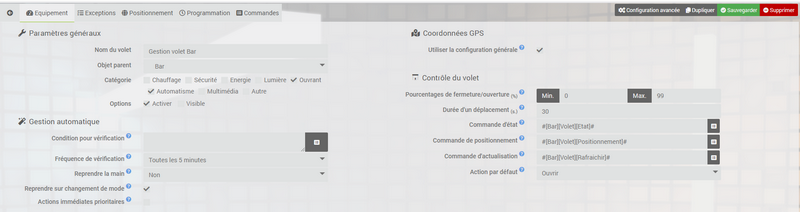
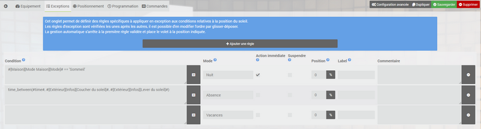

# Plug-in de Gerenciamento de Obturador

O plugin **Gestão de persianas** irá permitir-lhe gerir facilmente o posicionamento automático das suas persianas de acordo com a elevação e azimute do sol e / ou outras condições à sua escolha. Todos os cálculos são realizados diretamente pelo plugin, sem a necessidade de conexão com a internet.

Bem entendido, este plugin é capaz de substituir todos os cenários relativos à abertura, fechamento ou posicionamento de suas venezianas. Você pode encontrar um exemplo de uso lendo [este artigo de blog escrito por Loïc](https://www.jeedom.com/blog/?p=4310){:target = "\_ em branco"}.

>**IMPORTANTE**
>
>O plugin **Gestão de persianas** só funciona com equipamentos que tenham **um comando de ação / cursor** permitindo a **posicionar o obturador em uma certa porcentagem de abertura / fechamento**. Se o seu obturador só funciona ao abrir / fechar, o plugin não será utilizável.

# Configuration

O plugin **Gestão de persianas** só precisa ser habilitado após a instalação e não requer configuração adicional.

## Configuração das persianas

Para acessar os diversos equipamentos da **Gestão de persianas**, você tem que ir ao menu **Plugins → Automação → Gerenciamento de persianas**.

>**EM FORMAÇÃO**
>    
>O botão **acrescentar** permite que você adicione um novo obturador para automatizar.

Toda a configuração de automação para cada componente é realizada a partir da primeira aba do equipamento :

- **Nome do componente** : Nome de equipamentos.
- **Objeto pai** : Indica o objeto pai ao qual o equipamento pertence.
- **Categoria** : Permite que você escolha a categoria do equipamento.
- **Opções** :
    - **Ativar** : Usado para tornar o equipamento ativo.
    - **Visivél** : Tornar o equipamento visível.

Abaixo, poderemos configurar o próprio mecanismo de gerenciamento automático :

- **Condição para verificação** : Condição a ser cumprida para que o gerenciamento automático seja ativado, se esta condição não for verdadeira o plugin não irá modificar a posição do painel *(vazio por padrão = sempre ativo)*.
- **Frequência de verificação** : Frequência de verificação de exceções e condições de posicionamento.
- **Recuperar o controle** : Autorizar ou não o sistema de gerenciamento automático a modificar a posição da veneziana caso tenha sido operada manualmente.
>*Exemplo : o sistema fecha o obturador e você abre manualmente alguns minutos depois, então o gerenciamento automático só será feito se **Recuperar o controle** está em "**Sim**" ou que o tempo de recuperação já passou ou que o pedido **Assumir a gestão** é acionado.*

- **Retomar na mudança de modo** : Marque a caixa para retomar o gerenciamento automático no caso de uma mudança de modo.
- **Ação imediata prioritária** : Marque a caixa para que as exceções de ação imediata sejam executadas independentemente de outras condições, mesmo se suspensas.

>**IMPORTANTE**
>
>Os "modos" mencionados aqui estão relacionados aos modos definidos na guia **Comandos** de cada equipamento de plugin **Gestão de persianas** e não se referem a nenhum modo de plugin **Modo**.

Posteriormente será necessário indicar as coordenadas do edifício para poder calcular a posição do sol :

- **Use a configuração geral** : Marque a caixa para usar os detalhes de contato inseridos na configuração geral do Jeedom.

ou

- **Latitude** : A latitude do edifício ou veneziana.
- **Longitude** : A longitude do edifício ou veneziana.
- **Altitude** : A altitude do edifício ou veneziana.

Por fim, resta preencher as informações relativas ao controle da veneziana :

- **Porcentagens de fechamento / abertura** : Indique a porcentagem mínima de fechamento *(geralmente 0)* e abertura máxima *(geralmente 99 ou 100)*.
- **Duração de uma viagem** : Tempo máximo em segundos para realizar um movimento completo de abertura ou fechamento.
- **Comando de status** : Preencha o comando info / numérico indicando a posição atual do obturador.
- **Controle de posicionamento** : Preencha o comando de ação / cursor usado para posicionar o obturador.
- **Comando de atualização** : Preencha o comando de ação para atualizar a posição do obturador *(facultatif)*.
- **Ação padrão** : Ação que será executada por padrão se nenhuma exceção ou posição for válida.

# Exceptions

Esta página permitirá que você defina regras específicas que serão uma exceção às condições relativas à posição do sol na página seguinte. As regras são verificadas uma após a outra, o mecanismo de gerenciamento automático para na primeira regra válida e coloca a veneziana na posição indicada.

- **Condição** : A condição a ser cumprida para que a regra seja válida *(facultatif)*.
- **Modo** : Se inserida, a condição só será válida se o obturador estiver atualmente no modo especificado. É possível especificar vários modos, separando-os com vírgulas *(facultatif)*.
- **Exceção imediata** : Marque a caixa para que a regra seja executada imediatamente assim que a condição for válida. Observe que isso só funciona quando o estado dos comandos muda. Se você colocar por exemplo `#hour# == 1022` a exceção imediata não funcionará. O mesmo para variáveis.
- **Suspender** : Marque a caixa para suspender o gerenciamento automático enquanto a regra for válida.
- **Posição** : A posição desejada em porcentagem se a regra for válida *(vazio = nenhuma ação)*.
- **Etiqueta** : Rótulo associado à validação da regra de exceção *(facultatif)*.

# Positionnement

É nesta guia que você poderá gerenciar o posicionamento do obturador automaticamente de acordo com a posição do sol.

- **Condição** : Condição, complementar à posição, a ser cumprida para que o posicionamento da veneziana seja validado *(facultatif)*.
- **Azimute** : Preencha os limites de azimute do sol em graus entre os quais a condição será válida.
- **Elevação** : Preencha os limites de elevação do sol em graus entre os quais a condição será válida.
- **Posição** : A posição desejada em porcentagem se as condições de posicionamento (e adicionais, se aplicável) forem válidas.
- **Etiqueta** : Rótulo associado à validação da condição de posicionamento *(facultatif)*.

>**DICA**
>
>O site [suncalc.org](https://www.suncalc.org){:target = "\_ blank"} permite, uma vez inserido o seu endereço, visualizar a posição do sol e os ângulos de azimute e elevação de acordo com as horas do dia *(apenas arraste o pequeno sol para cima)*.

# Programmation

Esta guia só aparece se o plugin **Agenda** está instalado no seu Jeedom. Ele lista a programação do plugin **Agenda** agindo no gerenciamento automático deste componente para, por exemplo, planejar uma suspensão e uma retomada manual durante as horas de cochilo da criança.

# Commandes

Esta última aba dá acesso à lista de comandos e permite definir / deletar modos de gerenciamento automático da veneziana :

- **Azimute do sol** : Ângulo de azimute atual do sol.
- **Nascer do sol** : ângulo de elevação atual do sol.
- **Legal** : Forçar atualização de pedidos **Azimute do sol** e **Nascer do sol**.
>É claro que é possível usar os valores dos comandos **Sol de azimute** e **Nascer do sol** em outro lugar em Jeedom.

- **Status de gerenciamento** : Estado atual de gerenciamento automático em binário *(0 = suspenso / 1 = ativo)*.
- **Forçar ação** : Force o cálculo da posição do obturador de acordo com a posição do sol e as exceções e aplique o posicionamento independentemente do estado do gerenciamento automático *(suspenso ou não)*.
- **Última posição** : última posição solicitada do obturador pelo plugin.
- **Etiqueta** : Rótulo correspondente a uma exceção ou condição de posicionamento válida.
- **Suspender** : Suspende o gerenciamento do obturador automático.
- **Suspender (etiqueta)** : Status atual da suspensão do gerenciamento automático do obturador *(Nenhum / Manual / Auto)*.
- **Resumo** : Forçar o reinício do gerenciamento automático.
>Este é o comando que deve ser executado para voltar ao gerenciamento automático se você tiver alterado a posição da sua veneziana manualmente e configurada **Recuperar o controle** no "**Não**".

- **Modo** : Modo de obturador atual.

O botão azul **Adicionar um modo** permite- lhe adicionar um novo comando de acção cujo nome corresponderá ao novo modo actual a partir do momento em que for executado.

>**DICA**
>
>Você pode, por exemplo, definir um modo **Dia** e um modo **Noite** e ajustar a abertura e fechamento do seu obturador de acordo com estes 2 modos.

# Santé

O plugin **Gestão de persianas** tem uma janela **Saúde**, na página de equipamentos gerais, que permite visualizar rapidamente as configurações de cada gerenciamento automático.

# Panel

O plugin também possui um painel de gerenciamento disponível na versão desktop e móvel. Para ativá-lo, basta ir para **Plugins → Gerenciamento de Plugins**, clique no plugin **Gestão de persianas** e marque as caixas para exibir os painéis no canto inferior direito.
