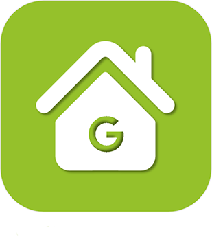
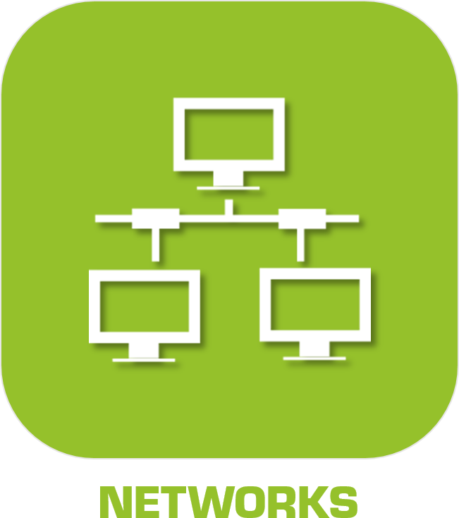
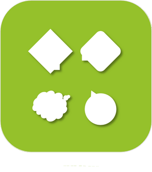

# Communication

>**IMPORTANT**
>Seuls les plugins officiels ont leur documentation ici. Vous pouvez consulter les documentations des autres plugins directement depuis le Market Jeedom. Une fois sur le plugin en question, cliquez sur documentation.
>Vous pouvez voir [ici](https://market.jeedom.com/index.php?v=d&p=market&type=plugin&categorie=communication) tous les plugins officiels de cette catégorie

| | | | |
|--- | --- | --- | ---|
||Alexa|Alexa|[Documentation](ash/index.md) [Market](https://market.jeedom.com/index.php?v=d&p=market_display&id=3409)|
||Borne Tenda W301A|Auteur du plugin : Thomas Guenneguez ATTENTION, il ne s’agit pas d’un plugin Officiel Jeedom mais d’un plugin développé par une tierce personne et dont l’évolution a été abandonnée. L’équipe technique Jeedom assurera l’assistance sur ce plugin sans obligation de résultat. Plugin permettant de gérer les Bornes Tenda W301A.|[Documentation](bornetenda/index.md) [Market](https://market.jeedom.com/index.php?v=d&p=market_display&id=1299)|
||Dialog flow|Plugin permet de parler à Google Home/Assistant par le biais des interactions Jeedom|[Documentation](dialogflow/index.md) [Market](https://market.jeedom.com/index.php?v=d&p=market_display&id=3215)|
||Gcast|Plugin simple de gestion de cast, et permet la notif vocale|[Documentation](gcast/index.md) [Market](https://market.jeedom.com/index.php?v=d&p=market_display&id=3057)|
||Google Smarthome|Plugin pour piloter Jeedom avec un Google Home. Important : le plugin nécessite un abonnement aux services vocaux (3 mois offert lors de l'achat du plugin) pour une configuration facile. Pour gérer cet abonnement : https://www.jeedom.com/market/index.php?v=d&p=profils#services Vous pouvez utiliser aussi le mode standalone mais ça configuration est plus complexe, nous vous conseillons vivement de lire la documentation avant tout achat si vous souhaitez utiliser ce mode.|[Documentation](gsh/index.md) [Market](https://market.jeedom.com/index.php?v=d&p=market_display&id=3412)|
||IFTTT|Grâce à ce plugin, vous pouvez bénéficier des innombrables recettes disponibles sur IFTT. Ainsi un événement Jeedom peut devenir un point d'entrée pour une recette IFTT et déclencher un événement de toutes sortes|[Documentation](ifttt/index.md) [Market](https://market.jeedom.com/index.php?v=d&p=market_display&id=1705)|
||Jarvis|Plugin permettant de gérer un ou plusieurs Jarvis|[Documentation](jarvis/index.md) [Market](https://market.jeedom.com/index.php?v=d&p=market_display&id=2577)|
||Jeedom Link|Plugin permettant de lier plusieurs Jeedom|[Documentation](jeelink/index.md) [Market](https://market.jeedom.com/index.php?v=d&p=market_display&id=2530)|
||LaMetric|Plugin permettant d'afficher des notifications sur LaMetric Time|[Documentation](lametric/index.md) [Market](https://market.jeedom.com/index.php?v=d&p=market_display&id=2818)|
||Mail|Plugin pour envoyer des mails|[Documentation](mail/index.md) [Market](https://market.jeedom.com/index.php?v=d&p=market_display&id=22)|
||App Mobile|L'application officielle Jeedom permet le pilotage de votre système domotique Jeedom, que ce soit en Wifi local, ou sur le réseau 3G/4G de votre opérateur.  L'app se connecte automatiquement à votre Jeedom avec une initialisation automatique par QRcode, aucune configuration n'est nécessaire. (possibilité de le faire manuellement) Vous retrouverez sur votre mobile toutes les fonctionnalités de votre Jeedom. Vous pourrez personnaliser votre application avec des raccourcis et plus encore...  Fonctionnalités actuelles: - Gestion de vos scénarios. - Gestion de votre domotique en fonction de vos pièces et équipements. - Maj et retour d'état automatique - Compatibilité aves les plugins, tel que thermostat, alarme, caméra etc... - Interface personnalisable avec les raccourcis. - Résumé domotique général et par pièce - Notifications (avec prise en charge du ASK) - Affichage des Designs   D'autres fonctionnalités et compatibilités sont à venir dans les prochaines mises à jour !  Respect de la vie privée. Aucune donnée (domotique ou personnelle) n'est stockée ou conservée sur nos serveurs.|[Documentation](mobile/index.md) [Market](https://market.jeedom.com/index.php?v=d&p=market_display&id=2030)|
||Network|Plugin permettant la gestion réseaux des équipements : ping (ip,arp et port) et wake on lan|[Documentation](networks/index.md) [Market](https://market.jeedom.com/index.php?v=d&p=market_display&id=1950)|
||Nimbus|Plugin pour contrôller votre Nimbus.  Vous pouvez controller le texte affiché, la position des aiguilles. Le tout via scénario ou via le dashboard.  Une représentation personnalisable du nimbus sur votre dash viendra aggrémenter le tout  Le dashboard est complétement personnalisable  Vous pouvez changer la position de chaque aiguille et changer le texte de chaque écran indépendammment (soit via le dashboard soit via scénario)  Il existe aussi une commande démo ainsi qu'une commande tous (pour agir sur tous les écrans en meme temps) ,ainsi qu'une commande phrase pour splitter une phrase sur les 4 écrans.   Bien lire la documentation|[Documentation](nimbus/index.md) [Market](https://market.jeedom.com/index.php?v=d&p=market_display&id=1506)|
||Notification Manager|Ce plugin permet de gérer les notifications (reprise en case d'erreur, génération de texte...)|[Documentation](notificationmanager/index.md) [Market](https://market.jeedom.com/index.php?v=d&p=market_display&id=3315)|
||Openvpn|Plugin permettant de gérer la connexion à un serveur openvpn|[Documentation](openvpn/index.md) [Market](https://market.jeedom.com/index.php?v=d&p=market_display&id=1965)|
||Philips Hue|Plugin pour commander les lampes Philips Hue. Fonctions dispos: - On/Off - Luminosité - Transition - Groupe - Couleur - Mode Alerte - Mode Arc en ciel  ATTENTION : il y a un léger décalage de couleurs connu entre le sélecteur et la couleur de l'ampoule. Il semble que la grille de couleur des ampoules aient un offset|[Documentation](philipsHue/index.md) [Market](https://market.jeedom.com/index.php?v=d&p=market_display&id=190)|
||Phone market|Plugin pour utiliser le market comme passerelle SMS et pour passer des appels|[Documentation](phonemarket/index.md) [Market](https://market.jeedom.com/index.php?v=d&p=market_display&id=1694)|
||Sarah|Plugin pour utiliser Sarah (http://encausse.wordpress.com/s-a-r-a-h/)|[Documentation](sarah/index.md) [Market](https://market.jeedom.com/index.php?v=d&p=market_display&id=17)|
||Slack|Plugin pour lier Jeedom à Slack|[Documentation](slack/index.md) [Market](https://market.jeedom.com/index.php?v=d&p=market_display&id=1689)|
||SMS|Plugin ajoutant la gestion (envoi/réception) des SMS à Jeedom.Avec ce plugin vous pouvez ainsi être notifié par SMS, voir grâce au moteur d'interactions poser une question ou déclencher une action via SMS.(Nécessite une clé 3G et une carte SIM ).|[Documentation](sms/index.md) [Market](https://market.jeedom.com/index.php?v=d&p=market_display&id=16)|
||Wifip|Plugin pour gérer le wifi de votre box ainsi que fixer l'ip|[Documentation](wifip/index.md) [Market](https://market.jeedom.com/index.php?v=d&p=market_display&id=2286)|
||Wifipower|Plugin pour la gestion des équipements wifipower|[Documentation](wifipower/index.md) [Market](https://market.jeedom.com/index.php?v=d&p=market_display&id=1046)|
