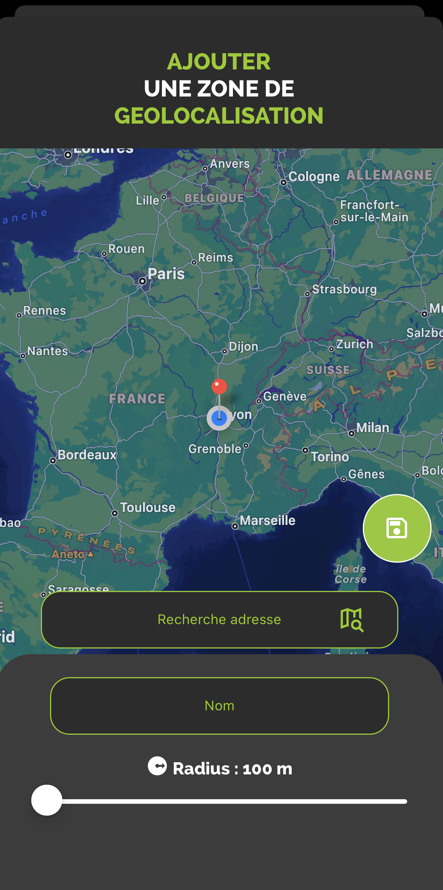
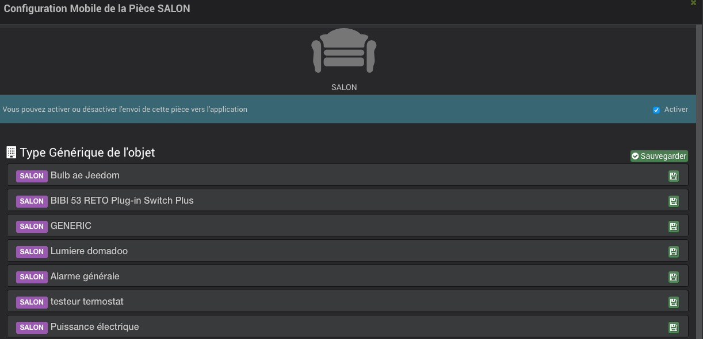
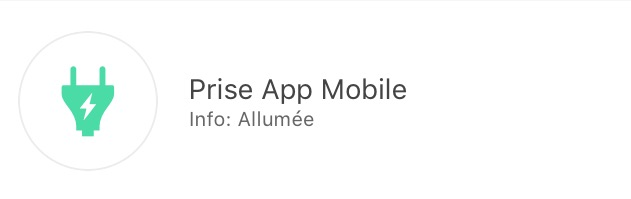

# Mobile Plugin

Plug-in para usar o aplicativo Jeedom Mobile.

O aplicativo móvel Jeedom requer a instalação deste plug-in para que a caixa possa se comunicar com o aplicativo móvel.

# Configuração do plugin Mobile para Application V2

Depois de instalar o plugin, você só precisa ativá-lo :

# Primeira conexão com o aplicativo V2

Para conectar seu telefone : existem 2 métodos possíveis;
Na primeira tela do aplicativo, você pode conectar sua conta de mercado e, assim, encontrar todas as caixas associadas a esta conta ou simplesmente adicionar uma caixa.

> **IMPORTANTE**
>
> Para aproveitar as funcionalidades do aplicativo, o núcleo do seu Jeedom deve estar em 4.4.0 mínimo

#### **LOGIN VIA CONTA DE MERCADO** :

Tudo o que você precisa fazer é inserir seu Market ID e senha.

#### **CONEXÃO VIA CAIXA ID** :

Várias opções nesta tela :

- Você insere a url do seu Jeedom (interno ou externo), bem como os identificadores de acesso a ele e confirma com o botão LOGIN

- Você clica no QR Code : uma nova tela aparece; você pode escanear um QR Code do plugin Mobile da Box que deseja adicionar, através da aba QR Code do plugin.

> Aba Qr Code do plugin Mobile

> > 

Uma vez que esta primeira etapa foi concluída, você está registrado no aplicativo: se você possui o plugin Mobile, terá acesso através do menu às Notificações, QR Codes, Personalização do Menu ....

No menu, você terá a aba Caixas, que agrupa todas as caixas presentes nesta conta de mercado

Basta clicar na Box onde o plugin Mobile está instalado e depois se identificar para acessar a Box.

A caixa irá para o topo da lista, validada a sua autenticação.
Você pode fazer isso para várias caixas.

Você também pode clicar no botão + no canto inferior direito para acessar diferentes opções;

- QR Code para adicionar uma Box à lista através do plugin Mobile,
- Manual para adicionar manualmente uma caixa
- Detecção Atlas e Luna (se estiver no Wifi, irá detectar as caixas na rede)
- Sincronização do Market para atualizar as informações configuradas da conta do Market

Para acessar recursos como Notificações, Personalização de Menu ou Geolocalização, você deve primeiro ter selecionado pelo menos uma caixa atual'

# Como funciona a geolocalização

Adicionamos uma zona de geolocalização clicando no ícone +

Digitamos o endereço que procuramos, validamos com Enter no seu telefone; o cursor irá então se posicionar no endereço desejado.
Podemos então adicionar um nome e salvar a zona.

Isto irá criar um novo comando no seu equipamento móvel, do tipo binário, que corresponderá às entradas e saídas da zona se a geolocalização estiver ativada no seu telemóvel.

Também podemos alterar o raio da zona, para estender a detecção da zona.

# FAQ

> **Tenho problemas com notificações**
>
> Esta parte está sendo melhorada e otimizada no aplicativo beta.

> **Tenho problemas para exibir meu webview**
>
> No seu Jeedom, nas Preferências, verifique se a página inicial do celular é HOME.

# Configurando o plugin Mobile V1

Depois de instalar o plugin, você só precisa ativá-lo :

**Configuração**

Para configurar o plug-in, você deve adicionar os telefones que poderão acessar o Jeedom.

Para adicionar um telefone : **Plugins** → **Comunicação** → **App
Mobile** → **Adicionar**

Aqui estão os parâmetros para inserir :

- **Nome do equipamento móvel** : Nome do telefone
- **Ativar** : Ativando o acesso para este celular
- **Tipo de celular** : Seleção de SO do telefone (iOS, Android)
- **Usuário** : Usuário associado a este acesso

> **Dica**
>
> A escolha do usuário é importante, pois determina o equipamento ao qual ele terá acesso de acordo com seus direitos.

Após salvar, você obterá um QR Code permitindo que o aplicativo se configure.

# Configuração de plugins e comandos recebidos pelo aplicativo

Após a inicialização do Mobile Plugin, você tem a possibilidade de modificar os tipos genéricos de pedidos, plugins e peças.

Ao clicar em um plug-in, você pode autorizá-lo ou não a conversar com o aplicativo móvel e configurar cada um dos tipos genéricos associados aos seus comandos.

Ao clicar em uma peça, você pode autorizá-la ou não a estar presente no aplicativo móvel e configurar cada um dos tipos genéricos associados a seus pedidos.

# Configuração de aplicativo para dispositivos móveis

Você encontrará os aplicativos nas persianas móveis :

**Android Google Play**

**Apple App Store**

## Primeiro lançamento do aplicativo

Ao iniciar o aplicativo Mobile pela primeira vez, você receberá um tutorial para ajudá-lo a configurá-lo.

Depois de baixar e instalar seu aplicativo móvel Jeedom, inicie o aplicativo em seu smartphone.

Você chega em um tutorial de configuração que recomendamos que você siga. Algumas etapas foram realizadas anteriormente.

Você terá então a opção entre configuração manual ou automática por QR Code. Caso opte pela configuração por QR Code, basta flashar o QR Code presente no plugin Mobile App no equipamento smartphone previamente criado. Nesse caso, o aplicativo recuperará automaticamente toda a configuração do seu Jeedom e se conectará automaticamente. Quando estiver conectado à sua casa via Wifi, o aplicativo usará automaticamente o endereço Ethernet Jeedom interno à sua rede. Quando você está conectado em 4G ou 3G, ele usa seu endereço externo para conectar-se ao seu Jeedom (por exemplo, através do serviço DNS Jeedom, se você o usar). Se você escolher a configuração manual, nesse caso, será necessário inserir manualmente os endereços IP internos e externos do seu Jeedom. Esta opção está reservada a um público informado.

O aplicativo será sincronizado e você chegará à sua página inicial (precedida por um mini guia de apresentação).

O aplicativo móvel Jeedom está pronto para funcionar.

## Favoritos

No aplicativo, você pode ter Favoritos (atalhos de comandos, plugins, cenários).

Aqui está o procedimento para criá-los :

Clique em um dos + na tela inicial do aplicativo :

Você chegará à página de seleção do tipo de atalho :

Por exemplo, vamos executar uma ação, por isso nos oferece moedas / objetos :

Em seguida, basta selecionar a ação que deseja como atalho :

É então possível personalizar a cor deste (no momento, três cores são propostas) :

Bem como os dois textos associados :

Pronto, agora você tem um atalho para o seu comando (na versão 1.1 Espera-se que os comandos liga / desliga apareçam na mesma tecla).

# Como configurar corretamente tipos genéricos

## Tipos genéricos no plug-in Mobile

Melhor que as palavras, aqui está um exemplo dos créditos genéricos para uma luz com todos os seus controles (veja também a tabela Luz abaixo)) :

## Tabelas de modelo de aplicativo

### As luzes

|              Imagem              | Tipo genérico                                                                                                                                                                                                                                                   | Parte do plugin Dev                                                                                                        |                                                                                                                           Descrição                                                                                                                            |
| :-----------------------------: | :--------------------------------------------------------------------------------------------------------------------------------------------------------------------------------------------------------------------------------------------------------------- | :----------------------------------------------------------------------------------------------------------------------- | :--------------------------------------------------------------------------------------------------------------------------------------------------------------------------------------------------------------------------------------------------------------: |
|  | `Botão de luz ligado` `Botão apagado`                                                                                                                                                                                                                     | `LIGHT_ON` `LIGHT_OFF`                                                                                               |                                                                                                   presença de dois botões "ON" e "Off" sem feedback de status.                                                                                                   |
|  | `Botão de luz ligado` `Botão apagado` `Luz do estado`                                                                                                                                                                                                  | `LIGHT_ON` `LIGHT_OFF` `LIGHT_STATE`                                                                             |                                                                                          Feedback de status presente, o botão esquerdo alterna entre ligado e desligado                                                                                           |
|  | `Botão de alternância de luz` `Luz do estado`                                                                                                                                                                                                                       | `LIGHT_TOGGLE` `LIGHT_STATE`                                                                                         |                                                                                          Feedback de status presente, o botão esquerdo alterna entre ligado e desligado                                                                                           |
|  | `Botão de luz ligado` `Botão apagado` `Luz do estado` `Light Slider`                                                                                                                                                                             | `LIGHT_ON` `LIGHT_OFF` `LIGHT_STATE` `LIGHT_SLIDER`                                                          |                                                                    Feedback de status presente, o botão esquerdo permite alternar entre On e Off e o controle deslizante permite controlar a intensidade                                                                    |
|  | `Botão de luz ligado` `Botão apagado` `Luz do estado` `Light Slider` `Cor clara (informação)` `Cor clara (ação)` `Light Mode` (opcional, é usado para ter modos de luz, por exemplo arco-íris no Philips Hue) | `LIGHT_ON` `LIGHT_OFF` `LIGHT_STATE` `LIGHT_SLIDER` `LIGHT_COLOR` `LIGHT_SET_COLOR` `LIGHT_MODE` | Feedback de status presente, o botão esquerdo permite alternar entre On e Off e o controle deslizante permite controlar a intensidade. No círculo, a cor da lâmpada está presente e, quando você clica nela, pode alterar a cor e ativar um modo |

### As tomadas

|               Imagem               | Tipo genérico                                                               | Parte do plugin Dev                                                   |                                                        Descrição                                                         |
| :-------------------------------: | :--------------------------------------------------------------------------- | :------------------------------------------------------------------ | :------------------------------------------------------------------------------------------------------------------------: |
|  | `Botão de soquete ativado` `Botão fora do soquete`                                     | `ENERGY_ON` `ENERGY_OFF`                                        |                                presença de dois botões "ON" e "Off" sem feedback de status.                                |
|  | `Botão de soquete ativado` `Botão fora do soquete` Tomada de Estado                    | `ENERGY_ON` `ENERGY_OFF` `ENERGY_STATE`                     |                       Feedback de status presente, o botão esquerdo alterna entre ligado e desligado                        |
|  | `Botão de soquete ativado` `Botão fora do soquete` Tomada de Estado `Soquete deslizante` | `ENERGY_ON` `ENERGY_OFF` `ENERGY_STATE` `ENERGY_SLIDER` | Feedback de status presente, o botão esquerdo permite alternar entre On e Off e o controle deslizante permite controlar a intensidade |

### As persianas

|              Imagem              | Tipo genérico                                                                                                        | Parte do plugin Dev                                                            |                                     Descrição                                     |
| :-----------------------------: | :-------------------------------------------------------------------------------------------------------------------- | :--------------------------------------------------------------------------- | :---------------------------------------------------------------------------------: |
|    | `Montar painel de botões` `Painel de botões para baixo` `Painel do botão Stop ' Painel de estado (opcional)                | `FLAP_UP` `FLAP_DOWN` `FLAP_STOP` `FLAP_STATE` (opcional)        |  Presença de três botões "Para cima", "Para baixo", "Parar", feedback opcional do status.  |
|    | `Montar painel de botões` `Painel de botões para baixo` `Painel do botão Stop ' Painel de estado `Painel do botão deslizante` | `FLAP_UP` `FLAP_DOWN` `FLAP_STOP` `FLAP_STATE` `FLAP_SLIDER` | Presença de um controle deslizante, com um botão Acima / Abaixo em Alternar (com ícone de status) |

### Inondation

|              Imagem              | Tipo genérico                                                                                 | Parte do plugin Dev                                                                        |                             Descrição                              |
| :-----------------------------: | :--------------------------------------------------------------------------------------------- | :--------------------------------------------------------------------------------------- | :------------------------------------------------------------------: |
|    | `Innondation` `TEMPERATURE` (opcional) Humidade (opcional) `SABOTAGE` (opcional) | `FLOOD` `TEMPERATURE` (opcional) «UMIDADE» (opcional) «UMIDADE» (opcional) | Permite que você tenha seu sensor de inundação completo em uma única linha. |

### Serrure

|             Imagem             | Tipo genérico                                                         | Parte do plugin Dev                             |                                  Descrição                                  |
| :---------------------------: | :--------------------------------------------------------------------- | :-------------------------------------------- | :---------------------------------------------------------------------------: |
|    | `Bloqueio de estado` `Abrir botão de bloqueio` `Fechar botão de bloqueio` | `LOCK_STATE` `LOCK_OPEN` `LOCK_CLOSE` | Feedback de status presente, o botão esquerdo alterna entre ligado e desligado |

### Sereia

|              Imagem              | Tipo genérico                                               | Parte do plugin Dev                            |                                  Descrição                                  |
| :-----------------------------: | :----------------------------------------------------------- | :------------------------------------------- | :---------------------------------------------------------------------------: |
|    | `Estado da sirene` `Botão da sirene ligado` `Botão da sirene desativado` | `SIREN_STATE` `SIREN_ON` `SIREN_OFF` | Feedback de status presente, o botão esquerdo alterna entre ligado e desligado |

### Fumaça

|              Imagem              | Tipo genérico                       | Parte do plugin Dev                    |                           Descrição                            |
| :-----------------------------: | :----------------------------------- | :----------------------------------- | :--------------------------------------------------------------: |
|    | `Fumaça` `TEMPERATURE` (opcional) | `SMOKE` `TEMPERATURE` (opcional) | Permite que você tenha seu sensor de fumaça completo em uma única linha. |

### Temperatura

|                    Imagem                    | Tipo genérico                          | Parte do plugin Dev                       | Descrição |
| :-----------------------------------------: | :-------------------------------------- | :-------------------------------------- | :---------: |
|    | TEMPERATURA Humidade (opcional) | `TEMPERATURE` «UMIDADE» (opcional) | Veja a imagem. |

### Presença

|                 Imagem                 | Tipo genérico                                                                                                                              | Parte do plugin Dev                                                                                                                           | Descrição |
| :-----------------------------------: | :------------------------------------------------------------------------------------------------------------------------------------------ | :------------------------------------------------------------------------------------------------------------------------------------------ | :---------: |
|    | PRESENÇA `TEMPERATURE` (opcional) `Brightness` (opcional) Humidade (opcional) `UV` (opcional) `SABOTAGE` (opcional) | `PRESENCE` `TEMPERATURE` (opcional) `BRILHO` (opcional) «UMIDADE» (opcional) `UV` (opcional) `SABOTAGE` (opcional) | Veja a imagem. |

### Ouvrant

|                Imagem                | Tipo genérico                                 | Parte do plugin Dev                                       |                              Descrição                              |
| :---------------------------------: | :--------------------------------------------- | :------------------------------------------------------ | :-------------------------------------------------------------------: |
|    | `Porta/Janela` `TEMPERATURE` (opcional) | `OPENING / OPENING_WINDOW` `TEMPERATURE` (opcional) | Consulte Imagem (ou seja, você pode escolher entre janela e porta). |

### Fio piloto

|                Imagem                | Tipo genérico                                                                                                                                      | Parte do plugin Dev                                                      |                                                                          Descrição                                                                           |
| :---------------------------------: | :-------------------------------------------------------------------------------------------------------------------------------------------------- | :--------------------------------------------------------------------- | :------------------------------------------------------------------------------------------------------------------------------------------------------------: |
|    | `Botão LIGADO do aquecimento do fio piloto` `Botão OFF do fio piloto de aquecimento` `Estado do fio piloto de aquecimento` `Aquecimento do fio piloto de botão` (opcional) | `HEATING_ON` `HEATING_OFF` `HEATING_STATE` `HEATING_OTHER` | Os botões ON / OFF e Status permitem criar o botão na extrema esquerda do modelo e os `fios de aquecimento do botão piloto 'existem para adicionar botões (5 no máximo) |

## OS JOKERS

### Ação genérica

|               Imagem               | Tipo genérico               | Parte do plugin Dev |                                                                            Descrição                                                                            |
| :-------------------------------: | :--------------------------- | :---------------- | :---------------------------------------------------------------------------------------------------------------------------------------------------------------: |
|    | `Ação Genérica` | `GENERIC_ACTION`  | O botão assume a forma do tipo de ação. Por padrão, é uma alternância, se for uma mensagem, então você tem um envelope, se for um controle deslizante, você tem um controle deslizante, etc... |

### Informações genéricas

|             Imagem             | Tipo genérico                    | Parte do plugin Dev |                 Descrição                 |
| :---------------------------: | :-------------------------------- | :---------------- | :-----------------------------------------: |
|    | `Informações Genéricas` | `GENERIC_INFO`    | O botão assume a forma do tipo de informação. |

# Troubleshooting

**Estou na versão Android do aplicativo (1.0.1 ou 1.0.0) Não consigo acessar minhas partes ou mesmo a configuração do aplicativo.**

Você tinha um pop-up alertando sobre uma preocupação com as configurações de acessibilidade; basta acessar as configurações de acessibilidade do seu celular e desmarcar os aplicativos usando esta opção. (Uma correção será trazida em breve no aplicativo)

**Tenho uma mensagem em uma das linhas dos meus módulos informando que está faltando um tipo genérico !**

Ao ler esta mensagem, ele informa qual tipo genérico está ausente para criar um modelo compatível. Apenas aplique. Consulte o [doc capítulo Tipo genérico](https://www.jeedom.com/doc/documentation/plugins/mobile/pt_PT/mobile#_configuration_des_plugins_et_commandes_que_reçoit_l_app).

**Tenho um problema com um dos chamados plug-ins totalmente integrados (clima, termostato, alarme, câmera) !**

Não hesite em acessar o seu módulo e clicar novamente em salvar, isso incluirá novamente os tipos genéricos associados ao módulo.

**Não foi possível colocar uma informação sobre as boas-vindas do aplicativo !**

Isso é normal, estará disponível na versão 1.1.

**Tenho o aplicativo que ocupa muita memória do meu celular !**

Houve um erro nas versões 1.0.0 e 1.0.1 na parte da câmera. O problema não acontecerá novamente com 1.0.2, para deletar o cache sem deletar o app, basta ir até a configuração do seu Mobile App e clicar em "deletar cache".

**Tenho uma preocupação de primeira sincronização no aplicativo ou de sql no plug-in móvel !**

Você precisa colocar tipos genéricos e autorizar o plug-in a enviar genéricos, veja o documento um pouco mais alto.
