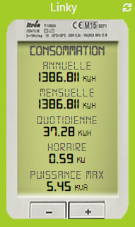

# Plugin Enedis

Plugin que permite a recuperação de dados de consumo de eletricidade de medidores inteligentes *(linky por exemplo)* questionando o [conta de cliente **Enedis**](https://mon-compte.enedis.fr/auth/XUI/#login/&realm=/enedis&forward=true){:target = "\_ em branco"}.

>**IMPORTANTE**
>
>O plugin foi completamente reescrito em fevereiro de 2021 para uso **a API Enedis Data-Connect oficial**. Se você já usou o plugin antes, nós o convidamos a criar um novo equipamento ou deletar todos os controles de um equipamento anterior.

É possível acessar dados de **consumo**, do **Produção** ou para os 2 tipos de medição diretamente em um dispositivo.

5 dados são relatados para cada tipo de medição :
- o **consumo por hora** por meia hora *(em kW)*.
- o **consumo diário** *(em kWh)*.
- o **consumo mensal** *(em kWh)*.
- o **consumo anual** *(em kWh)*.
- o **poder maximo** *(em kVA)*.

>**EM FORMAÇÃO**  
>    
>Como os dados não são disponibilizados em tempo real, o plugin recupera os dados de consumo de eletricidade da véspera de cada dia.

Enquanto o plug-in não recuperou todos os dados do dia anterior, ele continua a pesquisar os servidores Enedis a cada 30 minutos entre 7h e 20h, caso contrário, as chamadas serão suspensas até o dia seguinte.

# Configuration

Como qualquer plugin Jeedom, o plugin **Enedis** deve ser ativado após a instalação.

## Gerenciamento de dependências

O plugin requer a presença do pacote Linux `php-mbstring` normalmente presente por padrão, então o status de dependência deve ser **Certo** assim que o plugin for instalado. Caso contrário, clique no botão **Reviver** para instalar o pacote que falta.

## Configuração do plugin

Se ainda não o fez, comece por autorizar a partilha de dados Enedis com a Jeedom clicando no botão **Autorizar acesso aos servidores Enedis : Eu acesso minha área de cliente Enedis** da página de configuração do plugin :      

Você é então redirecionado para esta página na qual você deve informar **seus detalhes de login para o mercado Jeedom** então clique no botão **Validar** :      

Redirecionamento para a página de consentimento da Enedis na qual é necessário **Verifica a caixa** e clique em **Validar** :     

Depois que o compartilhamento de dados é validado, esta página é exibida :     

>**IMPORTANTE**
>    
>Se você não conseguir acessar nenhuma dessas páginas, desative o bloqueador de anúncios do navegador.

## Configuração do equipamento

Para acessar os diferentes equipamentos **Enedis**, vá para o menu **Plugins → Energia → Enedis**.

>**EM FORMAÇÃO**
>    
>O botão **acrescentar** permite que você adicione um novo medidor / PDL.

Uma vez que o compartilhamento de dados foi autorizado na página de configuração do plugin, tudo que você precisa fazer é entrar **o número de identificação do Ponto de Entrega** preocupado *(PDL)* e a **tipo de medição** para voltar.

Durante o 1º backup de um dispositivo ativo e configurado, o plugin irá criar automaticamente os comandos necessários e integrar os históricos disponíveis no site da Enedis desde 1º de janeiro do corrente ano. Este processo provavelmente levará vários minutos, você pode acompanhar o progresso no menu **Análise → Logs** *(loga ``debug``)*.

>**EM FORMAÇÃO**
>
>Os dados de consumo por hora são recuperados nos últimos 7 dias, no máximo.

## Adicionando dados

É possível integrar histórias sob demanda, até 3 anos atrás, diretamente do site da Enedis. Para fazer isso, basta clicar no botão azul **Acréscimos históricos** da guia **Pedidos** de um item de equipamento, na coluna **Açao** da ordem em questão :

Em seguida, escolha a data de início e clique em **Certo** para iniciar o processo.

Os dados de dia, mês, ano e potência máxima serão integrados a partir da data escolhida até 1º de janeiro do ano atual. Os dados horários, quando o forem, serão integrados em até 7 dias após a data escolhida.

>**EM FORMAÇÃO**
>
>Essas restrições de tempo são definidas pela Enedis.

# Template de widget

>**EM FORMAÇÃO**
>     
>O modelo do widget será exibido nas versões desktop e móvel.

O plugin oferece a possibilidade de exibir dados de consumo e / ou produção em um template de widget que imita a aparência de um medidor *Linky*. O clique no botão "**- \| +**" permite passar do consumo para a produção para quem tem acesso a 2 tipos de medidas. Um indicador também permite que você saiba se os dados estão atualizados ou não *(verde = todos os dados estão atualizados, laranja = alguns dados não estão atualizados, vermelho = nenhum dado está atualizado)*.

Para ativar esta opção, basta marcar a caixa **Template de widget** na página geral do equipamento em questão. Uma vez que a caixa é marcada, uma opção permite que você selecione a cor de fundo do widget *(163, 204, 40 por padrão)*.

>**DICA**
>     
>Na versão desktop, as informações exibidas no widget se adaptam em tamanho ao redimensionar o bloco.

# FAQ

>**Tenho erros `Error on enedis json return` nos logs, mas os dados são visíveis no site da Enedis**
>
>Às vezes acontece que você precisa ir diretamente ao site da Enedis para validar os últimos T & Cs para acessar os dados novamente. Às vezes também é necessário substituir o link Jeedom / Enedis da página de configuração do plugin.

>**Não tenho dados de Dia / Mês / Ano para 31 de dezembro de 2021**
>
>Para recuperar esses dados basta clicar no botão **Acréscimos históricos** da ordem **Dia do Consumo** e selecione a data de 1º de janeiro de 2021 como a data de partida.  
