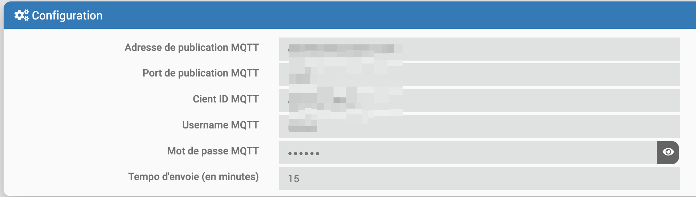
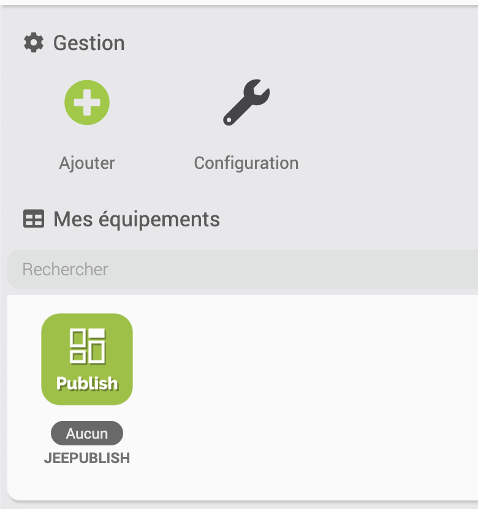
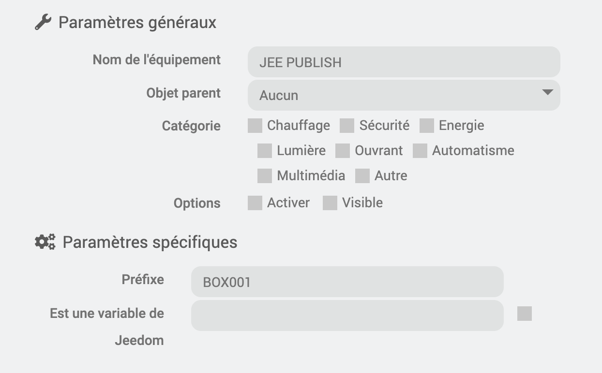

# Plug-in JeeDashboardPublish

## Introduction

O plug-in JeeDashboardPublish permite publicar valores do Jeedom usando o plug-in jMQTT.

## Configuração do plug-in

É necessário inserir os parâmetros do Broker MQTT.

## Configuração do equipamento

É possível criar quantos equipamentos você quiser : 

Recomenda-se inserir um prefixo para ter nomes exclusivos com dois métodos :

1. Um prefixo rígido.

2. Usando uma variável Jeedom. É necessário marcar a caixa “É uma variável Jeedom” e inserir o nome da variável : variável (xxx)

## Utilisation

É possível inserir os nomes dos comandos a serem publicados selecionando uma lista de comandos com o botão “Escolher comandos” ou adicionando manualmente com o botão “Adicionar telemetria”".

É possível exportar os históricos de um ou mais pedidos especificando uma data de início.

