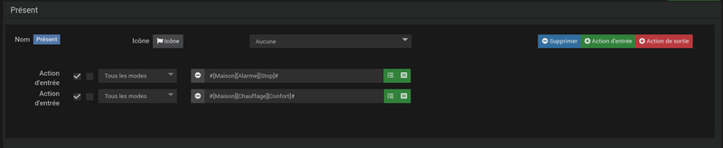
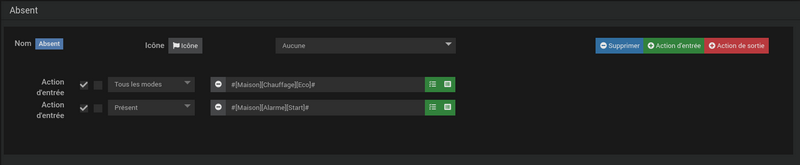

# Plugin de moda

O plug-in **Moda** permitirá que você crie modos para gerenciar facilmente diferentes recursos *(habitação, alarme, presença, etc...)* e execute ações automaticamente ao alternar entre os modos.

# Configuration

Este plugin não requer nenhuma configuração especial e simplesmente precisa ser ativado após a instalação.

## Configuração do equipamento

Para acessar os diversos equipamentos **Moda**, você tem que ir ao menu **Plugins → Organização → Moda**.

>**EM FORMAÇÃO**
>
>O botão + Adicionar permite adicionar um novo equipamento **Moda**.

Clique em um dispositivo **Moda** para acessar sua página de gerenciamento. A primeira aba dá acesso às opções de configuração do equipamento :

- **Nome do equipamento** : Nome do equipamento Modo.
- **Objeto pai** : Indica o objeto pai ao qual o equipamento pertence.
- **Categoria** : Permite escolher a categoria do equipamento.
- **Opções** :
    - **Ativar** : Permite ativar o equipamento.
    - **Visivél** : Torna o equipamento visível.

- **Comando de bloqueio** : Caixa de seleção para mostrar o comando de bloqueio no widget.

A segunda guia nos permitirá definir os diferentes modos do equipamento, bem como as ações associadas, se necessário :

- **Adicionar modo** : Clique no botão para criar um novo modo no equipamento.

Abaixo, você encontra a lista de modos existentes :

Clique na linha de um modo para implantar sua configuração e acessar o gerenciamento das ações de entrada/saída. A execução dessas ações pode ser condicionada pelo modo de chegada *(modo anterior)* para ações de entrada ou pelo modo que você vai *(próximo modo)* para ações de saída (consulte [os exemplos](#Exemples)).

>**EM FORMAÇÃO**
>
>Clique no nome do modo para alterá-lo. Atenção, em caso de modificação do nome de um modo, será necessário rever todos os cenários/equipamentos que se referiam a ele com seu nome antigo.

# Commandes

A lista de pedidos pode ser consultada clicando no botão **Configuração avançada** de um equipamento **Moda**. Cada modo criado em um dispositivo irá gerar o comando de ação correspondente além dos comandos existentes :

- **Bloqueio** :
    - **Bloquear desbloquear** : Permite bloquear o termostato para evitar qualquer mudança de modo.
    - **Desbloquear** : Desbloqueia o termostato.
>A Caixa **Comando de bloqueio** deve ser verificado para que este comando seja exibido no widget.

- **Moda** : Modo atual.
- **Modo anterior** : Modo anterior *(comando não visível por padrão)*.
- **Voltar ao modo anterior** : Permite retornar ao modo ativo anteriormente.
- **Ir para o próximo modo** : Permite que você vá para o próximo modo na lista.

# Exemples

## Modos de painel

Exemplo de equipamento sem ações de entrada ou saída nos modos. Equipamentos deste tipo podem ser úteis como um gatilho para um cenário ou para condicionar ações em um cenário :

## Modos de presença

Exemplo de equipamento com ações definidas ao mudar de modo. Neste equipamento vamos criar 3 modos na aba **Modos** equipamento :

- **Presente**
- **Ausente**
- **Férias**

Ao mudar para o modo **Presente**, queremos que o alarme seja desativado e o aquecimento mude para *Conforto (2 ações de entrada)* :

Ao sair do modo **Presente** para mudar para o modo **Ausente** ou **Férias**, queremos que o alarme seja ativado *(1 ação de saída)* :

Sobre os modos **Ausente** e **Férias**, vamos apenas criar em cada 1 ação de entrada para gerenciar o aquecimento, *Ecologicamente correto* para moda **Ausente** e *Proteção contra geada* para moda **Férias** :

### Presença de Operação

- Quando saímos do modo **Presente** na moda **Ausente**, o alarme está ativado (ação para sair **Presente**) e o aquecimento muda para *Ecologicamente correto* (ação de entrada de modo **Ausente**).  
- Quando saímos do modo **Presente** na moda **Férias**, o alarme está ativado (ação para sair **Presente**) e o aquecimento muda para *Proteção contra geada* (ação de entrada de modo **Férias**).
- Quando saímos do modo **Ausente** na moda **Presente**, o alarme é desativado (ação de entrada do **Presente**) e o aquecimento muda para *Conforto* (ação de entrada de modo **Presente**).
- Quando saímos do modo **Ausente** na moda **Férias**, interruptores de aquecimento para *Proteção contra geada* (ação de entrada de modo **Férias**).
- Quando saímos do modo **Férias** na moda **Presente**, o alarme é desativado (ação de entrada do **Presente**) e o aquecimento muda para *Conforto* (ação de entrada de modo **Presente**).
- Quando saímos do modo **Férias** na moda **Ausente**, interruptores de aquecimento para *Ecologicamente correto* (ação de entrada de modo **Ausente**).

## Modos Presença bis

Modificamos ligeiramente o exemplo anterior para ilustrar a filtragem de ações :

Para fazer isso, o alarme não será mais ativado ao sair do modo **Presente** mas na entrada de modos **Ausente** e **Férias**. Após a modificação obtemos o seguinte resultado :

>**EM FORMAÇÃO**
>
>nos modos **Ausente** e **Férias**, o alarme só é ativado se você sair do modo **Presente**. Se formos de **Ausente** no **Férias** *(Ou vice-versa)*, o alarme já está ativado, então não há necessidade de refazer a ação.

### Operação Presença bis

- Quando saímos do modo **Presente** na moda **Ausente**, o alarme está ativado (modo de ação de entrada **Ausente**) e o aquecimento muda para *Ecologicamente correto* (ação de entrada de modo **Ausente**).  
- Quando saímos do modo **Presente** na moda **Férias**, o alarme está ativado (modo de ação de entrada **Férias**) e o aquecimento muda para *Proteção contra geada* (ação de entrada de modo **Férias**).
- Quando saímos do modo **Ausente** na moda **Presente**, o alarme é desativado (ação de entrada do **Presente**) e o aquecimento muda para *Conforto* (ação de entrada de modo **Presente**).
- Quando saímos do modo **Ausente** na moda **Férias**, interruptores de aquecimento para *Proteção contra geada* (ação de entrada de modo **Férias**). O alarme não está ativado.
- Quando saímos do modo **Férias** na moda **Presente**, o alarme é desativado (ação de entrada do **Presente**) e o aquecimento muda para *Conforto* (ação de entrada de modo **Presente**).
- Quando saímos do modo **Férias** na moda **Ausente**, interruptores de aquecimento para *Ecologicamente correto* (ação de entrada de modo **Ausente**). O alarme não está ativado.
