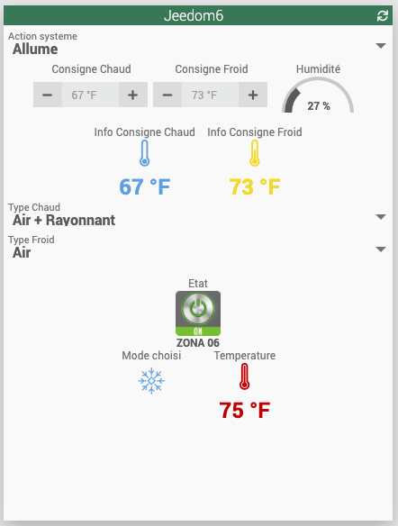
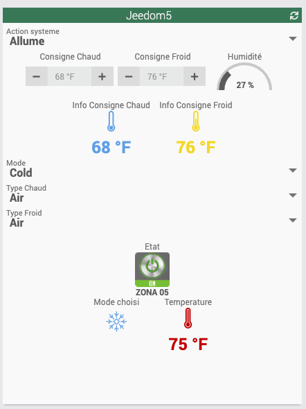

# Plugin Airzone

# Description

Plugin para gerenciar seus sistemas AirzoneWeb

# Pré-requisitos

 - Jeedom v4.1.22
 - Descubra o endereço IP do seu servidor AirzoneWeb

# Installation

Depois de baixar o plugin, você deve primeiro ativá-lo, como qualquer plugin Jeedom.

# Configuration

Vá para o menu de gerenciamento de Plugins / Plugins

Clique no seu plugin e configure-o com o endereço IP do seu AirzoneWebServer, bem como a porta (por padrão, os sistemas Airzone têm uma porta configurada em 3000)
O número de sistemas é detectado automaticamente quando um novo equipamento é adicionado.

Escolha o Cron desejado para a atualização dos valores :  5, 10, 15, 30, por hora ou diariamente.

Escolha o Tempo de espera entre solicitações para cada zona; por padrão 10s se campo vazio.

Ao clicar no botão Add DriverName, você pode modificar o nome do driver em seu sistema Airzone.

Sauvegardez

# Adicionando equipamento

Vá para o menu Plugins / Comfort / AirzoneJeedom

Clique em Adicionar.

As zonas disponíveis em seu sistema estarão disponíveis no menu suspenso.
Escolha uma zona para um equipamento

Lembre-se de ativar e tornar visível seu equipamento e atribuir a ele um pai para encontrá-lo em seu painel.

IMPORTANTE : Se você tiver uma área que contenha caracteres especiais, isso pode causar um erro de SystemOut of Range.

# Varredura de zona

Quando o seu equipamento estiver criado e ativado, você pode clicar em Scan Zones, na parte superior do equipamento
Isso enviará uma solicitação ao servidor da web para recuperar todas as informações de sua instalação

A página será atualizada e abrirá um menu de seleção para escolher a Zona associada a este equipamento

# Dashboard

Depois de criar seu equipamento, você os encontrará no painel.

Os ícones de modo mudam dependendo do modo selecionado: Frio, Quente, Ventilação, Seco e Pare.

Para se beneficiar dos ícones coloridos, lembre-se de ir para as configurações do seu Jeedom (Configurações / Sistema / Configuração / Interface), e marque "Ícones de widget coloridos"

Apenas as zonas Master têm o menu suspenso para alterar o modo nas zonas associadas configuradas em seu sistema

Os ícones de informações de ponto de ajuste e temperatura mudam de acordo com as janelas de valor : -20 ° C, entre 20 e 25 ° C, mais de 25 ° C (e o equivalente se a zona for definida em Fahrenheit)

As escolhas disponíveis nos modos, ou as velocidades dos ventiladores são detectadas de acordo com as possibilidades do seu sistema.

Equipamento típico :

Equipamento de uma zona mestre; vemos um comando adicional para ativar o mesmo modo em todas as zonas associadas do sistema

