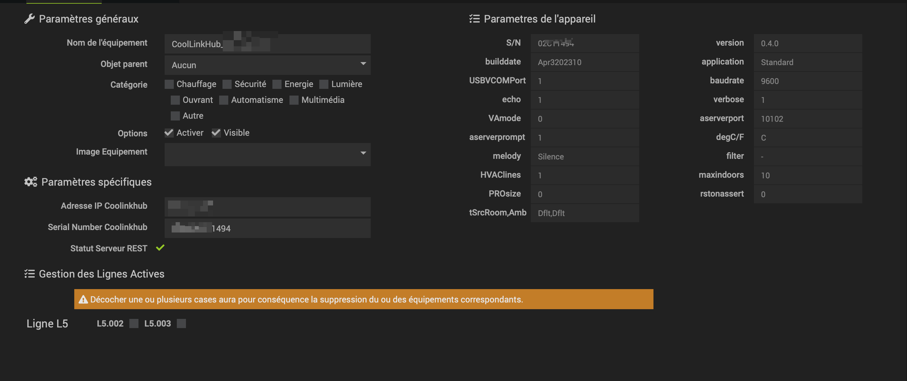
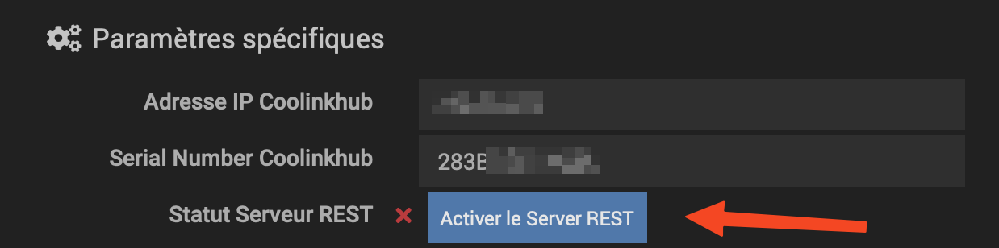
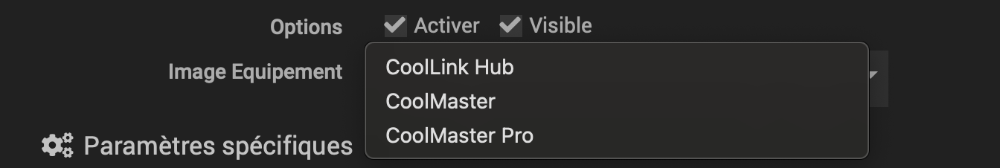

# Plug-in CoolAutomation

# Descoberta automática de equipamentos CoolAutomation

Basta clicar em Network Scan para começar a detectar equipamentos em sua rede

Uma vez encontrado, os eqlogics correspondentes serão criados

# Detalhe do equipamento

A página de equipamentos reúne as informações necessárias para a criação de equipamentos dependentes deste último

** Todas as informações nesta página são atualizadas ao chegar nesta página.

No lado direito você encontra os parâmetros do equipamento : versão do firmware, número máximo de linhas no dispositivo, número máximo de unidades etc.
Estes dados são apenas para fins informativos e não podem ser modificados

No lado esquerdo encontramos o endereço IP do equipamento, bem como o seu número de série : essas 2 informações são muito importantes porque servem para enviar solicitações à API do dispositivo. 

Abaixo dessas informações, encontramos o estado do servidor REST : este é o servidor web do dispositivo, que é usado para se comunicar com o plugin. Você deve, portanto, ativá-lo se ainda não estiver ativado. 
Pode ser ativado através do plugin, bastando clicar no botão correspondente

> ATTENTION

> Isso fará com que o equipamento seja reiniciado

Por fim, na seção Active Line Management, você encontrará as unidades conectadas ao equipamento e disponíveis para criação.

# Alterar imagem do equipamento

Acessando o equipamento Cool Automation, você pode escolher a imagem correspondente e salvar

# Criação de Unidades e seus Equipamentos Mestres

Para criar o equipamento que controla as unidades conectadas, basta verificá-los na seção Active Line Management e salvar

Isto criará os eqlogics correspondentes, bem como o equipamento Master, permitindo controlar uma linha inteira.

> ATTENTION

> Se você desmarcar uma unidade que já foi criada e salvar, isso excluirá o equipamento. 
> Se todas as caixas de uma linha estiverem desmarcadas, o equipamento Master da linha também será deletado

# Visão geral dos equipamentos e suas unidades

# Atribuindo unidades a um objeto

Dezenas de unidades podem ter sido criadas e é tedioso ter que ir até cada uma delas para atribuir um objeto pai a elas. 

Foi fornecido um sistema para facilitar esta : você só precisa marcar as unidades em uma linha e clicar em Atribuir seleção a um objeto, para escolher o objeto pai ao qual as unidades serão anexadas
Você pode até selecionar todas as unidades através da caixa de seleção ao lado do botão

# Atualização de dados 

Dependendo da configuração do plugin, os dados de todos os equipamentos serão atualizados nesta frequência

Existem 2 outros métodos para atualizar os dados de forma mais específica, sem fazer uma solicitação global para todos os dispositivos :

- clicando no ícone Atualizar de um dispositivo Line Master : os dados de suas unidades vinculadas serão recuperados
- clicando no ícone Atualizar de um equipamento filho do Mestre : os dados desta unidade somente serão recuperados

# Gestão de unidades e Masters

Cada unidade pode ser controlada individualmente

Para controlar todas as unidades em uma linha, você pode usar os comandos do Master associado. 

> Para as instruções, estas estão associadas a um modo: Quente ou frio
> Uma alteração do setpoint num Master irá alterar o setpoint das unidades dependentes, mas também o modo associado : Quente ou frio
> Portanto, lembre-se de retornar ao modo desejado assim que o ponto de ajuste geral tiver sido atribuído

# Registro em massa

Você pode registrar determinados comandos em uma única unidade, em todas as unidades filhas de equipamentos do tipo coolMaster/coolLinkHub ou em todas as unidades presentes no plugin

Para fazer isso, clique aqui :

Agora você seleciona a opção desejada :

Dependendo da sua escolha, um segundo seletor aparecerá para escolher a opção secundária correspondente :

Feita a escolha, basta escolher os comandos desejados e clicar em Log para que o(s) equipamento(s) escolhido(s) tenha(m) seus comandos registrados
Você pode selecionar todos eles através da primeira caixa de seleção

