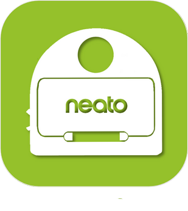
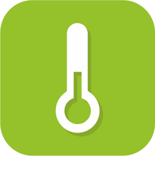

# Confort

>**IMPORTANT**
>Seuls les plugins officiels ont leur documentation ici. Vous pouvez consulter les documentations des autres plugins directement depuis le Market Jeedom. Une fois sur le plugin en question, cliquez sur documentation.
>Vous pouvez voir [ici](https://market.jeedom.com/index.php?v=d&p=market&type=plugin&categorie=wellness) tous les plugins officiels de cette catégorie

| | | | |
|--- | --- | --- | ---|
||Brumisateur Alfawise|Plugin pour contrôler les brumisateurs Alfawise|[Documentation](alfawiseumist/index.md) - [Market](https://market.jeedom.com/index.php?v=d&p=market_display&id=3296)|
||Green Momit|Plugin pour les thermostats Greenmomit|[Documentation](greenmomit/index.md) - [Market](https://market.jeedom.com/index.php?v=d&p=market_display&id=1081)|
||Ikettle|Plugin pour gérer les bouilloires smarter Ikettle et Ikettle 2|[Documentation](ikettle/index.md) - [Market](https://market.jeedom.com/index.php?v=d&p=market_display&id=3297)|
||Intesis|Plugin pour controler intesis|[Documentation](intesis/index.md) - [Market](https://market.jeedom.com/index.php?v=d&p=market_display&id=3921)|
||Neato|Plugin pour contrôller votre aspirateur Botvac Connected de chez Neato Il permet de lancer un cycle de nettoyage turbo ou eco De mettre en pause De reprendre De faire un retour base De connaitre le statut, la présence sur le dock, le niveau de charge   Et bien d'autres.....   Vous réviez d'un aspirateur intégré à votre domotique, cela est faisable |[Documentation](neato/index.md) - [Market](https://market.jeedom.com/index.php?v=d&p=market_display&id=2260)|
||Netatmo Thermostat|Plugin pour contrôler son thermostat Netatmo.  Le plugin permet de : -Choisir le mode de fonctionnement du thermostat (programme,max,absent,hors gel, off, consigne manuel) -Choisir son calendrier (vacances, standard etc...) - De connaitre la batterie et les niveaux de signals du thermostat - De connaitre le planning actuel ainsi que le suivant (et l'heure de fin du planning actuel) - De définir le jour et heure de fin des modes (absent, hors-gel, max et manuel) - L'ensemble des fonctions sont disponibles via scénarios - Les deux widgets (dashboard et mobile) permettent d'accéder à toutes ces fonctionnalités|[Documentation](netatmoThermostat/index.md) - [Market](https://market.jeedom.com/index.php?v=d&p=market_display&id=1969)|
||Smarter Coffee|Plugin pour gérer la cafetière smarter|[Documentation](smartercoffee/index.md) - [Market](https://market.jeedom.com/index.php?v=d&p=market_display&id=2285)|
||Swimo|Permet de piloter un controleur de piscine Swimo|[Documentation](swimo/index.md) - [Market](https://market.jeedom.com/index.php?v=d&p=market_display&id=3747)|
||Thermostat|Ce plugin très puissant et très complet vous permettra de gérer finement la température de votre logement que ce soit pour réchauffer ou refroidir celui-ci. Le plugin apprend de lui même avec le temps le meilleur moyen d'économiser de l'énergie tout en maintenant un confort optimal dans votre logement.|[Documentation](thermostat/index.md) - [Market](https://market.jeedom.com/index.php?v=d&p=market_display&id=77)|
||Thinking Cleaner|Plugin pour commander les roombas via le module Thinking Cleaner|[Documentation](thinkingCleaner/index.md) - [Market](https://market.jeedom.com/index.php?v=d&p=market_display&id=1712)|
