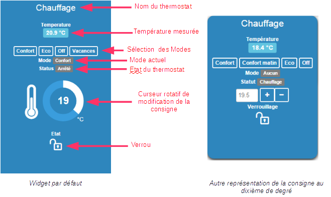
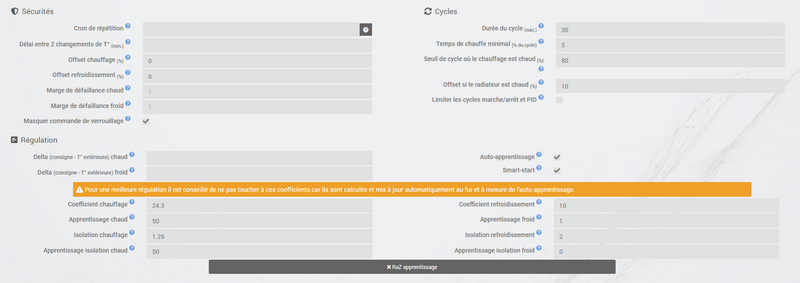
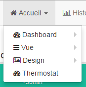

# Plugin de termostato

# Description

Este plugin permite que você crie e gerencie termostatos para controlar o aquecimento da sua casa. Opera em 2 modos, sua escolha :

-   o modo **histerese** corresponde a ligar e desligar o aquecimento em função da temperatura interior, em relação a um limiar correspondente ao ponto de ajuste. A histerese permite evitar comutações muito frequentes quando a temperatura está próxima do ponto definido.
-   o modo **temporal** calcula uma porcentagem de aquecimento em um ciclo de tempo predefinido, levando em consideração as diferenças entre o ponto de ajuste e as temperaturas interna e externa (isolamento)). Este modo é mais preciso, possui uma função de aprendizado que permite o ajuste automático dos coeficientes, mas pode exigir alguns ajustes manuais para adaptá-lo à sua instalação. Importante para o modo horário funcionar, você precisa absolutamente de um sensor de temperatura interno e externo.

# Configuration

Este plugin é para criar termostatos no Jeedom. Pode controlar o aquecimento, o ar condicionado ou ambos.

A vantagem em comparação com um termostato convencional é que ele poderá ser totalmente integrado à sua instalação de automação residencial. Além da regulação da temperatura, como é solicitado primeiro, o termostato pode interagir com todos os equipamentos da casa.

Entre suas características estão :

-   levando em consideração a temperatura externa, portanto, o coeficiente de isolamento da casa,
-   um sistema regulatório que aprende a otimizar a regulamentação,
-   a possibilidade de gerenciar as portas para desengatar o termostato,
-   gerenciamento de falhas de equipamentos, sensores de temperatura e aquecedores,
-   programação completa com o plugin diário, com em particular a possibilidade de antecipar a alteração do setpoint para que a temperatura seja atingida na hora programada (Smartstart)

Primeiro, mostraremos a implementação, depois detalharemos as diferentes configurações da configuração do termostato e, finalmente, através de alguns casos de uso, como podemos enriquecê-la em combinação com outros plugins ou usando cenários.

## Configuração em alguns cliques

O termostato Jeedom é muito poderoso, mas para uso tradicional, sua implementação é realmente simples e rápida, a partir do momento em que entendemos as etapas essenciais :

-   definição do motor do termostato (histerese ou tempo). É a escolha do algoritmo de regulação.
-   configuração e faixa de operação : somente aquecimento, ar condicionado ou ambas, temperaturas mínimas e máximas de uso.
-   Definir as ações que o termostato deve executar para aquecer, esfriar ou desligar.

Depois, existem guias diferentes :

-   A configuração do modo define temperaturas pré-determinadas. Por exemplo, modo conforto a 20 ° C, eco a 18 ° C. Pode haver dia, noite, férias, ausência, etc ... aqui você começa a ver as possibilidades de customização do plugin.
-   Para refinar o modo de operação do termostato, você também poderá configurar aberturas que interromperão temporariamente o regulamento (por exemplo, uma janela aberta pode interromper o aquecimento). A definição dessa interrupção é feita aqui simplesmente.
-   O gerenciamento de modos de falha para sensores de temperatura ou para aquecimento permite definir ações a serem executadas para um modo degradado.
-   A guia Configuração avançada permite ajustar os parâmetros de regulação do aquecimento.
-   Se, além disso, você tiver o plug-in Agenda, as alterações no modo de programação serão possíveis diretamente na guia de programação.

Agora o seu termostato está operacional e, usando cenários ou combinando-o com outros plugins (agenda, virtual, presença, ...), ele se misturará suavemente à sua instalação de automação residencial. Isso é o que obtemos por padrão no Painel :

A trava no widget permite bloquear o termostato em um determinado ponto de ajuste, após um evento imprevisto : feriados convidados, ...

## A criação de um termostato em detalhes

Para criar um novo termostato, vá para a página de configuração puxando para baixo o menu **Plugins → Conforto** e selecione **Termostato**. Clique no botão **Adicionar** localizado no canto superior esquerdo e digite o nome desejado para o seu termostato.

Primeiro, informaremos os parâmetros gerais do termostato. Eles são encontrados no canto superior esquerdo, seção geral, e é necessário especificar aqui o objeto pai, a ativação e a visibilidade do termostato, informações usuais para qualquer usuário de jeedom.

## A escolha do algoritmo do termostato

Destacado nesta imagem está o motor de operação do termostato. Existem 2 algoritmos possíveis para regulação da temperatura.

Quando você seleciona o modo **Histerese**, o seu aquecimento arranca assim que a temperatura é inferior ao setpoint menos a histerese e desliga-se assim que a temperatura excede o setpoint mais a histerese.

Por exemplo, se a histerese for definida em 1 ° C e o valor definido for 19 ° C, o aquecimento será ativado quando a temperatura cair abaixo de 18 ° C e parar assim que atingir 20 ° C.

Os parâmetros a serem fornecidos são o valor da histerese em ° C e o comando que permite a recuperação da medição da temperatura. A histerese será ajustada de acordo com a precisão do sensor, por exemplo, para uma sonda precisa em 0.5 ° C, uma histerese de 0.2 ° C é um bom compromisso.

É possível levar em consideração apenas a histerese positiva marcando a caixa **Histerese positiva**. No modo "Aquecimento", o termostato liga-se assim que a temperatura interior for inferior ao setpoint ou, no modo "Ar condicionado", assim que a temperatura interior for superior ao setpoint.

> **EM FORMAÇÃO**
>
> Os parâmetros relacionados à histerese podem ser encontrados na aba **Adiantamento**.

No caso do modo **Temporal**, o comando de aquecimento ou ar condicionado é definido em um ciclo pré-definido e o tempo de execução do comando depende da diferença entre o setpoint e a temperatura medida pelo sensor. O algoritmo também calculará o tempo de aquecimento (ou resfriamento) ao longo de um ciclo, de acordo com a inércia e o isolamento da sala.

Por fim, quanto maior o tempo de ciclo, mais lenta a regulação. Por outro lado, um tempo muito curto causará a troca frequente do seu sistema de aquecimento, o que pode não ter tempo para aquecer efetivamente o volume da sala. Recomenda-se não reduzir muito o tempo de ciclo (valores aceitáveis estão entre 30 e 60 minutos).

Esse tipo de regulação é mais otimizado, melhora o conforto e permite uma economia substancial de energia.

## A configuração geral

Além do modo de operação do termostato, você pode decidir se o termostato é usado em aquecimento, refrigeração ou ambos os modos. Então você indica seu alcance de uso : os pontos de ajuste mínimo e máximo irão definir os possíveis valores de ponto de ajuste acessíveis no widget.

Então, você deve especificar os comandos que permitem medir as temperaturas. Observe que o modo Temporal absolutamente precisa saber a temperatura externa. Se você não tiver um sensor externo, ele pode ser fornecido pelo plugin "Previsão do tempo"".

> **DICA**
>
> Os campos `` Temperatura mínima '' e `` Temperatura máxima '' definem a faixa de operação do termostato fora da qual uma falha de sensor é acionada *(Veja o parágrafo sobre ações padrão abaixo*).

Também é possível indicar o consumo por dia em kWh do seu aquecimento *(facultatif)* que exibirá uma indicação do desempenho do seu aquecimento ao fazer o cálculo **consumo / DJU** *(grau-dia unificado)*. Você também pode exibir qualquer comando de sua escolha no termostato inserindo-o no campo **Ordem pessoal**.

## Acções

Tudo relacionado aos controles do radiador ou ar condicionado é descrito na guia **Estoque**. Várias ações podem ser definidas lá, o que dá ao nosso termostato a possibilidade de controlar diferentes equipamentos (caso de operação por zona por exemplo ou controle de outro termostato)

Ações são aquelas que permitem aquecimento, resfriamento (ar condicionado), parada do comando. Uma ação adicional pode ser prevista a cada alteração do ponto de ajuste, seja no modo manual ou automático.

## Modas : o ponto de partida para automação

Os modos (definidos na guia **Modos**) são diretrizes de termostato predeterminadas que se adaptam ao seu estilo de vida. Por exemplo, o modo *Noite* onde *Eco* dê a temperatura que você quer quando todo mundo estiver dormindo. O modo *Dia* onde *Conforto* determina o comportamento do termostato para ter uma temperatura confortável quando você estiver presente em casa. Nada está congelado aqui. Você pode definir quantos modos quiser usá-los em cenários (voltaremos a isso mais tarde).

Na imagem abaixo, o modo *Conforto* tem um ponto de ajuste de 19 ° C e para o modo *Eco*, o termostato está ajustado em 17 ° C. O modo *Férias* programa o termostato a 15 ° C em caso de ausência prolongada. Não é visível no painel, porque é um cenário que programa todos os equipamentos em *Férias* e, assim, posicione o termostato neste modo.

Para definir um modo, faça o seguinte :

-   Clique no botão *Adicionar modo*,
-   dê um nome a este modo, por exemplo, `Eco`,
-   adicione uma ação e escolha o comando *Termostato* do seu equipamento termostato,
-   ajuste a temperatura desejada para este modo,
-   marque a caixa **Visivél** para exibir esse modo no widget termostato no painel.

>**IMPORTANTE**
>
>Atenção durante a renomeação de um modo, é absolutamente necessário revisar os cenários / equipamentos que usam o nome antigo para transmiti-los aos novos

## As aberturas : interromper temporariamente o termostato

Imagine que deseja interromper temporariamente o aquecimento ou o ar-condicionado, por exemplo, para ventilar a sala em que o termostato está ativo. Para detectar a abertura da janela, você usará um sensor localizado na abertura da janela, permitindo realizar essa interrupção adicionando-a na guia de configuração das aberturas. Dois parâmetros adicionais podem ser definidos aqui: os tempos de abertura e fechamento da janela farão com que o termostato pare e retome a operação.

Você pode definir o envio de um alerta se uma das portas inseridas nesta página permanecer aberta por mais de `XX` minutos.

Para configurar a operação quando a janela é aberta :

-   selecione as informações do sensor de abertura no campo `Abrindo`
-   ajuste o tempo antes de o termostato desligar após abrir na seção `Desligue se abrir mais de (min.) :``
-   ajuste o tempo após fechar a janela, permitindo que o termostato seja reiniciado no `Ligar, se estiver fechado desde (min.) :``
-   Clique no botão *Salvar* registrar a inclusão de aberturas

> **DICA**
>
> É possível definir várias aberturas, isso é necessário quando o termostato controla uma área composta por várias salas.

## Preveja um modo degradado graças ao gerenciamento de falhas

As falhas podem advir dos sensores de temperatura ou do controle de aquecimento. O termostato pode detectar uma falha durante um desvio prolongado da temperatura do ponto de ajuste.

### Falha na sonda de temperatura

Se os sensores usados pelo termostato não retornam uma mudança de temperatura, por exemplo, no caso de desgaste da bateria, o termostato inicia ações de falha. Quando a falha ocorre, é possível colocar o dispositivo em um modo de operação predeterminado, por exemplo, forçando a ordem de um radiador de fio piloto. Mais simplesmente, o envio de uma mensagem por sms ou uma notificação permite ser avisado e intervir manualmente.

> **IMPORTANTE**
>
> O parâmetro que permite ao termostato decidir sobre uma falha na sonda está localizado na guia *Adiantamento*. Este é o `tempo máximo entre 2 mudanças de temperatura`.

Para definir uma ação de falha :

-   clique na aba *Falha na sonda*,
-   Clique no botão *Adicionar uma ação de falha*
-   selecione uma ação e preencha os campos associados

Você pode inserir várias ações, que serão executadas em sequência e, no caso de ações mais complexas, chamar um cenário *(digite `cenário` sem acento no campo de ação e clique em outro lugar para poder inserir o nome do cenário)*.

### Falha no aquecimento / ar condicionado

O bom funcionamento do aquecimento ou do ar condicionado é condicionado por um bom acompanhamento das instruções. Assim, se a temperatura se desvia da faixa de operação do termostato, inicia ações de falha de aquecimento / ar condicionado. Esta análise é realizada ao longo de vários ciclos.

> **IMPORTANTE**
>
> O parâmetro que permite ao termostato decidir sobre uma falha na sonda está localizado na guia *Adiantamento*. Estas são as margens de falha a quente para aquecimento e a margem de falha a frio para o ar condicionado.

Para definir uma ação de falha :

-   clique na aba *Falha no aquecimento / ar condicionado*,
-   Clique no botão *Adicionar uma ação de falha*
-   selecione uma ação e preencha os campos associados

Você pode inserir várias ações, que serão executadas em sequência e, no caso de ações mais complexas, chamar um cenário *(digite `cenário` sem acento no campo de ação e clique em outro lugar para poder inserir o nome do cenário)*.

## Gerenciar casos especiais com a configuração avançada do termostato

Esta guia contém todos os parâmetros para ajustar o termostato no modo de tempo. Na maioria dos casos, não é necessário modificar esses valores, pois o auto-aprendizado calculará automaticamente os coeficientes. No entanto, mesmo que o termostato possa se adaptar à maioria dos casos, é possível ajustar os coeficientes para uma configuração otimizada para sua instalação.

Os coeficientes são os seguintes :

-   **Coeficiente de aquecimento / Coeficiente de resfriamento** : esse é o ganho do sistema regulatório. Este valor é multiplicado pela diferença entre o ponto de ajuste e a temperatura interna medida para deduzir o tempo de aquecimento / resfriamento.
-   **Aprendizagem a quente / Aprendizagem a frio** : este parâmetro indica o progresso da aprendizagem. Um valor 1 indica o início do aprendizado, o algoritmo executa um ajuste grosseiro dos coeficientes. Então, à medida que esse parâmetro aumenta, o ajuste se torna mais refinado. Um valor de 50 indica o fim do aprendizado.
-   **Isolante para aquecimento / Isolamento para ar condicionado** : este coeficiente é multiplicado pela diferença entre o ponto de ajuste e a temperatura externa medida para deduzir o tempo de aquecimento / ar condicionado. Representa a contribuição da temperatura externa para o tempo de aquecimento / resfriamento e seu valor é normalmente inferior ao coeficiente de aquecimento / resfriamento, no caso de uma sala bem isolada.
-   **Aprenda isolamento térmico / Aprenda isolamento térmico** : mesma função que acima, mas para os coeficientes de isolamento.
-   **Desvio de aquecimento (%) / Desvio de ar condicionado (%)** : O deslocamento de aquecimento permite levar em consideração *contribuições internas*, normalmente não deve ser corrigido, mas supomos que o aprendizado integre a parte dinâmica nos outros 2 coeficientes. O *contribuições internas*, é, por exemplo, um computador que causa um aumento de temperatura quando é ligado, mas também pode ser um indivíduo (1 pessoa = 80W em média), a geladeira na cozinha. Em uma sala ao sul, é uma fachada ensolarada que pode fornecer energia adicional. Em teoria, esse coeficiente é negativo.
- **Deslocamento a ser aplicado se o radiador for considerado quente (%)** : a ser usado se o seu sistema de controle de aquecimento tiver uma inércia significativa, seja devido aos radiadores, à configuração da sala (distância entre o radiador e a sonda de temperatura) ou a própria sonda de temperatura ( dependendo do modelo, sua reatividade é mais ou menos). A conseqüência visível dessa inércia é uma ultrapassagem temporária do ponto de ajuste durante aumentos significativos de temperatura (ponto de ajuste que varia de 15 ° C a 19 ° C, por exemplo). Este parâmetro corresponde à diferença observada entre o período de aquecimento (= o aquecimento está ativado) e o período em que a temperatura medida pela sonda aumenta, dividida pela duração do ciclo configurado. Por exemplo, se houver uma diferença de 30 minutos entre o início do aquecimento e o início do aumento da temperatura, e a duração dos ciclos de aquecimento estiver definida para 60 minutos, podemos definir esse parâmetro 50%. Assim, quando um ciclo de aquecimento a 100% é seguido por outro aquecimento, esse parâmetro permite levar em consideração o calor gerado pelo radiador no primeiro ciclo, mas ainda não medido pela sonda para o cálculo do segundo ciclo, reduzindo d '' seu poder de aquecimento. A potência do segundo ciclo será então reduzida em 50% em comparação com o cálculo feito de acordo com a temperatura medida pela sonda.
-   **Auto-aprendizagem** : caixa de seleção para ativar / desativar a aprendizagem dos coeficientes.
-   **Início inteligente** : Esta opção permite dar inteligência ao termostato, antecipando a alteração do ponto de ajuste para que a temperatura seja atingida no tempo programado. Esta opção requer o plug-in da agenda. Observe que, para o início inteligente do trabalho, é essencial que o aprendizado seja superior a 25. Outro ponto é necessário apenas para o evento mais próximo
-   **ciclo (min)** : este é o ciclo de cálculo do termostato. No final do ciclo e de acordo com a diferença entre as temperaturas e o ponto de ajuste, o termostato calcula o tempo de aquecimento para o próximo ciclo.
-   **Tempo mínimo de aquecimento (% do ciclo)** : Se o cálculo resultar em um tempo de aquecimento menor que esse valor, o termostato considera que não é necessário aquecer / esfriar, o comando será transferido para o próximo ciclo. Isso evita danos a certos dispositivos, como fogões, mas também atinge eficiência de energia real.
-   **Margem de falha a quente / margem de falha a frio** : este valor é usado para detectar um mau funcionamento do aquecimento / ar condicionado. Quando a temperatura excede essa margem em comparação com o ponto de ajuste por mais de 3 ciclos consecutivos, o termostato passa para o modo de falha de aquecimento.
- **Limita ciclos liga / desliga incessantes (pellet, gás, óleo combustível) e PID** : Esta opção permite regular com diferentes níveis de aquecimento. O retorno da energia do próximo ciclo deve atribuir o novo ponto de ajuste do nível de aquecimento ao aquecedor. Os ciclos terminam em 100%, portanto, tenha um tempo de ciclo curto.
- **Ponto de ajuste Delta - temperatura externa para direção quente / fria** : o termostato escolhe a direção (aquecimento ou ar condicionado) de acordo com o ponto de ajuste e a temperatura externa (por razões de economia, pressupõe-se que a temperatura interna incline para a temperatura externa). Com esses parâmetros, você pode alterar o limite. Ex : se você deseja 25 e está 22 fora, por padrão, o termostato entra no modo de aquecimento (basta colocar neste modo para o cálculo, não significa que ele irá aquecer), configurando o delta quente para 4 não aquecerá mais porque 25-22 = 3 e 3 <4, portanto, entrará no modo de resfriamento (se a temperatura interna estiver acima do ponto de ajuste)

> **Saber**
>
> A autoaprendizagem ainda está ativa. No entanto, a fase de inicialização pode ser relativamente longa *(conte cerca de 3 dias)*. Durante esta fase, é necessário ter períodos suficientemente longos durante os quais o ponto de ajuste não muda.

## Controles do termostato

Todos os comandos não estão acessíveis na programação, alguns são informações de status retornadas pelo plugin. Nos cenários, encontramos :

-   **Modas** : é possível alterar o modo executando diretamente os comandos (aqui, Comfort, Comfort morning, Eco, Holidays)
-   **Fora** : este comando corta o termostato, o regulamento não está mais ativo, o aquecimento / ar condicionado é interrompido
-   **Termostato** : este é o ponto de ajuste do termostato
-   **trava** : comando de bloqueio, não é possível modificar o status do termostato (mudança de modo, ponto de ajuste)
-   **destravar** : desbloqueia o termostato para alterar seu estado
-   **Apenas aquecimento** : regulamento só intervém para aquecer
-   **Apenas ar condicionado** : o regulamento é ativo apenas para esfriar
-   **Deslocamento de aquecimento** : modifica o coeficiente de compensação do aquecimento correspondente às contribuições internas : um cenário pode modificar esse parâmetro de acordo com um detector de presença, por exemplo
-   **Compensação a frio** : como acima, mas para ar condicionado
-   **Tudo permitido** : modifica o comportamento do termostato para atuar tanto no aquecimento quanto no ar condicionado
-   **Poder** : disponível apenas no modo de tempo, este comando indica a porcentagem de tempo de aquecimento / resfriamento durante o tempo de ciclo.
-   **Desempenho** : disponível apenas se você tiver um controle de temperatura externo e um controle de consumo (em kWh, redefina para 0 todos os dias às 00:00). Isso mostra o desempenho do seu sistema de aquecimento comparado ao dia-grau unificado.
-   **Ponto de ajuste delta** : disponível apenas no modo horário, este comando permite inserir um delta de cálculo no ponto de ajuste. Se> 0, o termostato procurará se deve aquecer para (ponto de ajuste - delta / 2) se sim, então ele procurará aquecer até (ponto de ajuste + delta / 2). A vantagem é aquecer mais, mas com menos frequência.

> **Dica**
>
> A utilização do termostato no modo `Somente aquecimento 'exige a definição dos controles *Para aquecer eu tenho que ?* e *Para parar tudo o que tenho ?* No modo `Somente ar condicionado`, são necessários controles *Para esfriar eu tenho que ?* e *Para parar tudo o que tenho ?*. E no modo "Todos autorizados", é necessário ter digitado os 3 comandos.

## Um exemplo concreto de uso do termostato

Quando o termostato estiver configurado, você deve executar a programação. O melhor método para explicar isso é usar um caso de uso. Então, queremos programar nosso termostato de acordo com as horas de presença dos ocupantes da casa.

Primeiro, usaremos 2 cenários para colocar o aquecimento no modo **Conforto** (ponto de ajuste 20 ° C) todas as manhãs da semana entre as 17h e as 19h30, depois à noite entre as 17h e as 21h. O modo **Conforto** também será ativado nas tardes de quarta-feira, das 12h às 21h, e nos fins de semana, das 8h às 22h. O resto do tempo, o aquecimento muda para **Eco**, com um ponto de ajuste de 18 ° C.

Então criamos o cenário ***Aquecimento confortável***, no modo programado :

e o código :

No mesmo princípio, o cenário "Aquecimento ecológico"" :

e seu código :

Observe que, nos cenários, o controle do termostato está completo, pois podemos atuar no modo de operação (apenas aquecimento ou ar condicionado), nos modos, no valor definido e na trava (travar, destravar).

Se a criação de cenários às vezes é complicada, para a programação de um termostato, a combinação de ações do termostato com o calendário do plug-in da agenda torna possível fazer isso simplesmente.

O plugin da agenda permite que você vá mais longe na programação e, acima de tudo, apresenta menos risco de estar errado. De fato, comparado à programação anterior, o calendário aparecerá na tela de forma clara e poderemos levar em consideração feriados, férias ... Em resumo, controle o termostato de acordo com seu estilo de vida.

## Programando com o plugin da agenda

Não apresentamos aqui o plug-in Agenda, com o objetivo de acoplá-lo à programação do termostato. Observe que, se você tiver o plug-in da agenda, uma guia *Programação* aparece na configuração do termostato, permitindo acesso direto ao calendário associado.

Então, vamos criar uma nova agenda chamada **Programação de aquecimento**, ao qual serão adicionados os eventos de alteração do modo termostato.
Depois que o calendário for criado, adicionaremos os eventos de manhã (segunda a sexta das 17:00 às 19:30), tarde (segunda, terça, quinta e sexta das 17:00 às 21:00), quarta-feira (quarta-feira das 12:00 às 21:00), Fim de semana (das 8h às 22h), feriados. Todos esses eventos têm como ação inicial a seleção do modo **Conforto** do termostato e, como ação final, o modo **Eco** :

Para a programação do evento da noite :

Basta repetir para cada evento para obter esta agenda mensal colorida :

Retornando à configuração do termostato, você pode acessar os eventos do calendário diretamente da guia de programação :

## Visualização da operação do termostato

Uma vez configurado o termostato, é importante verificar sua eficiência.

No menu `Home`, existe o submenu` Thermostat`. A janela que aparece quando você seleciona este menu é dividida em três áreas :

-   O *Widget* termostato, para visualizar o status instantâneo do termostato,
-   um gráfico representando o tempo acumulado de aquecimento por dia (em número de horas),
-   outro gráfico que exibe as curvas do ponto de ajuste, temperatura interior e status do aquecimento.

*Gráfico de tempo de aquecimento acumulado*

*Gráfico de curva do termostato*

# FAQ

>**Podemos usar o termostato com piso aquecido, com alta inércia ?**
>
>O termostato se adapta praticamente a todos os casos, mas isso requer uma análise aprofundada da sua instalação para ajustar os coeficientes, se você estiver em uma situação específica. Veja a seção em *Configuração avançada* para ajustar os coeficientes, especialmente no caso de piso aquecido. Vários tópicos do fórum tratam do uso do termostato para diferentes tipos de aquecimento (fogão, caldeira de aquecimento de piso, etc.))

>**Meus coeficientes continuam se movendo**
>
>   É normal, o sistema corrige constantemente seus coeficientes graças ao sistema de autoaprendizagem

>**Quanto tempo leva, no modo tempo, para aprender ?**
>
>Demora em média 7 dias para o sistema aprender e regular de maneira ideal

>**Não consigo programar meu termostato**
>
>A programação do termostato pode ser feita por um cenário ou com o uso do plugin da agenda.

>**Meu termostato parece nunca entrar no modo de aquecimento ou ar condicionado**
>
>Se o termostato não tiver um controle correspondente ao aquecimento e / ou ar condicionado, não poderá alternar para esses modos.

>**Não importa como mudo a temperatura ou o modo, o termostato sempre retorna ao estado anterior**
>
>Verifique se o seu termostato não está bloqueado

>**No modo de histerese, meu termostato nunca muda de estado**
>
>Como as sondas de temperatura não aumentam automaticamente seu valor, é aconselhável configurar um "Cron de controle"

>**As curvas do termostato (em particular o setpoint) não parecem estar corretas**
>
>Veja o lado de suavização do histórico de pedidos em questão. De fato, para ganhar em eficiência, a Jeedom calcula a média dos valores ao longo de 5 minutos e depois ao longo da hora.

>**A guia modo / ação está vazia e, quando clico nos botões de adição, não faz nada**
>
>Tente desabilitar o Adblock (ou qualquer outro bloqueador de anúncios), por alguma razão desconhecida eles bloqueiam o javaScript da página sem motivo.
